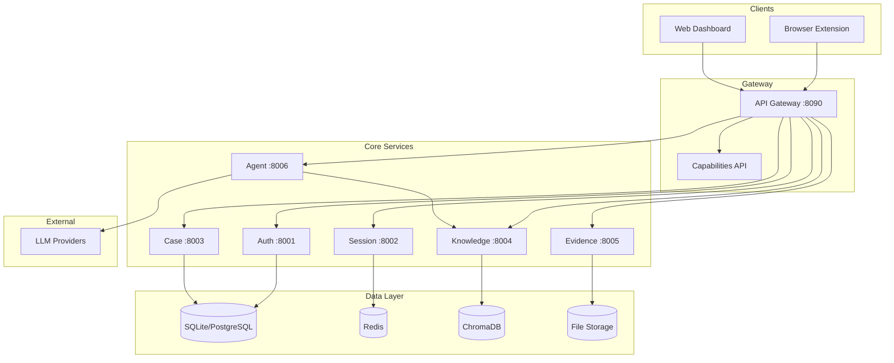

# FaultMaven

**The AI-Powered Troubleshooting Copilot for Modern Engineering**

Stop context-switching. FaultMaven connects your full stack—logs, metrics, and traces—to a unified knowledge engine. It combines global troubleshooting intelligence with your personal context to help you solve any problem faster, while automatically capturing the solution for the future.

[](LICENSE)
[](https://hub.docker.com/u/faultmaven)
[](https://github.com/FaultMaven)

---

## Quick Start

```bash
git clone https://github.com/FaultMaven/faultmaven-deploy.git && cd faultmaven-deploy
cp .env.example .env                      # Add your OPENAI_API_KEY
./faultmaven start                        # Validates env, starts all services
```

**Access Points:**
- **Dashboard:** http://localhost:3000 (`admin` / `changeme123`)
- **API Gateway:** http://localhost:8090

```bash
./faultmaven status   # Check service health
./faultmaven logs     # View logs
./faultmaven stop     # Stop services (preserves data)
```

> **Full deployment guide:** [faultmaven-deploy](https://github.com/FaultMaven/faultmaven-deploy)

---

## Why FaultMaven?

**The gap between "Monitoring" and "Fixing" is too wide.**

Traditional observability tools tell you *what* is broken. Generic LLMs (like ChatGPT) guess *why* it's broken, but lack access to your data.

FaultMaven bridges this gap by injecting **deep context** into the AI reasoning process.

### 1. Deep Context Awareness
Generic chatbots are blind to your infrastructure. FaultMaven correlates your **full stack**—logs, metrics, traces, configuration, and source code—to understand not just the error, but the system state that caused it.

### 2. Institutional Memory (The Tiered Knowledge Engine)
Most troubleshooting knowledge dies in Slack threads or forgotten wikis. FaultMaven's **Unified Knowledge Base** ensures you never solve the same problem twice:
* **Global Intelligence:** Pre-loaded with knowledge of common tech stacks (K8s, Postgres, Redis).
* **Team Knowledge (Enterprise):** Automatically indexes your runbooks and past case resolutions.
* **Personal Context:** Remembers your specific environment and local configurations.

### 3. Zero-Context Switching
Don't tab-switch between your dashboard and your AI. The **FaultMaven Copilot** browser extension overlays intelligence directly onto your existing tools (AWS Console, Datadog, Grafana, or localhost), bringing the fix to where the problem is.

---

### FaultMaven vs. Generic AI

| Feature | Generic LLMs (ChatGPT/Claude) | FaultMaven |
| :--- | :--- | :--- |
| **Input** | Manual copy-paste of snippets | Auto-ingest logs, files, and context |
| **Memory** | Forgets after the chat window closes | **Persistent Knowledge Base** (RAG) |
| **Context** | None (Training data only) | **Full Stack** (Code + Config + Telemetry) |
| **Security** | Data often trains public models | **Air-Gapped Capable** & Data Redaction |

---

## Open Core Model

FaultMaven follows an **Open Box / Black Box** philosophy:

### Open Source (This Repository)
**The "Open Box"** — Full transparency and control.

Everything you need for individual troubleshooting:
- All 7 core microservices (Apache 2.0)
- Browser extension + web dashboard
- Multi-provider LLM support
- Knowledge base with semantic search
- Case tracking and evidence management
- Docker Compose deployment

**Best for:** Individual SREs, small teams, air-gapped environments, contributors.

### Enterprise SaaS
**The "Black Box"** — Zero ops, team-scale features.

Same core platform, plus:
- **Team Collaboration:** Shared cases and knowledge bases
- **Enterprise Auth:** SSO/SAML (Okta, Azure AD, Google)
- **Integrations:** Slack, PagerDuty, ServiceNow
- **Managed Infrastructure:** HA PostgreSQL, Redis, S3
- **SLA Guarantees:** 99.9% uptime

**Best for:** Teams needing collaboration, compliance, or managed infrastructure.

**[Try Enterprise Free →](https://faultmaven.ai)**

---

## Feature Comparison

| Capability | Open Source | Enterprise |
|------------|:-----------:|:----------:|
| AI Troubleshooting Chat | ✅ | ✅ |
| Knowledge Base (Semantic Search) | ✅ | ✅ |
| Case Tracking | ✅ | ✅ |
| Evidence Management | ✅ | ✅ |
| Multi-Provider LLM Support | ✅ | ✅ |
| Local LLM Support (Ollama, vLLM) | ✅ | ✅ |
| Browser Extension | ✅ | ✅ |
| Web Dashboard | ✅ | ✅ |
| Docker Self-Hosting | ✅ | — |
| Team Workspaces | — | ✅ |
| Shared Knowledge Bases | — | ✅ |
| SSO / SAML | — | ✅ |
| Slack / PagerDuty Integration | — | ✅ |
| Managed Infrastructure | — | ✅ |
| Priority Support | — | ✅ |

---

## Architecture



### How It Works

1. **Browser Extension** captures context (errors, logs, stack traces) from your current page
2. **API Gateway** routes requests and handles authentication
3. **Agent Service** orchestrates AI conversations, pulling relevant context from the Knowledge Base
4. **Knowledge Service** performs semantic search across your runbooks and past cases
5. **Case Service** tracks investigations and links evidence to resolutions

---

## Repositories

This organization contains the microservices foundation:

| Layer | Repository | Purpose |
|-------|------------|---------|
| **Gateway** | [fm-api-gateway](https://github.com/FaultMaven/fm-api-gateway) | Request routing, auth, capabilities API |
| **Services** | [fm-agent-service](https://github.com/FaultMaven/fm-agent-service) | AI troubleshooting engine |
| | [fm-knowledge-service](https://github.com/FaultMaven/fm-knowledge-service) | Semantic search, RAG |
| | [fm-case-service](https://github.com/FaultMaven/fm-case-service) | Investigation tracking |
| | [fm-evidence-service](https://github.com/FaultMaven/fm-evidence-service) | File/log uploads |
| | [fm-auth-service](https://github.com/FaultMaven/fm-auth-service) | Authentication |
| | [fm-session-service](https://github.com/FaultMaven/fm-session-service) | Session management |
| **Workers** | [fm-job-worker](https://github.com/FaultMaven/fm-job-worker) | Background processing |
| **Shared** | [fm-core-lib](https://github.com/FaultMaven/fm-core-lib) | Common utilities |
| **Clients** | [faultmaven-copilot](https://github.com/FaultMaven/faultmaven-copilot) | Browser extension |
| | [faultmaven-dashboard](https://github.com/FaultMaven/faultmaven-dashboard) | Web UI |
| **Deploy** | [faultmaven-deploy](https://github.com/FaultMaven/faultmaven-deploy) | Docker Compose setup |

---

## LLM Support

Works with your preferred provider:

| Provider | Models | Notes |
|----------|--------|-------|
| **OpenAI** | GPT-4o, GPT-4 Turbo | Recommended for best results |
| **Anthropic** | Claude 3.5 Sonnet, Claude 3 Opus | Excellent for complex reasoning |
| **Google** | Gemini Pro | Good balance of speed/quality |
| **Groq** | Llama 3, Mixtral | Fast inference |
| **Local** | Ollama, vLLM, LM Studio, LocalAI | Air-gapped / privacy-first |

Configure in `.env`:
```bash
LLM_PROVIDER=openai          # or: anthropic, google, groq, ollama
OPENAI_API_KEY=sk-...        # Provider-specific key
OLLAMA_BASE_URL=http://host.docker.internal:11434  # For local LLMs
```

---

## Contributing

We welcome contributions. See [CONTRIBUTING.md](CONTRIBUTING.md) for guidelines.

```bash
# Fork and clone a service repo
git clone https://github.com/YOUR_USERNAME/fm-agent-service.git

# Run the full stack locally
cd faultmaven-deploy && docker compose up -d

# Make changes, test, submit PR
```

---

## Documentation

- **[Deployment Guide](https://github.com/FaultMaven/faultmaven-deploy)** — Self-hosting setup
- **[Architecture](./docs/ARCHITECTURE.md)** — System design details
- **[API Reference](./docs/API.md)** — REST endpoints
- **[Development](./docs/DEVELOPMENT.md)** — Local dev setup

---

## Support

- **Issues:** [GitHub Issues](https://github.com/FaultMaven/FaultMaven/issues)
- **Discussions:** [GitHub Discussions](https://github.com/FaultMaven/FaultMaven/discussions)
- **Enterprise:** [faultmaven.ai](https://faultmaven.ai)

---

## License

**Apache 2.0** — Use commercially, fork freely, no strings attached.

Same license as Kubernetes, TensorFlow, and Apache Kafka.

---

<p align="center">
  <strong>FaultMaven</strong> — Your AI copilot for incident response.
</p>
