# ToolRegistry Consolidation - Architecture Diagrams

## Current State (Before Consolidation)

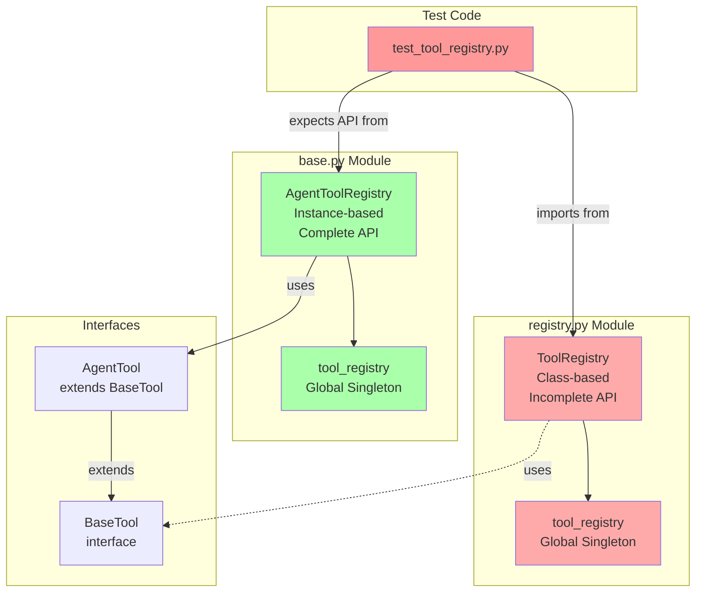

**Problem**: Tests import from `registry.py` but expect `AgentToolRegistry` API from `base.py`. Two competing implementations cause confusion and test failures.

---

## Proposed State (After Consolidation)

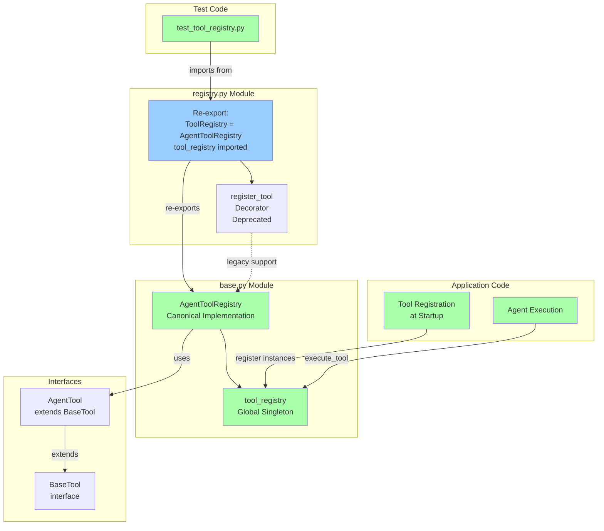

**Solution**: Single canonical implementation in `base.py`, re-exported from `registry.py` for backward compatibility. All code uses the same registry instance.

---

## Component Interaction - Before

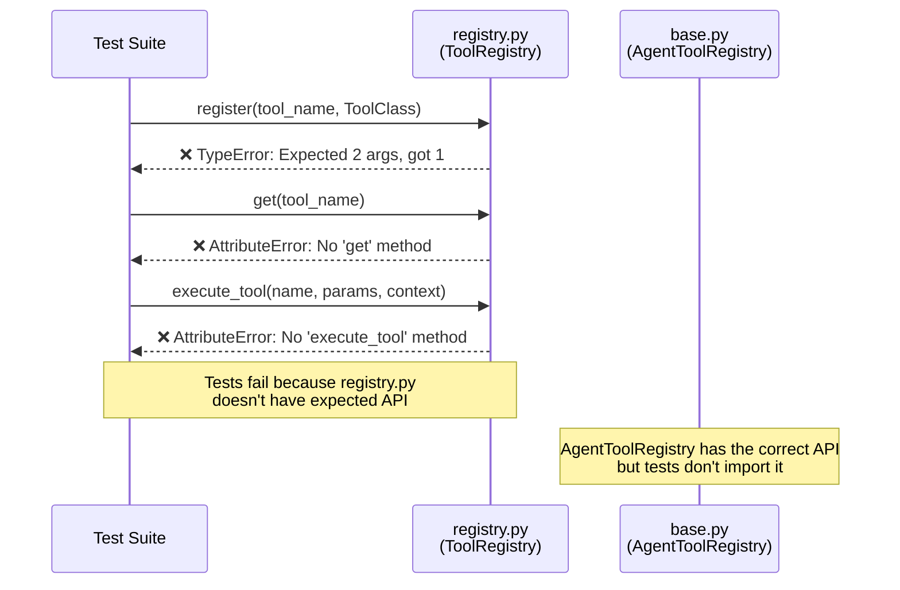

---

## Component Interaction - After

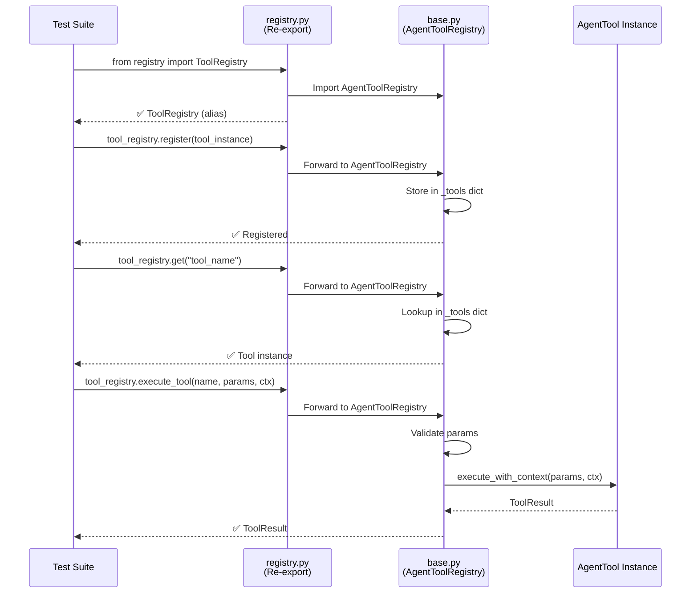

---

## Data Model - Registry Internal Storage

### Before: Two Separate Registries

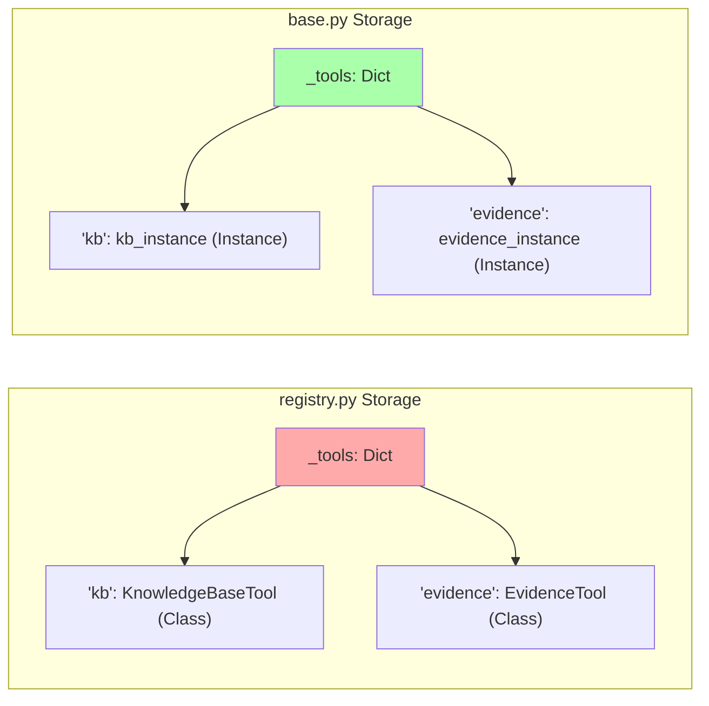

### After: Single Unified Registry

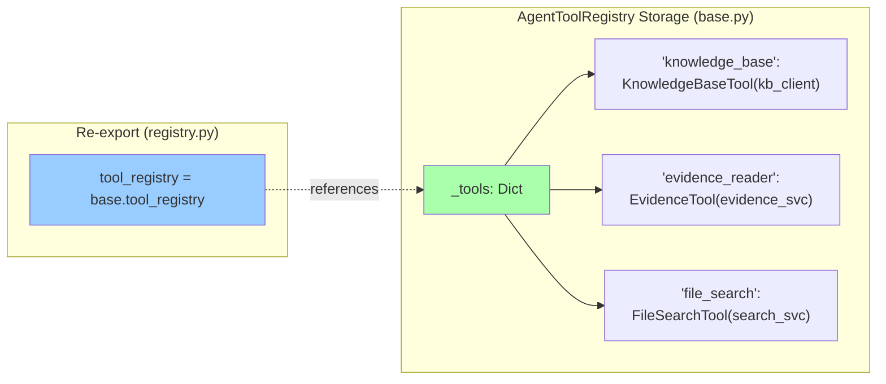

---

## Registration Patterns Comparison

### Pattern 1: Class-based (Deprecated)

```mermaid
graph TD
    A[Define Tool Class] --> B[@register_tool decorator]
    B --> C[Class registered with registry]
    C --> D[First get call]
    D --> E[Instantiate tool]
    E --> F[Cache instance]
    F --> G[Return instance]

    style A fill:#faa
    style B fill:#faa
    style C fill:#faa
```

**Problems**:
- Hidden initialization
- No dependency injection
- Circular import risks
- Testing difficulties

### Pattern 2: Instance-based (Recommended)

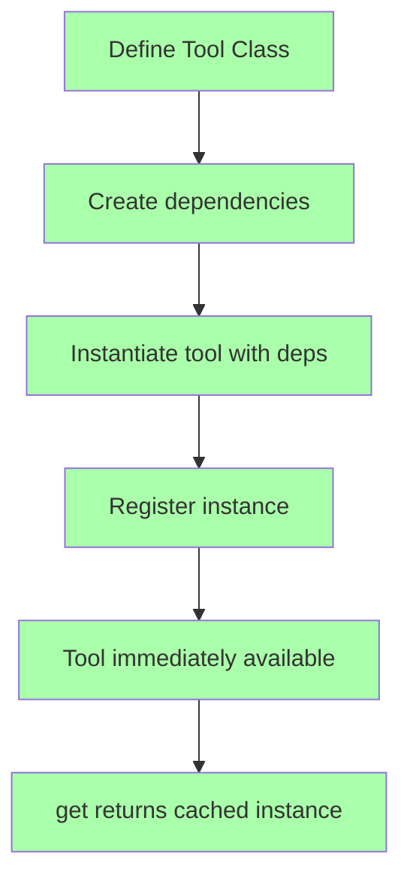

**Benefits**:
- Explicit initialization
- Clear dependency injection
- Easy testing with mocks
- No circular imports

---

## Tool Execution Flow

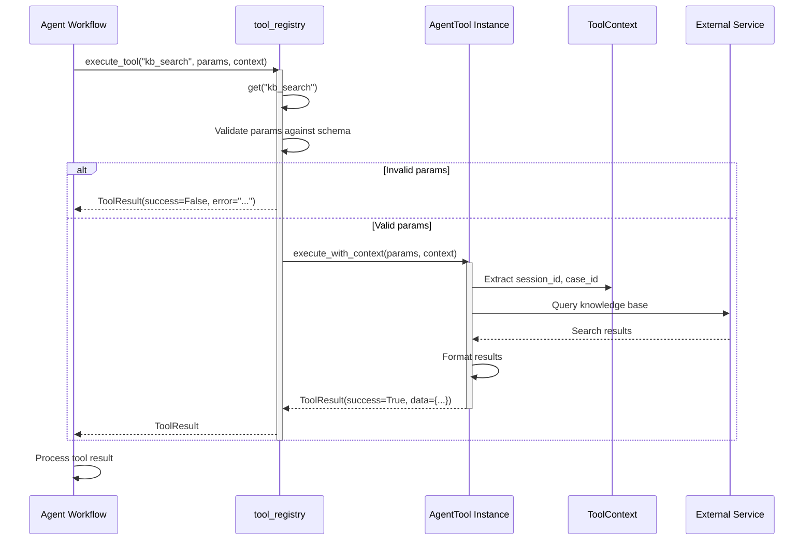

---

## Testing Strategy Diagram

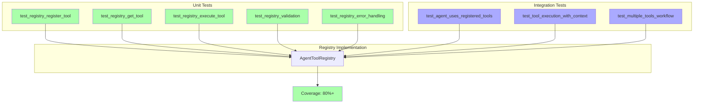

---

## Deployment Architecture

### Before: Confusion at Startup

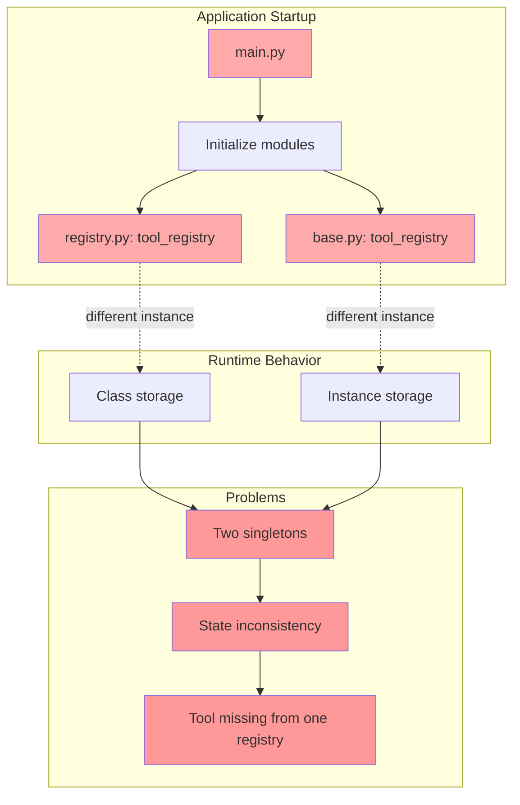

### After: Single Source of Truth

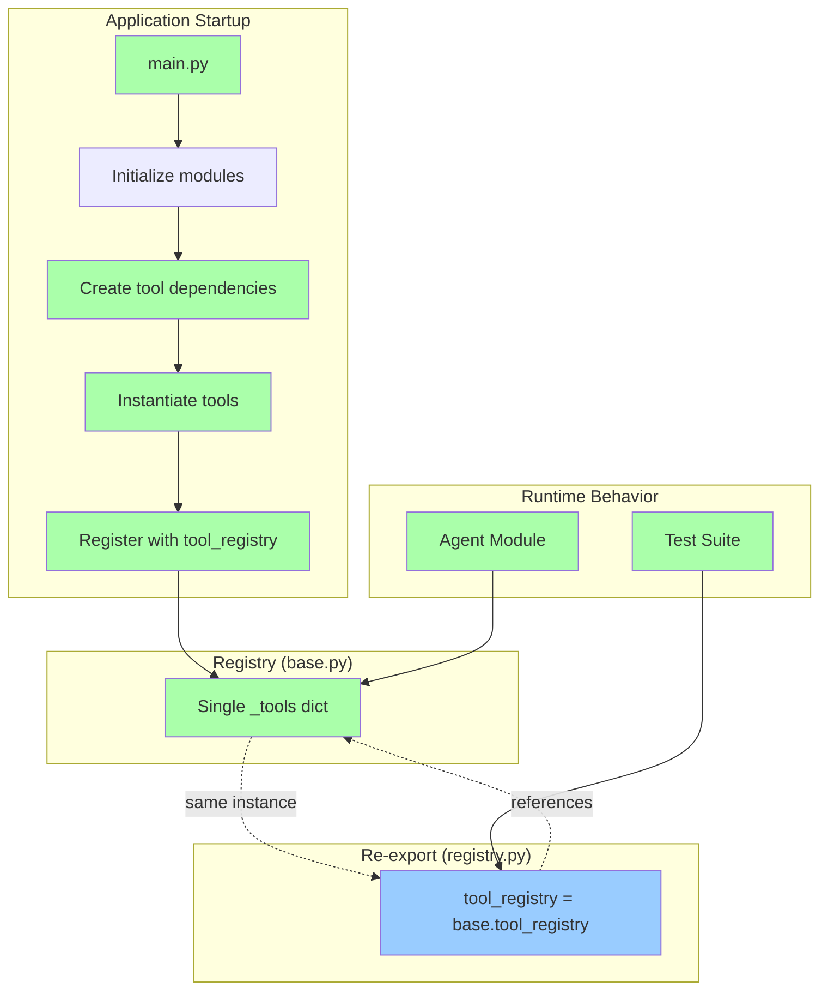

---

## Migration Path

```mermaid
graph LR
    subgraph "Phase 1: Consolidation"
        P1A[Update registry.py<br/>Re-export AgentToolRegistry]
        P1B[Run tests<br/>Verify all pass]
        P1C[Deploy to dev]
    end

    subgraph "Phase 2: Deprecation"
        P2A[Add deprecation warnings<br/>to @register_tool]
        P2B[Update internal code<br/>to instance-based]
        P2C[Document migration]
    end

    subgraph "Phase 3: Cleanup"
        P3A[Remove @register_tool<br/>decorator]
        P3B[Remove class-based<br/>support]
        P3C[Update docs]
    end

    P1A --> P1B --> P1C
    P1C --> P2A
    P2A --> P2B --> P2C
    P2C --> P3A
    P3A --> P3B --> P3C

    style P1A fill:#9cf
    style P1B fill:#9cf
    style P1C fill:#9cf
    style P2A fill:#ff9
    style P2B fill:#ff9
    style P2C fill:#ff9
    style P3A fill:#faa
    style P3B fill:#faa
    style P3C fill:#faa
```

**Timeline**:
- Phase 1: 1 day (immediate fix)
- Phase 2: 2-4 weeks (gradual migration)
- Phase 3: 1-2 sprints (final cleanup)

---

## Success Metrics

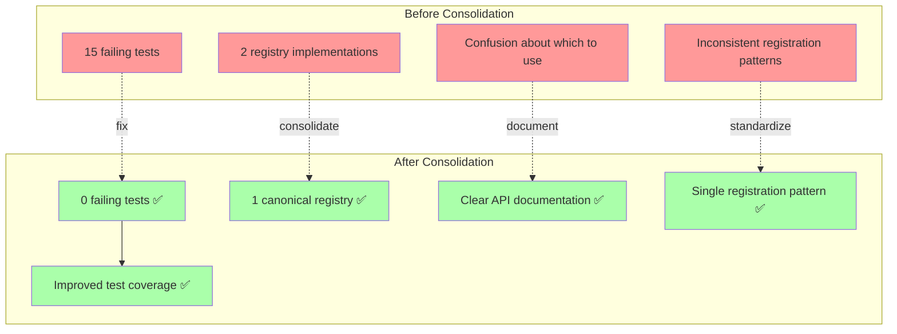

---

## API Before/After Comparison

### Before: Inconsistent APIs

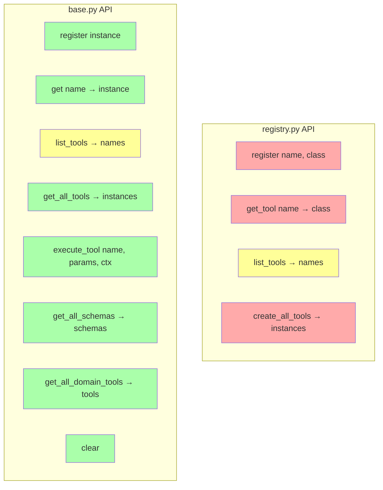

### After: Single Consistent API

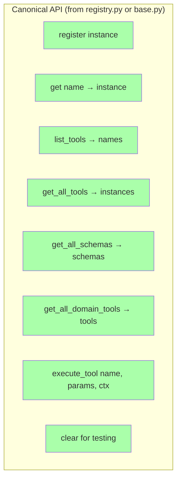

---

## End State Architecture

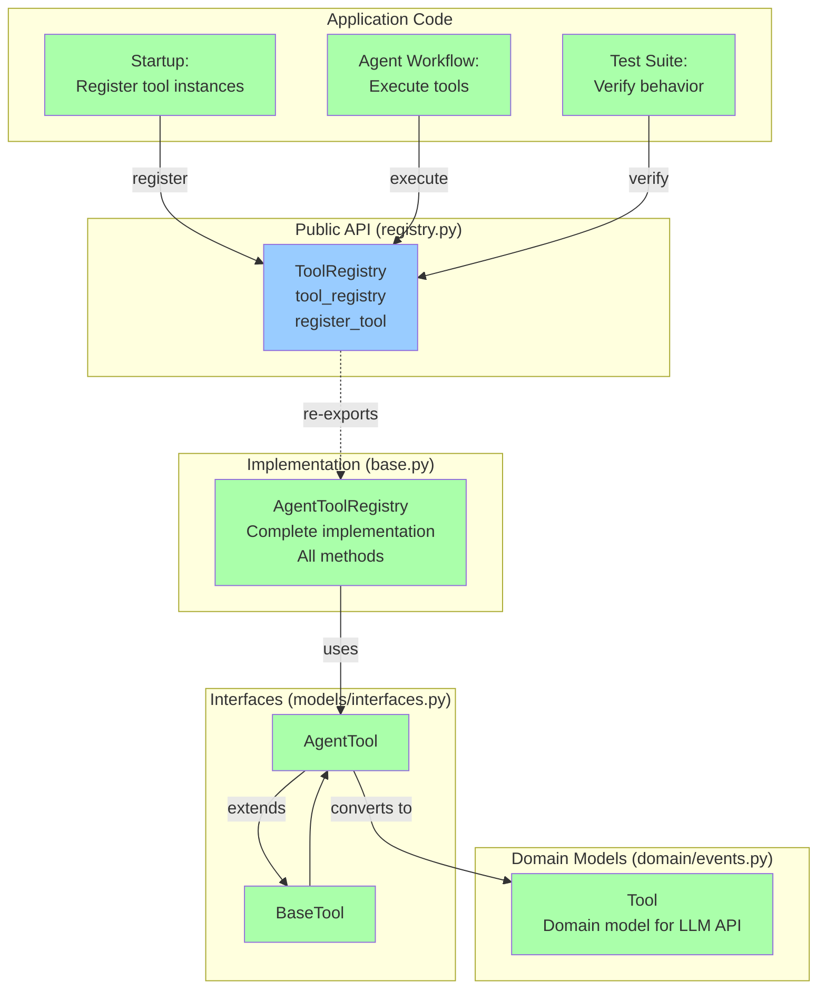

**Key Points**:
1. Single source of truth: `AgentToolRegistry` in `base.py`
2. Public interface: Re-exported from `registry.py` for discoverability
3. Clean separation: Interfaces → Implementation → Domain models
4. All application code uses the same registry instance
5. Tests verify canonical behavior

---

## Conclusion

The consolidation eliminates architectural inconsistency by:
- **Reducing complexity**: 2 registries → 1 registry
- **Fixing tests**: 15 failures → 0 failures
- **Improving clarity**: Canonical API with clear documentation
- **Enabling evolution**: Single implementation to maintain and enhance

Implementation is straightforward: update `registry.py` to re-export `AgentToolRegistry` from `base.py`.
