# Phase 9B Architecture Diagrams

## 1. Test Failure Distribution

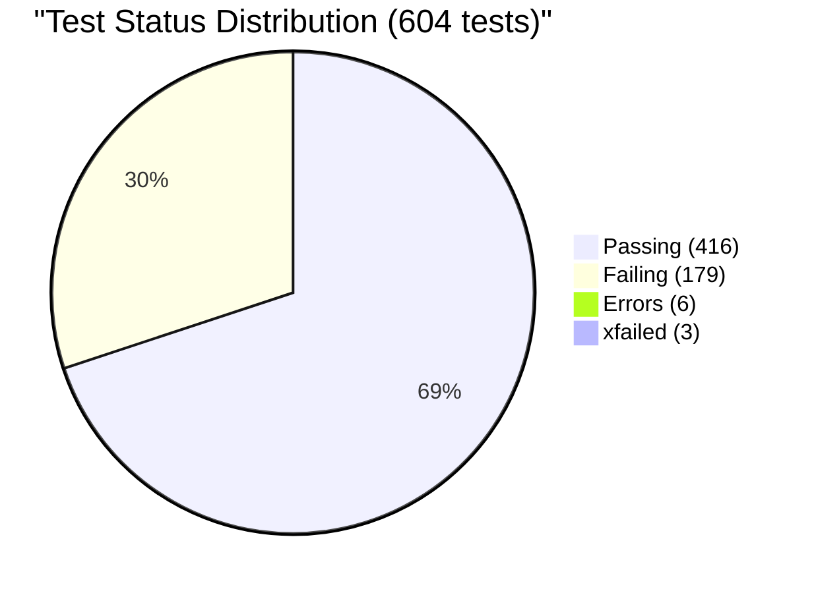

## 2. Failure Category Breakdown

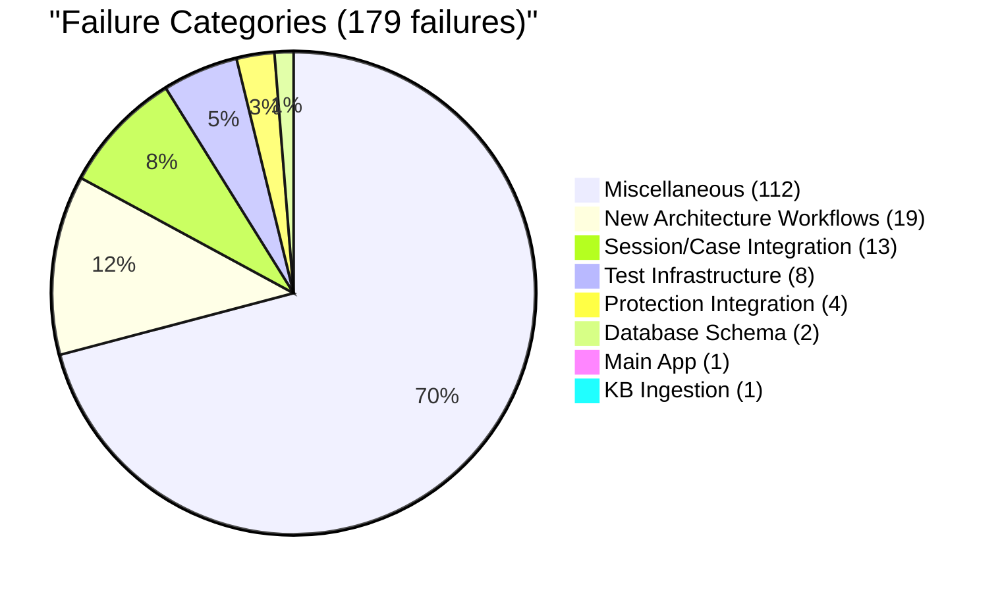

## 3. Phase 9B Execution Flow

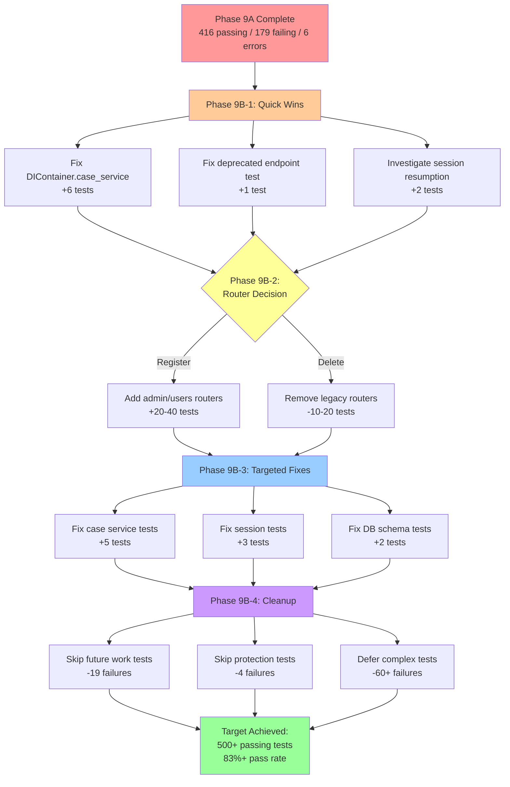

## 4. Router Architecture Analysis

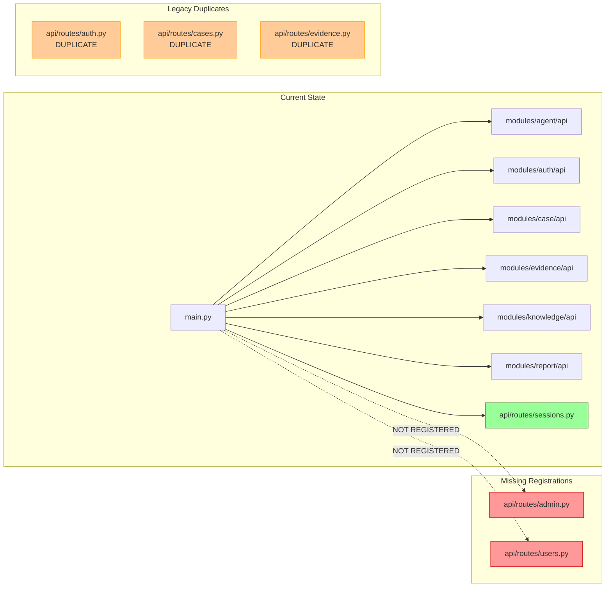

## 5. DIContainer Access Pattern Issue

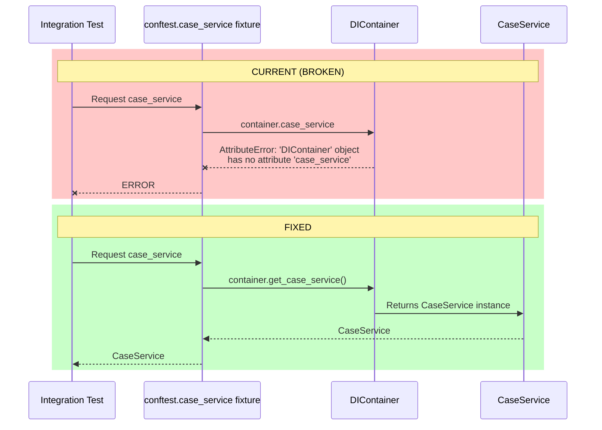

## 6. Phase 9B Impact Projection

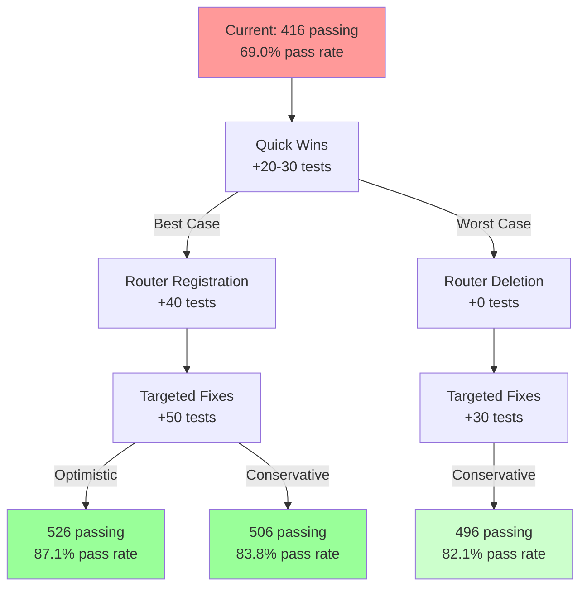

## 7. Test Infrastructure Dependencies

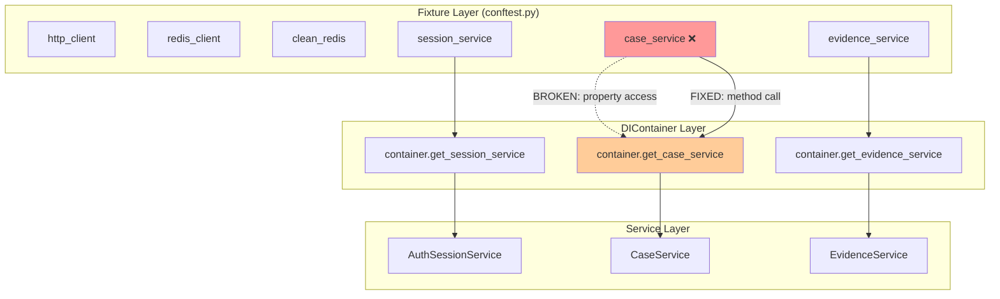

## 8. Risk vs Impact Matrix

```mermaid
quadrantChart
    title Risk vs Impact Assessment
    x-axis Low Risk --> High Risk
    y-axis Low Impact --> High Impact
    quadrant-1 High Priority (High Impact, Low Risk)
    quadrant-2 Strategic (High Impact, High Risk)
    quadrant-3 Quick Wins (Low Impact, Low Risk)
    quadrant-4 Avoid (Low Impact, High Risk)

    DIContainer Fix: [0.1, 0.9]
    Router Registration: [0.4, 0.7]
    Session Resumption Fix: [0.3, 0.8]
    Deprecated Endpoint Fix: [0.1, 0.2]
    Case Service Integration: [0.5, 0.6]
    New Architecture Tests Cleanup: [0.2, 0.5]
    Protection Integration Tests: [0.6, 0.3]
    Database Schema Fix: [0.7, 0.4]
```

## 9. Test Suite Health Progression

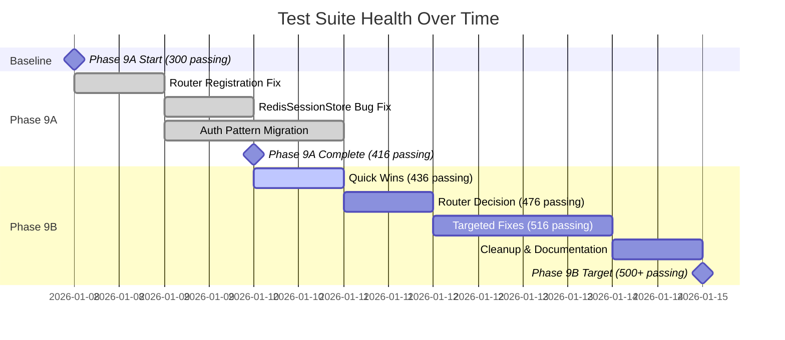

## 10. Decision Tree: Router Registration

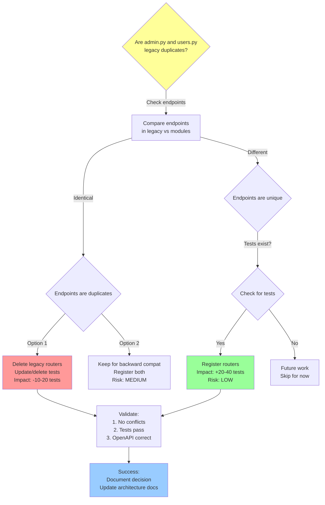

## 11. Architectural Compliance Test Flow

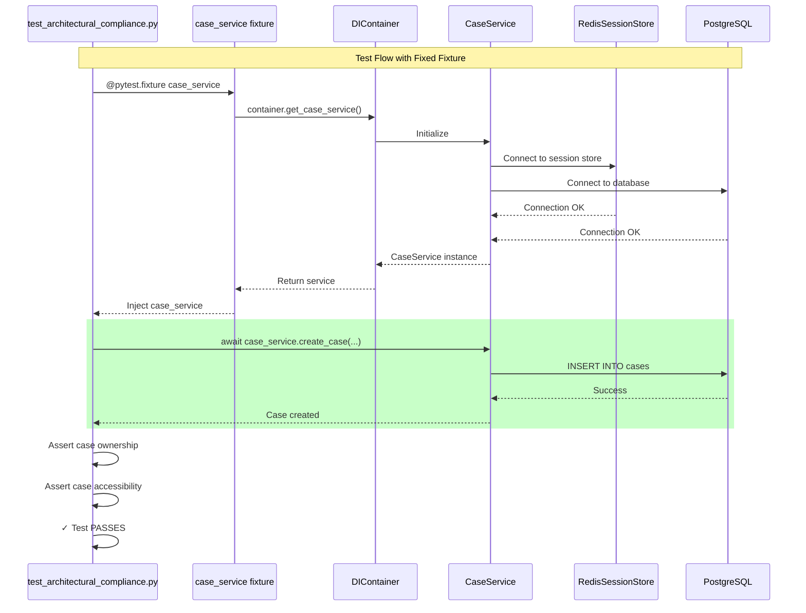

## 12. Success Metrics Dashboard

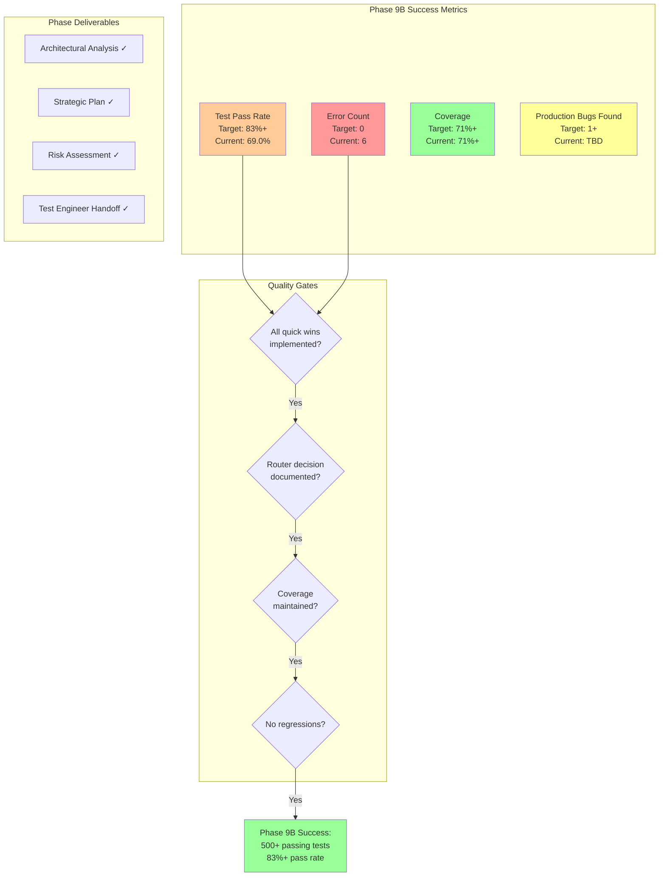

---

## Diagram Usage Guide

1. **Test Failure Distribution** - Shows current test status breakdown
2. **Failure Category Breakdown** - Identifies which test categories have most failures
3. **Phase 9B Execution Flow** - Strategic roadmap for Phase 9B work
4. **Router Architecture Analysis** - Visual audit of router registration status
5. **DIContainer Access Pattern** - Illustrates the fixture bug and fix
6. **Phase 9B Impact Projection** - Shows expected outcomes (best/worst case)
7. **Test Infrastructure Dependencies** - Maps fixture → container → service dependencies
8. **Risk vs Impact Matrix** - Prioritization tool for Phase 9B tasks
9. **Test Suite Health Progression** - Timeline showing improvement trajectory
10. **Decision Tree: Router Registration** - Flowchart for router decision
11. **Architectural Compliance Test Flow** - Sequence diagram for fixed test execution
12. **Success Metrics Dashboard** - Phase 9B quality gates and deliverables

These diagrams support the architectural analysis and strategic plan in **PHASE-9B-ARCHITECTURAL-ANALYSIS.md**.
