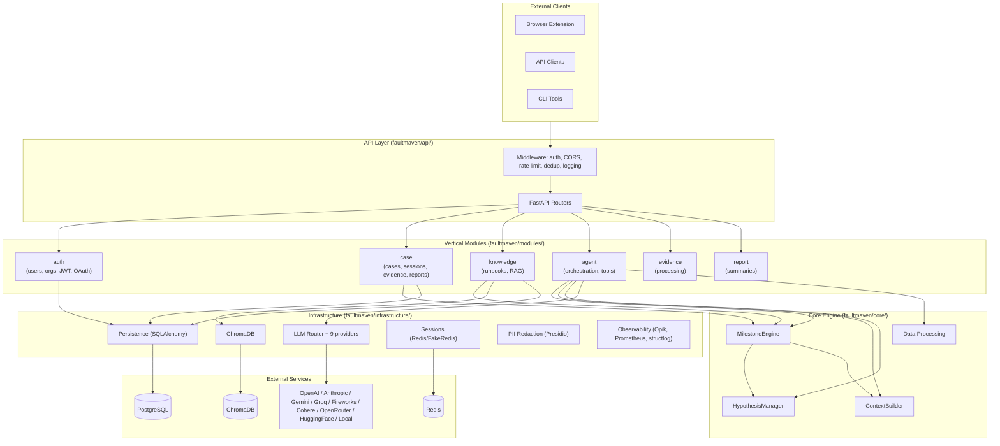

# FaultMaven Architecture Overview

**Status**: Active
**Last Updated**: 2026-04-16

This document is the top-level tour of FaultMaven's architecture. For depth, follow the links into canonical documents.

## Canonical Source of Truth

These four documents are authoritative. On any conflict, they supersede other docs:

1. **[Architectural Design Principles](core-architecture/architectural-design-principles.md)** — The 12 design principles
2. **[Investigation Lifecycle Logic](investigation-engine/investigation-lifecycle-logic.md)** — State transitions, stage routing, turns
3. **[Agent Behavioral Rules](investigation-engine/agent-behavioral-rules.md)** — 6 prompt-injected rules
4. **[Knowledge Base Architecture](knowledge-and-ai/knowledge-base-architecture.md)** — 3-tier KB, storage, retrieval

## System Shape

FaultMaven is a **modular monolith** with vertical domain modules and horizontal infrastructure layers. Investigation is **milestone-based and opportunistic** — agents complete tasks when evidence supports them, not on a rigid phase timeline.

## Module Organization

- **Vertical modules** own domain data (tables, repositories, APIs): `auth`, `case`, `knowledge`
- **Domain services** have business logic but no data ownership (they borrow Case's repository via contracts): `agent`, `evidence`, `report`
- **Horizontal infrastructure** is cross-cutting: LLM, persistence, security, observability, etc.

See [Module Organization Design](core-architecture/module-organization-design.md) for classification criteria and cross-module import rules.

## Investigation Engine

Investigation is driven by the `MilestoneEngine` (not a rigid phase machine). Turns flow through stages — SYMPTOM_VERIFICATION → HYPOTHESIS_FORMULATION → HYPOTHESIS_VALIDATION → SOLUTION — but milestones can complete opportunistically when evidence is sufficient.

Key concepts:
- **Case Status**: INQUIRY → INVESTIGATING → RESOLVED / CLOSED
- **Milestones** drive progress: 4 gate milestones (`mitigation_accepted`, `mitigation_verified`, `solution_accepted`, `solution_verified`) drive stage transitions; 3 progress indicators (`symptom_verified`, `root_cause_identified`, `solution_proposed`) provide LLM context
- **Hypotheses** have a lifecycle: CAPTURED → ACTIVE → VALIDATED / REFUTED / RETIRED, with confidence decay (`0.85^iterations`)
- **Behavioral rules** (6 total) constrain every agent response via prompt injection — see [Agent Behavioral Rules](investigation-engine/agent-behavioral-rules.md)

Full lifecycle and routing logic: [Investigation Lifecycle Logic](investigation-engine/investigation-lifecycle-logic.md).

## Knowledge Base

3-tier knowledge: **Personal**, **Team**, **Global**, all stored in a single ChromaDB collection (`faultmaven_kb`) with metadata filtering for scope isolation. The agent calls one `kb_qa` tool; the federated search layer resolves the scope from user context.

Evidence (case-specific diagnostic data) is separate from knowledge (remediation runbooks). Both reach the LLM through vector retrieval but use different chunking strategies and different tools.

Full design: [Knowledge Base Architecture](knowledge-and-ai/knowledge-base-architecture.md).

## LLM Architecture

- **Router with fallback chain** — cheaper models for classification, expensive models for reasoning
- **Capability-based routing**: `CHAT_PROVIDER`, `CODE_PROVIDER`, `MULTIMODAL_PROVIDER`, `SYNTHESIS_PROVIDER`, `CLASSIFIER_PROVIDER`
- **Stateless adapter layer** — provider calls are pure functions; orchestration handles retries, state, and fallback (see **Principle 10** in the canonical principles doc)
- **9 providers**: Anthropic, OpenAI, Gemini, Fireworks, Groq, HuggingFace, Cohere, OpenRouter, Local (Ollama/vLLM)

Structured output handling: [Structured Output Capability System](core-architecture/structured-output-capability-system.md).

## Data & Storage

- **Relational (SQLAlchemy + Alembic)** — 33 tables across 3 domains (user, case, config). Schema: [data-and-storage/schemas/](data-and-storage/schemas/), ER diagram: [er-diagram.md](data-and-storage/er-diagram.md).
- **Vector (ChromaDB)** — knowledge base + per-case evidence collections. BGE-M3 embeddings (1024 dims). See [vector-retrieval-architecture.md](knowledge-and-ai/vector-retrieval-architecture.md).
- **Sessions / cache (Redis or FakeRedis)** — FakeRedis is the default local-mode backend (full API parity, no external server).
- **File storage (local filesystem, S3, Azure)** — pluggable backend via `IStorageBackend`.

## Security

- **Auth**: JWT (HS256 local / RS256 OAuth), bcrypt ≥12 rounds, RBAC with scopes, token revocation via Redis
- **OAuth 2.0 + PKCE** for browser extension flows
- **PII redaction** via Presidio + regex layer, with case-scoped bidirectional registry for cross-turn consistency
- **Input validation** via Pydantic at every API boundary
- **Rate limiting** (adaptive + fixed), request deduplication, idempotency middleware

See [security/iam-design.md](security/iam-design.md), [security/case-scoped-pii-redaction.md](security/case-scoped-pii-redaction.md).

## Deployment Modes

| Mode | Database | Sessions | Storage | Vector | Tenancy |
|------|----------|----------|---------|--------|---------|
| **Standalone (self-hosted)** | SQLite | FakeRedis | Filesystem | ChromaDB PersistentClient | Single |
| **Cloud** | PostgreSQL | Redis | S3 / Azure | ChromaDB HTTP | Multi |

The **same codebase** runs in both modes — provider selection happens in `main.py` via settings (Principle 1: Deployment Agnostic).

## Architectural Enforcement

Import boundaries are enforced at build time by `import-linter` with 12 contracts covering module privacy, layer separation, and cross-module import rules. Run `lint-imports` locally; CI enforces on every PR.

See `.importlinter` at repo root for the current contracts. Architecture principles: [Architectural Design Principles](core-architecture/architectural-design-principles.md).

## Key Subsystems — Where to Read Next

| To understand... | Read |
|------------------|------|
| How the system boots and wires dependencies | `faultmaven/main.py`, `faultmaven/container/`, Principle 5 |
| How investigation turns are processed | [Investigation Lifecycle Logic](investigation-engine/investigation-lifecycle-logic.md) |
| How prompts are assembled | [Prompt Assembly Architecture](investigation-engine/prompt-assembly-architecture.md) + [Agent Behavioral Rules](investigation-engine/agent-behavioral-rules.md) |
| How evidence is classified and preprocessed | [data-processing/](data-processing/) |
| How the KB retrieves across scopes | [Knowledge Base Architecture](knowledge-and-ai/knowledge-base-architecture.md) |
| How LLM calls are routed and cached | `faultmaven/infrastructure/llm/` |
| How modules communicate via contracts | [Module Organization Design](core-architecture/module-organization-design.md) |
| Tests | [development/testing/](../development/testing/) |
