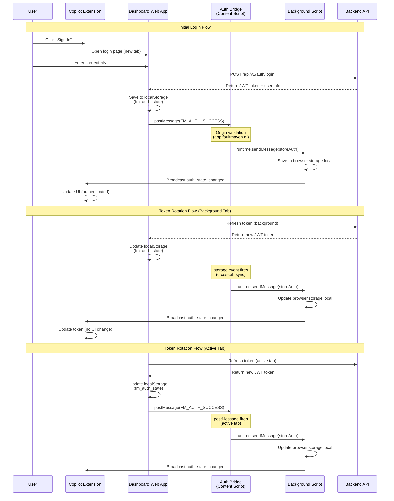

# FaultMaven Authentication System

## Overview

FaultMaven uses **JWT (JSON Web Tokens)** with Bearer token authentication across three components:
1. **faultmaven** (Backend API): Issues and validates JWT tokens
2. **faultmaven-dashboard** (Web UI): Primary authentication interface
3. **faultmaven-copilot** (Browser Extension): Consumes dashboard authentication

## Design Principles

### Core Philosophy
- **Dual-Header Approach**: Clean separation of concerns
  - `Authorization: Bearer <token>` for user identity
  - `X-Session-Id: <session_id>` for conversation continuity (copilot only)
- **Dashboard as Authority**: Dashboard is the single source of truth for authentication
- **One Active Environment**: Singleton pattern - one base URL configured at a time
- **Secure by Default**: Tokens expire, proper error handling, secure storage

### Key Design Goals
1. **Single Sign-On (SSO)**: User logs in once via dashboard, both components work
2. **Browser Extension Optimized**: Multi-tab, persistent extension usage
3. **Development Friendly**: Simple dev-login for testing
4. **Production Ready**: Clear migration path to OAuth2/OIDC
5. **Enterprise Alignment**: Supports SSO, SAML, OIDC flows

## Architecture Decision: Shared Session (Dashboard as Authority)

### Decision
**Option 1: Shared Session with Dashboard as Authority** - Recommended and implemented.

### Rationale
- ✅ **User Experience**: Single sign-on is expected in modern applications
- ✅ **Security**: Fewer tokens = smaller attack surface
- ✅ **Consistency**: One source of truth prevents sync issues
- ✅ **Enterprise Fit**: Dashboard handles complex SSO flows robustly
- ✅ **Infrastructure Ready**: Auth bridge content script already exists

### User Flow
1. User opens copilot → Not authenticated
2. Copilot shows "Sign In" button → Opens dashboard login page
3. User logs into dashboard → Token stored in `localStorage`
4. Content script forwards token to copilot → Copilot authenticated
5. User can now use both dashboard and copilot

### Dashboard Handoff Sequence Diagram

The following sequence diagram illustrates the complete authentication handoff from Dashboard to Copilot, including both initial login and token rotation scenarios:



**Key Points**:
- **Active Tab Login**: Uses `postMessage` for immediate synchronization
- **Background Tab Refresh**: Uses `storage` event for cross-tab synchronization
- **Origin Validation**: Content script validates `event.origin` before processing
- **Dual Storage**: Dashboard uses `localStorage`, Copilot uses `browser.storage.local`
- **Event Broadcasting**: Background script notifies all extension components of auth changes

## Authentication Flow

### Step 1: User Initiates Login

**Dashboard Flow**:
```typescript
// Dashboard: src/lib/auth/functions.ts
export async function devLogin(username: string): Promise<AuthState> {
  const response = await fetch(`${config.apiUrl}/api/v1/auth/dev-login`, {
    method: 'POST',
    headers: { 'Content-Type': 'application/json' },
    body: JSON.stringify({ username }),
  });
  const authState = await response.json();
  await authManager.saveAuthState(authState);
  return authState;
}
```

**Copilot Flow** (Redirects to Dashboard):
```typescript
// Copilot: src/shared/ui/SidePanelApp.tsx
const handleLogin = () => {
  const dashboardUrl = capabilities?.dashboardUrl || 'https://app.faultmaven.ai';
  window.open(`${dashboardUrl}/login?source=extension`, '_blank');
};
```

### Step 2: Backend Validates and Issues Token

```python
# Backend: faultmaven/api/routes/auth.py
@router.post("/dev-login", response_model=AuthTokenResponse)
async def dev_login(
    request: DevLoginRequest,
    user_store: DevUserStore = Depends(get_user_store),
    token_manager: DevTokenManager = Depends(get_token_manager)
) -> AuthTokenResponse:
    user = await user_store.get_user_by_username(request.username)
    access_token = await token_manager.create_token(user)
    
    return AuthTokenResponse(
        access_token=access_token,
        token_type="bearer",
        expires_in=3600,
        user=UserProfile(
            user_id=user.user_id,
            username=user.username,
            email=user.email,
            roles=user.roles or ['user']
        )
    )
```

**Response Structure**:
```json
{
  "access_token": "eyJhbGciOiJIUzI1NiIsInR5cCI6IkpXVCJ9...",
  "token_type": "bearer",
  "expires_in": 3600,
  "user": {
    "user_id": "user-123",
    "username": "john_doe",
    "email": "john@example.com",
    "display_name": "John Doe",
    "roles": ["admin"]
  }
}
```

### Step 3: Client Stores Authentication State

**Dashboard Storage** (localStorage):
```typescript
// Dashboard: src/lib/auth/AuthManager.ts
interface AuthState {
  access_token: string;
  token_type: "bearer";
  expires_at: number;  // Unix timestamp (ms)
  user: {
    user_id: string;
    username: string;
    email: string;
    display_name: string;
    roles?: string[];
  };
}

await browser.storage.local.set({ authState });
```

**Copilot Storage** (browser.storage.local):
- Same structure, different storage API
- Token received via auth bridge content script

### Step 4: Dashboard → Copilot Token Sharing

**Auth Bridge Content Script** (`auth-bridge.content.ts`):
```typescript
// Listens for postMessage from dashboard (primary method for active tab)
window.addEventListener("message", async (event) => {
  // CRITICAL: Validate origin
  const allowedOrigins = [
    'https://app.faultmaven.ai',
    'http://localhost:3000',
    'http://localhost:5173'
  ];
  
  if (!allowedOrigins.includes(event.origin)) return;
  if (event.source !== window) return;
  
  const message = event.data;  // Extract message from event
  if (message?.type === "FM_AUTH_SUCCESS") {
    await browser.runtime.sendMessage({
      action: "storeAuth",
      payload: message.payload
    });
  }
});

// Listen for token rotation (storage events - cross-tab synchronization only)
// NOTE: storage events do NOT fire on the tab that made the change.
// They only fire on OTHER tabs sharing the same origin.
// This listener handles:
// - Token refresh in background tab
// - Logout in another tab
// - Extension installed after dashboard login (polling fallback)
window.addEventListener('storage', (event) => {
  if (event.key === 'fm_auth_state' && event.newValue) {
    const authState = JSON.parse(event.newValue);
    browser.runtime.sendMessage({
      action: "storeAuth",
      payload: authState
    });
  }
});
```

**Background Script Handler**:
```typescript
// Copilot: src/entrypoints/background.ts
browser.runtime.onMessage.addListener((request) => {
  if (request.action === "storeAuth") {
    await authManager.saveAuthState(request.payload);
    // Broadcast to UI
    browser.runtime.sendMessage({
      type: "auth_state_changed",
      authState: request.payload
    });
  }
});
```

### Step 5: Subsequent API Requests Include Token

**Dashboard API Calls**:
```typescript
const token = await authManager.getAccessToken();
fetch(url, {
  headers: {
    'Authorization': `Bearer ${token}`,
    'Content-Type': 'application/json'
  }
});
```

**Copilot API Calls**:
```typescript
// Copilot: src/lib/api/client.ts
export async function authenticatedFetch(url: string, options: RequestInit = {}): Promise<Response> {
  const headers = await getAuthHeaders();  // Gets token from storage
  
  const response = await fetch(url, {
    ...options,
    headers: { ...headers, ...(options.headers || {}) }
  });
  
  // Handle 401 errors
  if (response.status === 401) {
    await handleAuthError();  // Clears auth state, triggers re-auth
  }
  
  return response;
}

// Header construction includes both auth and session
async function getAuthHeaders(): Promise<HeadersInit> {
  const headers: HeadersInit = { 'Content-Type': 'application/json' };
  
  const authState = await authManager.getAuthState();
  if (authState?.access_token) {
    headers['Authorization'] = `Bearer ${authState.access_token}`;
  }
  
  // Session ID for troubleshooting (copilot only)
  const sessionData = await browser.storage.local.get(['sessionId']);
  if (sessionData.sessionId) {
    headers['X-Session-Id'] = sessionData.sessionId;
  }
  
  return headers;
}
```

### Step 6: Backend Validates Token

```python
# Backend: faultmaven/api/middleware/auth.py
async def get_current_user(
    authorization: Optional[str] = Header(None, alias="Authorization"),
    auth_service: AuthService = Depends(get_auth_service),
) -> AuthenticatedUser:
    token = _extract_token(authorization, credentials)
    if not token:
        raise HTTPException(status_code=401, detail="Authentication required")
    
    # Verify token and check revocation
    user = await auth_service.extract_user_from_token_with_revocation_check(token)
    return user
```

**Token Validation Process**:
1. Extract `Bearer <token>` from `Authorization` header
2. Verify JWT signature using secret key
3. Check token expiration (`exp` claim)
4. Check token revocation (if Redis configured)
5. Extract user claims (user_id, email, roles)
6. Return `AuthenticatedUser` object

**Usage in API Routes**:
```python
@router.get("/api/v1/cases")
async def list_cases(
    current_user: AuthenticatedUser = Depends(get_current_user),
):
    return await case_service.list_cases(user_id=current_user.user_id)
```

## Token Management

### Token Characteristics
- **Format**: JWT (JSON Web Token)
- **Lifespan**: 1 hour (configurable, typically 3600 seconds)
- **Storage**: 
  - Dashboard: `localStorage` (web storage)
  - Copilot: `browser.storage.local` (extension storage)
- **Transmission**: `Authorization: Bearer <token>` header

### Token Lifecycle
1. **Creation**: User logs in → Backend generates JWT
2. **Storage**: Client stores token with expiration timestamp
3. **Usage**: Token included in `Authorization` header for all API calls
4. **Expiration**: Token expires after configured time (1 hour)
5. **Refresh**: Dashboard refreshes token → Copilot receives via postMessage (active tab) or storage event (cross-tab)
6. **Revocation**: User logs out → Token revoked in backend

### Token Rotation Handling

**Problem**: Dashboard refreshes token in background. Copilot must receive updated token.

**Solution**: Dual approach for comprehensive coverage:
1. **Primary**: `postMessage` event for immediate update when login happens in active tab
2. **Secondary**: `storage` event listener for cross-tab synchronization

**Important Note**: The `storage` event **does not fire** on the tab that made the change. It only fires on *other* open tabs sharing the same origin. Therefore:
- **Active tab login**: Handled by `postMessage` (`FM_AUTH_SUCCESS`) - immediate synchronization
- **Background tab refresh**: Handled by `storage` event listener - cross-tab synchronization
- **Cross-tab logout**: Handled by `storage` event listener - ensures logout propagates

**Implementation Priority**:
- **Active Tab**: `postMessage` (immediate, no race conditions)
- **Background Tabs**: `storage` event (reliable cross-tab sync)
- **Fallback**: Polling (if extension installed after dashboard login)

```typescript
// Primary: postMessage for active tab (immediate)
window.addEventListener("message", async (event) => {
  const message = event.data;  // Extract message from event
  if (message?.type === "FM_AUTH_SUCCESS") {
    // Forward token immediately
    await browser.runtime.sendMessage({
      action: "storeAuth",
      payload: message.payload
    });
  }
});

// Secondary: storage events for cross-tab sync (background)
window.addEventListener('storage', (event) => {
  if (event.key === 'fm_auth_state' && event.newValue) {
    // Forward token from other tabs
    const authState = JSON.parse(event.newValue);
    browser.runtime.sendMessage({
      action: "storeAuth",
      payload: authState
    });
  }
});
```

## Environment Configuration

### One Active Environment Pattern

**Principle**: One active environment at a time, configured via settings page.

**Approach**:
- **Default to SaaS**: Extension defaults to `https://api.faultmaven.ai` (90% of users)
- **Advanced Settings**: Self-hosted users configure base URL in Settings page
- **Singleton Pattern**: Code uses `config.baseUrl` everywhere

**Implementation**:
```typescript
// src/config.ts
export async function getApiUrl(): Promise<string> {
  // Priority order: storage > env > default
  // 1. User-configured URL (highest priority - Settings page)
  const stored = await browser.storage.local.get(['apiEndpoint']);
  if (stored.apiEndpoint) return stored.apiEndpoint;
  
  // 2. Build-time environment variable
  if (import.meta.env.VITE_API_URL) return import.meta.env.VITE_API_URL;
  
  // 3. Production default (SaaS)
  return 'https://api.faultmaven.ai';
}
```

**Priority Order** (as implemented):
1. **User Settings** (`browser.storage.local`) - Highest priority
   - Set via Settings page (Options)
   - Persists across extension restarts
   - Allows self-hosted users to override defaults
2. **Environment Variable** (`VITE_API_URL`) - Build-time override
   - Useful for development/testing
   - Set at build time
3. **Default** (`https://api.faultmaven.ai`) - Fallback
   - SaaS production URL
   - Ensures extension works out-of-the-box for 90% of users

// Dashboard URL from capabilities or derived
async function getDashboardUrl(): Promise<string> {
  const apiUrl = await getApiUrl();
  const caps = await capabilitiesManager.fetch(apiUrl);
  if (caps?.dashboardUrl) return caps.dashboardUrl;
  
  // Fallback: Derive from API URL
  if (apiUrl.includes('localhost') || apiUrl.includes('127.0.0.1')) {
    return 'http://localhost:3000';
  }
  return 'https://app.faultmaven.ai';
}
```

**Settings Page** (`src/entrypoints/options/main.tsx`):
- ✅ Preset selection: "FaultMaven SaaS" or "Localhost" or "Custom"
- ✅ API Endpoint input field
- ✅ Connection validation before save
- ✅ Capabilities detection (shows dashboard URL)

**UX Note**: To make settings discoverable for self-hosted users, the Copilot login screen should include a "gear" icon or "Connection Settings" link that opens the Options page. Users won't naturally know to navigate to `chrome://extensions` to configure the base URL.

## Security

### Security Measures

1. **Origin Validation**: Content script validates postMessage origins
   ```typescript
   const allowedOrigins = [
     'https://app.faultmaven.ai',
     'http://localhost:3000',
     'http://localhost:5173'
   ];
   if (!allowedOrigins.includes(event.origin)) return;
   ```

2. **Token Expiration**: Checked before use
   ```typescript
   if (Date.now() >= authState.expires_at) {
     await this.clearAuthState();
     return null;
   }
   ```

3. **Token Revocation**: Supported via Redis (if configured)

4. **Secure Storage**: 
   - Dashboard: localStorage (XSS risk, acceptable for web)
   - Copilot: browser.storage.local (isolated, more secure)

5. **HTTPS**: All token transmission over HTTPS in production

6. **Token Source Tracking**: 
   - **Do NOT** track source (dashboard vs copilot) in the token itself
   - Tokens remain identical regardless of source for consistent validation
   - Track client source via separate headers for analytics:
     - `X-Session-Id` (copilot only)
     - `X-Client-Source: extension` (optional analytics header)
   - Backend treats `Bearer` token identically for authentication
   - Client source logged separately for metrics/debugging

### Security Checklist
- [x] Content script validates postMessage origin
- [x] Token expiration checked before use
- [x] Token rotation handled automatically
- [x] Background script validates `storeAuth` payload
- [ ] Logout propagates to all components

## Error Handling

### Authentication Errors

**401 Unauthorized**: Token missing or invalid
- Clear auth state
- Show login UI
- Redirect to dashboard login

**403 Forbidden**: Token revoked
- Clear auth state
- Show login UI

**Session Expired** (Copilot only):
- Automatic session refresh
- Retry request with new session

### Error Handling Flow
```typescript
if (response.status === 401) {
  const errorData = await response.json();
  
  // Check if session expiration (copilot only)
  if (errorData.code === 'SESSION_EXPIRED') {
    await handleSessionExpired();
    return await authenticatedFetch(url, options);  // Retry
  }
  
  // Otherwise authentication failure
  await handleAuthError();  // Clear auth, show login
  throw new AuthenticationError('Authentication required');
}
```

## Session Management (Copilot Only)

The copilot extension uses an additional **session** concept for troubleshooting workflows:

1. **Session Creation**: Via `/api/v1/sessions` endpoint
2. **Session ID**: Stored separately from auth token
3. **Session Header**: `X-Session-Id` in API requests
4. **Session Expiration**: Handled separately from token expiration
5. **Session Refresh**: Automatic refresh on `SESSION_EXPIRED` errors

**Dual Headers**:
```typescript
headers = {
  'Authorization': 'Bearer <jwt_token>',  // For authentication
  'X-Session-Id': '<session_id>'           // For troubleshooting session
}
```

## Role-Based Access Control (RBAC)

### User Roles

**Regular User** (`user` role - default):
- ✅ Login and authenticate
- ✅ Search Global KB (read-only)
- ✅ Manage own User KB
- ✅ Use troubleshooting features
- ❌ Upload to Global KB
- ❌ Modify Global KB documents

**Admin User** (`user` + `admin` roles):
- ✅ Everything regular users can do
- ✅ Upload to Global KB
- ✅ Update/Delete Global KB documents
- ✅ Bulk operations on Global KB

### Role Implementation

**User Model**:
```python
@dataclass
class DevUser:
    user_id: str
    username: str
    email: str
    display_name: str
    roles: List[str] = field(default_factory=lambda: ['user'])
    is_dev_user: bool = True
    is_active: bool = True
```

**Protected Endpoints**:
```python
from faultmaven.api.middleware.auth import require_admin

@router.post("/knowledge/documents")
async def upload_document(
    file: UploadFile,
    current_user: AuthenticatedUser = Depends(require_admin)
):
    """Upload to Global KB (admin only)"""
    ...
```

**Frontend Role Checking**:
```typescript
function isAdmin(user: User): boolean {
  return user.roles?.includes('admin') || false;
}

// Conditional UI rendering
{isAdmin(user) && (
  <AdminPanel>
    <button onClick={uploadToGlobalKB}>Upload to Global KB</button>
  </AdminPanel>
)}
```

## API Endpoints

### Authentication Endpoints

**Development Login**:
```http
POST /api/v1/auth/dev-login
Content-Type: application/json

{
  "username": "user123",
  "email": "user@example.com",
  "display_name": "User Name"
}
```

**Get Current User**:
```http
GET /api/v1/auth/me
Authorization: Bearer <token>
```

**Logout**:
```http
POST /api/v1/auth/logout
Authorization: Bearer <token>
```

### Protected Endpoints

All case-related endpoints require authentication:
```http
GET /api/v1/cases
Authorization: Bearer <token>
X-Session-Id: <session_id>  # Copilot only
```

## Implementation Status

### Phase 1: Complete Auth Bridge ✅
- ✅ Dashboard stores auth in `localStorage` with `fm_auth_state` key
- ✅ Dashboard dispatches `FM_AUTH_SUCCESS` postMessage
- ✅ Copilot content script listens for messages
- ✅ Copilot polls `localStorage` as fallback

### Phase 2: Make Dashboard Primary ✅
- ✅ Copilot redirects to dashboard for login
- ✅ Origin validation in auth bridge
- ✅ Background script handler for `storeAuth`
- ✅ Token rotation detection (storage events)

### Phase 3: Synchronization (In Progress)
- [ ] Dashboard logout clears copilot's auth state
- [ ] Token expiration in dashboard triggers copilot logout
- [ ] Cross-tab synchronization

### Phase 4: Edge Cases & Polish
- [x] Environment configuration (settings page)
- [ ] Handle extension installation after dashboard login
- [ ] Auto-close login tab after successful auth (optional)

## Production Migration Strategy

### Current State
- ✅ Development authentication system complete
- ✅ JWT token-based authentication
- ✅ Role-based access control
- ❌ No user registration/password management
- ❌ No MFA/SSO

### Future: Third-Party Authentication

**Recommended**: Auth0 or Clerk for production

**Benefits**:
- Enterprise-grade security
- MFA, SSO, SAML, OIDC support
- Compliance certifications (SOC2, GDPR)
- Reduced development/maintenance burden

**Migration Path**:
1. Set up Auth0/Clerk account
2. Create production user database schema
3. Implement JWT validation middleware
4. Update frontend to use OAuth flow
5. Migrate existing dev users
6. Deploy to production

## Authentication Provider Abstraction

### Current State

**Existing Token Systems**:
1. **`DevTokenManager`** (`faultmaven/infrastructure/auth/token_manager.py`)
   - UUID-based tokens (not JWT)
   - Stored in Redis
   - Used by `/api/v1/auth/dev-login` endpoint
   - Development-only

2. **`AuthService`** (`faultmaven/services/auth_service.py`)
   - JWT token generation (RS256)
   - Access + refresh tokens
   - Used by `/api/v1/auth/login` endpoint
   - Production-ready JWT

**What's Missing**:
- No abstraction layer for different auth providers
- No integration with third-party services (Auth0, Clerk)
- No configuration to skip auth for local deployment
- No unified interface for token validation

### Why This Abstraction is Critical

**Solves Local Development Friction**: The `AuthProvider` abstraction eliminates the friction of "forcing" local users to set up complex authentication. With `NoAuthProvider`, local deployment works immediately without any auth configuration.

**Strategy Pattern Benefits**:
- **Single Environment Variable**: Switch between `no-auth`, `auth0`, or `clerk` via `AUTH_PROVIDER`
- **Consistent User Experience**: `NoAuthProvider` returns a consistent `local-user`, ensuring Vector Stores, Case Management, and other components continue to function without null-pointer exceptions regarding `user_id`
- **Clean Separation**: Auth logic isolated from business logic, making the system easier to test and extend

### Requirements

**Local Deployment**:
- **No authentication required** (single user)
- Skip all auth checks
- All requests treated as authenticated

**Cloud Deployment**:
- **Third-party auth service** (Auth0 or Clerk)
- Validate JWT tokens from external provider
- Extract user info from token claims
- No token generation (handled by provider)

### Proposed Architecture

**Auth Provider Interface**:
```python
# faultmaven/infrastructure/auth/providers/base.py
from abc import ABC, abstractmethod
from typing import Optional
from faultmaven.models.auth import AuthenticatedUser

class AuthProvider(ABC):
    """Abstract base class for authentication providers."""
    
    @abstractmethod
    async def validate_token(self, token: str) -> Optional[AuthenticatedUser]:
        """Validate token and return authenticated user."""
        pass
    
    @abstractmethod
    def is_enabled(self) -> bool:
        """Check if authentication is enabled."""
        pass
```

**No-Auth Provider (Local)**:
```python
# faultmaven/infrastructure/auth/providers/no_auth.py
class NoAuthProvider(AuthProvider):
    """No-op auth provider for local deployment (single user)."""
    
    def __init__(self, default_user_id: str = "local-user"):
        self.default_user_id = default_user_id
    
    async def validate_token(self, token: str) -> Optional[AuthenticatedUser]:
        """Always returns authenticated user (no validation)."""
        return AuthenticatedUser(
            user_id=self.default_user_id,
            email="local@faultmaven.local",
            roles=["admin"],
            organization_id="local-org"
        )
    
    def is_enabled(self) -> bool:
        return False  # Auth is disabled
```

**Auth0 Provider (Cloud)**:
```python
# faultmaven/infrastructure/auth/providers/auth0.py
from jose import jwt, jwk

class Auth0Provider(AuthProvider):
    """Auth0 JWT validation provider."""
    
    def __init__(self, domain: str, audience: str, issuer: Optional[str] = None):
        self.domain = domain
        self.audience = audience
        self.issuer = issuer or f"https://{domain}/"
        self.jwks_url = f"https://{domain}/.well-known/jwks.json"
        self._jwks_cache = None
    
    async def validate_token(self, token: str) -> Optional[AuthenticatedUser]:
        """Validate Auth0 JWT token using JWKS."""
        # Fetch JWKS, verify signature, decode claims
        # Return AuthenticatedUser from claims
        pass
    
    def is_enabled(self) -> bool:
        return True
```

**Clerk Provider (Cloud)**:
```python
# faultmaven/infrastructure/auth/providers/clerk.py
class ClerkProvider(AuthProvider):
    """Clerk JWT validation provider."""
    
    def __init__(self, secret_key: str):
        self.secret_key = secret_key
    
    async def validate_token(self, token: str) -> Optional[AuthenticatedUser]:
        """Validate Clerk JWT token using secret key."""
        # Verify with HS256, decode claims
        # Return AuthenticatedUser from claims
        pass
    
    def is_enabled(self) -> bool:
        return True
```

**Provider Factory**:
```python
# faultmaven/infrastructure/auth/providers/factory.py
def create_auth_provider() -> AuthProvider:
    """Create auth provider based on configuration."""
    settings = get_settings()
    auth_provider = settings.security.auth_provider.lower()
    
    if auth_provider == "none" or auth_provider == "no-auth":
        return NoAuthProvider()
    elif auth_provider == "auth0":
        return Auth0Provider(
            domain=settings.security.auth0_domain,
            audience=settings.security.auth0_audience
        )
    elif auth_provider == "clerk":
        return ClerkProvider(
            secret_key=settings.security.clerk_secret_key.get_secret_value()
        )
    else:
        raise ValueError(f"Unknown auth provider: {auth_provider}")
```

**Configuration**:
```python
# faultmaven/config/settings.py
class SecuritySettings(BaseSettings):
    # Auth provider selection
    auth_provider: str = Field(
        default="no-auth",
        env="AUTH_PROVIDER",
        description="Authentication provider: 'no-auth', 'auth0', or 'clerk'"
    )
    
    # Auth0 configuration
    auth0_domain: Optional[str] = Field(default=None, env="AUTH0_DOMAIN")
    auth0_audience: Optional[str] = Field(default=None, env="AUTH0_AUDIENCE")
    
    # Clerk configuration
    clerk_secret_key: Optional[SecretStr] = Field(default=None, env="CLERK_SECRET_KEY")
```

**Updated Middleware**:
```python
# faultmaven/api/middleware/auth.py
from faultmaven.infrastructure.auth.providers.factory import create_auth_provider

async def get_current_user(
    authorization: Optional[str] = Header(None, alias="Authorization"),
) -> AuthenticatedUser:
    """Get current authenticated user from token."""
    provider = create_auth_provider()
    
    # Skip auth if disabled
    if not provider.is_enabled():
        return await provider.validate_token("")  # Returns default user
    
    # Extract and validate token
    if not authorization or not authorization.startswith("Bearer "):
        raise HTTPException(status_code=401, detail="Authentication required")
    
    token = authorization.replace("Bearer ", "")
    user = await provider.validate_token(token)
    if not user:
        raise HTTPException(status_code=401, detail="Invalid or expired token")
    
    return user
```

### Usage Examples

**Local Deployment (No Auth)**:
```bash
# .env
AUTH_PROVIDER=none
```
All requests automatically authenticated as `local-user`.

**Cloud Deployment (Auth0)**:
```bash
# .env
AUTH_PROVIDER=auth0
AUTH0_DOMAIN=your-tenant.auth0.com
AUTH0_AUDIENCE=https://api.faultmaven.ai
```
Tokens validated against Auth0 JWKS.

**Cloud Deployment (Clerk)**:
```bash
# .env
AUTH_PROVIDER=clerk
CLERK_SECRET_KEY=sk_test_...
```
Tokens validated using Clerk secret key.

### Benefits

1. **Clean Separation**: Auth logic isolated from business logic
2. **Easy Testing**: Mock providers for unit tests
3. **Flexible**: Add new providers without changing core code
4. **Local-Friendly**: Zero auth overhead for local development
5. **Production-Ready**: Enterprise auth providers supported

### Frontend Abstraction Note

**Important**: While the backend uses `AuthProvider` abstraction, the frontend (Dashboard) should also abstract its authentication logic.

**Dashboard AuthContext Abstraction**:

The Dashboard's `AuthContext` should support both local and cloud authentication flows:

- **Local Deployment**: 
  ```typescript
  // src/lib/auth/functions.ts
  async function login(credentials) {
    // Direct API call to /api/v1/auth/dev-login
    return await fetch('/api/v1/auth/dev-login', { ... });
  }
  ```

- **Cloud Deployment**:
  ```typescript
  // src/lib/auth/functions.ts
  async function login() {
    // OIDC redirect (e.g., Auth0, Clerk)
    await auth0.loginWithRedirect({
      redirect_uri: window.location.origin + '/callback'
    });
  }
  ```

**Implementation Strategy**:
- Use environment variable or config to determine auth mode
- Abstract login/logout functions behind a unified interface
- Handle OIDC callback in a dedicated route (`/callback`)
- Extract user info from JWT token claims (cloud) or API response (local)

This ensures the Dashboard can seamlessly switch between local dev-login and cloud OIDC flows without changing UI components.

## Architectural Compliance

**✅ FULLY COMPLIANT** - The AuthProvider abstraction follows the exact same pattern as existing providers (TenantProvider, StorageBackend, VectorStore) and maintains full compliance with architectural principles.

### Compliance with Deployment Agnostic Architecture

**Single Codebase & Artifact**:
- One implementation, multiple providers (NoAuth, Auth0, Clerk)
- No separate `faultmaven/local/auth/` or `faultmaven/cloud/auth/` packages
- Same code runs in Local (NoAuth) and Cloud (Auth0/Clerk)

**Business Logic Stays Neutral**:
```python
# ✅ CORRECT: Business logic uses interface only
async def get_current_user(
    provider: AuthProvider = Depends(get_auth_provider),  # Injected interface
) -> AuthenticatedUser:
    if not provider.is_enabled():
        return await provider.validate_token("")
    # No deployment-specific branching
```

**Settings-Only Environment Reads**:
- All environment variables (`AUTH_PROVIDER`, `AUTH0_DOMAIN`, `CLERK_SECRET_KEY`) read in `faultmaven/config/settings.py`
- Factory uses `get_settings()`, not `os.getenv()`
- Immutable settings object passed to providers

**Provider Selection in Composition Root**:
```python
# ✅ CORRECT: Composition root selects provider
async def startup():
    settings = get_settings()
    auth_provider = create_auth_provider()  # Factory uses settings
    app.state.auth_provider = auth_provider
```

### Compliance with Architectural Design Principles

**Principle 5: Composition Root (CRITICAL)**:
- Provider created in composition root (`main.py` or `container.py`)
- Middleware receives provider via dependency injection
- No service locator pattern

**Principle 4: Interface-Based Design**:
- `AuthProvider` is an ABC (abstract base class)
- Multiple implementations: `NoAuthProvider`, `Auth0Provider`, `ClerkProvider`
- Business logic depends on interface, not concrete classes

**Principle 6: Errors as Domain Concepts**:
- Domain exceptions: `AuthenticationError`, `TokenExpiredError`
- Infrastructure errors (JWT decode failures) wrapped in domain terms

### Pattern Consistency with Existing Providers

The AuthProvider follows the **exact same pattern** as existing infrastructure providers:

| Provider | Interface | Factory | Settings | Composition Root |
|----------|-----------|---------|----------|------------------|
| TenantProvider | `TenantProvider` (ABC) | `create_tenant_provider()` | `TENANT_PROVIDER` | ✅ Injected at startup |
| StorageBackend | `IStorageBackend` (Protocol) | `create_storage_backend()` | `STORAGE_BACKEND` | ✅ Injected at startup |
| VectorStore | `IVectorStore` (ABC) | `create_vector_store()` | `VECTOR_BACKEND` | ✅ Injected at startup |
| **AuthProvider** | `AuthProvider` (ABC) | `create_auth_provider()` | `AUTH_PROVIDER` | ✅ Injected at startup |

**Conclusion**: AuthProvider is the **6th infrastructure layer**, following the same deployment-agnostic provider pattern as the other 5 layers. The implementation is architecturally sound and requires no changes.

## Key Files Reference

### Backend (faultmaven)
- `faultmaven/api/routes/auth.py` - Login endpoint
- `faultmaven/api/middleware/auth.py` - Token validation middleware
- `faultmaven/api/v1/auth_dependencies.py` - Auth dependencies

### Dashboard (faultmaven-dashboard)
- `src/lib/auth/functions.ts` - Login/logout functions
- `src/lib/auth/AuthManager.ts` - Auth state management
- `src/context/AuthContext.tsx` - React context for auth state
- `src/pages/LoginPage.tsx` - Login UI

### Copilot (faultmaven-copilot)
- `src/lib/api/services/auth-service.ts` - Login service
- `src/lib/auth/auth-manager.ts` - Auth state management
- `src/lib/api/client.ts` - Authenticated fetch wrapper
- `src/lib/api/fetch-utils.ts` - Header construction
- `src/entrypoints/auth-bridge.content.ts` - Dashboard → Copilot bridge
- `src/entrypoints/background.ts` - Background script (storeAuth handler)
- `src/entrypoints/options/main.tsx` - Settings page
- `src/shared/ui/hooks/useAuth.ts` - React hook for auth

## Quick Reference

### Required Headers
- `Authorization: Bearer <jwt_token>` - Required for all authenticated endpoints
- `X-Session-Id: <session_id>` - Required for copilot case operations

### Token Lifecycle
- **Duration**: 1 hour (configurable)
- **Refresh**: Automatic via storage events (dashboard → copilot)
- **Expiration**: Time-based
- **Revocation**: Supported via Redis

### Configuration
- **Default API URL**: `https://api.faultmaven.ai`
- **Settings**: Extension options page (`chrome://extensions` → FaultMaven → Options)
- **Dashboard URL**: Derived from capabilities API or API URL

### Error Codes
- `401 Unauthorized`: Token missing/invalid/expired → Re-authenticate
- `403 Forbidden`: Token revoked → Re-authenticate
- `SESSION_EXPIRED`: Session expired (copilot) → Auto-refresh
