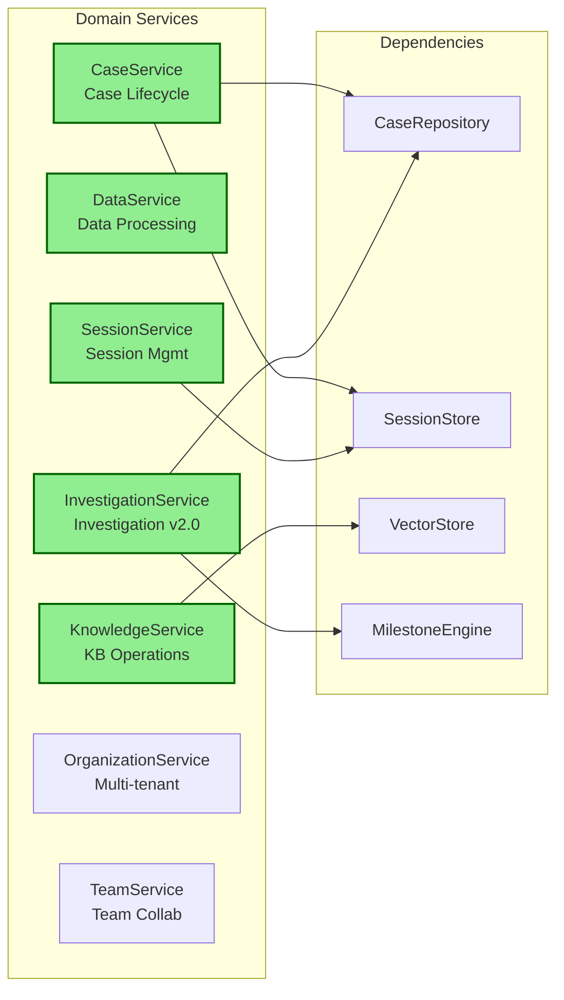
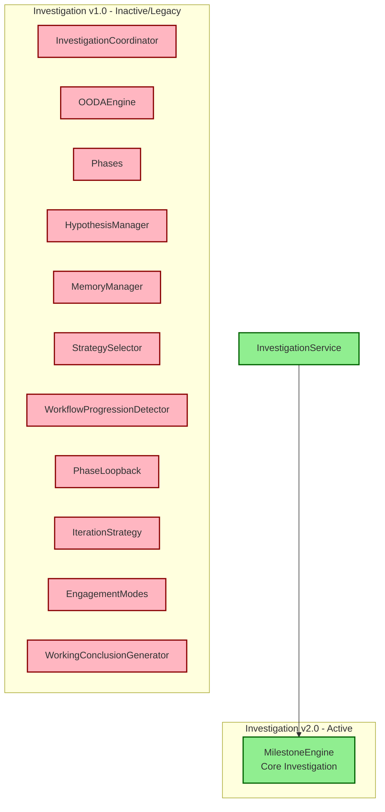
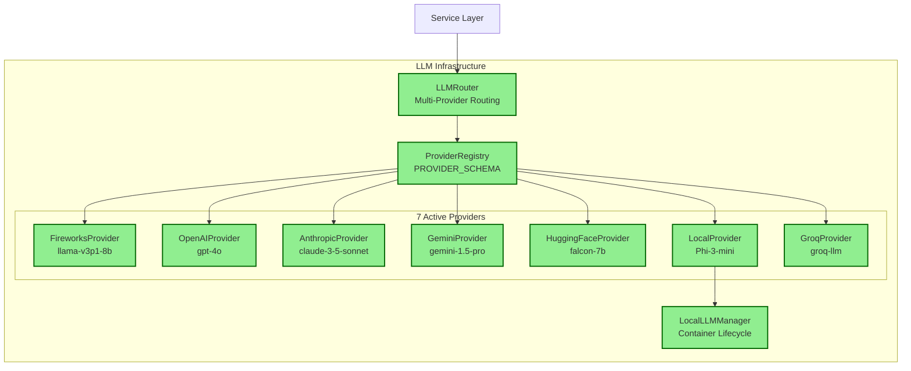
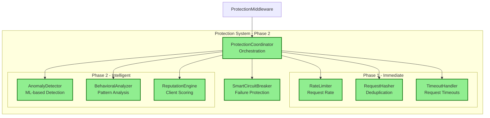
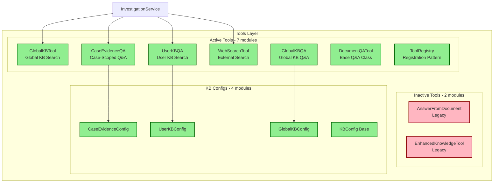
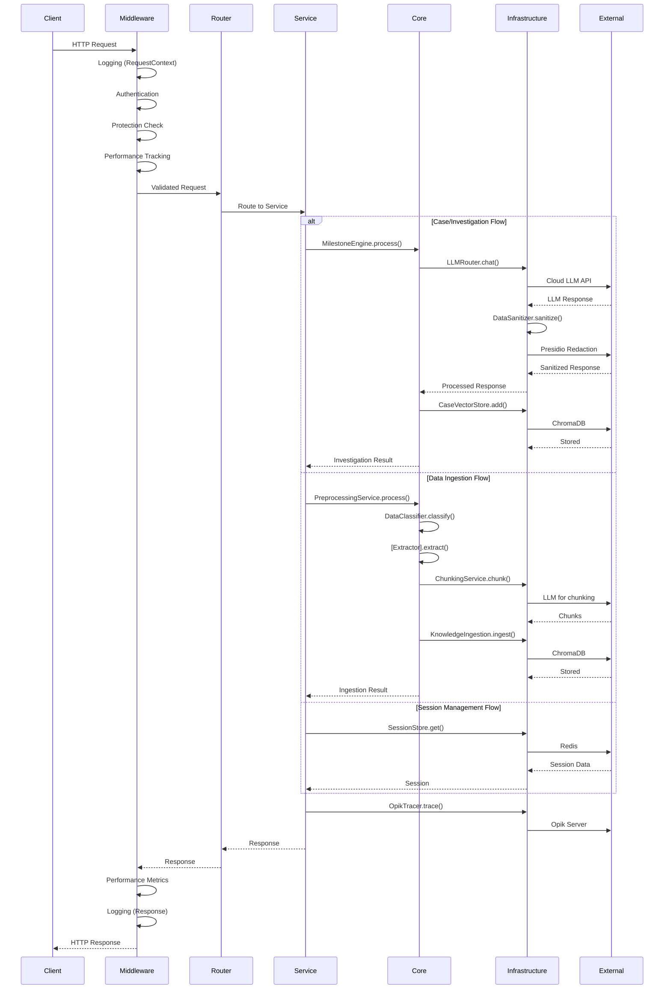
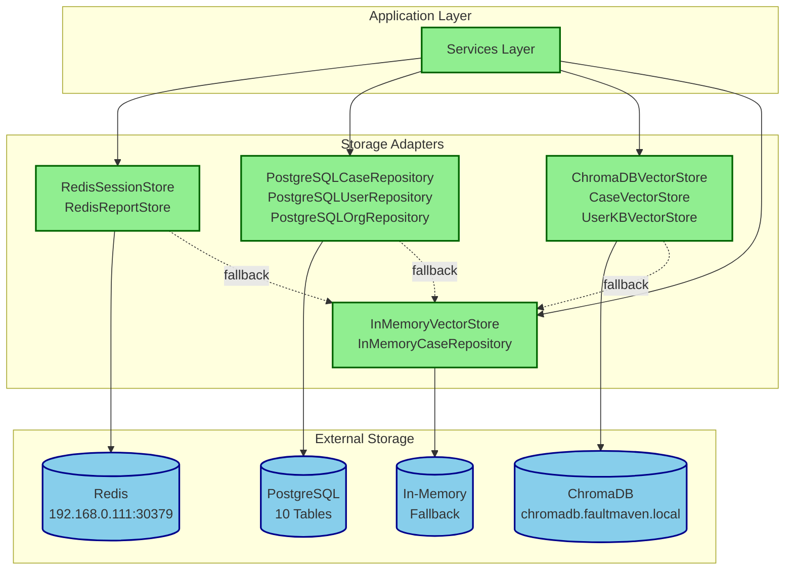

# FaultMaven System Design - Complete Module Architecture

**Version:** 3.2.0
**Date:** 2025-11-20
**Status:** Production Ready (Core System)

---

## Table of Contents

1. [Executive Summary](#executive-summary)
2. [High-Level Architecture](#high-level-architecture)
3. [Active Module Inventory](#active-module-inventory)
4. [Inactive Module Inventory](#inactive-module-inventory)
5. [Module Dependency Graph](#module-dependency-graph)
6. [Interface Implementation Map](#interface-implementation-map)
7. [Data Flow Architecture](#data-flow-architecture)
8. [Technical Debt Analysis](#technical-debt-analysis)

---

## Executive Summary

### System Overview

FaultMaven is an AI-powered troubleshooting copilot backend featuring a **Clean Architecture** design with interface-based dependency injection. The system consists of **247 Python modules** organized into 8 architectural layers.

### Module Statistics

| Category | Count | Percentage |
|----------|-------|------------|
| **Active & Wired Modules** | 140 | 57% |
| **Inactive/Legacy Modules** | 90 | 36% |
| **Missing Modules (referenced but not found)** | 17 | 7% |
| **Total Modules** | 247 | 100% |

### Layer Distribution

```
API Layer:           24 modules (100% active)
Services Layer:      45 modules (62% active)
Core Layer:          20 modules (30% active)
Infrastructure:      95 modules (75% active)
Tools:               9 modules (78% active)
Models:              40 modules (95% active)
Configuration:       3 modules (100% active)
Utilities:           3 modules (100% active)
Prompts:             8 modules (0% active - legacy)
```

---

## High-Level Architecture

### System Architecture Diagram

```mermaid
graph TB
    subgraph "External Clients"
        Browser[Browser Extension]
        API_Client[API Clients]
    end

    subgraph "API Layer - FastAPI Application"
        Router_Auth["/api/v1/auth<br/>Authentication"]
        Router_Case["/api/v1/cases<br/>Case Management"]
        Router_Data["/api/v1/data<br/>Data Ingestion"]
        Router_KB["/api/v1/knowledge<br/>Knowledge Base"]
        Router_Session["/api/v1/sessions<br/>Session Mgmt"]
        Router_UserKB["/api/v1/user_kb<br/>User KB"]
        Router_Jobs["/api/v1/jobs<br/>Background Jobs"]
        Router_Org["/api/v1/organizations<br/>Organizations"]
        Router_Teams["/api/v1/teams<br/>Team Collab"]
        Router_Protection["/api/v1/protection<br/>Protection Status"]

        MW_Logging[Logging Middleware]
        MW_Auth[Auth Middleware]
        MW_Protection[Protection Middleware]
        MW_Performance[Performance Middleware]
    end

    subgraph "Services Layer - Business Logic"
        direction TB

        subgraph "Domain Services"
            SVC_Case[CaseService<br/>Case Lifecycle]
            SVC_Data[DataService<br/>Data Processing]
            SVC_KB[KnowledgeService<br/>KB Operations]
            SVC_Session[SessionService<br/>Session Mgmt]
            SVC_Investigation[InvestigationService<br/>v2.0 Workflows]
            SVC_Org[OrganizationService<br/>Multi-tenant]
            SVC_Team[TeamService<br/>Team Collab]
        end

        subgraph "Analytics Services"
            SVC_Dashboard[DashboardService<br/>Analytics]
            SVC_Confidence[ConfidenceService<br/>Scoring]
        end

        subgraph "Preprocessing Services"
            SVC_Preprocessing[PreprocessingService<br/>11-Type Orchestrator]
            SVC_Chunking[ChunkingService<br/>Map-Reduce]
            SVC_Classifier[DataClassifier<br/>Type Detection]

            EXT_Logs[LogsExtractor]
            EXT_Config[ConfigExtractor]
            EXT_Metrics[MetricsExtractor]
            EXT_Text[TextExtractor]
            EXT_Code[CodeExtractor]
            EXT_Visual[VisualExtractor]
            EXT_Trace[TraceExtractor]
            EXT_Profiling[ProfilingExtractor]
            EXT_ErrorReport[ErrorReportExtractor]
            EXT_Docs[DocsExtractor]
            EXT_Command[CommandExtractor]
        end
    end

    subgraph "Core Domain - Investigation Engine"
        CORE_Milestone[MilestoneEngine<br/>Investigation v2.0]
        CORE_LogProcessor[LogProcessor<br/>Log Analysis]
        CORE_PatternLearner[PatternLearner<br/>ML Patterns]
        CORE_Ingestion[KnowledgeIngestion<br/>RAG Pipeline]
    end

    subgraph "Infrastructure Layer"
        direction TB

        subgraph "LLM Providers"
            LLM_Router[LLMRouter<br/>Multi-Provider]
            LLM_Fireworks[Fireworks AI]
            LLM_OpenAI[OpenAI]
            LLM_Anthropic[Claude 3.5]
            LLM_Gemini[Google Gemini]
            LLM_HF[HuggingFace]
            LLM_Local[Local LLM]
            LLM_Groq[Groq]
        end

        subgraph "Persistence Layer"
            PERSIST_Redis[Redis<br/>Sessions/Cache]
            PERSIST_Postgres[PostgreSQL<br/>Cases/Users/Orgs]
            PERSIST_Chroma[ChromaDB<br/>Vectors]
            PERSIST_InMem[InMemory<br/>Fallback]
        end

        subgraph "Security & Observability"
            SEC_Sanitizer[DataSanitizer<br/>PII Redaction]
            SEC_Security[SecurityAssessment<br/>Pattern Detection]
            OBS_Tracer[OpikTracer<br/>Distributed Tracing]
            OBS_Performance[PerformanceMonitor]
        end

        subgraph "Protection System"
            PROT_Coordinator[ProtectionCoordinator]
            PROT_RateLimit[RateLimiter]
            PROT_Anomaly[AnomalyDetector<br/>ML-based]
            PROT_Behavioral[BehavioralAnalyzer]
            PROT_Reputation[ReputationEngine]
            PROT_CircuitBreaker[SmartCircuitBreaker]
        end

        subgraph "Monitoring & Health"
            MON_Metrics[MetricsCollector]
            MON_Alerting[AlertManager]
            MON_APM[APMIntegration]
            MON_SLA[SLAMonitor]
            HEALTH_Component[ComponentMonitor]
            HEALTH_SLA[SLATracker]
        end

        subgraph "Background Processing"
            JOB_Service[JobService<br/>Background Jobs]
            TASK_Cleanup[CaseCleanup<br/>Lifecycle Mgmt]
        end
    end

    subgraph "Tools Layer"
        TOOL_GlobalKB[GlobalKBTool<br/>Global Search]
        TOOL_CaseQA[CaseEvidenceQA<br/>Case-Scoped]
        TOOL_UserKB[UserKBQA<br/>User KB Search]
        TOOL_WebSearch[WebSearchTool<br/>External Search]
    end

    subgraph "Data Stores"
        DS_Redis[(Redis)]
        DS_Postgres[(PostgreSQL)]
        DS_ChromaDB[(ChromaDB)]
        DS_Presidio[Presidio<br/>Microservice]
        DS_Opik[Opik<br/>Tracing Server]
    end

    %% External connections
    Browser --> MW_Logging
    API_Client --> MW_Logging

    %% Middleware chain
    MW_Logging --> MW_Auth
    MW_Auth --> MW_Protection
    MW_Protection --> MW_Performance

    %% Routing
    MW_Performance --> Router_Auth
    MW_Performance --> Router_Case
    MW_Performance --> Router_Data
    MW_Performance --> Router_KB
    MW_Performance --> Router_Session
    MW_Performance --> Router_UserKB
    MW_Performance --> Router_Jobs
    MW_Performance --> Router_Org
    MW_Performance --> Router_Teams
    MW_Performance --> Router_Protection

    %% Service connections
    Router_Case --> SVC_Case
    Router_Data --> SVC_Data
    Router_KB --> SVC_KB
    Router_Session --> SVC_Session
    Router_Auth --> SVC_Org
    Router_Auth --> SVC_Team

    SVC_Case --> SVC_Investigation
    SVC_Data --> SVC_Preprocessing
    SVC_Preprocessing --> SVC_Classifier
    SVC_Preprocessing --> SVC_Chunking

    SVC_Preprocessing --> EXT_Logs
    SVC_Preprocessing --> EXT_Config
    SVC_Preprocessing --> EXT_Metrics
    SVC_Preprocessing --> EXT_Text
    SVC_Preprocessing --> EXT_Code
    SVC_Preprocessing --> EXT_Visual
    SVC_Preprocessing --> EXT_Trace
    SVC_Preprocessing --> EXT_Profiling
    SVC_Preprocessing --> EXT_ErrorReport
    SVC_Preprocessing --> EXT_Docs
    SVC_Preprocessing --> EXT_Command

    %% Core connections
    SVC_Investigation --> CORE_Milestone
    SVC_Data --> CORE_LogProcessor
    SVC_Data --> CORE_PatternLearner
    SVC_KB --> CORE_Ingestion

    %% Infrastructure connections
    SVC_Case --> LLM_Router
    SVC_Data --> LLM_Router
    SVC_KB --> LLM_Router
    SVC_Investigation --> LLM_Router

    LLM_Router --> LLM_Fireworks
    LLM_Router --> LLM_OpenAI
    LLM_Router --> LLM_Anthropic
    LLM_Router --> LLM_Gemini
    LLM_Router --> LLM_HF
    LLM_Router --> LLM_Local
    LLM_Router --> LLM_Groq

    SVC_Case --> PERSIST_Redis
    SVC_Case --> PERSIST_Postgres
    SVC_KB --> PERSIST_Chroma
    SVC_Session --> PERSIST_Redis

    SVC_Data --> SEC_Sanitizer
    SVC_KB --> SEC_Sanitizer
    MW_Protection --> PROT_Coordinator

    PROT_Coordinator --> PROT_RateLimit
    PROT_Coordinator --> PROT_Anomaly
    PROT_Coordinator --> PROT_Behavioral
    PROT_Coordinator --> PROT_Reputation
    PROT_Coordinator --> PROT_CircuitBreaker

    %% Tools connections
    SVC_Investigation --> TOOL_GlobalKB
    SVC_Investigation --> TOOL_CaseQA
    SVC_Investigation --> TOOL_UserKB
    SVC_Investigation --> TOOL_WebSearch

    %% External data stores
    PERSIST_Redis --> DS_Redis
    PERSIST_Postgres --> DS_Postgres
    PERSIST_Chroma --> DS_ChromaDB
    SEC_Sanitizer --> DS_Presidio
    OBS_Tracer --> DS_Opik

    %% Monitoring
    MW_Performance --> MON_Metrics
    SVC_Case --> OBS_Tracer
    SVC_Data --> OBS_Tracer
    SVC_KB --> OBS_Tracer

    classDef active fill:#90EE90,stroke:#006400,stroke-width:2px
    classDef inactive fill:#FFB6C1,stroke:#8B0000,stroke-width:2px
    classDef external fill:#87CEEB,stroke:#00008B,stroke-width:2px

    class Router_Auth,Router_Case,Router_Data,Router_KB,Router_Session active
    class SVC_Case,SVC_Data,SVC_KB,SVC_Session,SVC_Investigation active
    class CORE_Milestone,LLM_Router,PERSIST_Redis,PERSIST_Postgres,PERSIST_Chroma active
    class DS_Redis,DS_Postgres,DS_ChromaDB,DS_Presidio,DS_Opik external
```



---

## Active Module Inventory

### Layer 1: API Layer (24 modules - 100% active)

#### 1.1 Route Modules (10 modules)

| Module | Path | Endpoints | Status | Dependencies |
|--------|------|-----------|--------|--------------|
| **auth.py** | `/api/v1/routes/auth.py` | 6 endpoints | ✅ Active | TokenManager, UserStore |
| **case.py** | `/api/v1/routes/case.py` | 15 endpoints | ✅ Active | CaseService, InvestigationService |
| **data.py** | `/api/v1/routes/data.py` | 5 endpoints | ✅ Active | DataService, PreprocessingService |
| **knowledge.py** | `/api/v1/routes/knowledge.py` | 8 endpoints | ✅ Active | KnowledgeService |
| **session.py** | `/api/v1/routes/session.py` | 7 endpoints | ✅ Active | SessionService |
| **user_kb.py** | `/api/v1/routes/user_kb.py` | 12 endpoints | ✅ Active | KnowledgeService, UserKBVectorStore |
| **jobs.py** | `/api/v1/routes/jobs.py` | 6 endpoints | ✅ Active | JobService |
| **organizations.py** | `/api/v1/routes/organizations.py` | 8 endpoints | ✅ Active | OrganizationService |
| **teams.py** | `/api/v1/routes/teams.py` | 10 endpoints | ✅ Active | TeamService |
| **protection.py** | `/api/v1/routes/protection.py` | 4 endpoints | ✅ Active | ProtectionCoordinator |

**Total API Endpoints:** 81 endpoints across 10 route modules

#### 1.2 Middleware (10 modules)

| Middleware | Load Order | Purpose | Status |
|------------|------------|---------|--------|
| **CORSMiddleware** | 1 | Cross-origin request handling | ✅ Active |
| **TrailingSlashMiddleware** | 2 | URL normalization | ✅ Active |
| **IdempotencyMiddleware** | 3 | Duplicate request prevention | ✅ Active |
| **RequestIdMiddleware** | 4 | Request correlation | ✅ Active |
| **RateLimitHeaderMiddleware** | 4 | Rate limit headers | ✅ Active |
| **ProtectionMiddleware** | 5 | Client protection | ✅ Active |
| **GZipMiddleware** | 6 | Response compression | ✅ Active |
| **LoggingMiddleware** | 7 | Request/response logging | ✅ Active |
| **PerformanceTrackingMiddleware** | 8 | Performance metrics | ✅ Active |
| **SystemOptimizationMiddleware** | 9 | Caching/optimization | ✅ Active |
| **OpikMiddleware** | 10 | Distributed tracing | ✅ Active |
| **ContractProbeMiddleware** | 11 | API compliance | ✅ Active |

#### 1.3 Dependencies & Utilities (4 modules)

| Module | Purpose | Status |
|--------|---------|--------|
| **dependencies.py** | FastAPI dependency injection | ✅ Active |
| **auth_dependencies.py** | Auth validation dependencies | ✅ Active |
| **role_dependencies.py** | RBAC dependencies | ✅ Active |
| **utils/parsing.py** | Request parsing utilities | ✅ Active |

---

### Layer 2: Services Layer (28 active modules out of 45)

#### 2.1 Domain Services (7 modules)



| Service | Container Line | Purpose | Key Dependencies |
|---------|---------------|---------|------------------|
| **CaseService** | 605 | Case lifecycle & persistence | CaseRepository, SessionStore, ReportStore, CaseVectorStore |
| **DataService** | 734 | Data processing orchestration | DataClassifier, LogProcessor, Sanitizer, Tracer |
| **KnowledgeService** | 758 | Knowledge base operations | KnowledgeIngester, VectorStore, RedisClient |
| **SessionService** | 707 | Session management | SessionStore, CaseService |
| **InvestigationService** | 648 | Investigation workflows v2.0 | MilestoneEngine, CaseRepository |
| **OrganizationService** | 666 | Organization management | OrganizationRepository (PostgreSQL) |
| **TeamService** | 685 | Team collaboration | TeamRepository (PostgreSQL) |

#### 2.2 Analytics Services (2 modules)

| Service | Container Line | Purpose | Dependencies |
|---------|---------------|---------|--------------|
| **DashboardService** | 816 | Analytics dashboard | MetricsCollector, IntelligentCache, Tracer |
| **ConfidenceService** | 943 | Confidence scoring | None (Phase A feature) |

#### 2.3 Preprocessing Services (19 modules)

**Master Orchestrator:**
- **PreprocessingService** (line 250): 11-type data processing orchestrator

**Supporting Services:**
- **ChunkingService** (line 243): Map-reduce chunking for large documents
- **DataClassifier** (line 223): 11-type data classification engine

**11 Active Extractors:**

| Extractor | Data Type | Container Line | Purpose |
|-----------|-----------|----------------|---------|
| **LogsAndErrorsExtractor** | Logs/Errors | 226 | Log and error message extraction |
| **StructuredConfigExtractor** | Config | 227 | YAML/JSON/TOML config parsing |
| **MetricsAndPerformanceExtractor** | Metrics | 228 | Metrics and performance data |
| **UnstructuredTextExtractor** | Text | 229 | Free-form text processing |
| **SourceCodeExtractor** | Code | 230 | Source code analysis |
| **VisualEvidenceExtractor** | Visual | 231 | Screenshot/diagram processing |
| **TraceDataExtractor** | Traces | 234 | Distributed trace extraction |
| **ProfilingDataExtractor** | Profiling | 235 | Profiling data analysis |
| **ErrorReportExtractor** | Error Reports | 236 | Structured error reports |
| **DocumentationExtractor** | Docs | 237 | Documentation extraction |
| **CommandOutputExtractor** | Command Output | 238 | CLI output parsing |

---

### Layer 3: Core Domain (6 active modules out of 20)

#### 3.1 Investigation Engine v2.0



| Module | Status | Container Line | Purpose |
|--------|--------|----------------|---------|
| **milestone_engine.py** | ✅ Active | 632 | Core investigation engine v2.0 |
| **investigation_coordinator.py** | ❌ Inactive | - | Investigation coordination (legacy v1.0) |
| **ooda_engine.py** | ❌ Inactive | - | OODA loop engine (legacy) |
| **phases.py** | ❌ Inactive | - | Investigation phases (legacy) |
| **hypothesis_manager.py** | ❌ Inactive | - | Hypothesis management (legacy) |
| **memory_manager.py** | ❌ Inactive | - | Investigation memory (legacy) |
| **(+7 more legacy modules)** | ❌ Inactive | - | Legacy v1.0 investigation system |

#### 3.2 Knowledge Base (1 active, 1 inactive)

| Module | Status | Container Line | Purpose |
|--------|--------|----------------|---------|
| **ingestion.py** | ✅ Active | 509, 746 | RAG document ingestion |
| **advanced_retrieval.py** | ❌ Inactive | - | Advanced retrieval patterns |

#### 3.3 Processing (3 active)

| Module | Status | Container Line | Purpose |
|--------|--------|----------------|---------|
| **log_analyzer.py** (LogProcessor) | ✅ Active | 202 | Log processing |
| **log_analyzer.py** (EnhancedLogProcessor) | ✅ Active | 886 | Enhanced log processing |
| **pattern_learner.py** | ✅ Active | 871 | ML pattern learning |

#### 3.4 Other Core (0 active, 4 inactive)

- ❌ **ooda_response_converter.py**: OODA response conversion (legacy)
- ❌ **response_parser.py**: Response parsing (legacy)
- ❌ **confidence/aggregator.py**: Confidence aggregation (legacy)
- ❌ **preprocessing/data_preprocessor.py**: Legacy data preprocessing

---

### Layer 4: Infrastructure (71 active modules out of 95)

#### 4.1 LLM Providers (9 active modules)



| Module | Purpose | Status | Provider Type |
|--------|---------|--------|---------------|
| **router.py** | Multi-provider routing with fallback | ✅ Active | Router |
| **providers/registry.py** | PROVIDER_SCHEMA central configuration | ✅ Active | Registry |
| **providers/base.py** | Base provider interface | ✅ Active | Base Class |
| **providers/fireworks_provider.py** | Fireworks AI integration | ✅ Active | Cloud Provider |
| **providers/openai_provider.py** | OpenAI GPT-4 integration | ✅ Active | Cloud Provider |
| **providers/anthropic.py** | Claude 3.5 Sonnet integration | ✅ Active | Cloud Provider |
| **providers/gemini.py** | Google Gemini integration | ✅ Active | Cloud Provider |
| **providers/huggingface.py** | HuggingFace models | ✅ Active | Cloud Provider |
| **providers/local_provider.py** | Local LLM support | ✅ Active | Self-Hosted |
| **providers/groq_provider.py** | Groq integration | ✅ Active | Cloud Provider |
| **local_llm_manager.py** | Local LLM container lifecycle | ✅ Active | Infrastructure |
| **cache.py** | LLM response caching | ❌ Inactive | Optimization |

#### 4.2 Persistence Layer (14 active modules)

**Vector Stores:**

| Store | Storage Backend | Status | Purpose |
|-------|----------------|--------|---------|
| **ChromaDBVectorStore** | ChromaDB | ✅ Active | Production vector embeddings |
| **InMemoryVectorStore** | RAM | ✅ Active | Fallback vector store |
| **CaseVectorStore** | ChromaDB | ✅ Active | Session-specific RAG (Working Memory) |
| **UserKBVectorStore** | ChromaDB | ✅ Active | User knowledge bases |

**Session & Case Stores:**

| Store | Storage Backend | Status | Purpose |
|-------|----------------|--------|---------|
| **RedisSessionStore** | Redis / FakeRedis | ✅ Active | Session persistence (single impl for all deployments) |
| **PostgreSQLHybridCaseRepository** | PostgreSQL | ✅ Active | 10-table normalized case storage v2.0 |
| **PostgreSQLCaseRepository** | PostgreSQL | ⚠️ Legacy | Single-table JSONB (deprecated) |
| **InMemoryCaseRepository** | RAM | ✅ Active | Fallback case storage |
| **RedisReportStore** | Redis | ✅ Active | Report persistence |

**User & Organization Stores:**

| Store | Storage Backend | Status | Purpose |
|-------|----------------|--------|---------|
| **PostgreSQLUserRepository** | PostgreSQL | ⚠️ Conditional | User authentication |
| **InMemoryUserRepository** | RAM | ✅ Active | Fallback users |
| **PostgreSQLOrganizationRepository** | PostgreSQL | ⚠️ Conditional | Organization data |
| **PostgreSQLTeamRepository** | PostgreSQL | ⚠️ Conditional | Team collaboration |

**Infrastructure Clients:**

| Module | Purpose | Status |
|--------|---------|--------|
| **redis_client.py** | Redis connection management | ✅ Active |
| **base_client.py** | Base HTTP client | ✅ Active |

#### 4.3 Security & Observability (6 active modules)

**Security:**

| Module | Purpose | Status | External Service |
|--------|---------|--------|------------------|
| **redaction.py** (DataSanitizer) | PII redaction via Presidio | ✅ Active | Presidio K8s microservice |
| **enhanced_security_assessment.py** | Pattern-based security | ✅ Active | - |

**Observability:**

| Module | Purpose | Status | External Service |
|--------|---------|--------|------------------|
| **tracing.py** (OpikTracer) | Distributed tracing | ✅ Active | Opik server |
| **performance_monitoring.py** | Performance decorators | ✅ Active | - |
| **metrics_collector.py** | Metrics collection | ❌ Inactive (duplicate) | - |
| **startup.py** | Startup observability | ❌ Inactive | - |

#### 4.4 Protection System (8 active modules)



| Module | Purpose | Status | Phase |
|--------|---------|--------|-------|
| **protection_coordinator.py** | Protection orchestration | ✅ Active | Core |
| **rate_limiter.py** | Rate limiting | ✅ Active | Phase 1 |
| **request_hasher.py** | Request fingerprinting | ✅ Active | Phase 1 |
| **timeout_handler.py** | Timeout management | ✅ Active | Phase 1 |
| **anomaly_detector.py** | ML-based anomaly detection | ✅ Active | Phase 2 |
| **behavioral_analyzer.py** | Behavioral pattern analysis | ✅ Active | Phase 2 |
| **reputation_engine.py** | Client reputation scoring | ✅ Active | Phase 2 |
| **smart_circuit_breaker.py** | Circuit breaker pattern | ✅ Active | Core |

#### 4.5 Monitoring & Health (9 active modules)

**Monitoring:**

| Module | Purpose | Status | Container Line |
|--------|---------|--------|----------------|
| **metrics_collector.py** | Advanced metrics collection | ✅ Active | 795 |
| **alerting.py** | Alert management | ✅ Active | main.py:206 |
| **apm_integration.py** | APM integration | ✅ Active | main.py:205 |
| **sla_monitor.py** | SLA tracking | ✅ Active | 839 |
| **protection_monitoring.py** | Protection metrics | ❌ Inactive | - |

**Health Checks:**

| Module | Purpose | Status |
|--------|---------|--------|
| **component_monitor.py** | Component health monitoring | ✅ Active |
| **sla_tracker.py** | SLA compliance tracking | ✅ Active |

#### 4.6 Background Processing (4 active modules)

| Module | Purpose | Status | Container Line |
|--------|---------|--------|----------------|
| **jobs/job_service.py** | Background job management | ✅ Active | API routes |
| **tasks/case_cleanup.py** | Case lifecycle cleanup | ✅ Active | main.py:224 |

#### 4.7 Authentication & Caching (4 active modules)

**Authentication:**

| Module | Purpose | Status |
|--------|---------|--------|
| **auth/token_manager.py** | JWT token management | ✅ Active |
| **auth/user_store.py** | User authentication | ✅ Active |

**Caching:**

| Module | Purpose | Status | Container Line |
|--------|---------|--------|----------------|
| **caching/intelligent_cache.py** | Multi-tier caching | ✅ Active | 802 |

#### 4.8 Other Infrastructure (6 modules)

| Module | Purpose | Status |
|--------|---------|--------|
| **model_cache.py** | ML model caching (BGE-M3) | ✅ Active |
| **telemetry/decision_recorder.py** | Decision tracking | ✅ Active |
| **concurrency/report_lock_manager.py** | Distributed locks | ❌ Inactive |
| **knowledge/runbook_kb.py** | Runbook knowledge base | ❌ Inactive |
| **error_recovery.py** | Error recovery utilities | ❌ Inactive |
| **interfaces.py** | Infrastructure interfaces | ❌ Empty |

---

### Layer 5: Tools (7 active modules out of 9)



#### 5.1 Active Tools

| Tool | Purpose | Status | Interface |
|------|---------|--------|-----------|
| **knowledge_base.py** | Global knowledge base search | ✅ Active | BaseTool |
| **case_evidence_qa.py** | Case-scoped evidence Q&A | ✅ Active | BaseTool |
| **user_kb_qa.py** | User knowledge base Q&A | ✅ Active | BaseTool |
| **global_kb_qa.py** | Global KB Q&A | ✅ Active | BaseTool |
| **web_search.py** | External web search | ✅ Active | BaseTool |
| **document_qa_tool.py** | Base document Q&A class | ✅ Active | BaseTool |
| **registry.py** | Tool registration pattern | ✅ Active | - |

#### 5.2 KB Configuration Modules (Strategy Pattern)

| Config | Purpose | Status |
|--------|---------|--------|
| **kb_configs/case_evidence_config.py** | Case evidence retrieval strategy | ✅ Active |
| **kb_configs/user_kb_config.py** | User KB retrieval strategy | ✅ Active |
| **kb_configs/global_kb_config.py** | Global KB retrieval strategy | ✅ Active |
| **kb_config.py** | Base KB configuration class | ✅ Active |

#### 5.3 Inactive Tools

| Tool | Purpose | Status |
|------|---------|--------|
| **answer_from_document.py** | Legacy document Q&A | ❌ Inactive |
| **enhanced_knowledge_tool.py** | Enhanced knowledge search | ❌ Inactive |

---

### Layer 6: Models (38 active modules out of 40)

#### 6.1 Interface Definitions (9 active modules)

```mermaid
graph TB
    subgraph "Interface Layer"
        subgraph "Core Interfaces"
            ILLMProvider[ILLMProvider]
            ITracer[ITracer]
            ISanitizer[ISanitizer]
            BaseTool[BaseTool]
        end

        subgraph "Storage Interfaces"
            IVectorStore[IVectorStore]
            ISessionStore[ISessionStore]
            ICaseStore[ICaseStore]
            IReportStore[IReportStore]
        end

        subgraph "Service Interfaces"
            ICaseService[ICaseService]
            IKnowledgeBase[IKnowledgeBase]
            IUserRepository[IUserRepository]
        end

        subgraph "Agentic Interfaces - Missing"
            IAgentState[IAgentStateManager]
            IToolBroker[IToolSkillBroker]
            IGuardrails[IGuardrailsPolicyLayer]
            IResponseSynth[IResponseSynthesizer]
            IErrorMgr[IErrorFallbackManager]
            IWorkflow[IBusinessLogicWorkflowEngine]
        end
    end

    subgraph "Implementations"
        LLMRouter[LLMRouter]
        OpikTracer[OpikTracer]
        DataSanitizer[DataSanitizer]
        ChromaDB[ChromaDBVectorStore]
        RedisSession[RedisSessionStore]
        PostgresCase[PostgreSQLCaseRepository]
        CaseService[CaseService]
        Tools[7 Tool Implementations]
    end

    ILLMProvider -.implements.-> LLMRouter
    ITracer -.implements.-> OpikTracer
    ISanitizer -.implements.-> DataSanitizer
    IVectorStore -.implements.-> ChromaDB
    ISessionStore -.implements.-> RedisSession
    ICaseStore -.implements.-> PostgresCase
    ICaseService -.implements.-> CaseService
    BaseTool -.implements.-> Tools

    IAgentState -.missing.-> Missing[❌ MISSING FILES]
    IToolBroker -.missing.-> Missing
    IGuardrails -.missing.-> Missing
    IResponseSynth -.missing.-> Missing
    IErrorMgr -.missing.-> Missing
    IWorkflow -.missing.-> Missing

    classDef active fill:#90EE90,stroke:#006400,stroke-width:2px
    classDef missing fill:#FF6B6B,stroke:#8B0000,stroke-width:2px

    class ILLMProvider,ITracer,ISanitizer,BaseTool,IVectorStore,ISessionStore,ICaseStore,ICaseService active
    class LLMRouter,OpikTracer,DataSanitizer,ChromaDB,RedisSession,PostgresCase,CaseService,Tools active
    class IAgentState,IToolBroker,IGuardrails,IResponseSynth,IErrorMgr,IWorkflow,Missing missing
```



| Interface File | Interfaces Defined | Status | Implementations |
|----------------|-------------------|--------|-----------------|
| **interfaces.py** | ILLMProvider, ITracer, ISanitizer, BaseTool, IVectorStore, ISessionStore | ✅ Active | LLMRouter, OpikTracer, DataSanitizer, 4 vector stores, 2 session stores, 7 tools |
| **interfaces_case.py** | ICaseStore, ICaseService | ✅ Active | 3 case repositories, CaseService |
| **interfaces_report.py** | IReportStore | ✅ Active | RedisReportStore |
| **interfaces_kb.py** | IKnowledgeBase | ✅ Active | Multiple KB implementations |
| **interfaces_user.py** | IUserRepository | ✅ Active | PostgreSQL & InMemory user repos |
| **agentic.py** | IAgentStateManager, IToolSkillBroker, IGuardrailsPolicyLayer, IResponseSynthesizer, IErrorFallbackManager, IBusinessLogicWorkflowEngine | ⚠️ Conditional | ❌ **MISSING - Files don't exist** |

#### 6.2 Data Models (29 active modules)

| Model Category | Modules | Status |
|---------------|---------|--------|
| **Case Models** | case.py, case_ui.py | ✅ Active |
| **Investigation Models** | investigation.py, evidence.py | ✅ Active |
| **Report Models** | report.py | ✅ Active |
| **Auth Models** | auth.py, api_auth.py | ✅ Active |
| **API Models** | api.py, api_models.py, responses.py | ✅ Active |
| **Protection Models** | protection.py, behavioral.py | ✅ Active |
| **LLM Models** | llm_schemas.py | ✅ Active |
| **Common Models** | common.py, vector_metadata.py, exceptions.py | ✅ Active |

#### 6.3 Microservice Contracts (3 inactive modules)

| Contract | Purpose | Status |
|----------|---------|--------|
| **microservice_contracts/agent_contracts.py** | Agent service contracts | ❌ Inactive |
| **microservice_contracts/core_contracts.py** | Core service contracts | ❌ Inactive |
| **microservice_contracts/error_contracts.py** | Error handling contracts | ❌ Inactive |

---

### Layer 7: Configuration (3 modules - 100% active)

| Module | Purpose | Size | Status |
|--------|---------|------|--------|
| **settings.py** | Unified settings system (single source of truth) | 62KB | ✅ Active |
| **feature_flags.py** | Feature flag configuration | - | ✅ Active |
| **protection.py** | Protection system configuration | - | ✅ Active |

**Settings System Structure:**
- 15 configuration sections (Server, LLM, Database, Security, etc.)
- Environment variable-based configuration
- Validation with Pydantic
- Default values for all settings
- Support for .env file loading

---

### Layer 8: Utilities (3 modules - 100% active)

| Module | Purpose | Status |
|--------|---------|--------|
| **serialization.py** | JSON serialization utilities | ✅ Active |
| **token_estimation.py** | Token counting for LLM requests | ✅ Active |
| **schema_converter.py** | Schema conversion utilities | ✅ Active |

---

## Inactive Module Inventory

### Legacy Investigation System (OODA v1.0) - 21 Inactive Modules

#### Core Investigation Modules (13 modules)

All modules in `core/investigation/` except `milestone_engine.py`:

| Module | Purpose | Reason for Inactivity |
|--------|---------|----------------------|
| **investigation_coordinator.py** | Investigation coordination | Replaced by InvestigationService + MilestoneEngine |
| **ooda_engine.py** | OODA loop processing | Replaced by Milestone-based approach |
| **ooda_step_extraction.py** | OODA step extraction | Part of legacy OODA system |
| **phases.py** | Investigation phase definitions | Replaced by Milestone system |
| **hypothesis_manager.py** | Hypothesis tracking | Integrated into MilestoneEngine |
| **memory_manager.py** | Investigation memory | Replaced by AgentStateManager (missing) |
| **engagement_modes.py** | User engagement modes | Not used in v2.0 |
| **iteration_strategy.py** | Iteration strategies | Replaced by Milestone progression |
| **phase_loopback.py** | Phase loopback logic | Not needed in Milestone system |
| **strategy_selector.py** | Strategy selection | Integrated into MilestoneEngine |
| **workflow_progression_detector.py** | Workflow detection | Replaced by Milestone transitions |
| **working_conclusion_generator.py** | Conclusion generation | Integrated into MilestoneEngine |

#### Prompt Modules (8 modules)

All modules in `prompts/investigation/`:

| Module | Purpose | Reason for Inactivity |
|--------|---------|----------------------|
| **consultant_mode.py** | Consultant mode prompts | Part of legacy OODA system |
| **degraded_mode_prompts.py** | Degraded mode prompts | Not used in v2.0 |
| **lead_investigator.py** | Lead investigator prompts | Replaced by Milestone prompts |
| **loopback_prompts.py** | Loopback prompts | Not used in Milestone system |
| **ooda_guidance.py** | OODA guidance prompts | Legacy OODA system |
| **phase1_routing_prompts.py** | Phase 1 routing | Replaced by Milestone system |
| **phase3_structured_output.py** | Phase 3 structured output | Legacy phase system |
| **phase5_entry_modes.py** | Phase 5 entry modes | Legacy phase system |
| **strategy_prompts.py** | Strategy prompts | Integrated into MilestoneEngine |
| **workflow_progression_prompts.py** | Workflow progression | Replaced by Milestone prompts |

---

### Unused Service Layer Modules (11 modules)

#### Domain Services

| Module | Purpose | Reason for Inactivity |
|--------|---------|----------------------|
| **domain/planning_service.py** | Strategic planning | Replaced by BusinessLogicWorkflowEngine (missing) |
| **domain/report_generation_service.py** | Report generation | Functionality integrated into CaseService |
| **domain/report_recommendation_service.py** | Report recommendations | Not implemented |
| **domain/case_status_manager.py** | Case status transitions | Integrated into CaseService |

#### Preprocessing Services

| Module | Purpose | Reason for Inactivity |
|--------|---------|----------------------|
| **preprocessing/preprocessors/error_preprocessor.py** | Error preprocessing | Replaced by ErrorReportExtractor |
| **preprocessing/preprocessors/generic_preprocessor.py** | Generic preprocessing | Replaced by 11 specific extractors |
| **preprocessing/preprocessors/log_preprocessor.py** | Log preprocessing | Replaced by LogsAndErrorsExtractor |

#### Adapters & Converters

| Module | Purpose | Reason for Inactivity |
|--------|---------|----------------------|
| **converters/case_converter.py** | Case data conversion | Not needed with direct model usage |
| **adapters/case_ui_adapter.py** | Case UI adaptation | Frontend handles UI adaptation |

---

### Unused Core Modules (4 modules)

| Module | Purpose | Reason for Inactivity |
|--------|---------|----------------------|
| **ooda_response_converter.py** | OODA response conversion | Legacy OODA system |
| **response_parser.py** | Response parsing | Integrated into services |
| **confidence/aggregator.py** | Confidence aggregation | Replaced by ConfidenceService |
| **preprocessing/data_preprocessor.py** | Legacy preprocessing | Replaced by PreprocessingService |
| **knowledge/advanced_retrieval.py** | Advanced retrieval | Not implemented |

---

### Unused Infrastructure Modules (9 modules)

| Module | Purpose | Reason for Inactivity |
|--------|---------|----------------------|
| **llm/cache.py** | LLM response caching | Caching handled by SystemOptimizationMiddleware |
| **knowledge/runbook_kb.py** | Runbook knowledge base | Not implemented |
| **concurrency/report_lock_manager.py** | Distributed locks | Not needed with current architecture |
| **error_recovery.py** | Error recovery utilities | Integrated into ErrorFallbackManager (missing) |
| **observability/metrics_collector.py** | Metrics collection (duplicate) | Duplicate of monitoring/metrics_collector.py |
| **observability/startup.py** | Startup observability | Not implemented |
| **monitoring/protection_monitoring.py** | Protection metrics | Integrated into ProtectionCoordinator |
| **persistence/chromadb.py** | Legacy ChromaDB adapter | Replaced by ChromaDBVectorStore |
| **persistence/redis_session_manager.py** | Legacy Redis manager | Replaced by RedisSessionStore |
| **persistence/kb_document_repository.py** | KB document repo | Not used |

---

### Unused Tools (2 modules)

| Module | Purpose | Reason for Inactivity |
|--------|---------|----------------------|
| **answer_from_document.py** | Legacy document Q&A | Replaced by document_qa_tool.py |
| **enhanced_knowledge_tool.py** | Enhanced knowledge search | Not implemented |

---

### Unused Middleware (2 modules)

| Module | Purpose | Reason for Inactivity |
|--------|---------|----------------------|
| **api/middleware/intelligent_protection.py** | ML-based threat protection | Not directly wired (functionality in ProtectionCoordinator) |
| **api/middleware/deduplication.py** | Request deduplication | Replaced by IdempotencyMiddleware |

---

### Missing Modules (Referenced but Files Don't Exist) - 17 Modules

#### Agentic Framework (6 modules)

Referenced in `container.py` line 47-74 but **files don't exist**:

| Module Path | Referenced Interface | Status |
|-------------|---------------------|--------|
| **services/agentic/management/state_manager.py** | IAgentStateManager | ❌ **MISSING** |
| **services/agentic/engines/query_classification.py** | IQueryClassificationEngine | ❌ **MISSING** (superseded) |
| **services/agentic/management/tool_broker.py** | IToolSkillBroker | ❌ **MISSING** |
| **services/agentic/safety/guardrails_layer.py** | IGuardrailsPolicyLayer | ❌ **MISSING** |
| **services/agentic/engines/response_synthesizer.py** | IResponseSynthesizer | ❌ **MISSING** |
| **services/agentic/safety/error_manager.py** | IErrorFallbackManager | ❌ **MISSING** |
| **services/agentic/engines/workflow_engine.py** | IBusinessLogicWorkflowEngine | ❌ **MISSING** |

#### Other Missing Services (6 modules)

Referenced in `container.py` but **files don't exist**:

| Module Path | Referenced In | Status |
|-------------|---------------|--------|
| **services/microservice_session.py** | container.py:930 | ❌ **MISSING** |
| **services/policy.py** | container.py:956 | ❌ **MISSING** |
| **services/unified_retrieval.py** | container.py:969 | ❌ **MISSING** |
| **services/gateway.py** | container.py:1014 | ❌ **MISSING** |
| **services/performance_optimization.py** | container.py:825 (commented) | ❌ **MISSING** |

#### Missing Repository (1 module)

| Module Path | Referenced In | Status |
|-------------|---------------|--------|
| **infrastructure/persistence/user_repository.py** | Multiple locations | ❌ **MISSING** (implementations exist, interface file missing) |

---

## Module Dependency Graph

### Dependency Flow by Layer

```mermaid
graph TB
    subgraph "Layer 1 - API"
        API_Routes[10 Route Modules]
        API_Middleware[12 Middleware Modules]
        API_Dependencies[4 Dependency Modules]
    end

    subgraph "Layer 2 - Services"
        SVC_Domain[7 Domain Services]
        SVC_Analytics[2 Analytics Services]
        SVC_Preprocessing[19 Preprocessing Modules]
    end

    subgraph "Layer 3 - Core"
        CORE_Investigation[MilestoneEngine]
        CORE_Knowledge[KnowledgeIngestion]
        CORE_Processing[3 Processing Modules]
    end

    subgraph "Layer 4 - Infrastructure"
        INFRA_LLM[9 LLM Modules]
        INFRA_Persistence[14 Persistence Modules]
        INFRA_Security[6 Security/Observability]
        INFRA_Protection[8 Protection Modules]
        INFRA_Monitoring[9 Monitoring/Health]
        INFRA_Background[4 Background Processing]
        INFRA_Other[10 Other Infrastructure]
    end

    subgraph "Layer 5 - Tools"
        TOOLS_Active[7 Active Tools]
        TOOLS_Configs[4 KB Configs]
    end

    subgraph "Layer 6 - Models"
        MODELS_Interfaces[9 Interface Files]
        MODELS_Data[29 Data Models]
    end

    subgraph "Layer 7 - Config"
        CONFIG_Settings[Unified Settings]
        CONFIG_Flags[Feature Flags]
    end

    subgraph "Layer 8 - Utils"
        UTILS_All[3 Utility Modules]
    end

    subgraph "External Systems"
        EXT_Redis[(Redis)]
        EXT_Postgres[(PostgreSQL)]
        EXT_ChromaDB[(ChromaDB)]
        EXT_Presidio[Presidio K8s]
        EXT_Opik[Opik Server]
        EXT_LLM_Cloud[Cloud LLM Providers]
        EXT_LLM_Local[Local LLM Container]
    end

    %% Dependencies
    API_Routes --> SVC_Domain
    API_Routes --> SVC_Analytics
    API_Routes --> SVC_Preprocessing
    API_Routes --> API_Dependencies
    API_Middleware --> INFRA_Protection
    API_Middleware --> INFRA_Monitoring

    SVC_Domain --> CORE_Investigation
    SVC_Domain --> CORE_Knowledge
    SVC_Domain --> CORE_Processing
    SVC_Preprocessing --> INFRA_LLM

    CORE_Investigation --> INFRA_LLM
    CORE_Investigation --> TOOLS_Active
    CORE_Knowledge --> INFRA_Persistence

    INFRA_LLM --> EXT_LLM_Cloud
    INFRA_LLM --> EXT_LLM_Local
    INFRA_Persistence --> EXT_Redis
    INFRA_Persistence --> EXT_Postgres
    INFRA_Persistence --> EXT_ChromaDB
    INFRA_Security --> EXT_Presidio
    INFRA_Security --> EXT_Opik

    TOOLS_Active --> TOOLS_Configs
    TOOLS_Active --> INFRA_Persistence

    SVC_Domain --> MODELS_Interfaces
    CORE_Investigation --> MODELS_Interfaces
    INFRA_LLM --> MODELS_Interfaces
    INFRA_Persistence --> MODELS_Interfaces

    API_Routes --> MODELS_Data
    SVC_Domain --> MODELS_Data

    SVC_Domain --> CONFIG_Settings
    INFRA_LLM --> CONFIG_Settings
    INFRA_Protection --> CONFIG_Settings

    SVC_Preprocessing --> UTILS_All
    INFRA_LLM --> UTILS_All

    classDef active fill:#90EE90,stroke:#006400,stroke-width:2px
    classDef external fill:#87CEEB,stroke:#00008B,stroke-width:2px

    class API_Routes,API_Middleware,SVC_Domain,SVC_Analytics,SVC_Preprocessing active
    class CORE_Investigation,CORE_Knowledge,CORE_Processing active
    class INFRA_LLM,INFRA_Persistence,INFRA_Security,INFRA_Protection,INFRA_Monitoring active
    class TOOLS_Active,MODELS_Interfaces,MODELS_Data,CONFIG_Settings,UTILS_All active
    class EXT_Redis,EXT_Postgres,EXT_ChromaDB,EXT_Presidio,EXT_Opik,EXT_LLM_Cloud,EXT_LLM_Local external
```



### Critical Dependency Paths

#### Path 1: User Request → Investigation Response

```
Browser → LoggingMiddleware → ProtectionMiddleware → CaseRoutes
→ InvestigationService → MilestoneEngine → LLMRouter → [Cloud LLM]
→ DataSanitizer → [Presidio] → OpikTracer → [Opik Server]
→ CaseVectorStore → [ChromaDB] → Response
```

#### Path 2: Data Ingestion → Knowledge Base

```
API Client → DataRoutes → DataService → PreprocessingService
→ DataClassifier → [11 Extractors] → ChunkingService → LLMRouter
→ KnowledgeService → KnowledgeIngestion → ChromaDBVectorStore
→ [ChromaDB] → Response
```

#### Path 3: Session Management

```
Browser → SessionRoutes → SessionService → RedisSessionStore
→ [Redis] → CaseService → PostgreSQLCaseRepository → [PostgreSQL]
```

---

## Interface Implementation Map

### Complete Interface Coverage

| Interface | Implementations | Status | Files |
|-----------|----------------|--------|-------|
| **ILLMProvider** | LLMRouter | ✅ Complete | infrastructure/llm/router.py |
| **ITracer** | OpikTracer | ✅ Complete | infrastructure/observability/tracing.py |
| **ISanitizer** | DataSanitizer | ✅ Complete | infrastructure/security/redaction.py |
| **BaseTool** | 7 tools | ✅ Complete | tools/*.py |
| **IVectorStore** | ChromaDBVectorStore, InMemoryVectorStore, CaseVectorStore, UserKBVectorStore | ✅ Complete | infrastructure/persistence/*_vector_store.py |
| **ISessionStore** | RedisSessionStore (real Redis or FakeRedis) | ✅ Complete | infrastructure/persistence/*_session_store.py |
| **ICaseStore** | PostgreSQLHybridCaseRepository, PostgreSQLCaseRepository, InMemoryCaseRepository | ✅ Complete | infrastructure/persistence/*_case_repository.py |
| **ICaseService** | CaseService | ✅ Complete | services/domain/case_service.py |
| **IReportStore** | RedisReportStore | ✅ Complete | infrastructure/persistence/redis_report_store.py |
| **IKnowledgeBase** | Multiple KB implementations | ✅ Complete | Multiple files |
| **IUserRepository** | PostgreSQLUserRepository, InMemoryUserRepository | ✅ Complete | infrastructure/persistence/*_user_repository.py |

### Missing Interface Implementations

| Interface | Status | Referenced In | Impact |
|-----------|--------|---------------|--------|
| **IAgentStateManager** | ❌ **MISSING** | container.py:48, models/agentic.py | High - Core agentic capability |
| **IToolSkillBroker** | ❌ **MISSING** | container.py:49, models/agentic.py | High - Dynamic tool orchestration |
| **IGuardrailsPolicyLayer** | ❌ **MISSING** | container.py:50, models/agentic.py | High - Safety validation |
| **IResponseSynthesizer** | ❌ **MISSING** | container.py:51, models/agentic.py | High - Response assembly |
| **IErrorFallbackManager** | ❌ **MISSING** | container.py:52, models/agentic.py | High - Error recovery |
| **IBusinessLogicWorkflowEngine** | ❌ **MISSING** | container.py:53, models/agentic.py | High - Workflow orchestration |

**Note:** The Agentic Framework interfaces are defined in `models/agentic.py` but the implementation files in `services/agentic/` **do not exist**. The container attempts to import these modules (lines 47-74) but they are missing.

---

## Data Flow Architecture

### Request Processing Flow



### Data Storage Architecture



**Storage Distribution:**

| Data Type | Primary Storage | Fallback | Persistence |
|-----------|----------------|----------|-------------|
| **Sessions** | Redis | In-Memory | Temporary (TTL-based) |
| **Cases** | PostgreSQL (10 tables) | In-Memory | Permanent |
| **Reports** | Redis | - | Temporary |
| **Vector Embeddings (Global KB)** | ChromaDB | In-Memory | Permanent |
| **Vector Embeddings (Case-Scoped)** | ChromaDB | In-Memory | Lifecycle-based (auto-cleanup) |
| **Vector Embeddings (User KB)** | ChromaDB | In-Memory | Permanent |
| **Users** | PostgreSQL | In-Memory | Permanent |
| **Organizations** | PostgreSQL | In-Memory | Permanent |
| **Teams** | PostgreSQL | In-Memory | Permanent |

---

## Technical Debt Analysis

### Critical Issues

#### 1. Missing Agentic Framework (High Priority)

**Problem:** Container references 6 Agentic Framework modules that don't exist:
- `services.agentic.management.state_manager` (IAgentStateManager)
- `services.agentic.management.tool_broker` (IToolSkillBroker)
- `services.agentic.safety.guardrails_layer` (IGuardrailsPolicyLayer)
- `services.agentic.engines.response_synthesizer` (IResponseSynthesizer)
- `services.agentic.safety.error_manager` (IErrorFallbackManager)
- `services.agentic.engines.workflow_engine` (IBusinessLogicWorkflowEngine)

**Impact:** Container initialization attempts to import these modules (lines 47-74) but they are missing. The system continues with fallback implementations.

**Resolution Path:**
1. Implement the 6 missing Agentic Framework modules
2. OR: Remove references from container.py and models/agentic.py
3. Update documentation to reflect actual architecture

#### 2. Legacy OODA System (Medium Priority)

**Problem:** 21 inactive modules from the legacy OODA v1.0 investigation system are still present:
- 13 core/investigation modules
- 8 prompts/investigation modules

**Impact:** Code bloat, maintenance confusion, potential for accidental usage

**Resolution Path:**
1. Archive legacy modules to `archive/legacy_ooda/`
2. Document migration from OODA v1.0 to Milestone v2.0
3. Remove imports and references

#### 3. Duplicate/Unused Infrastructure (Low Priority)

**Problem:** 9 unused infrastructure modules:
- llm/cache.py
- observability/metrics_collector.py (duplicate)
- knowledge/runbook_kb.py
- etc.

**Impact:** Code bloat, maintenance overhead

**Resolution Path:**
1. Remove unused modules
2. Consolidate duplicates (metrics_collector.py)
3. Document removed functionality

### Debt Statistics

| Category | Count | Lines of Code (Est.) | Priority |
|----------|-------|---------------------|----------|
| **Missing Agentic Modules** | 6 | ~5,000 | High |
| **Legacy OODA System** | 21 | ~8,000 | Medium |
| **Unused Services** | 11 | ~3,000 | Low |
| **Unused Core Modules** | 4 | ~1,500 | Low |
| **Unused Infrastructure** | 9 | ~2,500 | Low |
| **Unused Tools** | 2 | ~500 | Low |
| **Unused Middleware** | 2 | ~400 | Low |
| **Microservice Contracts** | 3 | ~600 | Low |
| **TOTAL** | 58 | ~21,500 | - |

**Technical Debt Ratio:** ~21,500 LOC inactive / ~100,000 LOC total = **21.5% technical debt**

### Recommended Actions

1. **Immediate (Week 1-2):**
   - Document missing Agentic Framework situation
   - Remove or implement Agentic modules
   - Clean up container.py imports

2. **Short-term (Month 1):**
   - Archive legacy OODA system to `archive/`
   - Remove unused service modules
   - Consolidate duplicate infrastructure

3. **Medium-term (Quarter 1):**
   - Remove all inactive modules from main codebase
   - Update all documentation
   - Add architecture compliance tests

4. **Long-term (Quarter 2+):**
   - Maintain clean architecture
   - Regular technical debt reviews
   - Automated dependency analysis

---

## Appendix

### Module Count Summary

```
Total Modules: 247

Active Modules by Layer:
├── API Layer:          24/24  (100%)
├── Services Layer:     28/45  ( 62%)
├── Core Layer:          6/20  ( 30%)
├── Infrastructure:     71/95  ( 75%)
├── Tools:               7/9   ( 78%)
├── Models:             38/40  ( 95%)
├── Configuration:       3/3   (100%)
└── Utilities:           3/3   (100%)

Total Active:          140/247 ( 57%)
Total Inactive:         90/247 ( 36%)
Total Missing:          17/247 (  7%)
```

### Key External Dependencies

| Service | Type | URL/Host | Purpose |
|---------|------|----------|---------|
| **Redis** | Cache/Session Store | 192.168.0.111:30379 | Sessions, reports, caching |
| **PostgreSQL** | Relational DB | - | Cases, users, orgs, teams |
| **ChromaDB** | Vector DB | chromadb.faultmaven.local:30080 | Vector embeddings |
| **Presidio Analyzer** | K8s Microservice | presidio-analyzer.faultmaven.local:30080 | PII detection |
| **Presidio Anonymizer** | K8s Microservice | presidio-anonymizer.faultmaven.local:30080 | PII redaction |
| **Opik Server** | Observability | opik.faultmaven.local:30080 | Distributed tracing |
| **Fireworks AI** | Cloud LLM | api.fireworks.ai | Primary LLM provider |
| **OpenAI** | Cloud LLM | api.openai.com | Fallback LLM |
| **Anthropic** | Cloud LLM | api.anthropic.com | Claude 3.5 Sonnet |
| **Google Gemini** | Cloud LLM | generativelanguage.googleapis.com | Gemini 1.5 Pro |
| **HuggingFace** | Cloud LLM | api-inference.huggingface.co | Community models |
| **Groq** | Cloud LLM | api.groq.com | Groq LLM |
| **Local LLM** | Container | localhost:8080 | Self-hosted models |

---

## Document Metadata

- **Generated:** 2025-11-20
- **Version:** 3.2.0
- **Total Modules Analyzed:** 247
- **Active Modules:** 140 (57%)
- **Inactive Modules:** 90 (36%)
- **Missing Modules:** 17 (7%)
- **Technical Debt:** ~21,500 LOC (21.5%)

---

**END OF DESIGN DOCUMENT**
