# FaultMaven Database ER Diagram

> **Auto-generated** from SQLAlchemy models on 2026-04-20 00:10 UTC.
> Do not edit manually — run `python scripts/generate_er_diagram.py --update` to regenerate.
> Render with any Mermaid-compatible viewer (GitHub, VS Code, Mermaid Live Editor).

## Summary

**29 tables** in the schema.

| Table | Columns | Primary Key | Foreign Keys |
|-------|---------|-------------|--------------|
| `agent_executions` | 17 | `execution_id` | cases, investigation_sessions |
| `agent_tool_calls` | 13 | `tool_call_id` | agent_executions |
| `case_actions` | 8 | `transition_id` | cases |
| `case_checkpoints` | 9 | `checkpoint_id` | cases |
| `case_messages` | 9 | `message_id` | cases |
| `case_tags` | 5 | `tag_id` | cases |
| `cases` | 23 | `case_id` | — |
| `conversion_drafts` | 21 | `id` | conversion_jobs |
| `conversion_jobs` | 16 | `id` | — |
| `evidence` | 20 | `evidence_id` | cases |
| `hypotheses` | 23 | `hypothesis_id` | cases |
| `investigation_sessions` | 17 | `session_id` | cases |
| `knowledge_items` | 29 | `item_id` | — |
| `knowledge_suggestions` | 26 | `suggestion_id` | — |
| `llm_config_overrides` | 4 | `key` | — |
| `oauth_authorization_codes` | 7 | `code` | — |
| `oauth_revoked_tokens` | 3 | `jti` | — |
| `organization_members` | 9 | `user_id, organization_id` | organizations, roles, users |
| `organizations` | 14 | `organization_id` | — |
| `permissions` | 4 | `permission_id` | — |
| `reports` | 15 | `report_id` | cases |
| `role_permissions` | 2 | `role_id, permission_id` | permissions, roles |
| `roles` | 7 | `role_id` | — |
| `solutions` | 23 | `solution_id` | cases, hypotheses |
| `team_members` | 4 | `user_id, team_id` | teams, users |
| `teams` | 7 | `team_id` | organizations |
| `uploaded_files` | 12 | `file_id` | cases |
| `user_audit_log` | 11 | `audit_id` | organizations, users |
| `users` | 19 | `user_id` | — |

## ER Diagram

```mermaid
erDiagram
    agent_executions {
        VARCHAR execution_id PK
        VARCHAR case_id FK
        VARCHAR organization_id
        VARCHAR agent_type
        VARCHAR agent_model
        VARCHAR status
        DATETIME started_at
        DATETIME completed_at
        INTEGER execution_duration_ms
        TEXT prompt
        TEXT response
        TEXT error_message
        TEXT token_usage
        DATETIME created_at
        DATETIME updated_at
        TEXT metadata
        VARCHAR session_id FK
    }
    agent_tool_calls {
        VARCHAR tool_call_id PK
        VARCHAR execution_id FK
        VARCHAR organization_id
        VARCHAR tool_name
        TEXT tool_input
        TEXT tool_output
        VARCHAR status
        TEXT error_message
        DATETIME started_at
        DATETIME completed_at
        INTEGER duration_ms
        DATETIME created_at
        DATETIME updated_at
    }
    case_actions {
        INTEGER transition_id PK
        VARCHAR case_id FK
        VARCHAR organization_id
        VARCHAR from_status
        VARCHAR to_status
        TEXT reason
        DATETIME transitioned_at
        TEXT metadata
    }
    case_checkpoints {
        VARCHAR checkpoint_id PK
        VARCHAR case_id FK
        VARCHAR organization_id
        INTEGER turn_number
        JSON case_snapshot
        VARCHAR snapshot_hash
        VARCHAR trigger
        TEXT metadata
        DATETIME created_at
    }
    case_messages {
        VARCHAR message_id PK
        VARCHAR case_id FK
        VARCHAR organization_id
        INTEGER turn_number
        VARCHAR role
        TEXT content
        DATETIME created_at
        INTEGER token_count
        TEXT metadata
    }
    case_tags {
        INTEGER tag_id PK
        VARCHAR case_id FK
        VARCHAR organization_id
        VARCHAR tag
        DATETIME created_at
    }
    cases {
        VARCHAR case_id PK
        VARCHAR user_id
        VARCHAR title
        VARCHAR status
        DATETIME created_at
        DATETIME updated_at
        TEXT inquiry
        TEXT problem_verification
        TEXT working_conclusion
        TEXT root_cause_conclusion
        TEXT path_selection
        TEXT escalation_state
        TEXT documentation
        TEXT progress
        TEXT metadata
        VARCHAR organization_id
        VARCHAR team_id
        BOOLEAN is_archived
        DATETIME archived_at
        VARCHAR closure_reason
        DATETIME last_activity_at
        DATETIME resolved_at
        DATETIME closed_at
    }
    conversion_drafts {
        VARCHAR id PK
        VARCHAR conversion_id FK
        VARCHAR runbook_id
        VARCHAR title
        VARCHAR file_path
        VARCHAR status
        VARCHAR source_type
        BOOLEAN validation_passed
        JSON validation_errors
        JSON validation_warnings
        NUMERIC quality_score
        JSON quality_details
        VARCHAR knowledge_item_id
        VARCHAR domain
        VARCHAR service
        VARCHAR severity
        TEXT tags
        VARCHAR document_type
        DATETIME created_at
        DATETIME verified_at
        VARCHAR verified_by
    }
    conversion_jobs {
        VARCHAR id PK
        VARCHAR user_id
        VARCHAR organization_id
        VARCHAR scope
        VARCHAR team_id
        VARCHAR status
        VARCHAR source_filename
        VARCHAR source_content_type
        INTEGER source_size_bytes
        VARCHAR source_path
        VARCHAR source_type
        VARCHAR case_id
        INTEGER failure_modes_detected
        JSON analysis_result
        DATETIME created_at
        DATETIME completed_at
    }
    evidence {
        VARCHAR evidence_id PK
        VARCHAR case_id FK
        VARCHAR organization_id
        VARCHAR category
        VARCHAR source_type
        VARCHAR summary
        TEXT preprocessed_content
        VARCHAR content_ref
        BIGINT file_size
        VARCHAR filename
        VARCHAR content_hash
        INTEGER collected_at_turn
        VARCHAR source_file_id
        DATETIME upload_timestamp
        TEXT metadata
        VARCHAR form
        BOOLEAN is_primary
        VARCHAR content_type
        FLOAT reliability_score
        TEXT tags
    }
    hypotheses {
        VARCHAR hypothesis_id PK
        VARCHAR case_id FK
        TEXT statement
        VARCHAR status
        NUMERIC likelihood
        NUMERIC initial_likelihood
        INTEGER generated_at_turn
        INTEGER last_updated_turn
        INTEGER last_progress_at_turn
        INTEGER iterations_without_progress
        VARCHAR category
        VARCHAR generation_mode
        TEXT rationale
        TEXT retirement_reason
        TEXT evidence_links
        DATETIME tested_at
        DATETIME concluded_at
        DATETIME proposed_at
        DATETIME updated_at
        TEXT metadata
        VARCHAR organization_id
        VARCHAR created_by
        VARCHAR updated_by
    }
    investigation_sessions {
        VARCHAR session_id PK
        VARCHAR case_id FK
        VARCHAR user_id
        VARCHAR organization_id
        VARCHAR status
        DATETIME started_at
        DATETIME ended_at
        DATETIME last_activity_at
        INTEGER total_duration_ms
        TEXT session_goal
        TEXT findings_summary
        INTEGER total_token_usage
        INTEGER total_agent_executions
        INTEGER token_budget_limit
        DATETIME created_at
        DATETIME updated_at
        TEXT metadata
    }
    knowledge_items {
        VARCHAR item_id PK
        VARCHAR organization_id
        VARCHAR scope
        VARCHAR owner_id
        VARCHAR team_id
        VARCHAR title
        TEXT content
        VARCHAR item_type
        VARCHAR category
        TEXT tags
        VARCHAR embedding_model
        TEXT embedding_vector
        INTEGER embedding_version
        VARCHAR source_url
        VARCHAR author
        VARCHAR language
        INTEGER verification_level
        VARCHAR verification_reason
        VARCHAR verified_by
        DATETIME verified_at
        VARCHAR source_suggestion_id
        INTEGER view_count
        INTEGER helpful_count
        INTEGER not_helpful_count
        DATETIME last_retrieved_at
        BOOLEAN is_published
        DATETIME created_at
        DATETIME updated_at
        TEXT metadata
    }
    knowledge_suggestions {
        VARCHAR suggestion_id PK
        VARCHAR organization_id
        VARCHAR case_id
        VARCHAR status
        VARCHAR suggested_title
        TEXT suggested_content
        VARCHAR suggested_type
        VARCHAR extracted_by
        DATETIME extracted_at
        BOOLEAN include_messages
        BOOLEAN include_evidence
        VARCHAR pii_scan_status
        TEXT pii_scan_result
        VARCHAR pii_remediated_by
        DATETIME pii_remediated_at
        VARCHAR source_case_title
        INTEGER message_count
        INTEGER evidence_count
        VARCHAR reviewed_by
        DATETIME reviewed_at
        TEXT review_notes
        TEXT rejection_reason
        VARCHAR knowledge_item_id
        DATETIME created_at
        DATETIME updated_at
        TEXT metadata
    }
    llm_config_overrides {
        VARCHAR key PK
        TEXT value
        DATETIME updated_at
        VARCHAR updated_by
    }
    oauth_authorization_codes {
        VARCHAR code PK
        VARCHAR user_id
        TEXT redirect_uri
        VARCHAR code_challenge
        DATETIME expires_at
        BOOLEAN used
        DATETIME created_at
    }
    oauth_revoked_tokens {
        VARCHAR jti PK
        DATETIME revoked_at
        DATETIME expires_at
    }
    organization_members {
        VARCHAR user_id PK
        VARCHAR organization_id PK
        VARCHAR role_id FK
        VARCHAR invited_by FK
        DATETIME invited_at
        DATETIME invitation_accepted_at
        DATETIME joined_at
        DATETIME updated_at
        DATETIME last_active_at
    }
    organizations {
        VARCHAR organization_id PK
        VARCHAR name
        VARCHAR slug
        VARCHAR owner_id
        BOOLEAN is_active
        DATETIME created_at
        DATETIME updated_at
        TEXT metadata
        TEXT description
        VARCHAR plan_tier
        INTEGER max_members
        INTEGER max_cases
        TEXT settings
        DATETIME deleted_at
    }
    permissions {
        VARCHAR permission_id PK
        VARCHAR resource
        VARCHAR action
        TEXT description
    }
    reports {
        VARCHAR report_id PK
        VARCHAR case_id FK
        VARCHAR report_type
        INTEGER version
        BOOLEAN is_current
        BOOLEAN linked_to_closure
        VARCHAR title
        TEXT content
        VARCHAR format
        VARCHAR generation_status
        INTEGER generation_time_ms
        JSON metadata
        DATETIME generated_at
        DATETIME updated_at
        VARCHAR generated_by
    }
    role_permissions {
        VARCHAR role_id PK
        VARCHAR permission_id PK
    }
    roles {
        VARCHAR role_id PK
        VARCHAR name
        TEXT description
        VARCHAR scope
        BOOLEAN is_system_role
        DATETIME created_at
        DATETIME updated_at
    }
    solutions {
        VARCHAR solution_id PK
        VARCHAR case_id FK
        VARCHAR solution_type
        VARCHAR title
        TEXT description
        VARCHAR status
        TEXT immediate_action
        TEXT longterm_fix
        TEXT implementation_steps
        TEXT commands
        TEXT risks
        VARCHAR risk_level
        VARCHAR estimated_effort
        TEXT verification_result
        DATETIME verification_timestamp
        DATETIME proposed_at
        DATETIME implemented_at
        DATETIME updated_at
        TEXT metadata
        VARCHAR organization_id
        VARCHAR created_by
        VARCHAR updated_by
        VARCHAR hypothesis_id FK
    }
    team_members {
        VARCHAR user_id PK
        VARCHAR team_id PK
        VARCHAR team_role
        DATETIME joined_at
    }
    teams {
        VARCHAR team_id PK
        VARCHAR organization_id FK
        VARCHAR name
        TEXT description
        DATETIME created_at
        DATETIME updated_at
        DATETIME deleted_at
    }
    uploaded_files {
        VARCHAR file_id PK
        VARCHAR case_id FK
        VARCHAR organization_id
        VARCHAR filename
        INTEGER size_bytes
        VARCHAR data_type
        INTEGER uploaded_at_turn
        DATETIME uploaded_at
        VARCHAR source_type
        VARCHAR content_ref
        TEXT preprocessing_summary
        TEXT metadata
    }
    user_audit_log {
        INTEGER audit_id PK
        VARCHAR user_id FK
        VARCHAR organization_id FK
        VARCHAR event_type
        VARCHAR event_category
        VARCHAR resource_type
        VARCHAR resource_id
        TEXT details
        VARCHAR ip_address
        TEXT user_agent
        DATETIME created_at
    }
    users {
        VARCHAR user_id PK
        VARCHAR username
        VARCHAR email
        VARCHAR display_name
        VARCHAR avatar_url
        VARCHAR timezone
        VARCHAR locale
        VARCHAR hashed_password
        BOOLEAN is_active
        BOOLEAN is_email_verified
        DATETIME email_verified_at
        VARCHAR sso_provider
        VARCHAR sso_provider_id
        DATETIME created_at
        DATETIME updated_at
        DATETIME last_login_at
        DATETIME last_password_change_at
        DATETIME deleted_at
        VARCHAR roles
    }
    agent_executions ||--o{ agent_tool_calls : ""
    cases ||--o{ agent_executions : ""
    cases ||--o{ case_actions : ""
    cases ||--o{ case_checkpoints : ""
    cases ||--o{ case_messages : ""
    cases ||--o{ case_tags : ""
    cases ||--o{ evidence : ""
    cases ||--o{ hypotheses : ""
    cases ||--o{ investigation_sessions : ""
    cases ||--o{ reports : ""
    cases ||--o{ solutions : ""
    cases ||--o{ uploaded_files : ""
    conversion_jobs ||--o{ conversion_drafts : ""
    hypotheses ||--o{ solutions : ""
    investigation_sessions ||--o{ agent_executions : ""
    organizations ||--o{ organization_members : ""
    organizations ||--o{ teams : ""
    organizations ||--o{ user_audit_log : ""
    permissions ||--o{ role_permissions : ""
    roles ||--o{ organization_members : ""
    roles ||--o{ role_permissions : ""
    teams ||--o{ team_members : ""
    users ||--o{ organization_members : ""
    users ||--o{ team_members : ""
    users ||--o{ user_audit_log : ""
```

