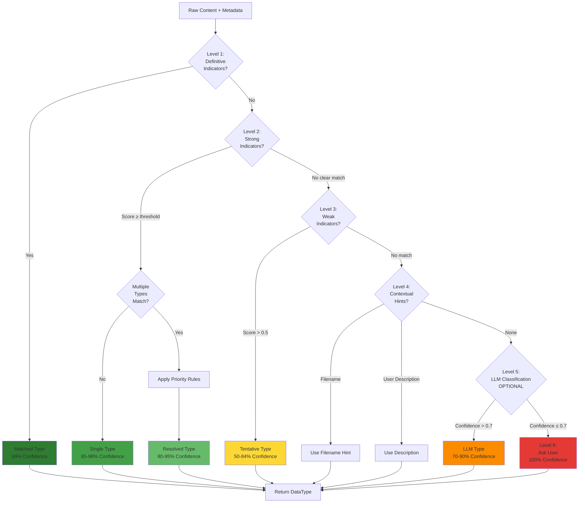

# Data Classification Strategy: Highly Effective Rules and Fallback Design

**Version**: 2.0
**Status**: Design Specification
**Date**: 2026-02-12
**Purpose**: Define comprehensive classification rules, disambiguation strategies, and multi-level fallback for accurate data type detection

**Role in Three-Tier Model**: This document specifies **Tier 0: Classification** — the first stage in the [Data Preprocessing v3.0](./data-preprocessing-design-specification.md) three-tier model. Tier 0 runs on every upload, completes in <100ms with zero LLM calls, and produces a `DataType` enum + confidence score that determines which Tier 1 extractor runs next.

**Scope**: This document addresses **data type classification** — determining what kind of data has been submitted (LOGS vs METRICS vs CONFIGURATION etc.). This is separate from **evidence classification** (SYMPTOM/CAUSAL/RESOLUTION/CONTEXTUAL/REJECTED) which is described in [evidence-classification-design.md](./evidence-classification-design.md).

**Note**: For **query classification** (human question vs machine data), see the QueryClassifier design in the data submission layer. The QueryClassifier is not yet implemented as a standalone module.

---

## Table of Contents

1. [Overview](#overview)
2. [Classification Hierarchy](#classification-hierarchy)
3. [Decision Tree Model](#decision-tree-model)
4. [Type-Specific Rules](#type-specific-rules)
5. [Disambiguation Strategies](#disambiguation-strategies)
6. [Multi-Tier Fallback Chain](#multi-tier-fallback-chain)
7. [Confidence Scoring](#confidence-scoring)
8. [Command Output Classification](#command-output-classification)
9. [Edge Cases and Conflicts](#edge-cases-and-conflicts)
10. [Learning and Adaptation](#learning-and-adaptation)

---

## Overview

### Classification Challenge

Data submitted to FaultMaven can have:
- **Overlapping characteristics** (logs contain errors, metrics can be logged)
- **Multiple valid interpretations** (CSV could be config or metrics)
- **Missing context** (no filename, pasted content)
- **Ambiguous content** (short snippets, mixed formats)

### Design Goals

1. **Accuracy**: >95% correct classification on clear cases
2. **Robustness**: Graceful degradation on ambiguous cases
3. **Speed**: <100ms for heuristic classification, <2s for LLM fallback
4. **Explainability**: Clear reasoning for classification decisions
5. **Adaptability**: Learn from user corrections

### Unified DataType Enum (6 Types)

This document classifies data into the unified `DataType` enum shared across preprocessing and evidence:

```python
class DataType(str, Enum):
    LOGS = "logs"                    # Time-ordered diagnostic output
    METRICS = "metrics"              # Quantitative measurements
    CONFIGURATION = "configuration"  # Structured system/app config
    CODE = "code"                    # Source code
    TEXT = "text"                    # Unstructured prose
    IMAGE = "image"                  # Visual content
```

This is **Tier 0** in the [Data Preprocessing v3.0](./data-preprocessing-design-specification.md) three-tier model:

**Position in Pipeline**:
```
/data endpoint receives file upload
         ↓
Tier 0: DataClassifier (THIS DOC): "What type of data?" → DataType + confidence
         ↓
Tier 1: Type-specific Mechanical Extraction (0 LLM, <2s)
  - LOGS → Structural Index (error clusters, timeline)
  - METRICS → Statistical Profile (anomalies, distributions)
  - CONFIGURATION → Parse & Sanitize (redact secrets)
  - CODE → AST Extraction (functions, classes, imports)
  - TEXT → Structure Extraction (headings, key sentences)
  - IMAGE → Metadata Extraction (format, dimensions)
         ↓
Evidence Architecture → Agent Response
```

**For /queries endpoint**: A separate QueryClassifier (3-tier: hints → patterns → heuristics) first determines **IF** content is machine data vs human question. If machine data is detected, DataClassifier (this document) determines **WHAT TYPE**.

**Hint Passing**: QueryClassifier's `detected_data_type` field (if present) can be passed as a hint to DataClassifier to improve accuracy.

### How Fine-Grained Subtypes Map to DataType

The classification algorithm uses detailed pattern detection internally, but the output is always one of the 6 `DataType` values. Fine-grained distinctions are captured in `ClassificationResult.metadata`:

| Internal Subtype | DataType | Metadata Example |
|-----------------|----------|-----------------|
| Application log, syslog, dmesg, journalctl | `LOGS` | `{"subtype": "application_log"}` |
| Error report, stack trace | `LOGS` | `{"subtype": "error_report"}` |
| Distributed trace (OpenTelemetry, Jaeger) | `LOGS` | `{"subtype": "distributed_trace"}` |
| Command output (top, ps, iostat, strace) | `METRICS` or `LOGS` | `{"subtype": "command_output", "command": "top"}` |
| Time-series metrics, dashboards | `METRICS` | `{"subtype": "time_series"}` |
| Profiling data (cProfile, perf) | `METRICS` | `{"subtype": "profiling_data"}` |
| Config files (YAML, JSON, TOML, INI) | `CONFIGURATION` | `{"subtype": "yaml_config"}` |
| Infrastructure definitions (K8s, Terraform) | `CONFIGURATION` | `{"subtype": "infrastructure"}` |
| Source code files | `CODE` | `{"subtype": "python", "language": "python"}` |
| Documentation, runbooks | `TEXT` | `{"subtype": "documentation"}` |
| Screenshots, diagrams | `IMAGE` | `{"subtype": "screenshot"}` |

---

## Classification Hierarchy

The classification algorithm uses a multi-level approach internally. These levels are **internal to the classification algorithm** and are distinct from the system-level Tiers (Tier 0/1/2).

### Level 1: Definitive Indicators (99%+ Confidence)

These are unambiguous markers that definitively identify a data type:

```python
DEFINITIVE_INDICATORS = {
    DataType.IMAGE: [
        # Binary image magic numbers
        (r"^\x89PNG\r\n\x1a\n", "PNG magic number"),
        (r"^\xff\xd8\xff", "JPEG magic number"),
        # Base64 image data
        (r"^data:image/(png|jpeg|gif);base64,", "Base64 image prefix"),
    ],

    DataType.LOGS: [
        # OpenTelemetry trace IDs → classified as LOGS (subtype: distributed_trace)
        (r'"traceId":\s*"[a-f0-9]{32}"', "OpenTelemetry trace format"),
        # Jaeger trace structure
        (r'"operationName".*"spans":\s*\[', "Jaeger trace structure"),
    ],

    DataType.METRICS: [
        # Python cProfile header → classified as METRICS (subtype: profiling_data)
        (r"^\s*ncalls\s+tottime\s+percall\s+cumtime", "cProfile header"),
        # Flame graph format
        (r"^[\w\.]+(?:;[\w\.]+)+\s+\d+$", "Flame graph stack notation", "MULTILINE"),
    ],

    DataType.CONFIGURATION: [
        # Valid JSON object spanning >50% of content
        ("is_valid_json_object", "Valid JSON structure"),
        # Valid YAML with --- separator
        (r"^---\s*\n\w+:\s*(?:\n|.|\s)*", "YAML document start"),
    ],
}
```

### Level 2: Strong Indicators (85-98% Confidence)

Multiple strong signals that together indicate a type:

```python
STRONG_INDICATORS = {
    DataType.LOGS: {
        "required": [
            ("has_timestamps", "Timestamps present"),
            ("has_log_levels", "Log levels (INFO, ERROR, etc.)"),
        ],
        "bonus": [
            ("sequential_entries", "Sequential log entries"),
            ("logger_names", "Logger/module names"),
            ("request_ids", "Correlation IDs"),
            ("has_stack_trace", "Stack trace structure"),
        ],
        "min_score": 2,  # At least 2 required + 0 bonus
        "subtypes": {
            "error_report": ["has_exception_keyword", "has_stack_trace", "no_timestamps"],
            "distributed_trace": ["has_trace_ids", "has_span_ids"],
        },
    },

    DataType.METRICS: {
        "required": [
            ("has_numeric_columns", "Numeric data columns"),
            ("has_metric_keywords", "Performance keywords"),
        ],
        "bonus": [
            ("has_tabular_structure", "Aligned columns"),
            ("has_time_series", "Time-series data"),
            ("has_percentages", "Percentage values"),
        ],
        "min_score": 2,
    },
}
```

### Level 3: Weak Indicators (50-84% Confidence)

Suggestive but not conclusive patterns:

```python
WEAK_INDICATORS = {
    DataType.TEXT: [
        ("markdown_syntax", 0.3),  # Weight
        ("prose_paragraphs", 0.2),
        ("code_blocks", 0.2),
        ("section_headings", 0.3),
    ],

    DataType.TEXT: [
        # Default when no clear pattern — fallback to TEXT
        ("no_clear_structure", 0.5),
        ("mixed_formats", 0.5),
    ],
}
```

---

## Decision Tree Model

### Primary Classification Flow

> **Note:** The "Level 1/2/3" labels below refer to **classification algorithm levels** (internal to Tier 0), not system-level Tiers (Tier 0/1/2). Levels 1-4 execute within Tier 0's <100ms zero-LLM budget. Level 5 (LLM) and Level 6 (user) are optional fallbacks that operate outside the Tier 0 guarantee.



---

## Type-Specific Rules

### 1. LOGS Detection (subtype: application_log)

**Definitive Markers**:
```python
def is_logs_definitive(content: str) -> bool:
    """
    Returns True if content has definitive log file markers.
    
    Requirements:
    - Timestamps in >30% of lines
    - Log levels in >30% of lines
    - Sequential structure (line N+1 timestamp >= line N)
    """
    lines = content.split('\n')
    if len(lines) < 3:
        return False
    
    timestamp_count = 0
    loglevel_count = 0
    
    for line in lines[:min(50, len(lines))]:  # Check first 50 lines
        if has_timestamp_at_start(line):
            timestamp_count += 1
        if has_log_level(line):
            loglevel_count += 1
    
    timestamp_ratio = timestamp_count / len(lines[:50])
    loglevel_ratio = loglevel_count / len(lines[:50])
    
    return timestamp_ratio > 0.3 and loglevel_ratio > 0.3
```

**Common Formats Recognized**:
```
[2025-10-14 14:32:01] INFO  [module.name] Message here
2025-10-14T14:32:01.123Z ERROR Something failed: details
Oct 14 14:32:01 hostname service[1234]: Log message
14:32:01.123 [main] WARN  Package.Class - Warning text
```

---

### 2. METRICS Detection

**Definitive Markers**:
```python
def is_metrics_definitive(content: str) -> bool:
    """
    Returns True if content has definitive metrics markers.
    
    Command Output Indicators:
    - Tabular structure (aligned columns)
    - Column headers with metric names
    - Numeric values in >70% of data cells
    - System metric keywords (CPU, MEM, IO, etc.)
    """
    # Check for tabular structure
    if not has_tabular_structure(content):
        return False
    
    # Check for metric column headers
    header_patterns = [
        r'\b(PID|USER|CPU|MEM|TIME|COMMAND)\b',  # ps, top
        r'\b(await|svctm|%util)\b',              # iostat
        r'\b(rx|tx|bytes|packets)\b',            # network stats
        r'\b(total|used|free|available)\b',      # memory stats
    ]
    
    has_metric_headers = any(
        re.search(pattern, content[:500], re.IGNORECASE)
        for pattern in header_patterns
    )
    
    if not has_metric_headers:
        return False
    
    # Check numeric density in data rows
    return has_high_numeric_density(content)

def has_tabular_structure(content: str) -> bool:
    """Detect aligned columns."""
    lines = content.strip().split('\n')
    if len(lines) < 3:
        return False
    
    # Check if lines have consistent field positions
    field_positions = []
    for line in lines[:10]:
        # Find whitespace-separated field boundaries
        positions = [m.start() for m in re.finditer(r'\s{2,}', line)]
        field_positions.append(positions)
    
    # Check if field positions are consistent (±2 chars)
    if len(field_positions) < 3:
        return False
    
    reference = field_positions[0]
    for positions in field_positions[1:]:
        if not positions_match(reference, positions, tolerance=2):
            return False
    
    return True
```

**Command Output Patterns**:
```python
COMMAND_OUTPUT_SIGNATURES = {
    'top': {
        'header': r'(top - |Tasks:|%Cpu\(s\)|KiB Mem)',
        'columns': r'(PID|USER|PR|NI|VIRT|RES|SHR|S|%CPU|%MEM|TIME\+|COMMAND)',
        'confidence': 0.98,
    },
    'ps': {
        'header': r'(USER|PID|%CPU|%MEM|VSZ|RSS|TTY|STAT|START|TIME|COMMAND)',
        'columns': r'^\s*\w+\s+\d+\s+[\d\.]+\s+[\d\.]+',  # Typical ps row
        'confidence': 0.95,
    },
    'iostat': {
        'header': r'(Device|tps|kB_read/s|kB_wrtn/s|kB_read|kB_wrtn)',
        'columns': r'(avg-cpu:|%user|%nice|%system|%iowait|%steal|%idle)',
        'confidence': 0.95,
    },
    'vmstat': {
        'header': r'(procs.*memory.*swap.*io.*system.*cpu)',
        'columns': r'(r\s+b\s+swpd\s+free\s+buff\s+cache)',
        'confidence': 0.95,
    },
    'netstat': {
        'header': r'(Proto|Recv-Q|Send-Q|Local Address|Foreign Address|State)',
        'confidence': 0.90,
    },
    'free': {
        'header': r'(total\s+used\s+free\s+shared\s+buff/cache\s+available)',
        'rows': r'(Mem:|Swap:)',
        'confidence': 0.95,
    },
}

def detect_command_output(content: str) -> Optional[Tuple[str, float]]:
    """
    Detect specific command output and return (command_name, confidence).
    """
    for cmd, signature in COMMAND_OUTPUT_SIGNATURES.items():
        if 'header' in signature:
            if re.search(signature['header'], content, re.IGNORECASE):
                if 'columns' in signature:
                    if re.search(signature['columns'], content, re.IGNORECASE):
                        return (cmd, signature['confidence'])
                else:
                    return (cmd, signature['confidence'])
    return None
```

---

### 3. Error Report vs Application Log Disambiguation

Both map to `DataType.LOGS`, but the subtype determines context. This disambiguation sets `metadata.subtype`:

```python
def disambiguate_error_vs_log(content: str,
                               error_score: float,
                               log_score: float) -> ClassificationResult:
    """
    Both map to DataType.LOGS. Disambiguate subtype for metadata.

    Decision Logic:
    1. If has_timestamps AND has_log_levels → LOGS (subtype: application_log)
    2. If has_stack_trace but NO timestamps → LOGS (subtype: error_report)
    3. If error_score > log_score * 2 → LOGS (subtype: error_report)
    4. Otherwise → LOGS (subtype: application_log, default)
    """
    has_ts = has_timestamps(content)
    has_levels = has_log_levels(content)
    has_trace = has_stack_trace(content)

    # Rule 1: Temporal context → application log
    if has_ts and has_levels:
        return ClassificationResult(
            data_type=DataType.LOGS, metadata={"subtype": "application_log"}
        )

    # Rule 2: Standalone error → error report
    if has_trace and not has_ts:
        return ClassificationResult(
            data_type=DataType.LOGS, metadata={"subtype": "error_report"}
        )

    # Rule 3: Error-dominated → error report
    if error_score > log_score * 2:
        return ClassificationResult(
            data_type=DataType.LOGS, metadata={"subtype": "error_report"}
        )

    # Rule 4: Default to application log
    return ClassificationResult(
        data_type=DataType.LOGS, metadata={"subtype": "application_log"}
    )
```

---

### 4. Profiling Data vs Distributed Trace Disambiguation

Both map to one of the 6 DataType values. Profiling data → `METRICS` (subtype: profiling_data). Distributed traces → `LOGS` (subtype: distributed_trace).

| Feature | Profiling Data → `METRICS` | Distributed Trace → `LOGS` |
|---------|---------------------------|---------------------------|
| **Focus** | Function timing | Request flow |
| **IDs** | Function names | Trace/Span IDs |
| **Structure** | Call tree, flat list | Nested spans |
| **Metrics** | CPU time, call counts | Latency, service hops |
| **Scope** | Single process | Distributed system |

```python
def disambiguate_profiling_vs_trace(content: str) -> ClassificationResult:
    """
    Profiling data → METRICS (subtype: profiling_data)
    Distributed trace → LOGS (subtype: distributed_trace)
    """
    # Check for distributed trace IDs (32-char hex)
    has_trace_ids = bool(re.search(
        r'(traceId|trace_id)["\s:]+[a-f0-9]{32}',
        content,
        re.IGNORECASE
    ))

    has_span_ids = bool(re.search(
        r'(spanId|span_id|parentId)["\s:]+[a-f0-9]{16,}',
        content,
        re.IGNORECASE
    ))

    has_service_names = bool(re.search(
        r'(serviceName|service\.name)',
        content,
        re.IGNORECASE
    ))

    # Distributed trace → LOGS
    if (has_trace_ids and has_span_ids) or has_service_names:
        return ClassificationResult(
            data_type=DataType.LOGS, metadata={"subtype": "distributed_trace"}
        )

    # Check for profiling indicators
    has_profiling_header = bool(re.search(
        r'(ncalls|tottime|percall|cumtime|filename:lineno)',
        content,
        re.IGNORECASE
    ))

    has_call_counts = bool(re.search(
        r'\d+\s+calls?\s+in\s+[\d\.]+\s+seconds',
        content,
        re.IGNORECASE
    ))

    # Profiling data → METRICS
    if has_profiling_header or has_call_counts:
        return ClassificationResult(
            data_type=DataType.METRICS, metadata={"subtype": "profiling_data"}
        )

    function_pattern = r'[\w\.]+\([\w\s,]*\)\s+[\d\.]+'
    if re.search(function_pattern, content):
        return ClassificationResult(
            data_type=DataType.METRICS, metadata={"subtype": "profiling_data"}
        )

    return ClassificationResult(
        data_type=DataType.LOGS, metadata={"subtype": "distributed_trace"}
    )
```

---

### 5. CONFIGURATION vs TEXT

**Disambiguation Strategy**:

```python
def disambiguate_config_vs_text(content: str) -> DataType:
    """
    Differentiate configuration files from documentation/prose.

    Key Indicators:
    - CONFIGURATION: Structured syntax, key-value pairs, parseable
    - TEXT: Prose, explanations, markdown, code examples
    """
    # Check if parseable as config format
    is_json = is_valid_json(content)
    is_yaml = is_valid_yaml(content)
    is_ini = is_valid_ini(content)
    is_toml = is_valid_toml(content)
    
    if any([is_json, is_yaml, is_ini, is_toml]):
        # Parseable → CONFIG
        return DataType.CONFIGURATION
    
    # Check prose density
    prose_indicators = [
        r'\b(the|and|for|with|that|this|from|which)\b',  # Common prose words
        r'[A-Z][a-z]+\s+[a-z]+\s+[a-z]+',  # Sentence structure
        r'\.\s+[A-Z]',  # Sentence boundaries
    ]
    
    prose_score = sum(
        len(re.findall(pattern, content, re.IGNORECASE))
        for pattern in prose_indicators
    ) / max(len(content), 1)
    
    # Check structured data indicators
    structure_indicators = [
        r'^\w+\s*[:=]\s*\S+',  # Key-value pairs
        r'^\s*[\w\.]+:\s*$',   # YAML-like keys
        r'^\[[^\]]+\]',        # INI sections
    ]
    
    structure_score = sum(
        len(re.findall(pattern, content, re.MULTILINE))
        for pattern in structure_indicators
    ) / max(content.count('\n'), 1)
    
    # Decision
    if prose_score > structure_score * 2:
        return DataType.TEXT
    else:
        return DataType.CONFIGURATION
```

---

## Multi-Level Fallback Chain

### Complete Fallback Strategy

> **Tier 0 Guarantee:** Levels 1-4 (heuristic) complete in <100ms with zero LLM calls. Level 5 (LLM) and Level 6 (user confirmation) are **optional** fallbacks that operate outside the Tier 0 zero-LLM guarantee. If LLM fallback is disabled, the classifier returns the best heuristic result with its confidence score.

```python
class EnhancedDataClassifier:
    """Enhanced classifier with multi-tier fallback."""
    
    async def classify_with_fallback(
        self,
        content: str,
        filename: Optional[str] = None,
        user_description: Optional[str] = None,
        source_metadata: Optional[Dict] = None,
    ) -> ClassificationResult:
        """
        Classify with comprehensive fallback chain.
        
        Returns:
            ClassificationResult with type, confidence, reasoning
        """
        context = ClassificationContext(
            content=content,
            filename=filename,
            user_description=user_description,
            source_metadata=source_metadata,
        )
        
        # Level 1: Definitive indicators (99%+)
        result = self._check_definitive_indicators(context)
        if result.confidence >= 0.99:
            return result

        # Level 2: Strong indicators (85-98%)
        result = self._check_strong_indicators(context)
        if result.confidence >= 0.85:
            return result

        # Level 3: Weak indicators (50-84%)
        result = self._check_weak_indicators(context)
        if result.confidence >= 0.50:
            return result

        # Level 4: Contextual hints (variable)
        result = self._check_contextual_hints(context)
        if result.confidence >= 0.60:
            return result

        # Level 5: LLM classification (OPTIONAL — outside Tier 0 zero-LLM guarantee)
        if self.llm_fallback_enabled:
            result = await self._llm_classify_with_examples(context)
            if result.confidence >= 0.70:
                return result

        # Level 6: Request user confirmation
        result = self._request_user_confirmation(context)
        return result  # 100% confidence after user input
    
    def _check_definitive_indicators(
        self, 
        context: ClassificationContext
    ) -> ClassificationResult:
        """Check for unambiguous markers."""
        for data_type, indicators in DEFINITIVE_INDICATORS.items():
            for pattern, description in indicators:
                if self._matches_pattern(context.content, pattern):
                    return ClassificationResult(
                        data_type=data_type,
                        confidence=0.99,
                        reasoning=f"Definitive: {description}",
                        fallback_level=1,
                    )
        
        return ClassificationResult(
            data_type=DataType.TEXT,
            confidence=0.0,
            reasoning="No definitive indicators found",
            fallback_level=0,
        )
    
    async def _llm_classify_with_examples(
        self,
        context: ClassificationContext
    ) -> ClassificationResult:
        """
        LLM classification with few-shot examples and confidence.
        """
        prompt = self._build_classification_prompt_with_examples(context)
        
        response = await self.llm_router.route(
            prompt=prompt,
            max_tokens=150,
            temperature=0.0,  # Deterministic
        )
        
        # Parse structured response
        parsed = self._parse_llm_classification_response(response.content)
        
        return ClassificationResult(
            data_type=parsed['type'],
            confidence=parsed['confidence'],
            reasoning=f"LLM: {parsed['reasoning']}",
            fallback_level=5,
        )
    
    def _build_classification_prompt_with_examples(
        self,
        context: ClassificationContext
    ) -> str:
        """Build prompt with few-shot examples."""
        return f"""
You are a data classification expert. Classify the following content into one of these types:

{self._get_type_descriptions()}

Examples:

{self._get_few_shot_examples()}

Now classify this content:

Filename: {context.filename or 'unknown'}
User Description: {context.user_description or 'none'}
Content (first 2000 chars):
{context.content[:2000]}

Respond in JSON format:
{{
  "type": "logs|metrics|configuration|code|text|image",
  "confidence": 0.0-1.0,
  "reasoning": "Brief explanation of why this classification was chosen"
}}
"""
    
    def _get_few_shot_examples(self) -> str:
        """Provide few-shot examples for LLM."""
        return """
Example 1:
Content: "2025-10-14 10:00:00 INFO User logged in..."
Type: logs
Reasoning: Contains timestamps and log levels

Example 2:
Content: "PID   USER   %CPU  %MEM  COMMAND\\n1234  root   12.5  3.2   python..."
Type: metrics
Reasoning: Tabular process metrics with numeric values

Example 3:
Content: "Traceback (most recent call last):\\n  File \\"app.py\\", line 42..."
Type: logs
Reasoning: Python stack trace / error output

Example 4:
Content: "database:\\n  host: localhost\\n  port: 5432..."
Type: configuration
Reasoning: YAML configuration structure

Example 5:
Content: "def calculate_total(items):\\n    return sum(i.price for i in items)"
Type: code
Reasoning: Python source code
"""
```

---

## Confidence Scoring

### Confidence Calculation Model

```python
class ConfidenceScorer:
    """Calculate confidence scores for classifications."""
    
    def calculate_confidence(
        self,
        data_type: DataType,
        matched_patterns: List[str],
        total_score: float,
        fallback_level: int,
    ) -> float:
        """
        Calculate confidence based on multiple factors.
        
        Factors:
        1. Number of matched patterns
        2. Pattern strength (weighted)
        3. Fallback tier used
        4. Disambiguation clarity
        """
        # Base confidence from classification level
        level_confidence = {
            1: 0.99,  # Definitive
            2: 0.90,  # Strong
            3: 0.70,  # Weak
            4: 0.65,  # Contextual
            5: 0.75,  # LLM (optional)
            6: 1.00,  # User confirmed
        }

        base = level_confidence.get(fallback_level, 0.50)
        
        # Adjust for pattern count
        pattern_bonus = min(0.10, len(matched_patterns) * 0.02)
        
        # Adjust for pattern strength
        strength_bonus = self._calculate_pattern_strength(matched_patterns)
        
        # Final confidence
        confidence = min(1.0, base + pattern_bonus + strength_bonus)
        
        return confidence
    
    def _calculate_pattern_strength(
        self,
        matched_patterns: List[str]
    ) -> float:
        """
        Calculate strength bonus based on pattern quality.
        
        Strong patterns (e.g., trace IDs) get higher bonus than
        weak patterns (e.g., common keywords).
        """
        pattern_weights = {
            'trace_id_32char': 0.15,
            'stack_trace_format': 0.12,
            'tabular_structure': 0.10,
            'timestamp_sequential': 0.08,
            'generic_keyword': 0.02,
        }
        
        bonus = sum(
            pattern_weights.get(pattern, 0.02)
            for pattern in matched_patterns
        )
        
        return min(0.15, bonus)  # Cap at 15%
```

### Confidence Thresholds for Actions

```python
CONFIDENCE_THRESHOLDS = {
    'auto_accept': 0.85,      # Accept classification without confirmation
    'suggest': 0.60,          # Suggest to user with option to override
    'llm_fallback': 0.50,     # Trigger LLM classification
    'user_required': 0.50,    # Below this, require user input
}

def should_request_user_confirmation(confidence: float) -> bool:
    """Determine if user confirmation is needed."""
    return confidence < CONFIDENCE_THRESHOLDS['user_required']

def should_use_llm_fallback(confidence: float) -> bool:
    """Determine if LLM classification should be used."""
    return confidence < CONFIDENCE_THRESHOLDS['llm_fallback']
```

---

## Command Output Classification

### Comprehensive Command Recognition

```python
COMMAND_OUTPUTS = {
    # Process & System Info
    'top': {
        'type': DataType.METRICS,
        'patterns': [
            r'top\s+-\s+\d{2}:\d{2}:\d{2}\s+up',
            r'Tasks:\s+\d+\s+total,\s+\d+\s+running',
            r'%Cpu\(s\):',
            r'KiB Mem\s*:',
            r'PID\s+USER\s+PR\s+NI\s+VIRT\s+RES',
        ],
        'confidence': 0.95,
    },
    
    'ps': {
        'type': DataType.METRICS,
        'patterns': [
            r'USER\s+PID\s+%CPU\s+%MEM\s+VSZ\s+RSS',
            r'^\s*[\w\-]+\s+\d+\s+[\d\.]+\s+[\d\.]+',
        ],
        'confidence': 0.90,
    },
    
    'vmstat': {
        'type': DataType.METRICS,
        'patterns': [
            r'procs\s+-+memory-+\s+-+swap-+\s+-+io-+',
            r'r\s+b\s+swpd\s+free\s+buff\s+cache',
        ],
        'confidence': 0.95,
    },
    
    'iostat': {
        'type': DataType.METRICS,
        'patterns': [
            r'avg-cpu:\s+%user\s+%nice\s+%system',
            r'Device.*tps.*kB_read/s.*kB_wrtn/s',
        ],
        'confidence': 0.95,
    },
    
    'netstat': {
        'type': DataType.METRICS,
        'patterns': [
            r'Proto\s+Recv-Q\s+Send-Q\s+Local Address\s+Foreign Address',
            r'tcp\s+\d+\s+\d+\s+[\d\.:]+\s+[\d\.:]+',
        ],
        'confidence': 0.90,
    },
    
    'free': {
        'type': DataType.METRICS,
        'patterns': [
            r'total\s+used\s+free\s+shared\s+buff/cache\s+available',
            r'Mem:\s+\d+',
            r'Swap:\s+\d+',
        ],
        'confidence': 0.95,
    },
    
    # Logs
    'dmesg': {
        'type': DataType.LOGS,
        'patterns': [
            r'^\[\s*[\d\.]+\]',  # Kernel timestamp
            r'\bkernel:\s',
            r'\bLinux version\s',
        ],
        'confidence': 0.95,
    },
    
    'journalctl': {
        'type': DataType.LOGS,
        'patterns': [
            r'^[A-Z][a-z]{2}\s+\d{2}\s+\d{2}:\d{2}:\d{2}',  # Oct 14 14:32:01
            r'systemd\[\d+\]:',
            r'\[\d+\]:',  # Process IDs
        ],
        'confidence': 0.95,
    },
    
    # Trace
    'strace': {
        'type': DataType.LOGS,  # System call trace → LOGS (subtype: system_trace)
        'patterns': [
            r'\w+\([^)]*\)\s+=\s+-?\d+',  # syscall() = retval
            r'<\d+\.\d+>',  # Timing info
            r'SIGTERM|SIGKILL|SIGSEGV',
        ],
        'confidence': 0.95,
    },

    'ltrace': {
        'type': DataType.LOGS,  # Library call trace → LOGS (subtype: system_trace)
        'patterns': [
            r'\w+\([^)]*\)\s+=\s+\w+',
            r'<\d+\.\d+>',
        ],
        'confidence': 0.90,
    },

    # Profiling
    'perf': {
        'type': DataType.METRICS,  # Performance counters → METRICS (subtype: profiling_data)
        'patterns': [
            r'Performance counter stats',
            r'seconds time elapsed',
            r'cycles|instructions',
        ],
        'confidence': 0.95,
    },
    
    # Configuration
    'lsof': {
        'type': DataType.METRICS,  # Process file descriptors
        'patterns': [
            r'COMMAND\s+PID\s+USER\s+FD\s+TYPE\s+DEVICE',
            r'^\w+\s+\d+\s+\w+\s+\d+[rwu]\s',
        ],
        'confidence': 0.90,
    },
    
    'lscpu': {
        'type': DataType.CONFIGURATION,  # CPU info
        'patterns': [
            r'Architecture:\s+\w+',
            r'CPU\(s\):\s+\d+',
            r'Model name:\s+',
        ],
        'confidence': 0.95,
    },
    
    'df': {
        'type': DataType.METRICS,  # Disk usage
        'patterns': [
            r'Filesystem\s+1K-blocks\s+Used\s+Available\s+Use%',
            r'/dev/\w+\s+\d+\s+\d+\s+\d+\s+\d+%',
        ],
        'confidence': 0.95,
    },
}

def detect_linux_command_output(content: str) -> Optional[ClassificationResult]:
    """
    Detect specific Linux command output.
    
    Returns:
        ClassificationResult if recognized, None otherwise
    """
    for cmd_name, signature in COMMAND_OUTPUTS.items():
        matched_patterns = []
        
        for pattern in signature['patterns']:
            if re.search(pattern, content, re.MULTILINE | re.IGNORECASE):
                matched_patterns.append(pattern)
        
        # Require at least 2 pattern matches for confidence
        if len(matched_patterns) >= 2:
            return ClassificationResult(
                data_type=signature['type'],
                confidence=signature['confidence'],
                reasoning=f"Detected {cmd_name} command output",
                fallback_level=1,  # Definitive
                metadata={'command': cmd_name, 'patterns': matched_patterns},
            )
    
    return None
```

---

## Edge Cases and Conflicts

### Case 1: Logs Containing Errors

**Scenario**: Application log file with error messages and stack traces.

**Decision**: Classify as `LOGS`

**Reasoning**:
- Temporal context (timestamps) → investigative narrative
- Errors are events within the log stream
- LOGS is the broader category, more useful for troubleshooting

```python
# Example content
content = """
2025-10-14 10:00:00 INFO Application started
2025-10-14 10:00:15 ERROR Connection failed
Traceback (most recent call last):
  File "app.py", line 42, in connect
    socket.connect(addr)
ConnectionRefusedError: [Errno 111] Connection refused
2025-10-14 10:00:16 INFO Retrying connection...
"""

# Classification: LOGS (has timestamps + sequential events)
# Error report subtype captured in metadata
```

### Case 2: Metrics Logged Over Time

**Scenario**: Time-series metrics written as log entries.

**Decision**: Classify as `METRICS` if tabular, `LOGS` if sequential.

```python
# Tabular metrics → METRICS
content_tabular = """
timestamp          cpu_percent  mem_percent  disk_io
2025-10-14 10:00   12.5        45.2         1024
2025-10-14 10:01   15.3        46.1         2048
2025-10-14 10:02   11.2        44.8         1536
"""

# Sequential logged metrics → LOGS
content_logged = """
2025-10-14 10:00:00 INFO CPU: 12.5%, Memory: 45.2%
2025-10-14 10:01:00 INFO CPU: 15.3%, Memory: 46.1%
2025-10-14 10:02:00 INFO CPU: 11.2%, Memory: 44.8%
"""
```

**Disambiguation Rule**:
```python
if has_tabular_structure(content) and has_high_numeric_density(content):
    return DataType.METRICS  # Tabular data
elif has_timestamps(content) and has_log_levels(content):
    return DataType.LOGS     # Sequential log entries
```

### Case 3: Configuration with Documentation

**Scenario**: YAML config file with extensive comments and documentation.

**Decision**: Classify as `CONFIGURATION`

**Reasoning**:
- Primary purpose is configuration
- Documentation is secondary (embedded comments)
- Parseable structure takes precedence

```python
content = """
# Database Configuration
# =====================
# This section configures the database connection settings.
# Supported databases: PostgreSQL, MySQL, SQLite
# 
# Example usage:
#   database:
#     type: postgresql
#     host: localhost

database:
  type: postgresql
  host: localhost
  port: 5432
"""

# Classification: CONFIGURATION (parseable YAML structure)
```

### Case 4: Short Ambiguous Snippets

**Scenario**: Very short content (<200 chars) without clear markers.

**Strategy**: Use contextual hints and LLM, lower confidence.

```python
content = """
Error: Connection timeout
Retry attempt 3/5 failed
"""

# Heuristic: Insufficient context
# Contextual: Check filename (error.log → LOGS)
# LLM: Ask for classification with low confidence
# Result: Suggest to user, allow override
```

---

## Learning and Adaptation

### User Feedback Loop

```python
class AdaptiveClassifier:
    """Classifier that learns from user corrections."""
    
    def __init__(self):
        self.feedback_store = FeedbackStore()
        self.pattern_learner = PatternLearner()
    
    async def record_user_correction(
        self,
        content: str,
        predicted_type: DataType,
        actual_type: DataType,
        confidence: float,
    ):
        """
        Record user correction and update patterns.
        """
        # Store feedback
        await self.feedback_store.save(
            content_hash=hash(content),
            predicted=predicted_type,
            actual=actual_type,
            confidence=confidence,
            timestamp=datetime.utcnow(),
        )
        
        # Learn new patterns if confidence was low
        if confidence < 0.70:
            new_patterns = await self.pattern_learner.extract_patterns(
                content=content,
                data_type=actual_type,
            )
            
            if new_patterns:
                await self._update_pattern_database(actual_type, new_patterns)
    
    async def get_similar_past_classifications(
        self,
        content: str,
        top_k: int = 5
    ) -> List[PastClassification]:
        """
        Retrieve similar past classifications for reference.
        """
        # Semantic similarity search
        similar = await self.feedback_store.search_similar(
            content=content,
            limit=top_k,
        )
        
        return similar
    
    async def _update_pattern_database(
        self,
        data_type: DataType,
        new_patterns: List[str]
    ):
        """
        Add learned patterns to the classification system.
        """
        # Validate patterns before adding
        validated = self._validate_patterns(new_patterns)
        
        # Add to pattern database with lower weight initially
        for pattern in validated:
            await self.pattern_db.add_pattern(
                data_type=data_type,
                pattern=pattern,
                weight=0.5,  # Lower weight for learned patterns
                source='user_feedback',
            )
```

### Pattern Learning from Misclassifications

```python
class PatternLearner:
    """Extract new patterns from misclassified data."""
    
    async def extract_patterns(
        self,
        content: str,
        data_type: DataType,
    ) -> List[str]:
        """
        Use LLM to extract discriminating patterns.
        """
        prompt = f"""
Analyze this content that was correctly classified as {data_type}.
Extract 3-5 regex patterns that would help identify similar content in the future.

Content:
{content[:1000]}

Provide patterns as a JSON array:
["pattern1", "pattern2", ...]
"""
        
        response = await self.llm_router.route(
            prompt=prompt,
            max_tokens=200,
            temperature=0.0,
        )
        
        try:
            patterns = json.loads(response.content)
            return self._validate_patterns(patterns)
        except:
            return []
    
    def _validate_patterns(self, patterns: List[str]) -> List[str]:
        """Validate regex patterns before adding to database."""
        validated = []
        
        for pattern in patterns:
            try:
                re.compile(pattern)
                # Check pattern is not too broad
                if not self._is_too_broad(pattern):
                    validated.append(pattern)
            except re.error:
                continue
        
        return validated
    
    def _is_too_broad(self, pattern: str) -> bool:
        """Check if pattern is too generic to be useful."""
        # Patterns like .* or \w+ are too broad
        broad_patterns = [r'.*', r'\w+', r'\d+', r'\s+']
        return pattern in broad_patterns
```

---

## Implementation Recommendations

### Phase 1: Enhance Heuristics (Week 1-2)

1. **Add Command Output Detection**
   - Implement `COMMAND_OUTPUTS` dictionary
   - Add `detect_linux_command_output()` function
   - Test with actual command outputs (top, ps, iostat, etc.)

2. **Improve Disambiguation Rules**
   - Implement `disambiguate_error_vs_log()`
   - Implement `disambiguate_profiling_vs_trace()`
   - Implement `disambiguate_config_vs_docs()`

3. **Add Structural Analysis**
   - `has_tabular_structure()` for aligned columns
   - `has_high_numeric_density()` for metrics
   - `is_sequential_with_timestamps()` for logs

### Phase 2: Multi-Tier Fallback (Week 3-4)

1. **Implement Tiered Classification**
   - `_check_definitive_indicators()`
   - `_check_strong_indicators()`
   - `_check_weak_indicators()`

2. **Enhance LLM Fallback**
   - Add few-shot examples to LLM prompt
   - Request structured JSON response
   - Parse confidence from LLM response

3. **Add Confidence Scoring**
   - Implement `ConfidenceScorer` class
   - Add confidence thresholds for actions

### Phase 3: Learning System (Week 5-6)

1. **Feedback Collection**
   - UI for user corrections
   - API endpoint for feedback submission
   - Feedback storage (Redis/database)

2. **Pattern Learning**
   - Implement `PatternLearner` class
   - LLM-based pattern extraction
   - Pattern validation and weighting

3. **Adaptive Classification**
   - Similarity search for past classifications
   - Dynamic pattern updates
   - A/B testing for pattern effectiveness

---

## Success Metrics

### Accuracy Targets

| Level | Confidence Range | Target Accuracy | Measurement |
|-------|------------------|-----------------|-------------|
| 1 (Definitive) | 0.99-1.00 | >99% | Unit tests with known samples |
| 2 (Strong) | 0.85-0.98 | >95% | Validation set (1000 samples) |
| 3 (Weak) | 0.50-0.84 | >80% | User feedback validation |
| 4 (Contextual) | 0.60-0.80 | >85% | With filename hints |
| 5 (LLM, optional) | 0.70-0.90 | >90% | LLM benchmark set |
| 6 (User) | 1.00 | 100% | By definition |

### Performance Targets

- **Heuristic Classification**: <50ms (Levels 1-3)
- **Contextual Analysis**: <100ms (Level 4)
- **LLM Fallback** (optional): <2s (Level 5)
- **User Confirmation**: <30s avg response time

### Quality Metrics

- **False Positive Rate**: <5% per type
- **False Negative Rate**: <5% per type
- **Ambiguous Cases**: <10% require LLM fallback
- **User Override Rate**: <3% (users disagree with classification)

---

## Appendix: Complete Example

### Example: Classifying `top` Command Output

```python
content = """
top - 14:32:01 up 5 days,  2:15,  3 users,  load average: 0.45, 0.52, 0.48
Tasks: 247 total,   2 running, 245 sleeping,   0 stopped,   0 zombie
%Cpu(s):  5.2 us,  2.1 sy,  0.0 ni, 92.5 id,  0.1 wa,  0.0 hi,  0.1 si,  0.0 st
KiB Mem : 16384000 total,  2048000 free,  8192000 used,  6144000 buff/cache
KiB Swap:  4096000 total,  4096000 free,        0 used. 12288000 avail Mem

  PID USER      PR  NI    VIRT    RES    SHR S  %CPU  %MEM     TIME+ COMMAND
 1234 root      20   0  156892  12345   6789 R  12.5   0.1   0:45.67 python
 5678 user      20   0 1234567  89012  23456 S   3.2   0.5   1:23.45 chrome
"""

# Classification Flow:

# Level 1: Definitive Indicators
result = detect_linux_command_output(content)
# → Matched: 'top' command
#   Patterns: ["top\s+-\s+\d{2}:\d{2}:\d{2}", "Tasks:", "%Cpu", "KiB Mem", "PID\s+USER"]
#   Type: METRICS (subtype: command_output)
#   Confidence: 0.95
#   Classification Level: 1

# Final Result:
ClassificationResult(
    data_type=DataType.METRICS,
    confidence=0.95,
    reasoning="Detected top command output (5 patterns matched)",
    fallback_level=1,
    metadata={
        'command': 'top',
        'patterns': ['top timestamp', 'Tasks summary', 'CPU line', 'Memory line', 'PID header'],
    }
)
```

---

**Document Version**: 2.0
**Last Updated**: 2026-02-12
**Status**: Design Specification


