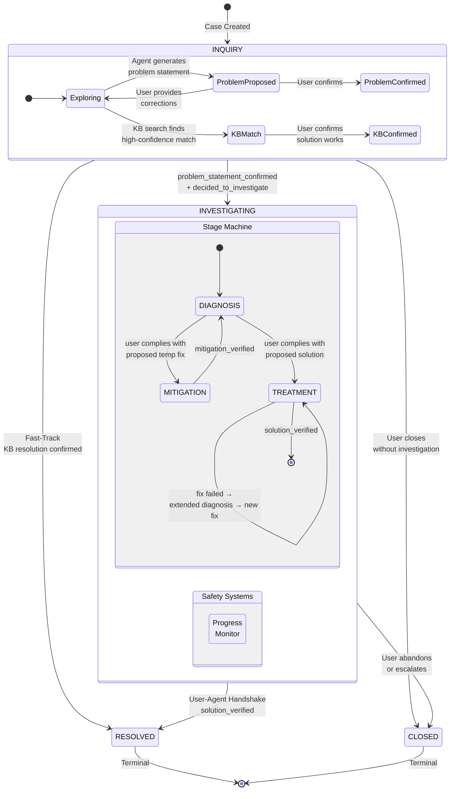
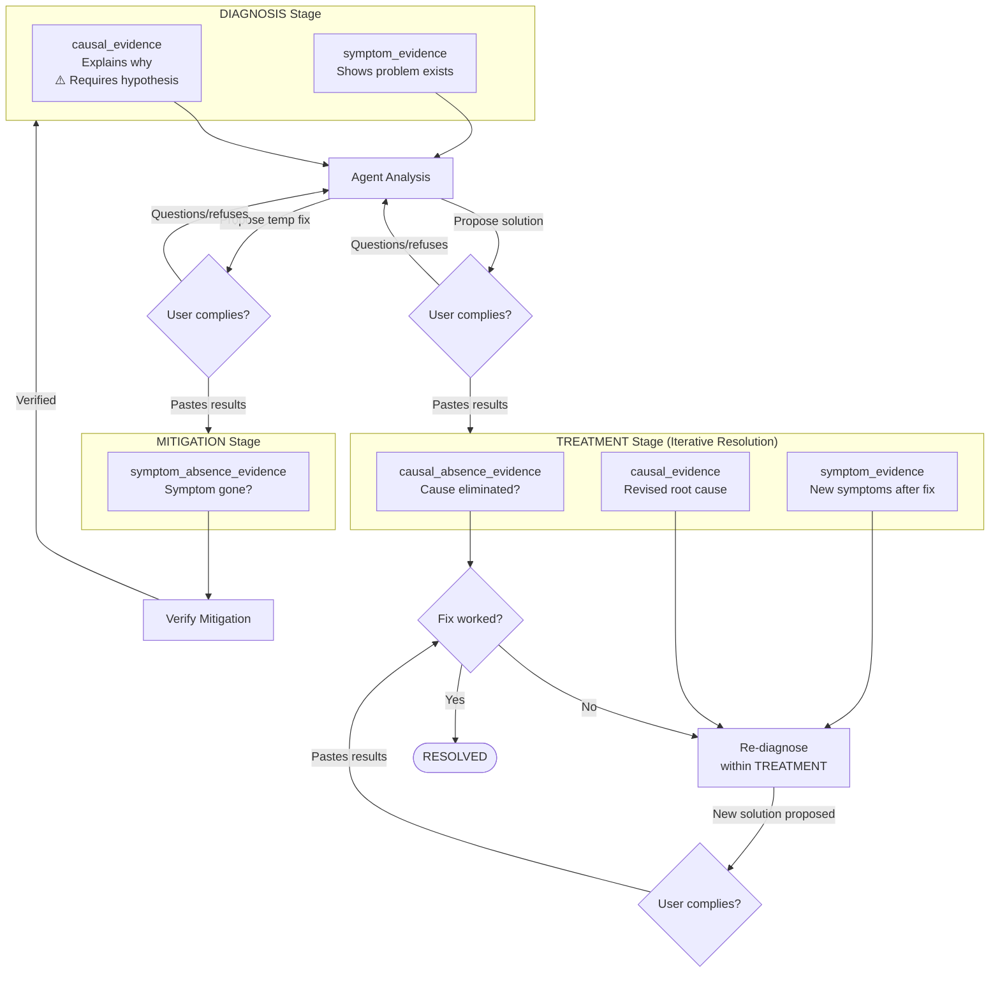

# Evidence-Driven Investigation Framework

## Status

| Field | Value |
|-------|-------|
| **Status** | REVIEW |
| **Authors** | FaultMaven Team |
| **Created** | 2026-02-18 |
| **Updated** | 2026-02-19 |

---

## Executive Summary

This document defines the investigation architecture for FaultMaven's investigation engine using a **stage-gated, evidence-driven** model with clear separation of concerns, user control over transitions, and structured LLM behavior.

**Architecture Summary:**

| Aspect | Design |
|--------|--------|
| **Stage model** | 2 core stages (DIAGNOSIS, TREATMENT) with optional MITIGATION detour |
| **Stage transitions** | Inference-based (user compliance with proposed action implies acceptance) |
| **Progress tracking** | 7 investigation milestones: 4 gate milestones (drive transitions) + 3 progress indicators (LLM context, non-driving) |
| **Evidence types** | 4 claim-attached categories: symptom, causal, mitigation, solution. Contextual material lives on `uploaded_files`; rejection is the absence of an Evidence row. |
| **Hypothesis constraint** | Required before causal_evidence classification |
| **Mitigation** | Distinct stage with own prompt, evidence type, and iterative verification |
| **Treatment failure** | Extended diagnosis within TREATMENT (new evidence required, not reprocessing) |

**What does NOT change:**

- Case states: INQUIRY → INVESTIGATING → RESOLVED/CLOSED
- INQUIRY phase and two-step confirmation for entering INVESTIGATING
- User-Agent Handshake for disposition transitions (RESOLVED/CLOSED)
- Hypothesis lifecycle (CAPTURED → ACTIVE → VALIDATED/REFUTED/INCONCLUSIVE/RETIRED)
- Knowledge base pre-check and fast-track resolution
- Input sanitization and token budget management

---

## 1. Motivation: Problems Solved

During lifecycle testing (a high-urgency, mitigation-first scenario), several design flaws emerged in the previous 4-stage milestone-driven architecture:

### 1.1 LLM "Jump Ahead" Inconsistency

The SYMPTOM_VERIFICATION prompt contained contradictory instructions:

- "Classify as **symptom_evidence** first" (required for early milestones)
- "**YOU CAN JUMP AHEAD** to root_cause_identified" (requires causal_evidence)

The LLM would classify evidence as `symptom_evidence` (following instruction 1) while simultaneously claiming `root_cause_identified` (following instruction 2). Validation failed because `root_cause_identified` requires `causal_evidence`, but the LLM had created `symptom_evidence`. The inconsistency is inherent: the same LLM making both decisions in one response cannot guarantee consistency between them.

### 1.2 Computed Stage is Fragile

The stage is a computed property derived from milestone flags:

```python
# Current implementation
if self.root_cause_identified:
    return HYPOTHESIS_VALIDATION
if self.symptom_verified:
    return HYPOTHESIS_FORMULATION
return SYMPTOM_VERIFICATION
```

If the LLM prematurely sets `root_cause_identified`, the computed stage jumps to HYPOTHESIS_VALIDATION, which uses a different prompt template. The agent now receives HYPOTHESIS_VALIDATION instructions when it should still be verifying symptoms. The milestone was reverted by validation (Bug 5 fix), but the structural fragility remains: any milestone flag error silently redirects the entire investigation.

### 1.3 Milestone Validation Was Afterthought

Milestones were applied **optimistically** from LLM output, then validated after the fact. Validation was warning-only (Bug 5) and even after making it blocking, the pattern remains: trust LLM first, check later. The validation serves as a consistency check on a decision already made, not as a gate that must be passed before advancing.

### 1.4 No User Agency in Stage Progression

The user had no say in when the investigation moves from diagnosis to solution. The LLM decided `solution_proposed = True` as an output field, and the stage computed automatically. Disposition actions (RESOLVED/CLOSED) required user confirmation via the User-Agent Handshake, but intermediate stage transitions did not. This creates asymmetry: the most critical decision (closing the case) requires user approval, but the decision to stop diagnosing and start solving does not.

### 1.5 Stages Imply an Ordering That Evidence Doesn't Follow

The 4-stage model assumes: verify symptoms → form hypotheses → validate hypotheses → propose solution. But in practice:

- Evidence arrives in any order (user may provide causal data first)
- Root cause can be obvious from initial evidence (no hypothesis testing needed)
- Mitigation may be needed before diagnosis is complete

The stages constrain the agent to activities that may not match what the evidence demands.

---

## 2. Design Philosophy

### 2.0 Agent Behavior Is Constant

The agent always does the same thing: analyzes submitted data, surfaces insights, and guides the user toward resolution. Stages (DIAGNOSIS, MITIGATION, TREATMENT) and milestones are descriptive labels that reflect where the evidence has led — they are not prescriptive modes that change agent behavior.

This means:

- There is no "degraded mode" that alters agent behavior when stuck
- The agent communicates limitations naturally in its responses, not through a special mode
- Stagnation nudges (gentle reminders, alternative category suggestions) are prompt hints, not mode changes
- If the investigation is blocked, the agent says so and suggests alternatives — the same way it always communicates

### 2.1 Core Principle: Evidence-Driven, User-Gated

Investigation evidence flows naturally — the agent processes whatever data the user provides, in whatever order it arrives. But **stage transitions require explicit user acceptance**.

This creates a clear separation:

- **Within a stage**: The agent operates autonomously, guided by evidence
- **Between stages**: The user decides when to advance

### 2.2 The "Evidence-Driven" Principle

The core claim: **"process evidence naturally within the current stage; transitions happen when the user acts, not when the user agrees."**

Evidence drives the agent's analysis (what to focus on, which hypotheses to form). User actions drive stage progression. The agent asks "what does this evidence tell me?" rather than "what milestones can I complete?"

| Previous Model | Evidence-Driven Model |
|----------------|----------------------|
| "What milestones can I complete?" | "What does this evidence tell me?" |
| Agent decides progress via flags | User actions imply progress |
| 9 flags → computed stage | User compliance → inferred transition |
| Jump ahead if data allows | Natural flow within stage bounds |

### 2.3 Key Design Decisions

**1. Action Over Words: Inference-Based Transitions**

Stage transitions are inferred from user behavior, not explicit confirmation. When the agent proposes a solution and the user responds with evidence of having executed it (command output, post-fix metrics), the system infers acceptance and transitions to TREATMENT. If the user questions or refuses, no transition occurs.

This is fundamentally different from case actions that require explicit confirmation:

- **INQUIRY → INVESTIGATING**: Requires two-step confirmation (changes the nature of interaction)
- **INVESTIGATING → RESOLVED/CLOSED**: Requires User-Agent Handshake (irreversible disposition)
- **DIAGNOSIS → TREATMENT**: Inferred from compliance (user ran the command and pasted results)

The reasoning: asking "do you accept this solution?" before letting the user try it adds friction without safety value. The user's act of executing the proposed command IS acceptance.

**2. Stages Are Primary, Not Secondary**

Stages are the primary structural unit. Each stage has a distinct prompt with different instructions, evidence types, and objectives. The stage determines what the LLM should do.

**3. Evidence Flows Naturally Within DIAGNOSIS**

Within DIAGNOSIS, the agent is unconstrained. It can verify symptoms, form hypotheses, identify root cause, and propose a solution — all based on what the evidence shows. The only ordering constraint: **a hypothesis must exist before evidence can be classified as causal**. This is a logical dependency (you can't say "this caused the problem" without first saying "the problem might be caused by X"), not an artificial stage boundary.

**4. TREATMENT Is Iterative Resolution, Not Just Verification**

Once the investigation crosses into "fixing mode" (TREATMENT), it stays there. If the first solution fails, the agent performs **extended diagnosis** within TREATMENT — analyzing failure evidence, requesting new data to fill knowledge gaps, forming new hypotheses, and proposing revised solutions — without regressing to DIAGNOSIS. DIAGNOSIS is purely for the initial bootstrapping of the investigation.

Extended diagnosis is structurally distinct from initial DIAGNOSIS: it starts from accumulated constraints (what's been tried, what's eliminated), requires new evidence (the original evidence produced a failed solution and cannot simply be reprocessed), and targets specific knowledge gaps rather than exploring broadly. In practice, most investigations resolve on the first fix or escalate quickly — extended diagnosis is a capability for the minority of cases where iteration is needed.

**5. Mitigation Is a Distinct Stage, Not a Path Modifier**

Treating mitigation as a "tool available during other stages" creates complex routing logic and unclear prompt boundaries. In this model, MITIGATION is a full stage with its own prompt, evidence type, and clear entry/exit conditions.

---

## 3. The 2-Stage Model with Mitigation Detour

### 3.1 Stage Overview

```text
                    ┌──────────────────────────────────────────────────┐
                    │               INVESTIGATING                      │
                    │                                                   │
                    │  ┌───────────┐   ┌────────────┐   ┌───────────┐ │
  INQUIRY ─────────►│ │ DIAGNOSIS │──►│ MITIGATION │──►│ DIAGNOSIS │ │
  (confirmed)       │  │           │   │ (optional)  │   │ (resumed) │ │
                    │  └─────┬─────┘   └────────────┘   └─────┬─────┘ │
                    │        │                                 │       │
                    │        │    (or directly)                │       │
                    │        └─────────────────────────────────┤       │
                    │                                          │       │
                    │                                    ┌─────▼─────┐ │
                    │                                    │ TREATMENT │ │
                    │                                    │           │ │
                    │                                    └─────┬─────┘ │
                    │                                          │       │
                    └──────────────────────────────────────────┤───────┘
                                                               │
                                                               ▼
                                                          RESOLVED
```

### 3.2 DIAGNOSIS Stage

**Purpose**: Build understanding of the problem, identify root cause, propose a solution.

**Entry**: Case transitions from INQUIRY → INVESTIGATING.

**Activities** (natural flow, not sequential):

1. Verify the problem — symptoms, scope, timeline
2. Form hypotheses — theories about why the problem is happening
3. Test hypotheses — evaluate evidence against competing theories
4. Propose solution — when root cause is identified with sufficient confidence

**Evidence types accepted**:

- `symptom_evidence` — data showing the problem exists
- `causal_evidence` — data explaining why (requires hypothesis to exist)

Post-010: the dropped `contextual_evidence` category has no
replacement. Background material lives on `uploaded_files` with its
preprocessing artifacts and is visible to the agent via the
structural index. No Evidence row is created until a slice is
extracted in support of a specific claim.

**Ordering constraint**: A hypothesis must exist before evidence can be classified as `causal_evidence`. If the cause is immediately obvious, the agent creates a hypothesis AND classifies causal evidence in the same turn. This is **prompt guidance** (no Python validator rejects orphan `causal_evidence`). The runtime prompt-side guidance lives in `_HYPOTHESIS_EVIDENCE_ORDERING_BLOCK` (in `templates.py`), composed into the single unified DIAGNOSIS block (`_RCA_DIAGNOSIS_BLOCK`) reached by all INVESTIGATING turns. Under the unified opportunistic flow (the path fork and its emission bans are retired — see [Investigation Lifecycle Logic §2](./investigation-lifecycle-logic.md#2-mitigation-as-an-insert) and the retirement note on INV-17/INV-21 in the [Invariant Enforcement Matrix](./investigation-invariants.md#invariant-enforcement-matrix)), there is no longer a pre-mitigation block that forbids `hypotheses_to_add` / `causal_evidence` emission; the diagnostic machinery runs whenever the cause is uncertain (`cause_state ∈ {UNKNOWN, CANDIDATES}`).

**Exit conditions** (inference-based — action over words):

The agent proposes a concrete action (command, config change, rollback). The user's next message determines the transition:

- **Compliance**: User executes the action and submits results → system infers acceptance → enter **TREATMENT** (to verify the fix)
- **Compliance with mitigation**: User executes a proposed temp fix and submits results → system infers acceptance → enter **MITIGATION** (for urgent, ongoing issues)
- **Rejection/Query**: User questions, refuses, or provides unrelated data → no transition → stay in **DIAGNOSIS**

There is no separate confirmation turn. The agent proposes, the user acts (or doesn't), and the system infers.

**Urgency handling**: If the agent detects active production impact during DIAGNOSIS, it should offer a mitigation action: "This is impacting production right now. I'd suggest [specific temp fix] to stabilize things while we investigate the root cause."

### 3.3 MITIGATION Stage

**Purpose**: Apply a temporary fix to stop the bleeding. This is a controlled detour — stabilize the situation, then return to diagnosis for root cause analysis.

**Entry**: User complies with a proposed mitigation action during DIAGNOSIS (inferred from submitted results).

**Activities**:

1. Guide user through implementing the temporary fix
2. Verify the mitigation worked (ask for metrics/logs)
3. If mitigation is insufficient or ineffective → adjust approach and try again (iterative)
4. Communicate that this is temporary

Mitigation is **not assumed to be one-shot**. It is dynamic, interactive, and potentially iterative — multiple attempts may be needed until the user verifies the situation is stabilized. The agent stays in MITIGATION and adjusts its approach based on user feedback until the mitigation is verified.

**Evidence types accepted**:

- `symptom_absence_evidence` — confirmation the symptom is no longer present after the workaround (the cause may persist)

**Exit condition**: User verifies mitigation is effective → post-mitigation behavior depends on `rca_infeasible` (see [Lifecycle Logic §2.4](./investigation-lifecycle-logic.md#24-diagnostic-feasibility-advisory-signal)). Default: return to **DIAGNOSIS** for root cause analysis. When `rca_infeasible=True`: agent proposes closure as mitigated (User-Agent Handshake). The user can always override in either direction.

**No re-entry under forward-only design**: Once the mitigation is verified, the case returns to the unified flow for the rest of the investigation. As shipped, the LLM still emits `mitigation_accepted` / `mitigation_verified` symbols, which the engine materializes into the single forward-only `progress.mitigation: MitigationRecord` (INV-24) — acceptance/verification are set-once, the engine does not reset them, and the case does not re-enter a "Mitigating" detour on the same investigation. The `current_stage` display property falls through to "Investigating" once the mitigation is verified. If a regression occurs afterward, the agent handles it opportunistically in-flow (analogous to extended diagnosis after a failed fix); if the regression is fundamentally a different problem, the user opens a new linked case. Mitigation attempts are preserved in the `action_attempts` list for history and audit.

**Scope**: The agent should NOT pursue root cause analysis during MITIGATION. Focus solely on applying and verifying the temporary fix.

### 3.4 TREATMENT Stage (Iterative Resolution)

**Purpose**: Apply fixes and verify resolution. When a fix fails, perform extended diagnosis to understand why and propose a revised approach — all without leaving TREATMENT.

**Entry**: User complies with a proposed solution during DIAGNOSIS (inferred from submitted results).

**Core principle**: Once the investigation crosses into "fixing mode," it stays there. DIAGNOSIS is for the initial bootstrapping of understanding. TREATMENT handles everything from first fix attempt through resolution.

**Primary path** (most common):

1. Verify whether the applied fix worked (analyze submitted evidence)
2. Fix worked → confirm resolution → **RESOLVED**

**Failure path** (extended diagnosis):

When verification shows the fix failed, the agent performs extended diagnosis within TREATMENT. This is structurally different from initial DIAGNOSIS:

| | Initial DIAGNOSIS | Extended Diagnosis (in TREATMENT) |
|---|---|---|
| Starting position | Blank slate — "what's happening?" | Constrained — prior hypotheses tested, solutions attempted |
| Evidence requirement | Exploratory — "show me logs, metrics" | New evidence required — the original evidence produced a failed solution and cannot simply be reprocessed |
| Hypothesis space | Wide open | Narrowed — failed paths eliminated |
| Evidence strategy | Broad — "what's the scope and timeline?" | Targeted — "what did we miss? what distinguishes remaining possibilities?" |

Extended diagnosis proceeds:

1. **Failure analysis** — What does the failure tell us? Implementation error or wrong root cause?
2. **Gap identification** — What don't we know that we need to know?
3. **Targeted evidence request** — Ask for specific new data that would distinguish remaining hypotheses
4. **Additive hypothesis formation** — New hypotheses must account for ALL evidence (original + failure). Form via `hypotheses_to_add`, same mechanism as DIAGNOSIS.
5. **New solution proposal** — Derived from the new hypothesis, with specific commands/steps
6. **User complies → verify again** (loop back to primary path)

Extended diagnosis may take multiple turns (e.g., requesting evidence, analyzing, requesting more) before converging on a new solution. Escalation triggers when the agent has no more viable options (cannot formulate a new hypothesis or identify new evidence to request). The agent communicates limitations naturally in its responses — explaining what has been tried, what is blocked, and suggesting alternatives or escalation. For simple lack of progress, the system injects a gentle reminder to nudge the next diagnostic step without lowering confidence — FaultMaven is a copilot; the user decides the pace.

**Evidence types accepted**:

- `causal_absence_evidence` — positive proof the root cause is eliminated after the fix (post-fix metrics, logs, user confirmation)
- `symptom_evidence` — new symptoms discovered after fix attempt
- `causal_evidence` — new causal insights from failure analysis (requires hypothesis)

**Exit condition**: User confirms solution worked (solution_verified) → **RESOLVED**.

**The iterative resolution loop**:

```text
┌──────────────────────────────────────────────────────────────┐
│                        TREATMENT                              │
│                                                               │
│  ┌──────────┐                                                 │
│  │  Verify  │──(works)──► RESOLVED                            │
│  │  Result  │                                                 │
│  └────┬─────┘                                                 │
│       │ (fails)                                               │
│       ▼                                                       │
│  ┌─────────────────────── Extended Diagnosis ──────────────┐  │
│  │  Failure    Gap         Targeted      New        New    │  │
│  │  Analysis → Identify → Evidence  →  Hypothesis → Fix   │  │
│  │             (may take multiple turns)                    │  │
│  └─────────────────────────────────────────────┬───────────┘  │
│                                     (user complies)           │
│                                                │              │
│                                                ▼              │
│                                          Verify Result        │
│                                                               │
└──────────────────────────────────────────────────────────────┘
```

**Why not return to DIAGNOSIS?** Regressing to DIAGNOSIS would:

- Reset the user's mental model ("I thought we were fixing this?")
- Lose the context of what was already tried
- Add state machine complexity with no analytical benefit

The agent can perform all necessary diagnostic work within TREATMENT. The key difference from initial DIAGNOSIS is that extended diagnosis starts from constraints (what's eliminated) and requires new evidence (not reprocessing the same data).

**Practical note**: Most investigations resolve on the first fix attempt. Extended diagnosis is a capability for the minority of cases where iteration is needed — it should be handled correctly when it occurs but is not the primary TREATMENT workflow.

**Escalation**: The agent suggests escalation when it has no more viable options — it cannot formulate a new hypothesis or identify new evidence to request. The principle: do not repeat a task without new input. For genuine external blockers (limited data, hypothesis deadlock, external dependencies), the agent communicates limitations naturally and offers escalation with a structured handoff summary (problem, evidence collected, hypotheses explored, solutions attempted and their outcomes). Simple lack of progress (5+ turns without investigative activity) receives only a gentle stagnation nudge — a prompt hint, not a mode change.

---

## 4. Investigation State

### 4.1 Defining Investigation State

The state of an investigation at any point in time is defined by two dimensions:

1. **Stage** — Where the investigation is: DIAGNOSIS, MITIGATION (detour), or TREATMENT
2. **Investigation Milestones** — What has been established and what has been acted upon

**Stage** is a computed property derived from 4 gate milestones. It determines which prompt template the LLM receives and what kind of work is expected.

**Investigation Milestones** are the signals (grouped into gate milestones and progress indicators) that track the investigation's advancement. Gate milestones drive stage transitions; progress indicators provide the LLM with context about what has been established so far.

Together, these dimensions fully describe investigation state:

| Dimension | Values | Drives |
|-----------|--------|--------|
| **Stage** | DIAGNOSIS, MITIGATION, TREATMENT | LLM prompt selection, evidence expectations |
| **Gate Milestones** (4) | mitigation_accepted, mitigation_verified, solution_accepted, solution_verified | Stage transitions |
| **Progress Indicators** (3) | symptom_verified, cause_state, solution_proposed | LLM focus within DIAGNOSIS stage, analytics |

Note: Stage is not independent — it is *computed from* gate milestones. But it is the primary abstraction users and the LLM interact with, while milestones are the underlying state.

### 4.2 Investigation Milestones

#### Gate Milestones (4)

Gate milestones drive stage transitions. They are **set by the LLM in structured output based on detected user compliance** with a ProposedAction — the LLM is the compliance detector, not the decision-maker. The user's action is the trigger; the LLM recognizes it:

| Milestone | Trigger | Effect |
|-----------|---------|--------|
| `solution_accepted` | User acknowledges executing proposed solution | DIAGNOSIS → TREATMENT |
| `solution_verified` | User confirms fix worked (via User-Agent Handshake) | TREATMENT → RESOLVED |
| `mitigation_accepted` | User acknowledges executing proposed temp fix | DIAGNOSIS → MITIGATION |
| `mitigation_verified` | User confirms mitigation worked (subjective confirmation sufficient) | MITIGATION → DIAGNOSIS (return for RCA) |

**How inference works**: The system (or classification layer) detects whether the user's input matches the expected evidence of the proposed action. This is distinct from the three other transition types:

| Case Action | Mechanism | Why |
|-----------|-----------|-----|
| INQUIRY → INVESTIGATING | Explicit two-step confirmation | Changes nature of interaction |
| DIAGNOSIS → TREATMENT | **Inferred from compliance** | User's action IS acceptance |
| DIAGNOSIS → MITIGATION | **Inferred from compliance** | User's action IS acceptance |
| INVESTIGATING → RESOLVED | User-Agent Handshake | Irreversible disposition |

#### Progress Indicators (3)

Progress indicators track what has been established during the DIAGNOSIS stage. They do NOT drive stage transitions. `symptom_verified` is set by the LLM; `solution_proposed` and `cause_state` are engine-derived — recomputed each turn (`cause_state` from the LLM's grounded cause signal plus the active-hypothesis count; `solution_proposed` from live SOLUTION offers, INV-32), and never path-stripped. They serve two purposes: (1) inform LLM focus within DIAGNOSIS, (2) provide analytics and dashboard progress.

Only variables that pass both design tests are progress indicators: (a) they must be mandatory — their absence genuinely blocks forward progress, and (b) they must require an independent evidence search (not just extracted as a byproduct of another search).

| Indicator | What It Tracks | Evidence Category |
|-----------|----------------|-------------------|
| `symptom_verified` | Problem confirmed with concrete evidence (logs, metrics, user reports) | SYMPTOM_EVIDENCE |
| `cause_state` | Root-cause knowledge state — `UNKNOWN`/`CANDIDATES`/`IDENTIFIED`, engine-derived from the LLM's grounded cause signal (kept as an emission) plus the active-hypothesis count | CAUSAL_EVIDENCE |
| `solution_proposed` | A live permanent-fix offer stands — derived each turn from SOLUTION ProposedActions in liveness (`pending`/`accepted`) or an advanced gate ladder; withdrawn offers (superseded by reproposal, or license lost when the established cause falls) drop it back to False (INV-32) | (engine-derived, not evidence-driven) |

**What about scope, timeline, and changes?** Scope and timeline are facts *extracted* from symptom evidence — they are attributes of the investigation context, not independent evidence searches. Change events (deployments, config updates) are *contextual triggers* that inform hypothesis prioritization, not mandatory gate conditions. All three are valuable context that the agent captures opportunistically when present in evidence; none of them gate progress when absent.

### 4.3 Stage Computation

```python
# Stage is computed from gate milestones
def current_stage(case) -> InvestigationStage:
    if case.solution_accepted and not case.solution_verified:
        return InvestigationStage.TREATMENT
    if case.mitigation_accepted and not case.mitigation_verified:
        return InvestigationStage.MITIGATION
    return InvestigationStage.DIAGNOSIS
```

Key properties:

- **No regression**: Once in TREATMENT, the case stays in TREATMENT (extended diagnosis happens within TREATMENT)
- **Mitigation is a detour**: MITIGATION always returns to DIAGNOSIS when verified
- **Inference-based**: Non-disposition case actions are inferred from user compliance, not explicit confirmation

### 4.4 What Happened to the 9 Old Milestones?

The old milestones (symptom_verified, scope_assessed, timeline_established, changes_identified, root_cause_identified, solution_proposed, solution_applied, mitigation_applied, solution_verified) tracked micro-progress within what is now a single DIAGNOSIS stage.

In the current model:

- **symptom_verified**: Retained as a progress indicator — confirms the problem exists before any hypothesis work begins.
- **scope_assessed, timeline_established, changes_identified**: **Removed.** These failed both design tests: (a) their absence does not block progress (investigation continues without them), and (b) they don't require independent evidence searches — scope and timeline are extracted facts from symptom evidence, and change events are contextual triggers that live on `uploaded_files` (as file-level metadata) rather than as a synthetic evidence category. The agent captures this context opportunistically; it never stalls waiting for it.
- **root_cause_identified**: **Replaced** by the engine-derived `cause_state` enum (`UNKNOWN`/`CANDIDATES`/`IDENTIFIED`). The LLM still emits a grounded "cause identified" signal (kept as an emission symbol); the engine recomputes `cause_state` each turn (never path-stripped). Also reflected in hypothesis state (VALIDATED with high confidence ≥ 70%).
- **solution_proposed**: Retained as a progress indicator, engine-derived (not LLM-set) from live `ProposedAction` records with `action_type=SOLUTION` (INV-32). Tells the LLM "a fix offer currently stands" without scanning conversation history — and stops saying it when the standing offer is superseded or its established-cause license falls.
- **solution_applied**: Tracked as part of TREATMENT workflow. Not a milestone.
- **mitigation_applied**: Replaced by the MITIGATION stage with its own lifecycle.
- **solution_verified**: Retained as a gate milestone driving the TREATMENT → RESOLVED transition.

### 4.5 Transition Flow Diagram

```text
INQUIRY ──(user confirms problem)──► DIAGNOSIS
                                        │
                                        ├──(agent proposes temp fix)
                                        │       │
                                        │       ├── user complies (pastes results) ──► MITIGATION
                                        │       │                                         │
                                        │       │                          (mitigation verified)
                                        │       │                                         │
                                        │       └── user questions/refuses ──► stay       │
                                        │                                                 │
                                        │   ◄─────────────────────────────────────────────┘
                                        │
                                        ├──(agent proposes solution)
                                        │       │
                                        │       ├── user complies (pastes results) ──► TREATMENT
                                        │       │                                        │
                                        │       │                         (iterative resolution)
                                        │       │                                        │
                                        │       └── user questions/refuses ──► stay      │
                                        │                                     (solution verified)
                                        │                                                │
                                        │                                                ▼
                                        │                                            RESOLVED
                                        │
                                        └──(user abandons)──► CLOSED
```

---

## 5. Evidence Model

Two tables, one role each. Files are data — they live in
`uploaded_files` with all their preprocessing artifacts. Evidence is
a claim-anchored extract — the LLM's deliberate decision to record a
focused slice of system output that supports a specific claim. The
two tables play distinct roles and never carry duplicate information.

```text
┌─────────────────────────┐         ┌─────────────────────────┐
│ uploaded_files          │         │ evidence                │
│ (the data)              │◄────────│ (the claim-anchored     │
│                         │ FK      │  extract)               │
│ - filename, size, MIME  │         │                         │
│ - content_hash          │         │ - source_file_id (FK)   │
│ - storage_ref           │         │ - summary, extract      │
│ - summary               │         │ - category              │
│ - structural_index      │         │ - source_type           │
│ - data_type             │         │ - hypothesis_evidence   │
│ - coverage timestamps   │         │   links                 │
└─────────────────────────┘         └─────────────────────────┘
```

### 5.1 Evidence Categories (4)

| Category | Description | Used In Stage | Example |
|----------|-------------|--------------|---------|
| `symptom_evidence` | Data showing the problem exists | DIAGNOSIS, TREATMENT | Error logs, latency spikes, alert notifications |
| `causal_evidence` | Data explaining why the problem happened | DIAGNOSIS, TREATMENT | Deploy logs, config diffs, code changes |
| `symptom_absence_evidence` | Confirmation the symptom is gone after a workaround (cause may persist) | MITIGATION | Post-mitigation metrics, error-rate drop |
| `causal_absence_evidence` | Confirmation the root cause is eliminated after the fix | TREATMENT | Post-fix metrics, clean logs, user confirmation |

Contextual material (architecture diagrams, baseline configs,
deployment timestamps) is data, not evidence — it lives on
`uploaded_files` with its preprocessing artifacts and is visible to
the agent via the structural index; no Evidence row is created until
a slice is extracted in support of a specific claim. Rejected
submissions are expressed as the absence of an Evidence row.

### 5.2 The Source Invariant

Every Evidence row has a known source. The invariant is enforced at
three layers:

1. **DB-level CHECK** (`evidence_source_invariant`):
   `source_file_id IS NOT NULL OR source_type = 'user_description'`
2. **Pydantic domain validator** on `Evidence`:
   `_source_requires_file_unless_user_description`
3. **Pydantic LLM-output validator** on `EvidenceToAdd`:
   `_source_file_required_unless_user_description` — the LLM gets
   a clear validation error pointing it at the `file_id` attribute
   it should have copied from the prompt context.

The only legal carve-out for `source_file_id IS NULL` is
`source_type = USER_DESCRIPTION` — the chat-quote case where the
LLM extracted a verbatim system-output snippet from the user's
short chat message. The source is then recoverable via
`collected_at_turn` + the user message at that turn (no separate
`source_message_id` FK needed; one user message per turn is the
invariant).

### 5.3 Evidence Classification Rules

1. **Causal evidence requires hypothesis**: The agent must create a
   hypothesis before classifying evidence as `causal_evidence`. This
   enforces the logical dependency: "X caused Y" presupposes
   "X might have caused Y" (the hypothesis).

2. **Multiple extracts per file**: A single file can yield multiple
   Evidence rows — different focused slices supporting different
   claims (e.g., the error lines as `symptom_evidence` plus the
   deploy timestamp as `causal_evidence`). They all share the same
   `source_file_id`.

3. **No evidence creation during INQUIRY**: Evidence presupposes a
   confirmed claim. During INQUIRY the claim is still being formed;
   files persist in `uploaded_files` but the LLM extracts
   claim-anchored slices only after the case transitions to
   INVESTIGATING. The Pydantic `InquiryResponse.InquiryStateUpdate`
   schema does not carry an `evidence_to_add` field.

4. **User words are not evidence**: The extract must be system
   output. The user's own descriptions, opinions, or paraphrases
   stay in `case_messages` as context — they do not become Evidence
   rows. When a user types a verbatim system-output quote (e.g.,
   `Got: HTTP/1.1 503 Service Unavailable`) inline in a short chat
   message, that quote can become evidence with
   `source_type=USER_DESCRIPTION` and no source_file_id.

### 5.4 Evidence Creation Pipeline (single path)

```text
                ┌──────────────────────────────────────┐
                │   User submits attachment            │
                │   (file upload / paste / page        │
                │    capture; all become attachments)  │
                └─────────────────┬────────────────────┘
                                  │
                                  ▼
                ┌──────────────────────────────────────┐
                │   Intake (case.api.routes):          │
                │   1. Store raw bytes                 │
                │   2. Insert UploadedFile row         │
                │   3. Preprocessing populates         │
                │      summary, structural_index,      │
                │      data_type, coverage_*           │
                │   ◄── NO Evidence row created ──────►│
                └─────────────────┬────────────────────┘
                                  │
                                  ▼  (later, during INVESTIGATING)
                ┌──────────────────────────────────────┐
                │   Agent turn:                        │
                │   - Reads the file's structural_index│
                │     from prompt context              │
                │   - Identifies claim-relevant slices │
                │   - Emits `evidence_to_add` with     │
                │     source_file_id copied from the   │
                │     <evidence file_id="..."> attr    │
                └─────────────────┬────────────────────┘
                                  │
                                  ▼
                ┌──────────────────────────────────────┐
                │   Persister (milestone_engine):      │
                │   - Validates source invariant       │
                │   - Inserts one Evidence row per     │
                │     evidence_to_add entry            │
                └──────────────────────────────────────┘
```

### 5.5 Dedup is a file-level concern

Per-case content-hash deduplication now operates on
`uploaded_files`, not on `evidence`. The repository contract is
`find_uploaded_file_by_content_hash(case_id, content_hash) →
UploadedFile?`. When an attachment with a previously-seen
content_hash is submitted, the existing UploadedFile is returned;
no new file is stored and no Evidence is created (Evidence only
exists when the agent extracts a claim-relevant slice, which is
unaffected by dedup).

---

## 6. Hypothesis Model

> **Methodology layer.** This section specifies the hypothesis *lifecycle and
> confidence mechanics*. How candidate root causes are **formed**, **structured**
> into a search space, **searched** (invalidation-first), and **validated** —
> the diagnostic reasoning the agent applies while driving this lifecycle — is
> specified in **[Two-Dimensional Hypothesis Methodology](./two-dimensional-hypothesis-methodology.md)**.
> That document defines the building blocks (root cause vs. intermediate state,
> hypothesis-as-causal-chain, test vs. solution) and supersedes the flat
> single-sentence hypothesis and per-mention confidence assumptions below.

### 6.1 Hypothesis Lifecycle

The hypothesis lifecycle:

- **CAPTURED** → **ACTIVE** → **VALIDATED** / **REFUTED** / **INCONCLUSIVE** / **RETIRED**
- Evidence links with stances: SUPPORTS, REFUTES, NEUTRAL
- Confidence formula: `initial + (0.15 x supporting) - (0.20 x refuting)`
- Stagnation decay: `likelihood x 0.85^iterations_without_progress`
- Anchoring detection: 4+ hypotheses in same category refuted

### 6.2 New Constraint: Hypothesis Before Causal Evidence

Without this constraint, the LLM could identify root cause directly from evidence without creating a hypothesis.

This model enforces the constraint: **a hypothesis must exist before evidence can be classified as `causal_evidence`**. This ensures:

- Every causal claim has a testable statement attached
- The audit trail is always complete (Evidence → Hypothesis → Solution)
- The LLM cannot "jump" to root cause without articulating why

The single-shot validation pattern still works — the agent creates a hypothesis and links causal evidence in the same turn. The constraint only prevents causal classification without any hypothesis at all.

### 6.3 Hypotheses Within DIAGNOSIS and TREATMENT

Hypotheses are created and managed during both DIAGNOSIS and TREATMENT:

**In DIAGNOSIS** (initial investigation):

- **Form**: Agent creates hypotheses based on symptom evidence
- **Test**: New evidence evaluated against all active hypotheses
- **Converge**: When one hypothesis reaches high confidence (validated), agent proposes solution
- **Retire**: Stagnant or refuted hypotheses are cleaned up by housekeeping

**In TREATMENT** (extended diagnosis):

- When a solution fails, the agent performs failure analysis to determine whether the root cause was wrong
- Extended diagnosis requires **new evidence** — the original evidence produced a failed solution and cannot be reprocessed for a different result
- The agent requests targeted new data, then forms **new hypotheses** that account for all evidence (original + failure + new)
- This is a limited-use capability — most investigations resolve on the first fix. Extended diagnosis handles the minority of cases that need iteration

Hypotheses are not used during MITIGATION (focused on applying and verifying the temporary fix).

---

## 7. Workflow Paths

> **Note (unified flow):** The two "paths" below are retrospective *descriptions of what happened* (direct vs mitigated), not prospective forks chosen up front. There is no path enum and no path-selection gate — the agent records what it learns opportunistically and inserts a mitigation only when an impact-now gap exists. See [Investigation Lifecycle Logic §2 / §4.3–4.4](./investigation-lifecycle-logic.md#2-mitigation-as-an-insert) for the canonical unified-flow spec.

### 7.1 Direct Investigation (no mitigation)

For historical problems or cases with no impact-now gap:

```text
INQUIRY → INVESTIGATING (diagnose + permanent fix) → RESOLVED
```

1. User describes problem, confirms investigation
2. Agent collects evidence, forms hypotheses, identifies root cause
3. Agent proposes concrete action (e.g., "Run `kubectl rollout restart deployment/payment-api`")
4. User executes and pastes results → inferred transition to "Resolving"
5. Agent verifies fix worked, user confirms → RESOLVED

### 7.2 Mitigated Investigation (impact-now gap)

For ongoing production incidents where something is hurting now that can't be fully resolved this session:

```text
INQUIRY → INVESTIGATING (mitigation insert, then RCA + permanent fix) → RESOLVED
```

1. User describes urgent problem, confirms investigation
2. Agent recognizes the impact-now gap and *proposes* a mitigation action
3. User executes the mitigation and pastes results → "Mitigating"
4. Agent verifies the mitigation worked
5. Return to the unified flow for root cause analysis (forwarding per [Lifecycle Logic §2.3](./investigation-lifecycle-logic.md#23-mitigation-triggers-and-forwarding))
6. Agent proposes permanent solution action
7. User executes and pastes results → "Resolving"
8. Agent verifies fix worked, user confirms → RESOLVED
9. Agent reminds user to revert the temporary workaround

### 7.3 Direct vs Mitigated (no prospective fork)

There is no system-determined path selection and no `InvestigationPath` enum. Whether a mitigation is inserted is an agent judgment re-evaluated turn-by-turn — most commonly assessed right after `symptom_verified` (the same point the old Gate 2 fired), but never an irreversible commitment. The agent *proposes* a mitigation when an Axis-B (impact-now) gap exists; the user accepts or declines. The descriptor `investigation_shape: DIRECT | MITIGATED` is derived retrospectively from `progress.mitigation is not None`.

See **[Investigation Lifecycle Logic §2](./investigation-lifecycle-logic.md#2-mitigation-as-an-insert)** for the canonical unified-flow spec (assessment variables, mitigation triggers, and forwarding).

### 7.4 Edge Cases

**User doesn't comply with proposed action**: Agent proposed "restart the service," user says "I don't think that's the right fix" or asks a clarifying question. No transition — agent stays in DIAGNOSIS, refines analysis, proposes revised approach.

**User provides unrelated evidence after proposal**: Agent proposed a fix, user submits new diagnostic data instead of execution results. No transition — system recognizes this is not compliance. Agent processes the new evidence within DIAGNOSIS.

**Solution fails in TREATMENT**: Agent stays in TREATMENT and enters extended diagnosis. Analyzes the failure evidence, identifies knowledge gaps, requests targeted new data. The original evidence produced the failed solution — it cannot be reprocessed for a different result. New evidence is required. Once obtained, the agent forms new hypotheses, proposes a revised solution, and the cycle repeats. Escalation when the agent has no more viable options (communicated naturally in the agent's response).

**New symptoms emerge in TREATMENT**: User discovers the fix caused a new problem. Agent stays in TREATMENT, treats this as failure evidence requiring extended diagnosis, and follows the same process: failure analysis → gap identification → targeted evidence request → new hypothesis → corrective action.

**Mitigation-only resolution**: After a mitigation is verified, the case can close without RCA in two ways: (1) When `rca_infeasible=True`, the agent proactively proposes closure once the mitigation is verified — *"The mitigation is verified. Since [rationale], shall we close this case?"* (2) The user can always close via UI regardless of `rca_infeasible`. Both lead to CLOSED with `closure_reason="closed_after_investigation"` (the `mitigation_sufficient` reason was dropped and folded into this single reason). The documented mitigation is preserved on the closed case. The auto-generated Closure Summary captures what was learned; no runbook is generated for CLOSED cases.

---

## 7.5 Terminal State Behavior

When a case reaches a disposition (RESOLVED or CLOSED), the investigation engine stops but the case remains interactive until archived. The post-terminal lifecycle has two phases:

1. **Terminal transition** — Investigation stops. Active sessions completed. Auto-generated summary created (Resolution Summary for RESOLVED, Closure Summary for CLOSED). Terminal metrics emitted.
2. **Terminal mode** — Case state is immutable, but users can interact via the copilot chat (text-only, attachments disabled). Three capabilities: ask questions about the investigation (TERMINAL_TEMPLATE), regenerate the summary report, or generate a runbook (RESOLVED cases only). Report viewing is via Dashboard. Users archive the case from Dashboard when done.

See [Investigation Lifecycle Logic §1.7](./investigation-lifecycle-logic.md#17-post-terminal-lifecycle) for full specification including interaction mode derivation, session cleanup, and auto-summary content.

### 7.5.1 Knowledge Flywheel

The knowledge flywheel converts investigations into reusable knowledge. Only RESOLVED cases are eligible for runbook generation — they carry a confirmed root-cause-to-solution chain that a future investigator can apply.

```text
RESOLVED case
    │
    ├──► Auto: Resolution Summary (immediate, SYNTHESIS LLM)
    │         Root cause, solution, confirming evidence, timeline
    │
    ├──► User-initiated: Runbook Generation (Dashboard)
    │         POST /api/v1/knowledge/convert-from-case
    │         Canonical template (YAML frontmatter + 7 sections)
    │         Draft → Edit → Verify → Ingest into ChromaDB
    │         Indexed for similarity search (BGE-M3, 1024 dims)
    │
    └──► User-initiated: Knowledge Article Extraction (Dashboard)
              POST /api/v1/knowledge/suggestions/extract
              Structured article (Problem, Root Cause, Solution, Prevention)
              PII scan → Admin review → Approve → KnowledgeItem
```

**Only RESOLVED cases are runbook-eligible.** Runbooks codify a complete root-cause-to-solution chain. CLOSED cases — including those closed after a verified mitigation (`closure_reason=closed_after_investigation`) — lack a confirmed root cause, so they do not qualify. The auto-generated Closure Summary captures what was learned without risking low-quality knowledge base entries.

**Runbook generation is never automatic.** Design: suggest first, evaluate on acceptance.

1. **Agent offers at terminal transition** — For RESOLVED cases: DECIDE suggestions "Regenerate resolution summary" and "Generate runbook from this case." For CLOSED cases with an auto-generated summary: "Regenerate closure summary" only. For CLOSED cases that failed the substance check (no summary generated): no suggestions are offered — there's nothing to regenerate. Report viewing is via Dashboard link. No evaluation happens at suggestion time.
2. **Evaluation on acceptance** — When the user accepts, the system checks readiness + deduplication. Four outcomes: `SUCCESS` (draft created), `NOT_SUITABLE` (not enough data), `EXISTING_COVERS` (similar runbook exists), `GENERATION_FAILED`.
3. **User requests** — Via copilot chat or Dashboard KB page, same evaluation applies.

**Readiness + Deduplication** (`evaluate_runbook_suggestion()` in `terminal_transitions.py`):

1. **Content readiness** (`assess_runbook_readiness`) — Maps case data to the 7 canonical runbook sections. Requires problem definition + root cause with actionable fix (commands/steps). Returns READY, NEEDS_ENRICHMENT, or NOT_SUITABLE.
2. **No similar runbook exists** — Vector search in ChromaDB via `RunbookKnowledgeBase`. ≥85% match → existing covers. 70-84% → suggest with caveat. <70% → no conflict.

**Auto-summary generation**: Terminal cases with investigation substance (evidence / hypotheses / completed milestones) get an auto-generated summary (`RESOLUTION_SUMMARY` or `CLOSURE_SUMMARY`), synthesized synchronously on terminal transition and rendered inline in the closure-turn chat reply. See [Investigation Lifecycle Logic §4.5.0](./investigation-lifecycle-logic.md#450-auto-generated-terminal-summary) for the canonical spec (content-focus table, substance gate, regen rules).

**Flywheel effect**: Runbooks generated from resolved cases are indexed in ChromaDB. When future cases arrive with similar symptoms, the agent's `kb_qa` tool surfaces these runbooks, potentially enabling fast-track resolution (INQUIRY → RESOLVED) without a full investigation cycle.

---

## 8. Prompt Architecture

### 8.1 Template Structure

The three-template system is preserved with updated stage instructions:

| Template | Used When | Description |
|----------|-----------|-------------|
| **INQUIRY_TEMPLATE** | `status == INQUIRY` (phase) | Explore problem, get commitment (unchanged) |
| **INVESTIGATION_BASE** + stage instructions | `status == INVESTIGATING` (phase) | Active investigation |
| **TERMINAL_TEMPLATE** | `status in [RESOLVED, CLOSED]` (dispositions) | Documentation and summary (unchanged) |

### 8.2 Stage Instructions (Replaces STAGE_INSTRUCTIONS Dict)

The 4 stage instruction sets (SYMPTOM_VERIFICATION, HYPOTHESIS_FORMULATION, HYPOTHESIS_VALIDATION, SOLUTION) are replaced by 3:

| New Instruction | Replaces | Focus |
|-----------------|----------|-------|
| **DIAGNOSIS prompt** (`focus_emphasis + _RCA_DIAGNOSIS_BLOCK` via `_select_diagnosis_block`, now a thin wrapper — no longer a path selector) | SYMPTOM_VERIFICATION + HYPOTHESIS_FORMULATION + HYPOTHESIS_VALIDATION | Understand, diagnose, propose solution |
| **MITIGATION_INSTRUCTIONS** | (new) | Apply temp fix, verify, return to the flow |
| **TREATMENT_INSTRUCTIONS** | SOLUTION (expanded) | Verify fix, extended diagnosis if fix fails, resolve |

### 8.3 Stage Dispatch

```python
# In get_prompt_for_case(), DIAGNOSIS assembles a single unified block;
# other stages use stage-specific constants directly.
def get_stage_instructions(case: Case) -> str:
    stage = case.current_stage  # DIAGNOSIS, MITIGATION, or TREATMENT

    if stage == InvestigationStage.TREATMENT:
        return TREATMENT_INSTRUCTIONS
    elif stage == InvestigationStage.MITIGATION:
        return MITIGATION_INSTRUCTIONS
    else:
        # Single unified DIAGNOSIS block — see _select_diagnosis_block in
        # templates.py. The path fork is retired: this is now a thin wrapper
        # returning focus_emphasis + _RCA_DIAGNOSIS_BLOCK (it kept its old
        # name but no longer selects a path). The hypothesis-emission-under-
        # uncertainty mandate lives in _HYPOTHESIS_EVIDENCE_ORDERING_BLOCK
        # inside that block.
        return _select_diagnosis_block(case)
```

### 8.4 DIAGNOSIS Prompt Objectives

The DIAGNOSIS instructions combine the analytical capabilities of the old 4 stage prompts into a natural flow:

1. **Verify** — Confirm symptoms, scope, timeline using evidence
2. **Hypothesize** — Form testable theories about root cause
3. **Test** — Evaluate evidence against hypotheses
4. **Propose** — When confident, propose a concrete action for the user to execute

The agent is not forced through these steps sequentially. If evidence immediately reveals the root cause, the agent can verify, hypothesize, and propose in one turn.

### 8.5 Focus Zone Emphasis (Progress Milestone-Driven)

Within the DIAGNOSIS stage, progress milestones determine a **focus zone** — a priority signal injected at the top of the DIAGNOSIS instructions that tells the LLM what matters most this turn. This is NOT a sub-stage boundary; all DIAGNOSIS capabilities remain available regardless of focus zone.

**Design rationale**: DIAGNOSIS covers the full spectrum from "we don't know what the problem is" to "we've identified root cause and need to propose a fix." Without focus emphasis, the LLM receives all instructions equally and must infer priority from milestone flags. Focus zones make the priority explicit while preserving opportunistic investigation.

#### Focus Zone Computation

```python
def _get_diagnosis_focus_emphasis(progress: InvestigationProgress) -> str:
    """Compute focus zone from progress milestones.

    Returns a priority signal injected before standard DIAGNOSIS instructions.
    The LLM still has all DIAGNOSIS capabilities — this guides emphasis only.
    """
    if not progress.symptom_verified:
        return """
**CURRENT FOCUS: VERIFY THE PROBLEM**
Your primary goal this turn is to gather logs, confirm symptoms, and
establish the scope and timeline. Ask the user for the specific evidence
needed to prove the problem exists.
"""
    elif progress.symptom_verified and progress.cause_state != CauseState.IDENTIFIED:
        return """
**CURRENT FOCUS: ROOT CAUSE ANALYSIS**
The problem is verified. Your primary goal this turn is to form and test
hypotheses. Look at the causal evidence, form a theory, and actively seek
the data needed to prove or disprove it.
"""
    elif progress.cause_state == CauseState.IDENTIFIED and not progress.solution_proposed:
        return """
**CURRENT FOCUS: PROPOSE A SOLUTION**
You have identified the root cause. Your primary goal this turn is to
formulate a concrete, executable fix. Provide specific commands for the
user to run so the investigation can transition to Treatment.
"""
    else:
        # solution_proposed=True (Zone-3-pending). A NON-suppressive hold, not a
        # freeze (INV-33). It names the diagnostic exit rather than forbidding
        # further evidence — the absolutist "do not request further evidence"
        # frame stranded the #656 diagnostic thread.
        return """
**INVESTIGATION PROGRESS: Solution proposal issued — awaiting execution**
A fix has been proposed and is awaiting execution. If the user reports
executing it, set solution_accepted=True and infer the transition to
TREATMENT. This hold is NOT a freeze: if the user's reply instead brings new
evidence, questions the fix, or points at a different cause, resume root-cause
analysis on that signal. A pending proposal never forecloses a live diagnostic
thread.
"""
```

#### Injection Point

The focus zone is injected immediately after the stage header, before the standard capabilities list:

```text
**CURRENT STAGE: DIAGNOSIS** (Understand, Diagnose, Propose)
{focus_zone_emphasis}                          ← injected here
**YOUR NATURAL FLOW** (no sub-stages — follow the evidence):
1. Verify Symptoms ...
2. Diagnose Root Cause ...
3. Propose Action ...
```

#### Why This Works

- **Not a sub-stage boundary**: The LLM can still complete multiple milestones in one turn. The focus zone says "prioritize this" not "only do this."
- **No schema change**: The response schema remains `InvestigationResponse_Diagnosis` regardless of focus zone.
- **No new templates**: The instruction set is still one template with conditional emphasis.
- **Maps to evidence categories**: Verification zone expects `SYMPTOM_EVIDENCE`, RCA zone expects `CAUSAL_EVIDENCE`, solution zone is triggered programmatically. This aligns with `CATEGORY_MILESTONE_MAP`.
- **Non-suppressive pending hold (INV-33)**: When `solution_proposed=True`, the emphasis holds for the fix's result WITHOUT freezing diagnosis. It names the exit — new evidence, a dispute, or a competing cause reopens root-cause analysis — because the earlier absolutist "do not request further evidence" frame stranded a live diagnostic thread while a fix sat pending (#656). The `pending_action` context supplies the specific proposal; the emphasis supplies the posture. The frame is DIAGNOSIS-only: once `solution_accepted` moves the case to TREATMENT, §8.6 owns the verify/extended-diagnosis prompt and this emphasis does not render.

The proposal should be a specific action ("Run `kubectl rollout restart...`"), not a request for permission ("Would you like me to suggest a fix?"). The user's compliance (executing and submitting results) triggers the inference-based transition to TREATMENT.

### 8.6 TREATMENT Prompt Objectives

TREATMENT has two modes:

**Primary** (most cases): Verify submitted evidence → fix worked → RESOLVED.

**Extended diagnosis** (fix failed): When verification shows the fix failed, TREATMENT enters an extended diagnosis process that is structurally distinct from initial DIAGNOSIS:

1. **Failure analysis** — What does the failure tell us? What's eliminated?
2. **Gap identification** — What new evidence is needed? (The original evidence produced a failed solution — reprocessing it cannot yield a valid different result.)
3. **Targeted evidence request** — Ask for specific new data
4. **Additive hypothesis formation** — New hypotheses must account for ALL evidence (original + failure + new)
5. **New solution proposal** — Derived from new hypothesis
6. **Escalation** — When no viable options remain, suggest handoff with structured summary

This is a limited-use capability — most investigations resolve on the first fix. The TREATMENT prompt includes extended diagnosis instructions proportionally.

### 8.7 What the "Jump Ahead" Removal Means

The old SYMPTOM_VERIFICATION prompt said: "YOU CAN JUMP AHEAD to root_cause_identified." This is removed entirely. In DIAGNOSIS, there is no "jumping" because there are no sub-stages to jump between. The agent simply processes evidence and advances naturally.

The new equivalent: if evidence reveals root cause immediately, the agent creates a hypothesis at high confidence, classifies causal evidence, and proposes an action — all within DIAGNOSIS. The progression is natural, not a "jump."

---

## 9. Problem Refinement During DIAGNOSIS

### 9.1 Current State

The problem description (ProblemVerification.symptom_statement) is set when entering INVESTIGATING and is essentially static. The LLM receives it as context every turn but has no mechanism to refine it.

### 9.2 Proposed Enhancement

During DIAGNOSIS, the agent should be able to refine the problem statement as understanding evolves. For example:

- Initial: "Checkout is slow"
- After evidence: "Payment gateway connection pool exhausted after v2.1.3 deploy"

This is implemented via `verification_updates` in the LLM response, allowing updates to ProblemVerification fields. The refinement history is preserved in turn records for audit trail.

### 9.3 Issue Tracking vs Hypothesis Tracking

Hypotheses are tracked as structured entities (statement, confidence, evidence links, status) because there are **multiple competing** hypotheses evaluated against each other.

The issue/problem is tracked via ProblemVerification because it is **singular** — there is one problem being investigated, and understanding of it evolves. It does not need the multiplicity of hypothesis tracking, but it should support refinement.

---

## 10. Data Model Changes

### 10.1 InvestigationStage Enum

```python
# Old
class InvestigationStage(str, Enum):
    SYMPTOM_VERIFICATION = "symptom_verification"
    HYPOTHESIS_FORMULATION = "hypothesis_formulation"
    HYPOTHESIS_VALIDATION = "hypothesis_validation"
    SOLUTION = "solution"

# New
class InvestigationStage(str, Enum):
    DIAGNOSIS = "diagnosis"
    MITIGATION = "mitigation"
    TREATMENT = "treatment"
```

### 10.2 InvestigationProgress

```python
# Old: 9 boolean milestone flags that drove stage transitions
class InvestigationProgress(BaseModel):
    symptom_verified: bool = False
    scope_assessed: bool = False
    timeline_established: bool = False
    changes_identified: bool = False
    root_cause_identified: bool = False
    solution_proposed: bool = False
    solution_applied: bool = False
    solution_verified: bool = False
    mitigation_applied: bool = False

# Current (as-built, unified flow): assessment variables + a single
# mitigation record. The LLM still EMITS mitigation_accepted /
# mitigation_verified symbols, but the engine materializes them into the
# `mitigation` record (no booleans persisted). `root_cause_identified`
# is cut cleanly — replaced by the engine-derived `cause_state` enum.
class InvestigationProgress(BaseModel):
    # Gate signals → materialized into the single mitigation record
    solution_accepted: bool = False       # → "Resolving" (user acknowledges executing solution)
    solution_verified: bool = False       # → RESOLVED (User-Agent Handshake)
    mitigation: MitigationRecord | None = None   # single forward-only insert (INV-24)

    # Assessment variables (engine-derived / recomputed each turn — never path-stripped)
    symptom_verified: bool = False                     # Problem symptoms confirmed with evidence
    cause_state: CauseState = CauseState.UNKNOWN       # UNKNOWN | CANDIDATES | IDENTIFIED
    solution_state: SolutionState = SolutionState.UNKNOWN
    solution_feasible: SolutionFeasible = SolutionFeasible.NOW
    solution_proposed: bool = False       # Derived: solution_state == SELECTED AND a Solution exists

    @property
    def current_stage(self) -> str:
        # Pure UI view (derived, not driving) — see §12
        if self.mitigation and self.mitigation.accepted and not self.mitigation.verified:
            return "Mitigating"
        if self.solution_accepted and not self.solution_verified:
            return "Resolving"
        return "Investigating"
```

### 10.3 EvidenceCategory Enum

Four claim-anchored categories forming the presence/absence verification quartet — a symptom present, a cause present, a symptom gone after a fix, a cause gone after a fix. Every Evidence row attaches a finding to a specific claim about the problem. Contextual data lives on `uploaded_files`, not in `evidence`; rejection is expressed as the absence of a row. See §5.1 for the rationale.

```python
class EvidenceCategory(str, Enum):
    SYMPTOM_EVIDENCE = "symptom_evidence"
    CAUSAL_EVIDENCE = "causal_evidence"
    SYMPTOM_ABSENCE_EVIDENCE = "symptom_absence_evidence"
    CAUSAL_ABSENCE_EVIDENCE = "causal_absence_evidence"
```

### 10.4 InvestigationPath (REMOVED — superseded by assessment variables)

The `InvestigationPath` enum (`MITIGATION_FIRST` / `ROOT_CAUSE`), the `PathSelection`
row, Gate 2, and `investigation_router.py` are **all removed** under the unified
opportunistic flow ([Investigation Lifecycle Logic §2](./investigation-lifecycle-logic.md#2-mitigation-as-an-insert)).
There is no prospective fork: whether a mitigation is inserted is an agent
judgment re-evaluated each turn, not a path committed up front. Migration 016 drops
the `cases.path_selection` column.

What replaces it:

- **`cause_state` enum** (`UNKNOWN | CANDIDATES | IDENTIFIED`) — engine-derived,
  recomputed every turn; drives whether the diagnostic machinery runs. Replaces
  the overloaded boolean `root_cause_identified`. Never path-stripped (INV-22).
- **`solution_state` / `solution_feasible`** — knowledge of the fix and whether it
  can be applied this session.
- **`progress.mitigation: MitigationRecord`** — a single forward-only insert
  (INV-24) that materializes from the LLM's `mitigation_accepted` / `mitigation_verified`
  emission symbols (the schema names were *not* renamed).
- **`investigation_shape: DIRECT | MITIGATED`** — a *retrospective* descriptor
  derived from `progress.mitigation is not None`, not a prospective fork.

See [Investigation Data Models](./investigation-data-models.md) and Lifecycle Logic
§2 for the full assessment-variable model.

### 10.5 ProposedAction (New)

The agent's proposed action must be tracked as structured data so the system can:
(a) determine which transition to make on user compliance (mitigation vs solution), and
(b) match user submissions against the proposed action for compliance detection.

```python
class InvestigationActionType(str, Enum):
    MITIGATION = "mitigation"   # Temp fix → compliance triggers DIAGNOSIS → MITIGATION
    SOLUTION = "solution"       # Permanent fix → compliance triggers DIAGNOSIS → TREATMENT
    DIAGNOSTIC = "diagnostic"   # Data collection → no stage transition on compliance

class ProposedAction(BaseModel):
    action_id: str                        # Unique action identifier (auto-generated)
    case_id: str                          # Case this action belongs to
    action_type: InvestigationActionType  # What kind of action this is
    description: str                      # What the agent proposed (human-readable, max 2000)
    commands: List[str]                   # Specific commands for the user to execute
    proposed_at: datetime                 # When the action was proposed (auto-set)
    proposed_in_turn: int                 # Turn number when proposed
    state: str                            # "pending" | "accepted" | "rejected" | "superseded"
```

The `action_type` is determined by the system when creating the ProposedAction from a SolutionToAdd:

- `WORKAROUND` solution type → `MITIGATION` (a mitigation insert)
- Otherwise → `SOLUTION`
- Downgraded to `DIAGNOSTIC` if no hypothesis exists (prevents premature TREATMENT entry)

The system uses `action_type` to determine which gate milestone to set when user compliance is detected.

### 10.6 Action Attempt Tracking (New)

Track user attempts to execute proposed actions. Compliance detection analyzes attempts to determine if gate milestones should be set:

```python
class ActionAttempt(BaseModel):
    attempt_id: str                       # Unique attempt identifier (auto-generated)
    action_id: str                        # ProposedAction this attempt relates to
    user_message: str                     # The user's message containing attempt results (max 10000)
    submitted_at: datetime                # When the attempt was submitted (auto-set)
    compliance_detected: bool             # Whether user appears to have executed the proposed action
    compliance_confidence: float          # Confidence score (0.0-1.0)

# On Case:
proposed_actions: list[ProposedAction] = []
action_attempts: list[ActionAttempt] = []
```

This covers both TREATMENT cycles (solution attempts) and MITIGATION cycles (mitigation attempts). The boolean flags on InvestigationProgress (`mitigation_accepted`, `mitigation_verified`, `solution_accepted`, `solution_verified`) are **set-once monotonic** under forward-only design — once True, they stay True for the rest of the investigation. The `action_attempts` list provides per-attempt **history**, which is the right source for cycle-level analytics (multiple attempts within a single MITIGATION or TREATMENT stage).

This is not used for escalation thresholds (escalation is based on capability exhaustion, not a fixed counter). It provides:

- **LLM context**: The agent sees what has been tried (both mitigations and solutions) and can avoid repeating failed approaches
- **Analytics**: Time-per-cycle, failure categorization, investigation thoroughness, mitigation effectiveness
- **Progress monitor input**: The progress monitor can use attempt history to detect fix-failure cycles and repeated execution paths (see [Progress Transparency](./progress-transparency.md) repair patterns)
- **Audit trail**: Complete record of all mitigation and solution actions, indexed per-attempt regardless of which milestone flags are set

---

## 11. Process Flow (Updated)

### 11.1 Case Lifecycle State Machine



### 11.2 Single-Turn Processing (Simplified)

The core processing pipeline remains the same (context assembly → prompt selection → LLM invocation → response processing). Changes are limited to:

1. **Template selection**: 2 core stage instructions + 1 mitigation detour instruction (replacing the old 4)
2. **Stage computation**: From inferred milestones instead of 9 boolean flags
3. **Evidence validation**: Category-based checks updated for new types
4. **Compliance detection**: Post-LLM detection of user compliance with proposed action via gate milestones in structured output (transition takes effect next turn)

### 11.3 Evidence Classification & Stage Relationship



Background/contextual material (architecture diagrams, baseline
configs, deployment timestamps) lives on `uploaded_files` and is
visible to the agent via the structural index — it is not an
evidence category. See §5.1 and §5.4.

---

## 12. User-Facing Stage Names

| Derived stage (`current_stage`) | Driven by | Description |
|----------------|-----------------|-------------|
| "Investigating" | else (default) | Understanding the problem and finding the cause |
| "Mitigating" | `mitigation.accepted ∧ ¬mitigation.verified` | Applying a temporary mitigation |
| "Resolving" | `solution_accepted ∧ ¬solution_verified` | Applying the permanent solution |

`current_stage` is a pure UI view derived from the mitigation record and the solution gates — it does not drive behavior (INV-05). The UI renders the label as secondary detail under the primary "Investigating" status badge.

---

## 13. Migration Path

### 13.1 Backward Compatibility

The old STAGE_INSTRUCTIONS dictionary and prompt templates remain in the codebase alongside the new templates during migration. The switch is controlled by the stage enum and dispatch logic in `get_prompt_for_case()`.

### 13.2 Implementation Sequence

1. **Add new stage instructions** (DONE) — `_RCA_DIAGNOSIS_BLOCK`, `MITIGATION_INSTRUCTIONS`, `TREATMENT_INSTRUCTIONS` in templates.py. The DIAGNOSIS-stage prompt is a single unified block assembled by `_select_diagnosis_block(case)` (`focus_emphasis + _RCA_DIAGNOSIS_BLOCK`); the path fork and its blocks (`_SYMPTOM_VALIDATION_BLOCK`, `_GATE3_PENDING_BLOCK`, `_POST_MITIGATION_RCA_PREFIX`) were retired in the flow redesign.
2. **Update InvestigationStage enum** — Add DIAGNOSIS, MITIGATION, TREATMENT values
3. **Update InvestigationProgress model** — Gate milestones + retained progress milestones
4. **Add ProposedAction model** — action_type, expected_command, description (Section 10.5)
5. **Add ActionAttempt tracking** — List on Case for solution and mitigation history (Section 10.6)
6. **Update EvidenceCategory enum** — Add mitigation_evidence, rename resolution_evidence
7. **Update evidence_processor.py** — Validation rules for new evidence categories
8. **Update milestone_engine.py** — Stage dispatch, compliance detection (post-LLM), progress monitoring
9. **Update context_builder.py** (DONE) — Stage-specific context loading (hypothesis condensing per stage), ProposedAction in prompt context.
10. **Update LLM response schemas** — ProposedAction output, gate milestones, progress milestones
11. **Update tests** — All test files referencing old milestones/stages

### 13.3 Database Migration

Existing cases with old milestone fields need migration:

- Cases in INQUIRY: No change needed
- Cases in RESOLVED/CLOSED: No change needed (terminal, immutable)
- Cases in INVESTIGATING: Map old milestones to new fields:

```python
# Progress indicators: copy the two retained fields
new.symptom_verified = old.symptom_verified
new.solution_proposed = old.solution_proposed
# root_cause_identified is NOT copied — cause_state is engine-recomputed each
# turn (cut cleanly, no compat shim); the old boolean has no successor field.
# Note: scope_assessed, timeline_established, changes_identified are not migrated
# (fields removed — they failed the mandatory-gate and distinct-search-target tests)

# Gate milestones: infer from old state
new.solution_accepted = old.solution_applied    # if applied, they accepted
new.solution_verified = old.solution_verified
new.mitigation_accepted = old.mitigation_applied
new.mitigation_verified = old.mitigation_applied  # assume verified if applied

# New fields: initialize empty
new.action_attempts = []
```

---

## 14. Comparison: What Changes vs What Stays

### Changes

| Component | Old | New |
|-----------|-----|-----|
| InvestigationStage enum | 4 values | 3 values |
| InvestigationProgress | 9 boolean flags driving stages | 4 gate milestones (inferred) + 3 progress indicators (non-driving, LLM context) |
| Stage computation | Computed from milestone flags | Computed from gate milestones only |
| Stage transitions (case actions) | Automatic (milestone-driven) | Inference-based (user compliance with proposed action) |
| Proposal tracking | None (free text only) | ProposedAction with action_type, expected_command (Section 10.5) |
| Action attempt tracking | None | ActionAttempt list covering both solution and mitigation cycles (Section 10.6) |
| TREATMENT scope | Verify fix only | Verify fix + extended diagnosis when fix fails |
| Evidence categories | 4 types | 4 claim-attached types: symptom, causal, mitigation, solution (contextual material moves to `uploaded_files`; rejection is the absence of an Evidence row) |
| Prompt stage instructions | 4 templates | 3 templates (TREATMENT includes extended diagnosis) |
| Mitigation | Path modifier (one-shot) | Distinct stage (iterative until verified) |
| Path selection | USER_CHOICE in matrix | Removed — no prospective fork. Mitigation is an opportunistic insert; `investigation_shape: DIRECT / MITIGATED` is derived retrospectively (see [Lifecycle Logic §2](./investigation-lifecycle-logic.md#2-mitigation-as-an-insert)) |
| Milestone validation | Consistency check (blocking) | Gate milestones inferred from behavior; progress milestones set by LLM (advisory, non-blocking) |
| Compliance detection | N/A (explicit confirmation) | Post-LLM, default no-transition when ambiguous (Section 15, decisions 5-6) |
| "Jump ahead" | Allowed and encouraged | Removed (no sub-stages to jump between) |

### Unchanged

| Component | Status |
|-----------|--------|
| CaseState (INQUIRY/INVESTIGATING/RESOLVED/CLOSED) | Unchanged |
| INQUIRY template and two-step confirmation | Unchanged |
| User-Agent Handshake for disposition actions | Unchanged |
| TERMINAL template | Unchanged |
| Hypothesis lifecycle and evidence linking | Unchanged |
| Knowledge base pre-check and fast-track | Unchanged |
| Progress monitoring and milestone tracking | Updated — `StagnationDetector`/`StagnationBreaker` replaced by `ProgressMonitor`; progress definition broadened; stagnation nudges are prompt hints, not mode changes |
| Evidence creation pipeline (classify → create) | Unchanged |
| Preprocessing service (Tier 0+1) | Unchanged |
| Input sanitization and token budget | Unchanged |
| TurnProgress tracking | Unchanged (fields adapt to new milestones) |
| Diagnostic reasoning requirements | Unchanged |
| Anti-hallucination / evidence grounding | Unchanged |

---

## 15. Design Decisions

All open questions from the initial draft have been resolved.

1. **Progress indicators trimmed to 3.** Three original flags (scope_assessed, timeline_established, changes_identified) were removed from InvestigationProgress. They failed both design tests: (a) their absence does not block forward progress (mandatory-gate test), and (b) they do not require an independent evidence search — scope and timeline are facts extracted as byproducts of symptom evidence, and change events are contextual triggers (sourced from the structural index of uploaded files post-010, not their own evidence row), not a distinct mandatory milestone. The three retained signals (symptom_verified, the grounded cause signal → `cause_state`, solution_proposed) each require their own evidence search and each signals a distinct diagnostic shift. These are called "progress indicators" rather than "progress milestones" to avoid confusion with the gate milestones (solution_accepted, solution_verified, mitigation_accepted, mitigation_verified) that drive stage transitions.

2. **Mitigation returns to the unified flow for RCA by default; `rca_infeasible` overrides.** After a mitigation is verified, the default behavior directs the user back to root cause analysis. However, when `rca_infeasible=True` on `ProblemVerification` (set by the LLM when the problem involves uncontrollable external dependencies, deprecated systems, or known intractable conditions), the agent proposes closure instead of pushing RCA. This is an advisory signal, not a forced path — the user can still request RCA. The terminal state for these cases is `CLOSED(closed_after_investigation)`, and an auto-generated Closure Summary captures the operational knowledge. See [Investigation Lifecycle Logic §2.4](./investigation-lifecycle-logic.md#24-diagnostic-feasibility-advisory-signal).

3. **Escalation via capability exhaustion, not a fixed counter.** The agent suggests escalation when it has no more viable options — not after a fixed number of cycles. The principle: do not repeat a task without new input. For genuine external blockers (limited data, hypothesis deadlock, external dependencies), the agent communicates limitations naturally in its responses and suggests escalation. Simple lack of progress (5+ turns) receives a gentle stagnation nudge — a prompt hint, not a mode change. FaultMaven is a copilot that patiently serves the user while keeping the diagnostic thread visible.

4. **MITIGATION is iterative until verified, then forward-only.** Mitigation is not assumed to be one-shot. It is dynamic, interactive, and potentially iterative — multiple attempts may be needed until the user verifies the situation is stabilized. The MITIGATION stage stays active until verified, supporting multiple mitigation actions within a single MITIGATION detour. Once verified, however, the case transitions forward to post-mitigation DIAGNOSIS for cause-phase work and does not re-enter MITIGATION on the same investigation. Gate milestones are set-once; regressions during post-mitigation DIAGNOSIS are handled as in-stage actions (analogous to TREATMENT failure handling), and a fundamentally different problem is treated as a new linked case rather than a MITIGATION re-entry.

5. **Compliance detection: default to no-transition when ambiguous.** The inference-based transition depends on classifying whether the user's message is compliance with a proposed action. When ambiguous (e.g., "I ran the command but got a different error", "Here are the results, but I'm not sure I did it right"), the system defaults to no-transition and the LLM handles it within the current stage. It is safer to stay in the current stage and let the LLM ask for clarification than to transition incorrectly. The `ProposedAction.expected_command` field (Section 10.5) provides a structured reference point for matching user submissions against the proposed action, improving detection accuracy over free-text inference alone.

6. **Compliance detection happens post-LLM (within LLM response processing).** The LLM sets `action_type` on `ProposedAction` when proposing an action, and sets gate milestones (solution_accepted, mitigation_accepted) in its structured output when it determines the user has complied. The system transitions for the next turn based on these outputs. This means the transition turn itself runs with the current stage's prompt (e.g., DIAGNOSIS prompt), which is acceptable because: (a) the DIAGNOSIS prompt already instructs the agent to recognize compliance and respond appropriately, (b) the actual TREATMENT/MITIGATION prompt takes effect on the next turn when stage-specific instructions are needed, and (c) pre-LLM classification would require a separate lightweight classifier that duplicates the LLM's contextual understanding, adding fragility without clear benefit.

---

## Appendix A: Terminology

| Term | Definition |
|------|-----------|
| **Phase** | An active work period: INQUIRY or INVESTIGATING. The case is being actively worked on. |
| **Disposition** | A terminal resolution: RESOLVED or CLOSED. The case has reached its final state. |
| **Case Action** | Any phase transition or disposition change (e.g., INQUIRY → INVESTIGATING, INVESTIGATING → RESOLVED). Recorded as `CaseAction` entries in the `case_actions` table (managed by `CaseActionManager`). |
| **Status** | A passive descriptive label on entities (e.g., hypothesis state: CAPTURED, ACTIVE, VALIDATED). |
| **State/CaseState** | A complete technical snapshot of the case at a point in time. |
| **Investigation State** | The current state of an investigation, defined by two dimensions: Stage (where the investigation is) and Investigation Milestones (what has been established and acted upon). See §4.1. |
| **Stage** | One of DIAGNOSIS, MITIGATION, or TREATMENT (within the INVESTIGATING phase only). Computed from gate milestones. Determines which prompt the LLM receives. |
| **Investigation Milestone** | Collective term for the signals that track investigation advancement. Two sub-types: gate milestones (4, drive transitions) and progress indicators (3, LLM context). |
| **Gate Milestone** | A milestone that drives stage transitions (mitigation_accepted, mitigation_verified, solution_accepted, solution_verified). Set by the LLM in structured output when it detects user compliance. |
| **Progress Indicator** | A signal that tracks diagnostic advancement without driving stage transitions (symptom_verified, cause_state, solution_proposed). `symptom_verified`/`solution_proposed` are LLM-set/programmatic; `cause_state` is engine-derived from the LLM's grounded cause signal. Used for focus guidance and analytics. |
| **Evidence** | Data submitted by the user, classified by the LLM into categories. |
| **Hypothesis** | A testable theory about the root cause, with confidence scoring and evidence links. |
| **Inference-based transition** | A stage change inferred from user compliance with a proposed action (executing a command and submitting results). |
| **Compliance** | User behavior indicating they executed a proposed action — detected post-LLM from the content of their submission, matched against ProposedAction. |
| **ProposedAction** | Structured record of the agent's last proposed action, including action_type (mitigation, solution, diagnostic) and expected_command. Used for compliance detection and transition type determination. |
| **Extended diagnosis** | The diagnostic process within TREATMENT when a fix fails. Structurally distinct from initial DIAGNOSIS: starts from constraints, requires new evidence, targets specific knowledge gaps. |
| **Mitigation** | A temporary fix applied during an ongoing incident to reduce impact. Iterative — may require multiple attempts until user verifies stabilization. |
| **Treatment** | Apply fix, verify result. If fix fails: extended diagnosis (failure analysis → new evidence → new hypothesis → revised fix). Most cases resolve on first fix. |
| **Diagnosis** | Initial investigation: understand the problem, collect evidence, identify root cause, propose first solution. |
| **Stagnation nudge** | A prompt hint injected when the investigation is not progressing (e.g., gentle reminder, alternative category suggestion). Not a mode change — the agent continues doing the same thing it always does. |

## Appendix B: Related Documents

| Document | Relationship |
|----------|-------------|
| [Investigation Data Models](./investigation-data-models.md) | Data models to be updated per Section 10 |
| [Investigation Lifecycle Logic](./investigation-lifecycle-logic.md) | Lifecycle logic to be updated per Sections 4, 7 |
| [Agent Behavioral Rules](./agent-behavioral-rules.md) | Prompt-injected rules that constrain agent output (replaces the former prompt engineering guide) |
| [Prompt Assembly Architecture](./prompt-assembly-architecture.md) | Templates to be updated per Section 8 |
