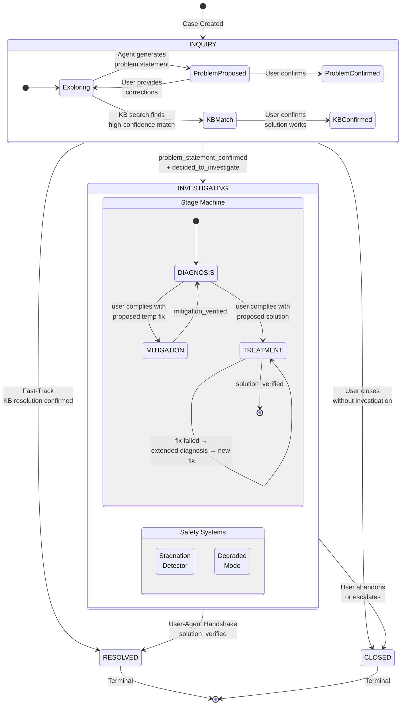
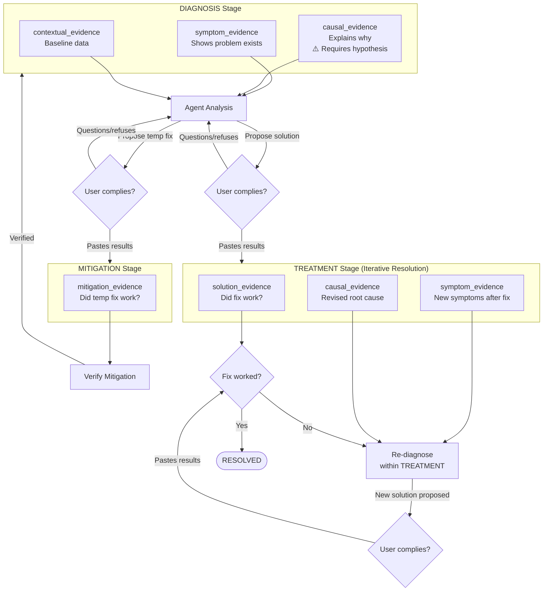

# Evidence-Driven Investigation Framework

## Status

| Field | Value |
|-------|-------|
| **Status** | REVIEW |
| **Authors** | FaultMaven Team |
| **Created** | 2026-02-18 |
| **Updated** | 2026-02-19 |

---

## Executive Summary

This document defines the investigation architecture for FaultMaven's investigation engine using a **stage-gated, evidence-driven** model with clear separation of concerns, user control over transitions, and structured LLM behavior.

**Architecture Summary:**

| Aspect | Design |
|--------|--------|
| **Stage model** | 3 explicit stages: DIAGNOSIS, MITIGATION, TREATMENT |
| **Stage transitions** | Inference-based (user compliance with proposed action implies acceptance) |
| **Progress tracking** | 4 stage-gate milestones (drive transitions) + 6 progress indicators (LLM context, non-driving) |
| **Evidence types** | 5 categories: symptom, causal, mitigation, solution, contextual |
| **Hypothesis constraint** | Required before causal_evidence classification |
| **Mitigation** | Distinct stage with own prompt, evidence type, and iterative verification |
| **Treatment failure** | Extended diagnosis within TREATMENT (new evidence required, not reprocessing) |

**What does NOT change:**
- Case statuses: INQUIRY → INVESTIGATING → RESOLVED/CLOSED
- INQUIRY phase and two-step confirmation for entering INVESTIGATING
- User-Agent Handshake for terminal transitions (RESOLVED/CLOSED)
- Hypothesis lifecycle (CAPTURED → ACTIVE → VALIDATED/REFUTED/RETIRED)
- Knowledge base pre-check and fast-track resolution
- Stagnation detection and degraded mode
- Input sanitization and token budget management

---

## 1. Motivation: Problems Solved

During lifecycle testing (Turns 1-3 of a MITIGATION_FIRST path), several design flaws emerged in the previous 4-stage milestone-driven architecture:

### 1.1 LLM "Jump Ahead" Inconsistency

The SYMPTOM_VERIFICATION prompt contained contradictory instructions:
- "Classify as **symptom_evidence** first" (required for early milestones)
- "**YOU CAN JUMP AHEAD** to root_cause_identified" (requires causal_evidence)

The LLM would classify evidence as `symptom_evidence` (following instruction 1) while simultaneously claiming `root_cause_identified` (following instruction 2). Validation failed because `root_cause_identified` requires `causal_evidence`, but the LLM had created `symptom_evidence`. The inconsistency is inherent: the same LLM making both decisions in one response cannot guarantee consistency between them.

### 1.2 Computed Stage is Fragile

The stage is a computed property derived from milestone flags:

```python
# Current implementation
if self.root_cause_identified:
    return HYPOTHESIS_VALIDATION
if self.symptom_verified:
    return HYPOTHESIS_FORMULATION
return SYMPTOM_VERIFICATION
```

If the LLM prematurely sets `root_cause_identified`, the computed stage jumps to HYPOTHESIS_VALIDATION, which uses a different prompt template. The agent now receives HYPOTHESIS_VALIDATION instructions when it should still be verifying symptoms. The milestone was reverted by validation (Bug 5 fix), but the structural fragility remains: any milestone flag error silently redirects the entire investigation.

### 1.3 Milestone Validation Was Afterthought

Milestones were applied **optimistically** from LLM output, then validated after the fact. Validation was warning-only (Bug 5) and even after making it blocking, the pattern remains: trust LLM first, check later. The validation serves as a consistency check on a decision already made, not as a gate that must be passed before advancing.

### 1.4 No User Agency in Stage Progression

The user had no say in when the investigation moves from diagnosis to solution. The LLM decided `solution_proposed = True` as an output field, and the stage computed automatically. Terminal transitions (RESOLVED/CLOSED) required user confirmation via the User-Agent Handshake, but intermediate stage transitions did not. This creates asymmetry: the most critical decision (closing the case) requires user approval, but the decision to stop diagnosing and start solving does not.

### 1.5 Stages Imply an Ordering That Evidence Doesn't Follow

The 4-stage model assumes: verify symptoms → form hypotheses → validate hypotheses → propose solution. But in practice:
- Evidence arrives in any order (user may provide causal data first)
- Root cause can be obvious from initial evidence (no hypothesis testing needed)
- Mitigation may be needed before diagnosis is complete

The stages constrain the agent to activities that may not match what the evidence demands.

---

## 2. Design Philosophy

### 2.1 Core Principle: Evidence-Driven, User-Gated

Investigation evidence flows naturally — the agent processes whatever data the user provides, in whatever order it arrives. But **stage transitions require explicit user acceptance**.

This creates a clear separation:
- **Within a stage**: The agent operates autonomously, guided by evidence
- **Between stages**: The user decides when to advance

### 2.2 The "Evidence-Driven" Principle

The core claim: **"process evidence naturally within the current stage; transitions happen when the user acts, not when the user agrees."**

Evidence drives the agent's analysis (what to focus on, which hypotheses to form). User actions drive stage progression. The agent asks "what does this evidence tell me?" rather than "what milestones can I complete?"

| Previous Model | Evidence-Driven Model |
|----------------|----------------------|
| "What milestones can I complete?" | "What does this evidence tell me?" |
| Agent decides progress via flags | User actions imply progress |
| 9 flags → computed stage | User compliance → inferred transition |
| Jump ahead if data allows | Natural flow within stage bounds |

### 2.3 Key Design Decisions

**1. Action Over Words: Inference-Based Transitions**

Stage transitions are inferred from user behavior, not explicit confirmation. When the agent proposes a solution and the user responds with evidence of having executed it (command output, post-fix metrics), the system infers acceptance and transitions to TREATMENT. If the user questions or refuses, no transition occurs.

This is fundamentally different from transitions that require explicit confirmation:
- **INQUIRY → INVESTIGATING**: Requires two-step confirmation (changes the nature of interaction)
- **INVESTIGATING → RESOLVED/CLOSED**: Requires User-Agent Handshake (irreversible terminal state)
- **DIAGNOSIS → TREATMENT**: Inferred from compliance (user ran the command and pasted results)

The reasoning: asking "do you accept this solution?" before letting the user try it adds friction without safety value. The user's act of executing the proposed command IS acceptance.

**2. Stages Are Primary, Not Secondary**

Stages are the primary structural unit. Each stage has a distinct prompt with different instructions, evidence types, and objectives. The stage determines what the LLM should do.

**3. Evidence Flows Naturally Within DIAGNOSIS**

Within DIAGNOSIS, the agent is unconstrained. It can verify symptoms, form hypotheses, identify root cause, and propose a solution — all based on what the evidence shows. The only ordering constraint: **a hypothesis must exist before evidence can be classified as causal**. This is a logical dependency (you can't say "this caused the problem" without first saying "the problem might be caused by X"), not an artificial stage boundary.

**4. TREATMENT Is Iterative Resolution, Not Just Verification**

Once the investigation crosses into "fixing mode" (TREATMENT), it stays there. If the first solution fails, the agent performs **extended diagnosis** within TREATMENT — analyzing failure evidence, requesting new data to fill knowledge gaps, forming new hypotheses, and proposing revised solutions — without regressing to DIAGNOSIS. DIAGNOSIS is purely for the initial bootstrapping of the investigation.

Extended diagnosis is structurally distinct from initial DIAGNOSIS: it starts from accumulated constraints (what's been tried, what's eliminated), requires new evidence (the original evidence produced a failed solution and cannot simply be reprocessed), and targets specific knowledge gaps rather than exploring broadly. In practice, most investigations resolve on the first fix or escalate quickly — extended diagnosis is a capability for the minority of cases where iteration is needed.

**5. Mitigation Is a Distinct Stage, Not a Path Modifier**

Treating mitigation as a "tool available during other stages" creates complex routing logic and unclear prompt boundaries. In this model, MITIGATION is a full stage with its own prompt, evidence type, and clear entry/exit conditions.

---

## 3. The Three-Stage Model

### 3.1 Stage Overview

```
                    ┌──────────────────────────────────────────────────┐
                    │               INVESTIGATING                      │
                    │                                                   │
                    │  ┌───────────┐   ┌────────────┐   ┌───────────┐ │
  INQUIRY ─────────►│ │ DIAGNOSIS │──►│ MITIGATION │──►│ DIAGNOSIS │ │
  (confirmed)       │  │           │   │ (optional)  │   │ (resumed) │ │
                    │  └─────┬─────┘   └────────────┘   └─────┬─────┘ │
                    │        │                                 │       │
                    │        │    (or directly)                │       │
                    │        └─────────────────────────────────┤       │
                    │                                          │       │
                    │                                    ┌─────▼─────┐ │
                    │                                    │ TREATMENT │ │
                    │                                    │           │ │
                    │                                    └─────┬─────┘ │
                    │                                          │       │
                    └──────────────────────────────────────────┤───────┘
                                                               │
                                                               ▼
                                                          RESOLVED
```

### 3.2 DIAGNOSIS Stage

**Purpose**: Build understanding of the problem, identify root cause, propose a solution.

**Entry**: Case transitions from INQUIRY → INVESTIGATING.

**Activities** (natural flow, not sequential):
1. Verify the problem — symptoms, scope, timeline
2. Form hypotheses — theories about why the problem is happening
3. Test hypotheses — evaluate evidence against competing theories
4. Propose solution — when root cause is identified with sufficient confidence

**Evidence types accepted**:
- `symptom_evidence` — data showing the problem exists
- `causal_evidence` — data explaining why (requires hypothesis to exist)
- `contextual_evidence` — baseline/environmental data

**Ordering constraint**: A hypothesis must exist before evidence can be classified as `causal_evidence`. If the cause is immediately obvious, the agent creates a hypothesis AND classifies causal evidence in the same turn.

**Exit conditions** (inference-based — action over words):

The agent proposes a concrete action (command, config change, rollback). The user's next message determines the transition:
- **Compliance**: User executes the action and submits results → system infers acceptance → enter **TREATMENT** (to verify the fix)
- **Compliance with mitigation**: User executes a proposed temp fix and submits results → system infers acceptance → enter **MITIGATION** (for urgent, ongoing issues)
- **Rejection/Query**: User questions, refuses, or provides unrelated data → no transition → stay in **DIAGNOSIS**

There is no separate confirmation turn. The agent proposes, the user acts (or doesn't), and the system infers.

**Urgency handling**: If the agent detects active production impact during DIAGNOSIS, it should offer a mitigation action: "This is impacting production right now. I'd suggest [specific temp fix] to stabilize things while we investigate the root cause."

### 3.3 MITIGATION Stage

**Purpose**: Apply a temporary fix to stop the bleeding. This is a controlled detour — stabilize the situation, then return to diagnosis for root cause analysis.

**Entry**: User complies with a proposed mitigation action during DIAGNOSIS (inferred from submitted results).

**Activities**:
1. Guide user through implementing the temporary fix
2. Verify the mitigation worked (ask for metrics/logs)
3. If mitigation is insufficient or ineffective → adjust approach and try again (iterative)
4. Communicate that this is temporary

Mitigation is **not assumed to be one-shot**. It is dynamic, interactive, and potentially iterative — multiple attempts may be needed until the user verifies the situation is stabilized. The agent stays in MITIGATION and adjusts its approach based on user feedback until the mitigation is verified.

**Evidence types accepted**:
- `mitigation_evidence` — data showing whether the temporary fix worked

**Exit condition**: User verifies mitigation is effective → return to **DIAGNOSIS** for root cause analysis. The system always directs toward RCA after mitigation. The user can manually resolve or close the case via UI at any point, but the system does not offer a "mitigation-only resolution" flow path.

**Re-entry**: After returning to DIAGNOSIS, if a new urgent situation arises, the agent can propose another mitigation. The mitigation flags reset when returning to DIAGNOSIS, allowing a new MITIGATION detour.

**Scope**: The agent should NOT pursue root cause analysis during MITIGATION. Focus solely on applying and verifying the temporary fix.

### 3.4 TREATMENT Stage (Iterative Resolution)

**Purpose**: Apply fixes and verify resolution. When a fix fails, perform extended diagnosis to understand why and propose a revised approach — all without leaving TREATMENT.

**Entry**: User complies with a proposed solution during DIAGNOSIS (inferred from submitted results).

**Core principle**: Once the investigation crosses into "fixing mode," it stays there. DIAGNOSIS is for the initial bootstrapping of understanding. TREATMENT handles everything from first fix attempt through resolution.

**Primary path** (most common):
1. Verify whether the applied fix worked (analyze submitted evidence)
2. Fix worked → confirm resolution → **RESOLVED**

**Failure path** (extended diagnosis):

When verification shows the fix failed, the agent performs extended diagnosis within TREATMENT. This is structurally different from initial DIAGNOSIS:

| | Initial DIAGNOSIS | Extended Diagnosis (in TREATMENT) |
|---|---|---|
| Starting position | Blank slate — "what's happening?" | Constrained — prior hypotheses tested, solutions attempted |
| Evidence requirement | Exploratory — "show me logs, metrics" | New evidence required — the original evidence produced a failed solution and cannot simply be reprocessed |
| Hypothesis space | Wide open | Narrowed — failed paths eliminated |
| Evidence strategy | Broad — "what's the scope and timeline?" | Targeted — "what did we miss? what distinguishes remaining possibilities?" |

Extended diagnosis proceeds:

1. **Failure analysis** — What does the failure tell us? Implementation error or wrong root cause?
2. **Gap identification** — What don't we know that we need to know?
3. **Targeted evidence request** — Ask for specific new data that would distinguish remaining hypotheses
4. **Additive hypothesis formation** — New hypotheses must account for ALL evidence (original + failure). Form via `hypotheses_to_add`, same mechanism as DIAGNOSIS.
5. **New solution proposal** — Derived from the new hypothesis, with specific commands/steps
6. **User complies → verify again** (loop back to primary path)

Extended diagnosis may take multiple turns (e.g., requesting evidence, analyzing, requesting more) before converging on a new solution. Escalation triggers when the agent has no more viable options (cannot formulate a new hypothesis or identify new evidence to request). For genuine external blockers (missing data, all hypotheses deadlocked, external dependencies), the system enters limitation-aware mode. For simple lack of progress, the system injects a gentle reminder to nudge the next diagnostic step without lowering confidence — FaultMaven is a copilot; the user decides the pace.

**Evidence types accepted**:
- `solution_evidence` — data showing whether the fix worked (post-fix metrics, logs, user confirmation)
- `symptom_evidence` — new symptoms discovered after fix attempt
- `causal_evidence` — new causal insights from failure analysis (requires hypothesis)

**Exit condition**: User confirms solution worked (solution_verified) → **RESOLVED**.

**The iterative resolution loop**:

```
┌──────────────────────────────────────────────────────────────┐
│                        TREATMENT                              │
│                                                               │
│  ┌──────────┐                                                 │
│  │  Verify  │──(works)──► RESOLVED                            │
│  │  Result  │                                                 │
│  └────┬─────┘                                                 │
│       │ (fails)                                               │
│       ▼                                                       │
│  ┌─────────────────────── Extended Diagnosis ──────────────┐  │
│  │  Failure    Gap         Targeted      New        New    │  │
│  │  Analysis → Identify → Evidence  →  Hypothesis → Fix   │  │
│  │             (may take multiple turns)                    │  │
│  └─────────────────────────────────────────────┬───────────┘  │
│                                     (user complies)           │
│                                                │              │
│                                                ▼              │
│                                          Verify Result        │
│                                                               │
└──────────────────────────────────────────────────────────────┘
```

**Why not return to DIAGNOSIS?** Regressing to DIAGNOSIS would:
- Reset the user's mental model ("I thought we were fixing this?")
- Lose the context of what was already tried
- Add state machine complexity with no analytical benefit

The agent can perform all necessary diagnostic work within TREATMENT. The key difference from initial DIAGNOSIS is that extended diagnosis starts from constraints (what's eliminated) and requires new evidence (not reprocessing the same data).

**Practical note**: Most investigations resolve on the first fix attempt. Extended diagnosis is a capability for the minority of cases where iteration is needed — it should be handled correctly when it occurs but is not the primary TREATMENT workflow.

**Escalation**: The agent suggests escalation when it has no more viable options — it cannot formulate a new hypothesis or identify new evidence to request. The principle: do not repeat a task without new input. For genuine external blockers (limited data, hypothesis deadlock, external dependencies), the system enters limitation-aware mode and offers escalation with a structured handoff summary (problem, evidence collected, hypotheses explored, solutions attempted and their outcomes). Simple lack of progress (5+ turns without investigative activity) receives only a gentle reminder — not degraded mode.

---

## 4. Milestones and Transitions

### 4.1 Stage-Gate Milestones

Only two milestones gate stage transitions. Both are **set by the LLM in structured output based on detected user compliance** with a ProposedAction — the LLM is the compliance detector, not the decision-maker. The user's action is the trigger; the LLM recognizes it:

| Milestone | Trigger | Effect |
|-----------|---------|--------|
| `solution_accepted` | User complies with proposed solution (submits execution results) | DIAGNOSIS → TREATMENT |
| `solution_verified` | User confirms fix worked (via User-Agent Handshake) | TREATMENT → RESOLVED |

For the mitigation-first path, one additional milestone:

| Milestone | Trigger | Effect |
|-----------|---------|--------|
| `mitigation_accepted` | User complies with proposed temp fix (submits execution results) | DIAGNOSIS → MITIGATION |

**How inference works**: The system (or classification layer) detects whether the user's input matches the expected evidence of the proposed action. This is distinct from the three other transition types:

| Transition | Mechanism | Why |
|-----------|-----------|-----|
| INQUIRY → INVESTIGATING | Explicit two-step confirmation | Changes nature of interaction |
| DIAGNOSIS → TREATMENT | **Inferred from compliance** | User's action IS acceptance |
| DIAGNOSIS → MITIGATION | **Inferred from compliance** | User's action IS acceptance |
| INVESTIGATING → RESOLVED | User-Agent Handshake | Irreversible terminal state |

### 4.2 Transition Rules

```python
# Stage computation (replaces computed property from milestones)
def current_stage(case) -> InvestigationStage:
    if case.solution_accepted and not case.solution_verified:
        return InvestigationStage.TREATMENT
    if case.mitigation_accepted and not case.mitigation_verified:
        return InvestigationStage.MITIGATION
    return InvestigationStage.DIAGNOSIS
```

Key properties:

- **No regression**: Once in TREATMENT, the case stays in TREATMENT (extended diagnosis happens within TREATMENT)
- **Mitigation is a detour**: MITIGATION always returns to DIAGNOSIS when verified
- **Inference-based**: Non-terminal transitions are inferred from user compliance, not explicit confirmation

### 4.3 What Happened to the 9 Old Milestones?

The old milestones (symptom_verified, scope_assessed, timeline_established, changes_identified, root_cause_identified, solution_proposed, solution_applied, mitigation_applied, solution_verified) tracked micro-progress within what is now a single DIAGNOSIS stage.

In the new model:
- **symptom_verified, scope_assessed, timeline_established, changes_identified**: Become LLM context data within DIAGNOSIS. The agent tracks these internally (via ProblemVerification fields), but they do not control stage selection.
- **root_cause_identified**: Tracked via hypothesis status (VALIDATED with high confidence). Not a boolean flag.
- **solution_proposed**: Becomes the agent's proposed action within DIAGNOSIS. User compliance triggers inferred transition to TREATMENT. Not a milestone.
- **solution_applied**: Tracked as part of TREATMENT workflow. Not a milestone.
- **mitigation_applied**: Replaced by the MITIGATION stage with its own lifecycle.
- **solution_verified**: Retained as a user-confirmed milestone gating the terminal transition.

### 4.4 Transition Flow Diagram

```
INQUIRY ──(user confirms problem)──► DIAGNOSIS
                                        │
                                        ├──(agent proposes temp fix)
                                        │       │
                                        │       ├── user complies (pastes results) ──► MITIGATION
                                        │       │                                         │
                                        │       │                          (mitigation verified)
                                        │       │                                         │
                                        │       └── user questions/refuses ──► stay       │
                                        │                                                 │
                                        │   ◄─────────────────────────────────────────────┘
                                        │
                                        ├──(agent proposes solution)
                                        │       │
                                        │       ├── user complies (pastes results) ──► TREATMENT
                                        │       │                                        │
                                        │       │                         (iterative resolution)
                                        │       │                                        │
                                        │       └── user questions/refuses ──► stay      │
                                        │                                     (solution verified)
                                        │                                                │
                                        │                                                ▼
                                        │                                            RESOLVED
                                        │
                                        └──(user abandons)──► CLOSED
```

---

## 5. Evidence Model

### 5.1 Evidence Categories

| Category | Description | Used In Stage | Example |
|----------|-------------|--------------|---------|
| `symptom_evidence` | Data showing the problem exists | DIAGNOSIS, TREATMENT | Error logs, latency spikes, alert notifications |
| `causal_evidence` | Data explaining why the problem happened | DIAGNOSIS, TREATMENT | Deploy logs, config diffs, code changes |
| `contextual_evidence` | Baseline/environmental data | DIAGNOSIS, TREATMENT | Architecture diagrams, normal configs |
| `mitigation_evidence` | Data showing whether the temp fix worked | MITIGATION | Post-mitigation metrics, error rate changes |
| `solution_evidence` | Data showing whether the fix worked | TREATMENT | Post-fix metrics, clean logs, user confirmation |

### 5.2 Evidence Classification Rules

1. **Content-based, not stage-based**: Evidence is classified by what the data contains, not by which stage the investigation is in. Error logs are `symptom_evidence` whether submitted during DIAGNOSIS or TREATMENT.

2. **Causal evidence requires hypothesis**: The agent must create a hypothesis before classifying evidence as `causal_evidence`. This enforces the logical dependency: "X caused Y" presupposes "X might have caused Y" (the hypothesis).

3. **Multiple evidence items per submission**: When a user submits a large block of data (e.g., pasted logs containing errors + deploy timeline + metrics), the LLM may split it into multiple evidence records with different categories.

### 5.3 Evidence Creation Pipeline

The existing single-phase evidence creation pipeline remains unchanged:

1. User submits message via `/queries/` endpoint
2. LLM classifies submission as `user_text`, `submitted_data`, or `mixed`
3. For `submitted_data` / `mixed`: LLM populates `evidence_to_add` with one or more evidence items
4. System creates Evidence records from `evidence_to_add`
5. For file uploads: preprocessing service runs Tier 0+1 pipeline, LLM receives summary

No changes to the preprocessing service, context builder, or evidence storage.

---

## 6. Hypothesis Model

### 6.1 Hypothesis Lifecycle

The hypothesis lifecycle:
- **CAPTURED** → **ACTIVE** → **VALIDATED** / **REFUTED** / **RETIRED**
- Evidence links with stances: SUPPORTS, REFUTES, NEUTRAL
- Confidence formula: `initial + (0.15 x supporting) - (0.20 x refuting)`
- Stagnation decay: `likelihood x 0.85^iterations_without_progress`
- Anchoring detection: 4+ hypotheses in same category refuted

### 6.2 New Constraint: Hypothesis Before Causal Evidence

Without this constraint, the LLM could identify root cause directly from evidence without creating a hypothesis.

This model enforces the constraint: **a hypothesis must exist before evidence can be classified as `causal_evidence`**. This ensures:
- Every causal claim has a testable statement attached
- The audit trail is always complete (Evidence → Hypothesis → Solution)
- The LLM cannot "jump" to root cause without articulating why

The single-shot validation pattern still works — the agent creates a hypothesis and links causal evidence in the same turn. The constraint only prevents causal classification without any hypothesis at all.

### 6.3 Hypotheses Within DIAGNOSIS and TREATMENT

Hypotheses are created and managed during both DIAGNOSIS and TREATMENT:

**In DIAGNOSIS** (initial investigation):
- **Form**: Agent creates hypotheses based on symptom evidence
- **Test**: New evidence evaluated against all active hypotheses
- **Converge**: When one hypothesis reaches high confidence (validated), agent proposes solution
- **Retire**: Stagnant or refuted hypotheses are cleaned up by housekeeping

**In TREATMENT** (extended diagnosis):
- When a solution fails, the agent performs failure analysis to determine whether the root cause was wrong
- Extended diagnosis requires **new evidence** — the original evidence produced a failed solution and cannot be reprocessed for a different result
- The agent requests targeted new data, then forms **new hypotheses** that account for all evidence (original + failure + new)
- This is a limited-use capability — most investigations resolve on the first fix. Extended diagnosis handles the minority of cases that need iteration

Hypotheses are not used during MITIGATION (focused on applying and verifying the temporary fix).

---

## 7. Workflow Paths

### 7.1 Standard Path (ROOT_CAUSE)

For historical problems or low/medium urgency:

```
INQUIRY → DIAGNOSIS → TREATMENT → RESOLVED
```

1. User describes problem, confirms investigation
2. Agent collects evidence, forms hypotheses, identifies root cause
3. Agent proposes concrete action (e.g., "Run `kubectl rollout restart deployment/payment-api`")
4. User executes and pastes results → inferred transition to TREATMENT
5. Agent verifies fix worked, user confirms → RESOLVED

### 7.2 Mitigation-First Path

For ongoing production incidents with high/critical urgency:

```
INQUIRY → DIAGNOSIS → MITIGATION → DIAGNOSIS → TREATMENT → RESOLVED
```

1. User describes urgent problem, confirms investigation
2. Agent recognizes urgency, proposes specific temp fix action
3. User executes temp fix and pastes results → inferred transition to MITIGATION
4. Agent verifies mitigation worked
5. Return to DIAGNOSIS for root cause analysis
6. Agent proposes permanent solution action
7. User executes and pastes results → inferred transition to TREATMENT
8. Agent verifies fix worked, user confirms → RESOLVED
9. Agent reminds user to revert temporary workaround

### 7.3 Path Selection

Path selection remains system-determined from the temporal_state x urgency_level matrix:

| | CRITICAL | HIGH | MEDIUM | LOW |
|---|---|---|---|---|
| **ONGOING** | MITIGATION_FIRST | MITIGATION_FIRST | USER_CHOICE | USER_CHOICE |
| **HISTORICAL** | USER_CHOICE | ROOT_CAUSE | ROOT_CAUSE | ROOT_CAUSE |

- **MITIGATION_FIRST**: Agent proactively offers mitigation during DIAGNOSIS before pursuing root cause.
- **ROOT_CAUSE**: Agent goes straight to root cause analysis. Mitigation is not offered unless the user requests it.
- **USER_CHOICE**: Agent presents both options and lets the user decide. Used for ambiguous urgency/temporal combinations where the right approach depends on context the system cannot infer (e.g., historical + critical: "We had a catastrophic outage last week, the CEO wants answers by tomorrow" — the user knows whether speed or thoroughness matters more).

The path determines **whether the agent offers mitigation** during DIAGNOSIS. The actual entry into MITIGATION stage is inferred from user compliance with the proposed temp fix.

### 7.4 Edge Cases

**User doesn't comply with proposed action**: Agent proposed "restart the service," user says "I don't think that's the right fix" or asks a clarifying question. No transition — agent stays in DIAGNOSIS, refines analysis, proposes revised approach.

**User provides unrelated evidence after proposal**: Agent proposed a fix, user submits new diagnostic data instead of execution results. No transition — system recognizes this is not compliance. Agent processes the new evidence within DIAGNOSIS.

**Solution fails in TREATMENT**: Agent stays in TREATMENT and enters extended diagnosis. Analyzes the failure evidence, identifies knowledge gaps, requests targeted new data. The original evidence produced the failed solution — it cannot be reprocessed for a different result. New evidence is required. Once obtained, the agent forms new hypotheses, proposes a revised solution, and the cycle repeats. Escalation when the agent has no more viable options (degraded mode).

**New symptoms emerge in TREATMENT**: User discovers the fix caused a new problem. Agent stays in TREATMENT, treats this as failure evidence requiring extended diagnosis, and follows the same process: failure analysis → gap identification → targeted evidence request → new hypothesis → corrective action.

**Mitigation-only resolution**: After MITIGATION, user says "That's good enough, we'll investigate later." The system directs toward DIAGNOSIS for RCA, but the user can close the case via UI (→ CLOSED with closure_reason = "mitigation_sufficient"). Note: CaseStatus.CLOSED formally means "closed without permanent solution," but when closure_reason is "mitigation_sufficient" the UI should render this distinctly (e.g., "Closed - Mitigated" rather than "Closed - Abandoned") to reflect that the user's problem was addressed, just not via root cause analysis.

---

## 8. Prompt Architecture

### 8.1 Template Structure

The three-template system is preserved with updated stage instructions:

| Template | Used When | Description |
|----------|-----------|-------------|
| **INQUIRY_TEMPLATE** | `status == INQUIRY` | Explore problem, get commitment (unchanged) |
| **INVESTIGATION_BASE** + stage instructions | `status == INVESTIGATING` | Active investigation |
| **TERMINAL_TEMPLATE** | `status in [RESOLVED, CLOSED]` | Documentation and summary (unchanged) |

### 8.2 Stage Instructions (Replaces STAGE_INSTRUCTIONS Dict)

The 4 stage instruction sets (SYMPTOM_VERIFICATION, HYPOTHESIS_FORMULATION, HYPOTHESIS_VALIDATION, SOLUTION) are replaced by 3:

| New Instruction | Replaces | Focus |
|-----------------|----------|-------|
| **DIAGNOSIS_INSTRUCTIONS** | SYMPTOM_VERIFICATION + HYPOTHESIS_FORMULATION + HYPOTHESIS_VALIDATION | Understand, diagnose, propose solution |
| **MITIGATION_INSTRUCTIONS** | (new) | Apply temp fix, verify, return to diagnosis |
| **TREATMENT_INSTRUCTIONS** | SOLUTION (expanded) | Verify fix, extended diagnosis if fix fails, resolve |

### 8.3 Stage Dispatch

```python
# Replaces computed stage lookup in get_prompt_for_case()
def get_stage_instructions(case: Case) -> str:
    stage = case.current_stage  # DIAGNOSIS, MITIGATION, or TREATMENT

    if stage == InvestigationStage.TREATMENT:
        return TREATMENT_INSTRUCTIONS
    elif stage == InvestigationStage.MITIGATION:
        return MITIGATION_INSTRUCTIONS
    else:
        return DIAGNOSIS_INSTRUCTIONS
```

### 8.4 DIAGNOSIS Prompt Objectives

The DIAGNOSIS instructions combine the analytical capabilities of the old 3 stage prompts into a natural flow:

1. **Verify** — Confirm symptoms, scope, timeline using evidence
2. **Hypothesize** — Form testable theories about root cause
3. **Test** — Evaluate evidence against hypotheses
4. **Propose** — When confident, propose a concrete action for the user to execute

The agent is not forced through these steps sequentially. If evidence immediately reveals the root cause, the agent can verify, hypothesize, and propose in one turn.

The proposal should be a specific action ("Run `kubectl rollout restart...`"), not a request for permission ("Would you like me to suggest a fix?"). The user's compliance (executing and submitting results) triggers the inference-based transition to TREATMENT.

### 8.5 TREATMENT Prompt Objectives

TREATMENT has two modes:

**Primary** (most cases): Verify submitted evidence → fix worked → RESOLVED.

**Extended diagnosis** (fix failed): When verification shows the fix failed, TREATMENT enters an extended diagnosis process that is structurally distinct from initial DIAGNOSIS:

1. **Failure analysis** — What does the failure tell us? What's eliminated?
2. **Gap identification** — What new evidence is needed? (The original evidence produced a failed solution — reprocessing it cannot yield a valid different result.)
3. **Targeted evidence request** — Ask for specific new data
4. **Additive hypothesis formation** — New hypotheses must account for ALL evidence (original + failure + new)
5. **New solution proposal** — Derived from new hypothesis
6. **Escalation** — When no viable options remain (degraded mode), suggest handoff with structured summary

This is a limited-use capability — most investigations resolve on the first fix. The TREATMENT prompt includes extended diagnosis instructions proportionally.

### 8.6 What the "Jump Ahead" Removal Means

The old SYMPTOM_VERIFICATION prompt said: "YOU CAN JUMP AHEAD to root_cause_identified." This is removed entirely. In DIAGNOSIS, there is no "jumping" because there are no sub-stages to jump between. The agent simply processes evidence and advances naturally.

The new equivalent: if evidence reveals root cause immediately, the agent creates a hypothesis at high confidence, classifies causal evidence, and proposes an action — all within DIAGNOSIS. The progression is natural, not a "jump."

---

## 9. Problem Refinement During DIAGNOSIS

### 9.1 Current State

The problem description (ProblemVerification.symptom_statement) is set when entering INVESTIGATING and is essentially static. The LLM receives it as context every turn but has no mechanism to refine it.

### 9.2 Proposed Enhancement

During DIAGNOSIS, the agent should be able to refine the problem statement as understanding evolves. For example:
- Initial: "Checkout is slow"
- After evidence: "Payment gateway connection pool exhausted after v2.1.3 deploy"

This is implemented via `verification_updates` in the LLM response, allowing updates to ProblemVerification fields. The refinement history is preserved in turn records for audit trail.

### 9.3 Issue Tracking vs Hypothesis Tracking

Hypotheses are tracked as structured entities (statement, confidence, evidence links, status) because there are **multiple competing** hypotheses evaluated against each other.

The issue/problem is tracked via ProblemVerification because it is **singular** — there is one problem being investigated, and understanding of it evolves. It does not need the multiplicity of hypothesis tracking, but it should support refinement.

---

## 10. Data Model Changes

### 10.1 InvestigationStage Enum

```python
# Old
class InvestigationStage(str, Enum):
    SYMPTOM_VERIFICATION = "symptom_verification"
    HYPOTHESIS_FORMULATION = "hypothesis_formulation"
    HYPOTHESIS_VALIDATION = "hypothesis_validation"
    SOLUTION = "solution"

# New
class InvestigationStage(str, Enum):
    DIAGNOSIS = "diagnosis"
    MITIGATION = "mitigation"
    TREATMENT = "treatment"
```

### 10.2 InvestigationProgress

```python
# Old: 9 boolean milestone flags that drove stage transitions
class InvestigationProgress(BaseModel):
    symptom_verified: bool = False
    scope_assessed: bool = False
    timeline_established: bool = False
    changes_identified: bool = False
    root_cause_identified: bool = False
    solution_proposed: bool = False
    solution_applied: bool = False
    solution_verified: bool = False
    mitigation_applied: bool = False

# New: Stage-gate milestones + progress indicators (non-stage-driving)
class InvestigationProgress(BaseModel):
    # Stage-gate milestones (inferred from user behavior — drive transitions)
    mitigation_accepted: bool = False     # DIAGNOSIS → MITIGATION (inferred from compliance)
    mitigation_verified: bool = False     # MITIGATION → DIAGNOSIS (return)
    solution_accepted: bool = False       # DIAGNOSIS → TREATMENT (inferred from compliance)
    solution_verified: bool = False       # TREATMENT → RESOLVED (User-Agent Handshake)

    # Progress indicators (set by LLM — do NOT drive stage transitions)
    # Used for: LLM context, progress display, analytics, deciding when/what to propose
    symptom_verified: bool = False        # Problem symptoms confirmed
    scope_assessed: bool = False          # Impact scope determined
    timeline_established: bool = False    # When it started / timeline understood
    changes_identified: bool = False      # Recent changes correlated
    root_cause_identified: bool = False   # Root cause hypothesis validated
    solution_proposed: bool = False       # A solution has been proposed (set when
                                          # ProposedAction with action_type=SOLUTION is created)
                                          # Tells the LLM "you already proposed a solution"
                                          # without scanning conversation history

    @property
    def current_stage(self) -> InvestigationStage:
        if self.solution_accepted and not self.solution_verified:
            return InvestigationStage.TREATMENT
        if self.mitigation_accepted and not self.mitigation_verified:
            return InvestigationStage.MITIGATION
        return InvestigationStage.DIAGNOSIS

    @property
    def stage_display_name(self) -> str:
        stage = self.current_stage
        if stage == InvestigationStage.DIAGNOSIS:
            return "Diagnosing"
        elif stage == InvestigationStage.MITIGATION:
            return "Mitigating"
        else:
            return "Resolving"
```

### 10.3 EvidenceCategory Enum

```python
# Old
class EvidenceCategory(str, Enum):
    SYMPTOM_EVIDENCE = "symptom_evidence"
    CAUSAL_EVIDENCE = "causal_evidence"
    RESOLUTION_EVIDENCE = "resolution_evidence"
    CONTEXTUAL_EVIDENCE = "contextual_evidence"
    REJECTED = "rejected"

# New
class EvidenceCategory(str, Enum):
    SYMPTOM_EVIDENCE = "symptom_evidence"
    CAUSAL_EVIDENCE = "causal_evidence"
    MITIGATION_EVIDENCE = "mitigation_evidence"    # NEW
    SOLUTION_EVIDENCE = "solution_evidence"          # RENAMED from resolution_evidence
    CONTEXTUAL_EVIDENCE = "contextual_evidence"
    REJECTED = "rejected"
```

### 10.4 InvestigationPath

```python
class InvestigationPath(str, Enum):
    MITIGATION_FIRST = "mitigation_first"
    ROOT_CAUSE = "root_cause"
    USER_CHOICE = "user_choice"

# Semantics simplified: path determines whether the agent offers mitigation
# during DIAGNOSIS, not which milestones are available. Path is advisory, not structural.
```

### 10.5 ProposedAction (New)

The agent's proposed action must be tracked as structured data so the system can:
(a) determine which transition to make on user compliance (mitigation vs solution), and
(b) match user submissions against the proposed action for compliance detection.

```python
class InvestigationActionType(str, Enum):
    MITIGATION = "mitigation"   # Temp fix → compliance triggers DIAGNOSIS → MITIGATION
    SOLUTION = "solution"       # Permanent fix → compliance triggers DIAGNOSIS → TREATMENT
    DIAGNOSTIC = "diagnostic"   # Data collection → no stage transition on compliance

class ProposedAction(BaseModel):
    action_id: str                        # Unique action identifier (auto-generated)
    case_id: str                          # Case this action belongs to
    action_type: InvestigationActionType  # What kind of action this is
    description: str                      # What the agent proposed (human-readable, max 2000)
    commands: List[str]                   # Specific commands for the user to execute
    proposed_at: datetime                 # When the action was proposed (auto-set)
    proposed_in_turn: int                 # Turn number when proposed
    status: str                           # "pending" | "accepted" | "rejected" | "superseded"
```

The `action_type` is determined by the system when creating the ProposedAction from a SolutionToAdd:

- `WORKAROUND` solution type → `MITIGATION`
- `MITIGATION_FIRST` path + no mitigation accepted yet → `MITIGATION`
- Otherwise → `SOLUTION`
- Downgraded to `DIAGNOSTIC` if no hypothesis exists (prevents premature TREATMENT entry)

The system uses `action_type` to determine which stage-gate milestone to set when user compliance is detected.

### 10.6 Action Attempt Tracking (New)

Track user attempts to execute proposed actions. Compliance detection analyzes attempts to determine if stage-gate milestones should be set:

```python
class ActionAttempt(BaseModel):
    attempt_id: str                       # Unique attempt identifier (auto-generated)
    action_id: str                        # ProposedAction this attempt relates to
    user_message: str                     # The user's message containing attempt results (max 10000)
    submitted_at: datetime                # When the attempt was submitted (auto-set)
    compliance_detected: bool             # Whether user appears to have executed the proposed action
    compliance_confidence: float          # Confidence score (0.0-1.0)

# On Case:
proposed_actions: list[ProposedAction] = []
action_attempts: list[ActionAttempt] = []
```

This covers both TREATMENT cycles (solution attempts) and MITIGATION cycles (mitigation attempts). The boolean flags on InvestigationProgress (`mitigation_accepted`, `mitigation_verified`) represent the **current** cycle; the `action_attempts` list provides **history**. When mitigation flags reset on return to DIAGNOSIS, the completed mitigation attempt remains in the list.

This is not used for escalation thresholds (escalation is via degraded mode, not a fixed counter). It provides:
- **LLM context**: The agent sees what has been tried (both mitigations and solutions) and can avoid repeating failed approaches
- **Analytics**: Time-per-cycle, failure categorization, investigation thoroughness, mitigation effectiveness
- **Degraded mode input**: The stagnation detector can use attempt history to detect when the agent is cycling without new evidence
- **Audit trail**: Complete record of all mitigation and solution actions, even after flag resets

---

## 11. Process Flow (Updated)

### 11.1 Case Lifecycle State Machine



### 11.2 Single-Turn Processing (Simplified)

The core processing pipeline remains the same (context assembly → prompt selection → LLM invocation → response processing). Changes are limited to:

1. **Template selection**: 3 stage instructions instead of 4
2. **Stage computation**: From inferred milestones instead of 9 boolean flags
3. **Evidence validation**: Category-based checks updated for new types
4. **Compliance detection**: Post-LLM detection of user compliance with proposed action via stage-gate milestones in structured output (transition takes effect next turn)

### 11.3 Evidence Classification & Stage Relationship



---

## 12. User-Facing Stage Names

| Internal Stage | User-Facing Name | Description |
|----------------|-----------------|-------------|
| DIAGNOSIS | "Diagnosing" | Understanding the problem and finding the cause |
| MITIGATION | "Mitigating" | Applying a temporary fix |
| TREATMENT | "Resolving" | Applying the permanent solution |

The UI renders these as secondary detail under the primary "Investigating" status badge.

---

## 13. Migration Path

### 13.1 Backward Compatibility

The old STAGE_INSTRUCTIONS dictionary and prompt templates remain in the codebase alongside the new templates during migration. The switch is controlled by the stage enum and dispatch logic in `get_prompt_for_case()`.

### 13.2 Implementation Sequence

1. **Add new stage instructions** (DONE) — DIAGNOSIS_INSTRUCTIONS, MITIGATION_INSTRUCTIONS, TREATMENT_INSTRUCTIONS added to templates.py
2. **Update InvestigationStage enum** — Add DIAGNOSIS, MITIGATION, TREATMENT values
3. **Update InvestigationProgress model** — Stage-gate milestones + retained progress indicators
4. **Add ProposedAction model** — action_type, expected_command, description (Section 10.5)
5. **Add ActionAttempt tracking** — List on Case for solution and mitigation history (Section 10.6)
6. **Update EvidenceCategory enum** — Add mitigation_evidence, rename resolution_evidence
7. **Update evidence_processor.py** — Validation rules for new evidence categories
8. **Update milestone_engine.py** — Stage dispatch, compliance detection (post-LLM), degraded mode trigger
9. **Update context_builder.py** — Stage-specific context loading, ProposedAction in prompt context
10. **Update LLM response schemas** — ProposedAction output, stage-gate milestones, progress indicators
11. **Update tests** — All test files referencing old milestones/stages

### 13.3 Database Migration

Existing cases with old milestone fields need migration:
- Cases in INQUIRY: No change needed
- Cases in RESOLVED/CLOSED: No change needed (terminal, immutable)
- Cases in INVESTIGATING: Map old milestones to new fields:

```python
# Progress indicators: direct copy (field names unchanged)
new.symptom_verified = old.symptom_verified
new.scope_assessed = old.scope_assessed
new.timeline_established = old.timeline_established
new.changes_identified = old.changes_identified
new.root_cause_identified = old.root_cause_identified
new.solution_proposed = old.solution_proposed

# Stage-gate milestones: infer from old state
new.solution_accepted = old.solution_applied    # if applied, they accepted
new.solution_verified = old.solution_verified
new.mitigation_accepted = old.mitigation_applied
new.mitigation_verified = old.mitigation_applied  # assume verified if applied

# New fields: initialize empty
new.action_attempts = []
```

---

## 14. Comparison: What Changes vs What Stays

### Changes

| Component | Old | New |
|-----------|-----|-----|
| InvestigationStage enum | 4 values | 3 values |
| InvestigationProgress | 9 boolean flags driving stages | 4 stage-gate milestones (inferred) + 6 progress indicators (non-driving, LLM context) |
| Stage computation | Computed from milestone flags | Computed from stage-gate milestones only |
| Stage transitions | Automatic (milestone-driven) | Inference-based (user compliance with proposed action) |
| Proposal tracking | None (free text only) | ProposedAction with action_type, expected_command (Section 10.5) |
| Action attempt tracking | None | ActionAttempt list covering both solution and mitigation cycles (Section 10.6) |
| TREATMENT scope | Verify fix only | Verify fix + extended diagnosis when fix fails |
| Evidence categories | 4 types | 5 types |
| Prompt stage instructions | 4 templates | 3 templates (TREATMENT includes extended diagnosis) |
| Mitigation | Path modifier (one-shot) | Distinct stage (iterative until verified) |
| Path selection | USER_CHOICE in matrix | USER_CHOICE restored for ambiguous urgency/temporal cells |
| Milestone validation | Consistency check (blocking) | Stage-gate milestones inferred from behavior; progress indicators set by LLM (advisory, non-blocking) |
| Compliance detection | N/A (explicit confirmation) | Post-LLM, default no-transition when ambiguous (Section 15, decisions 5-6) |
| "Jump ahead" | Allowed and encouraged | Removed (no sub-stages to jump between) |

### Unchanged

| Component | Status |
|-----------|--------|
| CaseStatus (INQUIRY/INVESTIGATING/RESOLVED/CLOSED) | Unchanged |
| INQUIRY template and two-step confirmation | Unchanged |
| User-Agent Handshake for terminal transitions | Unchanged |
| TERMINAL template | Unchanged |
| Hypothesis lifecycle and evidence linking | Unchanged |
| Knowledge base pre-check and fast-track | Unchanged |
| Stagnation detection and progress tracking | Updated — broadened progress definition, NO_PROGRESS no longer triggers degraded mode |
| Evidence creation pipeline (classify → create) | Unchanged |
| Preprocessing service (Tier 0+1) | Unchanged |
| Input sanitization and token budget | Unchanged |
| TurnProgress tracking | Unchanged (fields adapt to new milestones) |
| Diagnostic reasoning requirements | Unchanged |
| Anti-hallucination / evidence grounding | Unchanged |

---

## 15. Design Decisions

All open questions from the initial draft have been resolved.

1. **Old milestones retained as progress indicators.** The old flags (symptom_verified, scope_assessed, timeline_established, changes_identified, root_cause_identified, solution_proposed) are retained as non-stage-driving progress indicators on InvestigationProgress. They are used by the LLM to evaluate investigation progress and decide when/what to propose — but they do NOT drive stage transitions. The change is removing sub-stage boundaries, not the tracking data. These should be called "progress indicators" or "diagnostic flags" rather than "milestones" to avoid confusion with the stage-gate milestones (solution_accepted, solution_verified, mitigation_accepted, mitigation_verified).

2. **Mitigation always returns to DIAGNOSIS for RCA.** After mitigation is verified, the system directs the user back to root cause analysis. DIAGNOSIS resumes with hypothesis formulation and verification informed by what was learned during mitigation. The user can always manually resolve or close the case via UI at any point (this is a UI-level override, not a system flow path), but the system does not offer a "mitigation-only resolution" path. The app pushes toward RCA.

3. **Escalation via capability exhaustion, not a fixed counter.** The agent suggests escalation when it has no more viable options — not after a fixed number of cycles. The principle: do not repeat a task without new input. For genuine external blockers (limited data, hypothesis deadlock, external dependencies), the system enters limitation-aware mode. Simple lack of progress (5+ turns) receives a gentle reminder — FaultMaven is a copilot that patiently serves the user while keeping the diagnostic thread visible. DegradedMode is reserved for situations where the agent truly cannot proceed without external intervention.

4. **MITIGATION is iterative until verified.** Mitigation is not assumed to be one-shot. It is dynamic, interactive, and potentially iterative — multiple attempts may be needed until the user verifies the situation is stabilized. The MITIGATION stage stays active until verified, supporting multiple mitigation actions within a single MITIGATION detour. Re-entry to MITIGATION from DIAGNOSIS (a second detour) is also supported — the mitigation_accepted/mitigation_verified flags reset when returning to DIAGNOSIS, allowing a new mitigation cycle if needed.

5. **Compliance detection: default to no-transition when ambiguous.** The inference-based transition depends on classifying whether the user's message is compliance with a proposed action. When ambiguous (e.g., "I ran the command but got a different error", "Here are the results, but I'm not sure I did it right"), the system defaults to no-transition and the LLM handles it within the current stage. It is safer to stay in the current stage and let the LLM ask for clarification than to transition incorrectly. The `ProposedAction.expected_command` field (Section 10.5) provides a structured reference point for matching user submissions against the proposed action, improving detection accuracy over free-text inference alone.

6. **Compliance detection happens post-LLM (within LLM response processing).** The LLM sets `action_type` on `ProposedAction` when proposing an action, and sets stage-gate milestones (solution_accepted, mitigation_accepted) in its structured output when it determines the user has complied. The system transitions for the next turn based on these outputs. This means the transition turn itself runs with the current stage's prompt (e.g., DIAGNOSIS prompt), which is acceptable because: (a) the DIAGNOSIS prompt already instructs the agent to recognize compliance and respond appropriately, (b) the actual TREATMENT/MITIGATION prompt takes effect on the next turn when stage-specific instructions are needed, and (c) pre-LLM classification would require a separate lightweight classifier that duplicates the LLM's contextual understanding, adding fragility without clear benefit.

---

## Appendix A: Terminology

| Term | Definition |
|------|-----------|
| **Stage** | One of DIAGNOSIS, MITIGATION, or TREATMENT. Determines which prompt the LLM receives. |
| **Stage-gate milestone** | An inferred event that drives stage transitions (solution_accepted, solution_verified, mitigation_accepted, mitigation_verified). Set by the LLM in structured output. |
| **Progress indicator** | A non-stage-driving flag tracking investigation progress (symptom_verified, scope_assessed, etc.). Set by the LLM, used for context and analytics, does NOT drive transitions. |
| **Evidence** | Data submitted by the user, classified by the LLM into categories. |
| **Hypothesis** | A testable theory about the root cause, with confidence scoring and evidence links. |
| **Inference-based transition** | A stage change inferred from user compliance with a proposed action (executing a command and submitting results). |
| **Compliance** | User behavior indicating they executed a proposed action — detected post-LLM from the content of their submission, matched against ProposedAction. |
| **ProposedAction** | Structured record of the agent's last proposed action, including action_type (mitigation, solution, diagnostic) and expected_command. Used for compliance detection and transition type determination. |
| **Extended diagnosis** | The diagnostic process within TREATMENT when a fix fails. Structurally distinct from initial DIAGNOSIS: starts from constraints, requires new evidence, targets specific knowledge gaps. |
| **Mitigation** | A temporary fix applied during an ongoing incident to reduce impact. Iterative — may require multiple attempts until user verifies stabilization. |
| **Treatment** | Apply fix, verify result. If fix fails: extended diagnosis (failure analysis → new evidence → new hypothesis → revised fix). Most cases resolve on first fix. |
| **Diagnosis** | Initial investigation: understand the problem, collect evidence, identify root cause, propose first solution. |
| **Degraded mode** | State entered when the agent has no more viable options (cannot formulate new hypothesis or identify new evidence to request). Triggers escalation suggestion. |

## Appendix B: Related Documents

| Document | Relationship |
|----------|-------------|
| [Investigation Data Models](./investigation-data-models.md) | Data models to be updated per Section 10 |
| [Investigation Lifecycle Logic](./investigation-lifecycle-logic.md) | Lifecycle logic to be updated per Sections 4, 7 |
| [Prompt Engineering Guide](./prompt-engineering-guide.md) | Prompt architecture to be updated per Section 8 |
| [Prompt Templates](./prompt-templates.md) | Templates to be updated per Section 8 |
