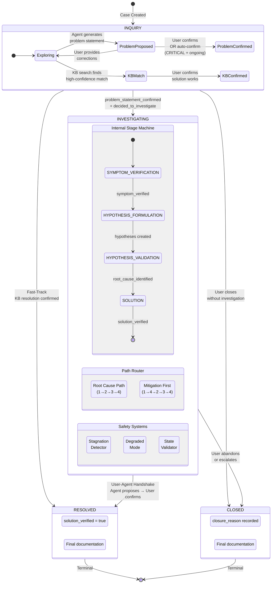
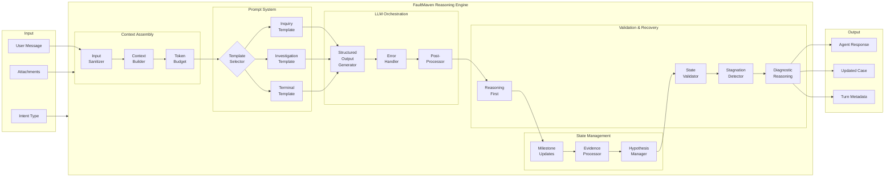
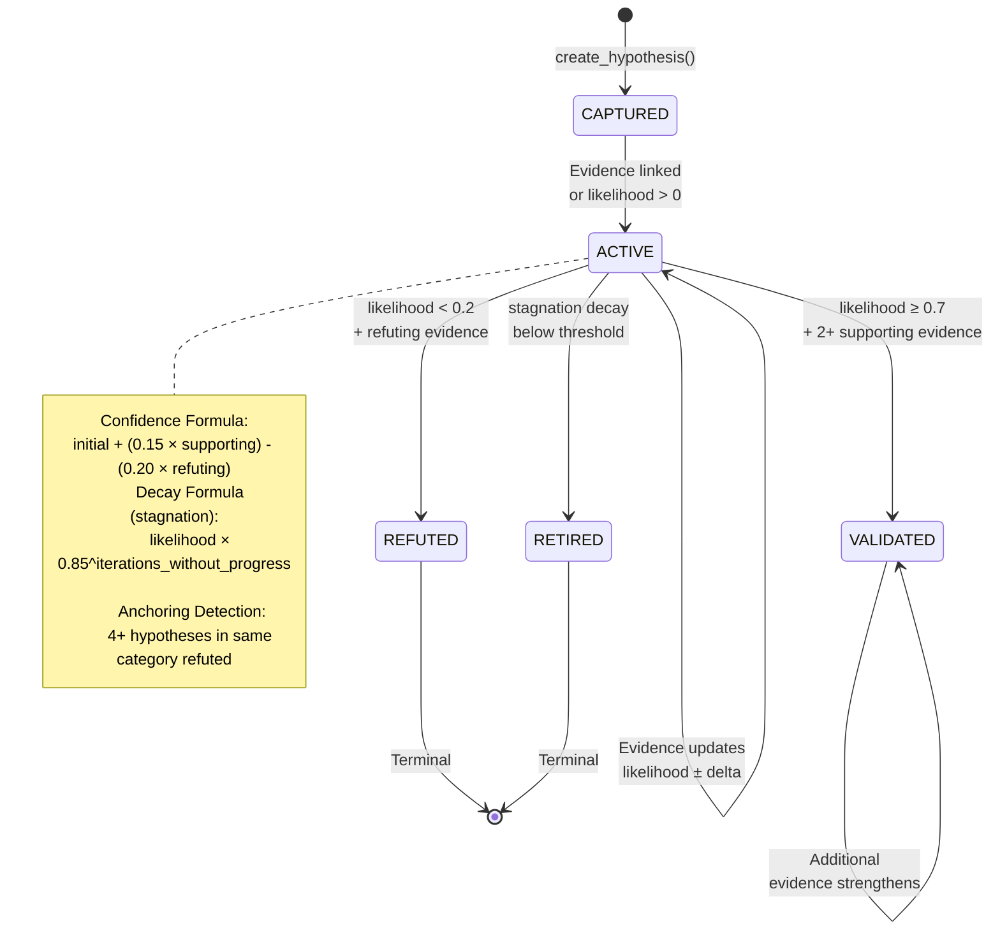
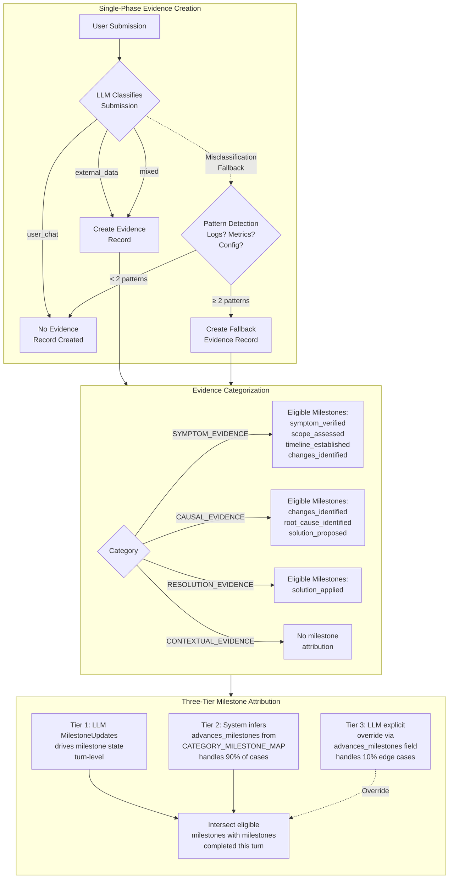
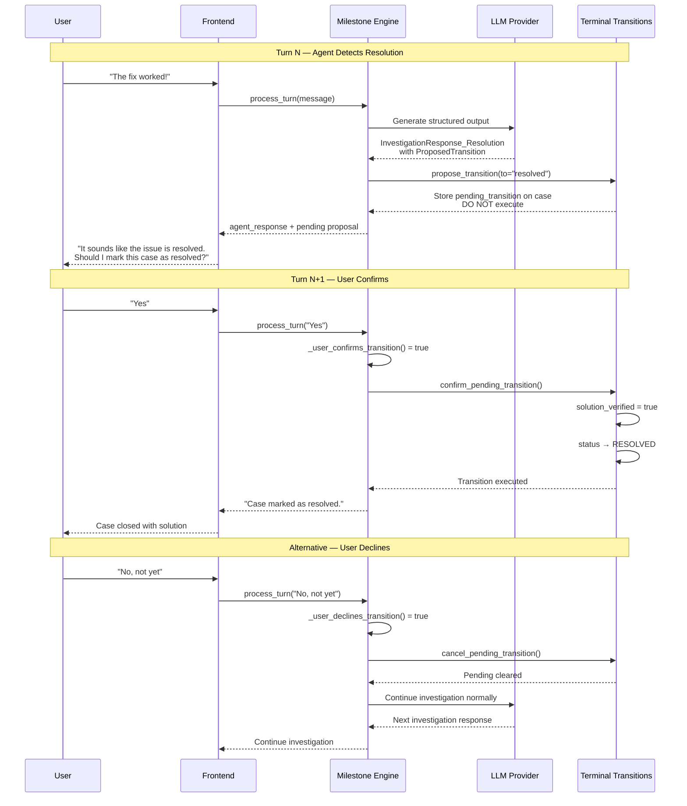
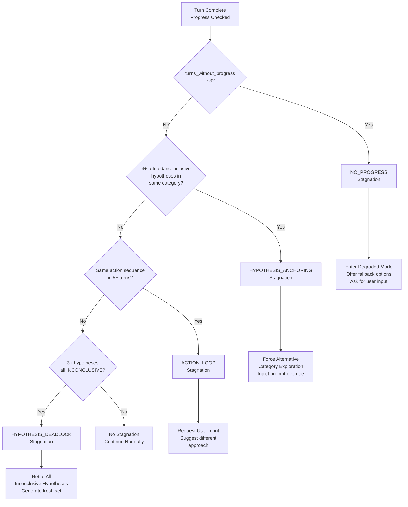

# Opportunistic Investigation Framework

## Executive Summary

This document defines FaultMaven's investigation architecture using an **opportunistic approach** where the agent completes tasks based on data availability rather than following rigid sequential phases.

**Core Principles**:
- Investigation progress tracked via **milestone completions**, not phase transitions
- Agent can complete **multiple milestones in one turn** when sufficient data is available
- **Case status** (INQUIRY/INVESTIGATING/RESOLVED/CLOSED) provides user-facing lifecycle state
- **Investigation stages** (Understanding/Diagnosing/Resolving) provide optional progress detail
- Hypothesis testing is **optional exploration**, not a required workflow step

---

## Document Structure

This specification is organized into focused documents:

| Document | Contents |
|----------|----------|
| **[Investigation Data Models](./investigation-data-models.md)** | Core data structures: CaseStatus, InvestigationProgress, Evidence, Hypothesis, Solution, DegradedMode |
| **[Investigation Lifecycle Logic](./investigation-lifecycle-logic.md)** | State transitions, path routing (MITIGATION_FIRST vs ROOT_CAUSE), turn tracking |
| **[Prompt Engineering Guide](./prompt-engineering-guide.md)** | LLM prompt templates and interaction patterns |
| **[Prompt Templates](./prompt-templates.md)** | Implementation-ready prompt templates |
| **[Prompt Implementation Examples](./prompt-implementation-examples.md)** | Complete integration code examples |

---

## 1. Architectural Philosophy

### 1.1 Core Concept

Investigation is **data-driven and opportunistic**, not phase-constrained.

**The Agent**:
- Checks what data is available
- Completes all tasks for which sufficient data exists
- Records which milestones were completed
- Proceeds naturally without artificial barriers

**Example**:
```
User uploads comprehensive log file containing:
  - Error messages (symptom data)
  - Timestamps (timeline data)
  - Stack trace (root cause data)

Agent in ONE turn:
  ✅ Verifies symptom
  ✅ Establishes timeline
  ✅ Identifies root cause
  ✅ Proposes solution

No sequential phase transitions required.
```

### 1.2 Key Design Decisions

**1. Milestones Track Completion, Not Position**

```python
# Opportunistic approach: Check data availability and completion status
if has_diagnostic_data(case) and not case.progress.root_cause_identified:
    identify_root_cause()
    case.progress.root_cause_identified = True
```

**Key Insight**: Instead of tracking "what phase am I in?", the system checks "what data is available?" and "what's been completed?" This enables opportunistic task completion.

**2. Status is User-Facing Lifecycle State**

Case status answers: **"Is my problem fixed?"**
- INQUIRY: Exploring
- INVESTIGATING: Working on it
- RESOLVED: Fixed (closed WITH solution)
- CLOSED: Done (closed WITHOUT solution)

**3. Stages are Optional Progress Detail**

Investigation stage answers: **"What's the agent doing right now?"**
- Understanding: Verifying the problem
- Diagnosing: Finding root cause
- Resolving: Applying solution

**Note**: The 4-stage internal execution layer (SYMPTOM_VERIFICATION → HYPOTHESIS_FORMULATION → HYPOTHESIS_VALIDATION → SOLUTION) maps to the 3-stage user-facing layer. This is intentional state abstraction - users don't need to know the micro-step the agent is on.

**4. Hypotheses are Optional Exploration Paths (Single-Shot Validation)**

Agent may:
- Identify root cause directly from evidence using **Single-Shot Validation**
- OR generate hypotheses for systematic exploration (when cause unclear)

**Single-Shot Validation Pattern** (preserves audit trail):
When root cause is obvious, agent completes ALL of these in ONE turn:
1. CREATE hypothesis with statement = identified root cause
2. LINK evidence with stance = SUPPORTS
3. SET hypothesis status = VALIDATED
4. SET root_cause_identified = True

This preserves the full audit trail (Evidence → Hypothesis → Resolution) while
achieving the same speed as skipping hypothesis generation.

**5. Knowledge Pre-Check Enables Fast-Track Resolution**

Before formal investigation, agent searches knowledge base for:
- Similar past cases (pattern matching)
- Relevant runbooks
- Known issues for affected services

If high-confidence match found (>70%), agent offers known solution first.
If user confirms it works → Case goes directly from INQUIRY to RESOLVED (Fast-Track)

---

## 2. Investigation Process Flow

This section provides comprehensive workflow diagrams of FaultMaven's proprietary investigation engine — the reasoning core that replaces generic orchestration frameworks (e.g., LangGraph) with a purpose-built, milestone-driven investigation architecture.

### 2.1 End-to-End Turn Processing Flow

The central orchestrator is `MilestoneEngine.process_turn()`. Each user message goes through a multi-stage pipeline that combines intent detection, LLM-powered structured reasoning, evidence processing, hypothesis management, and state validation — all within a single turn.

```mermaid
flowchart TD
    START([User Message Received]) --> INTENT_DETECT

    %% ──────────────────────────────────────────────
    %% PHASE 1: Intent Detection & Early Routing
    %% ──────────────────────────────────────────────
    subgraph PHASE1 [" Phase 1 — Intent Detection "]
        direction TB
        INTENT_DETECT{Intent Type?}
        INTENT_DETECT -->|status_transition<br/>frontend button| EXPLICIT_INTENT[Execute Explicit<br/>Status Transition]
        INTENT_DETECT -->|conversation<br/>or none| NLP_PATTERNS[NLP Pattern<br/>Matching]
        EXPLICIT_INTENT --> SAVE_EARLY[Save & Return<br/>Skip LLM]

        NLP_PATTERNS --> NLP_CHECK{Matches<br/>Terminal Pattern?}
        NLP_CHECK -->|Abandonment<br/>pattern| FORCE_CLOSE[force_close_investigation<br/>→ CLOSED]
        NLP_CHECK -->|Resolution<br/>pattern| PROPOSE_RESOLVE[propose_transition<br/>→ pending]
        NLP_CHECK -->|Ambiguous<br/>close pattern| PROPOSE_AMBIGUOUS[propose_transition<br/>ask clarification]
        NLP_CHECK -->|No match| CONTINUE_NORMAL[Continue to<br/>LLM Pipeline]

        FORCE_CLOSE --> SAVE_EARLY
    end

    SAVE_EARLY --> DONE([Return Response])
    PROPOSE_RESOLVE --> CONTINUE_NORMAL
    PROPOSE_AMBIGUOUS --> CONTINUE_NORMAL

    %% ──────────────────────────────────────────────
    %% PHASE 2: Context Building & LLM Invocation
    %% ──────────────────────────────────────────────
    CONTINUE_NORMAL --> PHASE2

    subgraph PHASE2 [" Phase 2 — Context & LLM Structured Output "]
        direction TB
        KB_SEARCH[KB Search<br/>INQUIRY only] --> CTX_BUILD[Build Investigation<br/>Context]
        CTX_BUILD --> SANITIZE[Sanitize User Input<br/>Prompt Injection Detection]
        SANITIZE --> TOKEN_BUDGET[Apply Token Budget<br/>Provider-Specific Limits]
        TOKEN_BUDGET --> SCHEMA_SELECT{Select Schema<br/>by Status + Stage}

        SCHEMA_SELECT -->|INQUIRY| SCHEMA_INQ[InquiryResponse]
        SCHEMA_SELECT -->|RESOLVED/CLOSED| SCHEMA_TERM[TerminalResponse]
        SCHEMA_SELECT -->|SYMPTOM_VERIFICATION| SCHEMA_VER[InvestigationResponse<br/>_Verification]
        SCHEMA_SELECT -->|HYPOTHESIS_*| SCHEMA_HYP[InvestigationResponse<br/>_Hypothesis]
        SCHEMA_SELECT -->|SOLUTION| SCHEMA_RES[InvestigationResponse<br/>_Resolution]
        SCHEMA_SELECT -->|unknown| SCHEMA_GEN[InvestigationResponse<br/>_General]

        SCHEMA_INQ --> PROMPT_BUILD[Assemble<br/>Status-Based Prompt]
        SCHEMA_TERM --> PROMPT_BUILD
        SCHEMA_VER --> PROMPT_BUILD
        SCHEMA_HYP --> PROMPT_BUILD
        SCHEMA_RES --> PROMPT_BUILD
        SCHEMA_GEN --> PROMPT_BUILD

        PROMPT_BUILD --> LLM_INVOKE[Invoke LLM<br/>with Structured Output]
        LLM_INVOKE --> RETRY{Success?}
        RETRY -->|Error| ERROR_HANDLER[LLM Error Handler<br/>Exponential Backoff]
        ERROR_HANDLER -->|Retryable| LLM_INVOKE
        ERROR_HANDLER -->|Fatal| RAISE_ERROR([Raise<br/>MilestoneEngineError])
        RETRY -->|OK| PARSE_RESPONSE[Parse Structured<br/>Response]
    end

    %% ──────────────────────────────────────────────
    %% PHASE 3: Response Processing & State Updates
    %% ──────────────────────────────────────────────
    PARSE_RESPONSE --> PHASE3

    subgraph PHASE3 [" Phase 3 — Response Processing "]
        direction TB
        POST_PROCESS[Post-Process LLM Response<br/>Pattern-Based Fallback<br/>Evidence Recovery] --> REASONING_VAL{Reasoning-First<br/>Validation}
        REASONING_VAL -->|Invalid: no<br/>justification| REASONING_REJECT[Reject: Log Warning<br/>+ Raise ValueError]
        REASONING_VAL -->|Valid or<br/>no milestones| DISPATCH{Dispatch by<br/>Response Type}

        DISPATCH -->|InquiryResponse| APPLY_INQUIRY[Apply Inquiry Updates<br/>Problem Confirmation<br/>Urgency Assessment<br/>KB Match]
        DISPATCH -->|TerminalResponse| APPLY_TERMINAL[Apply Terminal Updates<br/>Documentation Only]
        DISPATCH -->|Investigation*| APPLY_INVEST[Apply Investigation Updates]

        APPLY_INQUIRY --> INQUIRY_SUB{Auto-Confirm<br/>Urgent Issue?}
        INQUIRY_SUB -->|CRITICAL/HIGH<br/>+ ongoing| AUTO_CONFIRM[Auto-Confirm<br/>Problem Statement]
        INQUIRY_SUB -->|else| AWAIT_CONFIRM[Await User<br/>Confirmation]
        AUTO_CONFIRM --> EVIDENCE_CREATE
        AWAIT_CONFIRM --> EVIDENCE_CREATE
        EVIDENCE_CREATE[Create Evidence<br/>from Classified Submissions]

        APPLY_INVEST --> INVEST_PIPELINE
        subgraph INVEST_PIPELINE [" Investigation Update Pipeline "]
            direction TB
            BLOCKER_CHECK[Check Missing<br/>Critical Data] --> MILESTONE_UPDATE[Update Milestones<br/>True only, never revert]
            MILESTONE_UPDATE --> PATH_TRIGGER{symptom_verified<br/>just completed?}
            PATH_TRIGGER -->|Yes| PATH_SELECT[Determine<br/>Investigation Path<br/>ROOT_CAUSE vs<br/>MITIGATION_FIRST]
            PATH_TRIGGER -->|No| EVIDENCE_ADD
            PATH_SELECT --> EVIDENCE_ADD[Create Evidence<br/>+ Infer Milestone<br/>Attribution<br/>Three-Tier Logic]
            EVIDENCE_ADD --> MILESTONE_VALIDATE[Validate Milestone<br/>Claims Against<br/>Cited Evidence]
            MILESTONE_VALIDATE --> HYPOTHESIS_MGMT[Hypothesis Management<br/>Create / Update /<br/>Link Evidence]
            HYPOTHESIS_MGMT --> SOLUTION_ADD[Add Solutions<br/>if proposed]
            SOLUTION_ADD --> OUTCOME[Determine<br/>Turn Outcome]
        end
    end

    %% ──────────────────────────────────────────────
    %% PHASE 4: Post-Processing & Housekeeping
    %% ──────────────────────────────────────────────
    EVIDENCE_CREATE --> PHASE4
    APPLY_TERMINAL --> PHASE4
    OUTCOME --> PHASE4

    subgraph PHASE4 [" Phase 4 — Post-Processing & Housekeeping "]
        direction TB
        DIAG_REASON[Validate Diagnostic<br/>Reasoning Quality] --> PROGRESS_CHECK{Progress<br/>Made?}
        PROGRESS_CHECK -->|Yes| RESET_STAGNATION[Reset<br/>turns_without_progress = 0]
        PROGRESS_CHECK -->|No| INC_STAGNATION[Increment<br/>turns_without_progress]

        RESET_STAGNATION --> AUTO_TRANSITIONS
        INC_STAGNATION --> AUTO_TRANSITIONS

        AUTO_TRANSITIONS{Check Automatic<br/>Transitions}
        AUTO_TRANSITIONS -->|Pending transition<br/>+ user confirms| CONFIRM_TRANSITION[Execute Terminal<br/>Transition<br/>User-Agent Handshake]
        AUTO_TRANSITIONS -->|INQUIRY +<br/>decided_to_investigate| TRANSITION_INVEST[Transition →<br/>INVESTIGATING]
        AUTO_TRANSITIONS -->|KB match<br/>confirmed| FAST_TRACK[Fast-Track →<br/>RESOLVED]
        AUTO_TRANSITIONS -->|LLM proposed<br/>transition| STORE_PENDING[Store Pending<br/>Transition]
        AUTO_TRANSITIONS -->|No transition| HYPOTHESIS_HOUSE

        CONFIRM_TRANSITION --> HYPOTHESIS_HOUSE
        TRANSITION_INVEST --> HYPOTHESIS_HOUSE
        FAST_TRACK --> HYPOTHESIS_HOUSE
        STORE_PENDING --> HYPOTHESIS_HOUSE

        HYPOTHESIS_HOUSE[Hypothesis<br/>Housekeeping<br/>Decay + Anchoring<br/>Detection] --> METRICS[Calculate Progress<br/>Metrics + Momentum]
        METRICS --> WORKING_CONC[Generate Working<br/>Conclusion]
        WORKING_CONC --> STATE_VAL[Validate State<br/>Consistency]
        STATE_VAL --> STAGNATION_CHECK{Stagnation<br/>Detected?}
        STAGNATION_CHECK -->|No progress ≥3 turns<br/>Category anchoring<br/>Action loop<br/>Hypothesis deadlock| BREAKOUT[Execute Breakout<br/>Action + Enter<br/>Degraded Mode]
        STAGNATION_CHECK -->|No| RECORD_TURN
        BREAKOUT --> RECORD_TURN[Record Turn<br/>Progress]
        RECORD_TURN --> SAVE_CASE[Save Case<br/>to Repository]
    end

    SAVE_CASE --> DONE
    REASONING_REJECT --> DONE
```



### 2.2 Case Lifecycle State Machine

The case lifecycle is a state machine with four statuses. Non-terminal transitions are automatic (system-driven); terminal transitions require the User-Agent Handshake pattern.



### 2.3 Single-Turn Processing Pipeline

A detailed view of what happens within a single turn of the investigation engine, showing the data flow between the Milestone Engine components.



### 2.4 Hypothesis Lifecycle

Hypotheses follow a strict lifecycle with evidence-based confidence scoring and stagnation decay.



### 2.5 Evidence Classification & Milestone Attribution

Evidence flows through a single-phase creation pipeline with three-tier milestone attribution.



### 2.6 User-Agent Handshake for Terminal Transitions

All irreversible state transitions (RESOLVED, CLOSED) require explicit user confirmation through the User-Agent Handshake pattern. This prevents the LLM from unilaterally closing investigations.



### 2.7 Stagnation Detection & Recovery

When investigation progress stalls, the stagnation detector identifies the pattern and the breaker applies a recovery strategy.



---

## 3. UI/UX Design

### 3.1 Primary Display: Case Status

```python
def render_case_header(case: Case) -> str:
    """Primary UI shows STATUS"""

    status_display = {
        CaseStatus.INQUIRY: {
            "label": "💬 Exploring",
            "description": "Discussing the problem",
            "color": "blue"
        },
        CaseStatus.INVESTIGATING: {
            "label": "🔍 Investigating",
            "description": "Working on finding and fixing the issue",
            "color": "yellow"
        },
        CaseStatus.RESOLVED: {
            "label": "✅ Resolved",
            "description": "Problem fixed (closed with solution)",
            "color": "green"
        },
        CaseStatus.CLOSED: {
            "label": "📦 Closed",
            "description": f"Closed without solution ({case.closure_reason})",
            "color": "gray"
        }
    }

    info = status_display[case.status]

    # Stage as secondary detail (only for INVESTIGATING)
    stage_detail = ""
    if case.status == CaseStatus.INVESTIGATING and case.current_stage:
        stage_labels = {
            InvestigationStage.UNDERSTANDING: "Understanding the problem",
            InvestigationStage.DIAGNOSING: "Diagnosing the cause",
            InvestigationStage.RESOLVING: "Applying solution",
        }
        stage_detail = f"\n  {stage_labels[case.current_stage]}"

    return f"""
┌─────────────────────────────────────────────┐
│ Status: {info['label']}                     │
│ {info['description']}                       │
{stage_detail}
│                                             │
│ Turn {case.current_turn} | {format_time_ago(case.updated_at)}
└─────────────────────────────────────────────┘
"""
```

---

## 4. Complete Examples

### 4.1 One-Turn Resolution

```python
user_message = """
My API is timing out. Attached error.log showing NullPointerException
at line 42 starting at 14:23 UTC. We deployed v2.1.3 at 14:20 UTC.
"""

def agent_turn_1(case: Case):
    # Complete MULTIPLE milestones in one turn
    case.progress.symptom_verified = True
    case.progress.scope_assessed = True
    case.progress.timeline_established = True
    case.progress.changes_identified = True
    case.progress.root_cause_identified = True
    case.progress.root_cause_confidence = 0.95
    case.progress.solution_proposed = True

    return """
**Investigation Complete** (1 turn)

✅ Symptom: NullPointerException causing API timeouts
✅ Timeline: Started 14:23 UTC (3 min after v2.1.3 deploy)
✅ Root cause: Missing null check at line 42 in UserService.java

**Recommended Solutions**:
1. IMMEDIATE: Rollback to v2.1.2
2. LONG-TERM: Add null check at line 42

Would you like to proceed with rollback?
"""
```

### 4.2 Status Lifecycle Example

```python
# Turn 1: Inquiry
case.status = CaseStatus.INQUIRY

# Turn 3: User decides to investigate
case.status = CaseStatus.INVESTIGATING  # Automatic transition

# Turns 4-15: Investigation
case.progress.symptom_verified = True
case.progress.root_cause_identified = True
case.progress.solution_applied = True

# Turn 17: Solution verified
case.progress.solution_verified = True
case.status = CaseStatus.RESOLVED  # Automatic transition to TERMINAL
case.resolved_at = datetime.now()
case.closed_at = datetime.now()
case.closure_reason = "resolved"

# Case is now TERMINAL - no further processing
```

### 4.3 Closed Without Solution

```python
# User abandons investigation
user: "Need to escalate to senior engineer. Close this case."

case.status = CaseStatus.CLOSED  # Transition to TERMINAL
case.closed_at = datetime.now()
case.closure_reason = "escalated"

# Case is now TERMINAL - no further processing
```

---

## Quick Reference

### Case Statuses

| Status | Description | Terminal? |
|--------|-------------|-----------|
| `INQUIRY` | Pre-investigation exploration | No |
| `INVESTIGATING` | Active formal investigation | No |
| `RESOLVED` | Closed WITH solution | Yes |
| `CLOSED` | Closed WITHOUT solution | Yes |

### Resolution Paths

| Path | Description | Transitions |
|------|-------------|-------------|
| **Standard** | Full investigation | INQUIRY → INVESTIGATING → RESOLVED |
| **Fast-Track** | Known issue from KB | INQUIRY → RESOLVED (skips INVESTIGATING) |
| **Mitigation + RCA** | Stop bleeding, then find root cause | INQUIRY → INVESTIGATING (Mitigation → RCA) → RESOLVED |
| **Mitigation Only** | Stop bleeding, user satisfied | INQUIRY → INVESTIGATING (Mitigation) → RESOLVED |
| **Abandoned** | No solution found | INQUIRY/INVESTIGATING → CLOSED |

### Investigation Paths

| Path | Mitigation | Use When |
|------|------------|----------|
| `MITIGATION_FIRST` | Applied during stages 1-2; user then chooses RCA or close | ONGOING + HIGH/CRITICAL urgency |
| `ROOT_CAUSE` | After RCA complete | HISTORICAL + LOW/MEDIUM urgency |
| `USER_CHOICE` | User decides | Ambiguous cases |

### Milestones

| Category | Milestones |
|----------|------------|
| Verification | `symptom_verified`, `scope_assessed`, `timeline_established`, `changes_identified` |
| Investigation | `root_cause_identified` |
| Resolution | `solution_proposed`, `solution_applied`, `solution_verified` |
| Mitigation | `mitigation_applied` (opportunistic, during stages 1-2) |

### Evidence Stances

| Stance | Meaning | Use With |
|--------|---------|----------|
| `SUPPORTS` | Evidence supports hypothesis | `stance_confidence` 0.0-1.0 |
| `REFUTES` | Evidence contradicts hypothesis | `stance_confidence` 0.0-1.0 |
| `NEUTRAL` | Evidence neither supports nor refutes | — |
