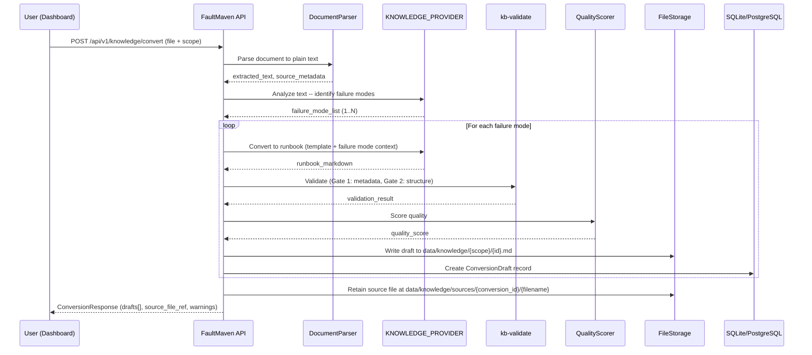
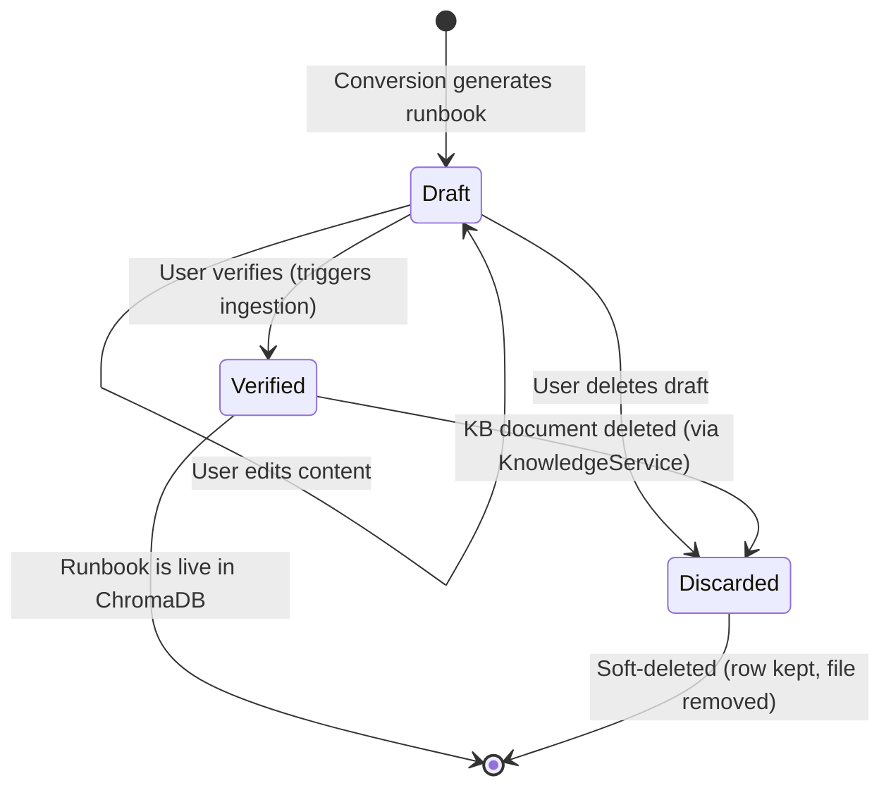

# Runbook Conversion (Document + Case Sources)

**Document Type:** Feature Specification
**Version:** 2.0
**Status:** Implemented
**Date:** 2026-03-26

---

## Executive Summary

This specification defines the runbook conversion feature that generates standardized runbook files from two sources:

1. **Document-to-runbook**: Uploaded documents (PDF, DOCX, TXT, Markdown, HTML) are analyzed for failure modes and converted to runbooks.
2. **Case-to-runbook**: Resolved investigation cases are converted to runbooks using the root cause, solutions, and evidence collected during the investigation.

Both sources produce output compliant with the [Runbook Content Architecture](./runbook-content-architecture.md) and share the same draft review workflow (edit → verify → ingest).

### Objectives

1. Reduce the manual effort required to populate the Knowledge Base with properly structured runbooks.
2. Enforce the "one runbook = one failure mode" rule automatically by detecting and splitting multi-topic source documents.
3. Maintain quality standards by gating all generated output through the existing `kb-validate` pipeline and quality scorer.
4. Keep generated runbooks as non-searchable drafts until a human explicitly promotes them to `verified` status.
5. Close the knowledge flywheel: a resolved case produces a draft runbook that, once human-verified, re-enters investigation as searchable, self-contained cause→fix units. (The KB cause seeder, which also instantiated them as *structured causal candidates* from an extracted graph record, was removed in fm#1295.) See §6.6 **Flywheel closure**.

### Non-Goals

- Real-time URL scraping or web page fetching. Users save web content to a file before uploading.
- Batch upload UI. Batch conversion is achieved by looping over the single-file API endpoint.
- Automatic ingestion into ChromaDB. Drafts remain outside the vector store until manually verified.

---

## 1. System Architecture

### 1.1 High-Level Flow



### 1.2 Component Diagram

```mermaid
graph TD
    subgraph "Dashboard"
        UI[ConvertDocumentPage]
    end

    subgraph "API Layer"
        EP[POST /knowledge/convert]
        EP2[GET /knowledge/conversions/{id}]
        EP7[GET /knowledge/conversions/by-case/{case_id}]
        EP3[PUT /knowledge/conversions/{id}/drafts/{draft_id}]
        EP4[POST /knowledge/conversions/{id}/drafts/{draft_id}/verify]
        EP5[DELETE /knowledge/conversions/{id}/drafts/{draft_id}]
    end

    subgraph "Domain Services"
        CS[ConversionService]
        KS[KnowledgeService]
    end

    subgraph "Infrastructure"
        DP[DocumentParser]
        LLM[LLMRouter - KNOWLEDGE_PROVIDER]
        VAL[RunbookValidator]
        QS[QualityScorer]
        FS[FileStorage]
        VDB[(ChromaDB)]
        DB[(Database)]
    end

    UI --> EP
    UI --> EP2
    UI --> EP3
    UI --> EP4
    UI --> EP5
    EP --> CS
    EP4 --> KS
    CS --> DP
    CS --> LLM
    CS --> VAL
    CS --> QS
    CS --> FS
    CS --> DB
    KS --> VDB
```

### 1.3 Module Placement

The conversion feature is a **domain service** within the knowledge module. It does not own its own database tables -- it creates `KnowledgeItem` records via the existing knowledge infrastructure and stores conversion metadata in a new `conversion_jobs` table.

```
faultmaven/modules/knowledge/
    domain/
        services/
            conversion_service.py      # NEW -- orchestrates the pipeline
            document_parser.py         # NEW -- text extraction from file formats
        models/
            conversion.py             # NEW -- ConversionJob, ConversionDraft models
    api/
        conversion_routes.py          # NEW -- /knowledge/convert endpoints
```

This placement follows the established pattern: conversion is business logic that creates knowledge items through the existing knowledge module contracts.

### 1.4 Two Conversion Sources

Both sources use the same downstream pipeline (LLM generation with canonical template, validation, quality scoring, draft persistence) but differ in input:

| Aspect | Document Source | Case Source |
|--------|----------------|-------------|
| **Entry point** | `POST /knowledge/convert` (file upload) | Copilot RESOLVED-turn *"Generate runbook from this case"* affordance (chat-only; no HTTP endpoint) |
| **Preprocessing** | 6-stage pipeline (extract, PII, triage, etc.) | None (case data is already structured) |
| **Analysis** | LLM identifies failure modes from text | Single failure mode from case root cause |
| **Source material** | Extracted document text | Assembled from case title, description, root cause, solutions, hypotheses, evidence |
| **Tracking** | `source_type = "document"` on ConversionJob | `source_type = "case"`, `case_id` populated |
| **Dashboard** | Drafts tab on KB page | Drafts tab on KB page (case-sourced drafts shown with "from case" badge) |

The `ConversionService.convert_from_case()` method constructs a `FailureModeAnalysis` from the case data and calls `_convert_single_failure_mode()` — the same method used for document-driven conversion. This ensures identical template compliance, validation, and quality scoring.

**Case-data extraction is single-sourced**: the chat-side dispatcher (`MilestoneEngine._handle_runbook_creation` — the only live case→runbook trigger) builds the `CaseConversionRequest` via the `CaseConversionRequest.from_case(case, scope=...)` factory in `faultmaven/modules/knowledge/domain/models/conversion.py`, never via inline extraction. A static guard test (`TestCaseConversionUsesFactory`) pins this so a future regression can't reintroduce a parallel extraction path.

**One trigger path for the Case Source — chat-initiated (Copilot) only.** On the RESOLVED ack-turn, the agent emits a DECIDE *"Generate runbook from this case"* suggestion (shown iff `runbook_conversion_ready`, §1.1). Clicking submits the precomposed payload, which routes via exact-match dispatch in `_process_terminal_turn` to `_handle_runbook_creation`. That handler runs the pre-flight gates (content readiness + existing-draft idempotence + similarity dedup) synchronously, then kicks off the conversion pipeline as a fire-and-forget background task (`asyncio.create_task` wrapping `_run_runbook_conversion`). The agent reply returns immediately ("Creating your runbook draft…"). When the background task finishes (success, no-drafts, or exception), it appends a `role="system"` completion message to `case.messages` with the outcome — naming the draft on success, or stating that nothing was saved and pointing at manual authoring in the Dashboard Knowledge Base on no-drafts or exception. The append acquires the per-case lock to avoid interleaving with a concurrent Q&A turn, and notification-write failures are logged but never propagate. Note the asymmetry: the trigger is Copilot-only, but the Copilot drops `role="system"` rows, so the Dashboard is the notification's only reader and the notices are written for that surface. See `investigation-lifecycle-logic.md §1.7.3` for the chat-side flow in full.

There is **no Dashboard-initiated case→runbook path**: the Dashboard is view-only for case runbooks, and the former `POST /knowledge/convert-from-case` endpoint was removed in Phase 5.1 (it was dead — it 503'd in production because nothing wired `app.state.case_repository`).

**Case conversion lookup**: `GET /knowledge/conversions/by-case/{case_id}` returns the conversion job and drafts for a specific case (used by the Dashboard Runbook tab for viewing).

### 1.1 Soundness gate: only an authority-grounded cause may seed the KB (§7)

Auto-converting a case into a runbook seeds *reusable* knowledge, so it carries the first soundness guarantee (NO INCORRECT CONCLUSION) one step further than a single investigation: a confidently-wrong cause that becomes a runbook can mislead every future case that retrieves it. Both case-sourced paths therefore gate on a single assurance grade before any conversion runs.

`grade_cause_assurance(case)` (in `faultmaven/core/investigation/cause_assurance.py`) classifies the case's identified cause into one of three mutually-exclusive grades:

| Grade | Meaning | Convertible? |
|-------|---------|--------------|
| `CONFIRMED` | ≥1 VALIDATED root borne out by a **counterfactual confirmation** — a SUPPORTS evidence link backed by a `causal_absence_evidence` row on that root (the cause was removed and the problem went with it; M2 gone⇒gone). | **Yes** |
| `MECHANISTIC` | ≥1 VALIDATED root (empirical rung evidence or a deductive derivation), but none counterfactually confirmed. | No |
| `NO_ROOT` | No VALIDATED root at all — a bare `RootCauseConclusion` is LLM prose with zero causal graph. | No |

Only `CONFIRMED` clears the bar. Validation method never raises the grade — a deductive derivation rests on model-mediated refutations plus an asserted-exhaustive differential, so it stays `MECHANISTIC` without the confirmation. The two held grades are distinguished in the user-facing copy for *different* reasons (confirm the cause vs. identify one).

**One canonical predicate.** The grade is one input to a single source-of-truth predicate, `runbook_conversion_ready(case)` (in `cause_assurance.py`): a case is convertible iff it has a verified problem definition **and** a `CONFIRMED` cause with a populated `RootCauseConclusion` record **and** an actionable solution. Every case→runbook gate defers to it, so the offer boundary and the enforcement boundary cannot drift (#698): the RESOLVED offer affordance (`_runbook_suggestion`) is shown iff the predicate holds — identical to the boundary `assess_runbook_readiness` treats as `NOT_SUITABLE` — so a case is never offered-then-denied. The grade half enforces soundness (no confidently-wrong cause becomes reusable knowledge); the problem-definition and actionable-solution halves enforce that the runbook won't be a shell the LLM has to fabricate content for.

**Actionable solution means a fix the user executed, not one that was merely floated.** A resolved case accumulates every fix the agent proposed in `case.solutions`, including offers that were replaced before the user ran them and proposals the engine refused as fixes. The engine never stamps per-`Solution` lifecycle fields (`applied_at`/`verified_at`/`effectiveness` are unset) — the live signal is the `ProposedAction` a solution is co-created with (same `description`/`commands`). `classify_solution_outcome(solution, proposed_actions)` (in `case/domain/models.py`) reads its `state`/`action_type`:

- `APPLIED` — an `accepted` (executed), actionable action (`SOLUTION`/`MITIGATION`, not a downgraded `DIAGNOSTIC`).
- `FAILED` — never executed or refused: `superseded`/`rejected` (replaced while pending, never run), **or** engine-downgraded to `DIAGNOSTIC` (refused as a fix).
- `PROPOSED` — no resolved matching action (pending or uncorrelated); surfaced but flagged unconfirmed.

**Deliberate limit.** `accepted` means the user *executed* the fix, not that it *worked* (that is the case-level `solution_verified` / the resolution itself), and the engine records no per-fix success signal. An executed fix that failed is indistinguishable from one step of a compound remediation — both are `accepted`, neither is superseded — so the classifier does **not** infer failure from ordering (e.g. "a later `SOLUTION` exists, therefore the earlier executed fix failed"). Doing so would wrongly drop real remediation and could block a legitimate conversion. Excluding only the unambiguous never-executed/refused cases keeps the guarantee one-directional: a never-run fix is never laundered in, and a fix the user actually ran is never dropped.

This drives two guards against **solution laundering** (a never-run fix's commands surfacing verbatim as a runbook's remediation): (1) `has_actionable_solution` ignores `FAILED` solutions, so a case whose only actionable fixes were never executed is not convertible; (2) `CaseConversionRequest.from_case` **drops** `FAILED` solutions from the source material and outcome-tags the survivors (`Outcome: applied` / `Outcome: proposed`), ordered executed-first, so the conversion prompt treats fixes the user ran as remediation material and unconfirmed proposals as candidates. A case with no compliance chain (e.g. a stub) classifies its solutions `PROPOSED` and surfaces them all, preserving the prior behavior.

**Case→runbook is chat-initiated only.** There is no case-conversion HTTP endpoint (the dead `POST /knowledge/convert-from-case`, which 503'd in production because nothing wired `app.state.case_repository`, was removed in Phase 5.1). The Dashboard is view-only for case runbooks. The single live trigger is the *"Generate runbook from this case"* DECIDE suggestion on RESOLVED turns; **acting on it** routes through `_handle_runbook_creation`, which runs `evaluate_runbook_suggestion` → `assess_runbook_readiness` (the predicate above) and, on a non-convertible case, returns `NOT_READY` with **no draft side effect**.

**Idempotence (unique runbook per case).** Before generating, both the chat handler and — authoritatively — the service funnel (`_convert_from_case_impl`) call `get_conversion_by_case`: a case that already produced a **live** draft (`DRAFT`/`VERIFIED`) is refused with `CASE_RUNBOOK_EXISTS`, so the same case never yields a second runbook. A case whose only prior drafts were **discarded** (or whose prior attempt failed with no drafts) is free to regenerate. The in-flight lock in `convert_from_case` covers the concurrent double-fire race; this persisted-job check covers the sequential repeat. The funnel additionally rejects a request with no root-cause text (`MISSING_ROOT_CAUSE`) as defense-in-depth — a runbook with no root cause is not reusable knowledge.

**Provenance-based uniqueness (across cases) — removed with the KB cause seeder (fm#1295 step 4b); the similarity dedup below is the only cross-case tier. Kept here as the record of what the tier did:** The same-case idempotence check above is the narrow backstop; the broader axis is *"don't regenerate a runbook the case was resolved by **applying**."* When a case is resolved by validating a cause the KB cause seeder planted from an existing runbook, generating a runbook from it would only duplicate that runbook. `confirmed_root_seed_origin(case)` (in `kb_cause_seeder.py`) reads the direct provenance signal: the runbook the case's **CONFIRMED** root cause was seeded from, keyed on that root's distinct-cause **cluster** (`distinct_cause_clusters`) — not "does any seed exist," so seeded candidates the investigation *refuted* while resolving a different, self-discovered cause never suppress a legitimate offer. REFUTED roots are excluded before clustering: a seed the case's failed fixes disproved was, by definition, *not* what resolved the case, so it can never claim the resolution (this also honors the descendant walk's never-REFUTED-endpoint precondition, preventing a refuted seed from poisoning a deeper confirmed root's cluster). Two gates read it:

- The **offer gate** (`_runbook_suggestion`) suppresses the *"Generate runbook"* affordance when the confirmed cause was seeded — closing the offered-then-refused drift (#695) at the offer boundary, cheaply and synchronously, rather than only at action time.
- The **action handler** (`_handle_runbook_creation`, Step 0) short-circuits before the async embedding-similarity dedup with a message naming the covering runbook (via `KnowledgeService.get_runbook_title`) — a direct, certain "you applied runbook X" signal is cheaper and sharper than an embedding search.

It was a **cheap sync tier ABOVE** the similarity dedup, not a replacement for it: known false-negatives (a reused node the removed seeder never restamped, a benign-dedup overlap, a retrieval miss) still fall through to `evaluate_runbook_suggestion`'s similarity check, whose `SIMILAR_FOUND` verdict (≥ 0.70 best-chunk match) stops the turn and offers the choice — stated as overlap, never as coverage; a draft is created only on explicit "generate anyway" confirmation (see `runbook-dedup.md`). It is a **knowledge-lifecycle decision, not a safety gate** — a wrong answer only yields a missing or redundant affordance, never an incorrect conclusion — and the manual `POST /knowledge/runbooks/create` escape hatch stays open for a user who wants a distinct runbook anyway. Because it reads seed origin, `confirmed_root_seed_origin` is the **single named exception** the seeder's provenance-blindness invariant carves out, permitted in exactly the offer module and nowhere else (see `kb-cause-seeder.md`).

> **Rejected alternative:** an earlier gate keyed on the *negative* predicate "cause validated only by fallback support." It returned False for the `NO_ROOT` case (no validated root is not "fallback-only"), so a pure-prose `RootCauseConclusion` slipped through. Gating on the positive top grade closes that hole — a record with no validated root is graded `NO_ROOT`, never `CONFIRMED`.

---

## 2. Preprocessing Pipeline

Before the source document reaches the LLM, it passes through a preprocessing pipeline that extracts text, removes noise, enforces size limits, checks for sensitive content, and triages non-actionable documents. This pipeline runs entirely server-side — the user uploads a file and receives either converted drafts or a rejection with explanation.

### 2.1 Pipeline Flow

```text
Upload (file + scope + metadata)
  │
  ├── 1. Format Extraction
  │     PDF/DOCX/HTML → plain text with structure preserved
  │     Markdown/TXT → pass through
  │     Reuse existing extractors from faultmaven/modules/preprocessing/
  │
  ├── 2. Content Cleanup
  │     Strip: navigation boilerplate, cookie banners, sidebars
  │     Strip: table of contents (redundant with headings)
  │     Strip: marketing/sales content ("Try our enterprise plan!")
  │     Strip: page numbers, copyright notices, revision history
  │     Strip: embedded image references (LLM can't see them)
  │     Collapse: excessive whitespace, repeated blank lines
  │     Preserve: headings, lists, code blocks, tables (structural elements)
  │
  ├── 3. Sensitive Content Scan
  │     Run Presidio + regex detection (same as evidence pipeline)
  │     Detect: API keys, credentials, private keys, DB connection strings
  │     Action: Redact and log what was removed
  │     Warning: "N sensitive items were redacted. Redacted commands may be
  │              incomplete in the generated runbook. Review before verifying."
  │
  ├── 4. Size Check (hard limit)
  │     Measure: token count (tiktoken or model-appropriate tokenizer)
  │     Limit: 30,000 tokens (~120K chars)
  │     If under limit: pass through
  │     If over limit: REJECT with HTTP 413 Payload Too Large
  │       → "Document contains {actual} tokens (limit: 30,000).
  │          Please split the document into smaller, focused chapters
  │          and convert each one separately."
  │     No silent truncation — truncation causes silent data loss
  │     where failure modes at the end of the document are never
  │     detected, and the user has no way to know.
  │
  ├── 5. Source Metadata Extraction
  │     Capture: original filename, file size, format, page count (PDF),
  │              word count, detected language, extraction timestamp
  │     Purpose: feeds into Sources section of generated runbook and
  │              ConversionJob record for provenance tracking
  │
  └── 6. Content Triage (CLASSIFIER_PROVIDER)
        Send only the FIRST 2,000 tokens to the classifier (introduction,
        abstract, and table of contents are always sufficient to determine
        document type). Full document is never sent — classifiers often
        have small context windows (8K) and the cost is wasted.
        Prompt: "Does this document contain troubleshooting procedures,
        diagnostic steps, error resolution, or incident response content?"
        Response: { is_actionable: bool, confidence: float, reason: str }
        If not actionable (confidence > 0.8):
          → Reject with: "This document does not appear to contain
             troubleshooting content. The conversion pipeline produces
             runbooks from diagnostic procedures, incident reports,
             vendor troubleshooting guides, or postmortems."
        If uncertain (confidence ≤ 0.8):
          → Proceed with warning: "This document may not contain
             sufficient troubleshooting content. Generated runbooks
             may have incomplete sections."
```

### 2.2 Format Extraction Details

| Format | Extractor | Structure Preservation | Notes |
|--------|-----------|----------------------|-------|
| PDF | `PyPDF2` / `pdfplumber` | Tables extracted as markdown tables, headings from font size heuristics | Multi-column layouts may need reflow |
| DOCX | `python-docx` | Headings, lists, tables preserved as markdown | Embedded images stripped |
| HTML | `BeautifulSoup` | `h1-h6` → markdown headings, `pre/code` → fenced blocks, `table` → markdown tables, `ul/ol` → lists | Strip `nav`, `footer`, `aside`, `script`, `style` tags |
| Markdown | Pass-through | Full structure preserved | Strip HTML comments |
| TXT | Pass-through | No structure | Best-effort heading detection (ALL CAPS lines, underlined lines) |

The existing extractors in `faultmaven/modules/preprocessing/` handle PDF, DOCX, and unstructured text. HTML extraction exists in the page capture pipeline (`source_type="page_capture"` branch). These should be reused — the conversion pipeline calls the same extraction functions, not new implementations.

### 2.3 Content Cleanup Rules

The cleanup step removes content that would waste tokens and dilute embeddings without contributing to runbook quality:

**Always remove:**
- Repeated headers/footers (detected by identical text appearing on multiple pages)
- Navigation elements (`<nav>`, breadcrumbs, sidebar menus)
- Cookie/privacy banners
- "Last updated by..." revision metadata (we capture this in frontmatter instead)
- Empty sections (heading with no content before next heading)

**Never remove:**
- Code blocks (even if they look like boilerplate — the LLM decides relevance)
- Tables (often contain the most useful content: error codes, parameters, thresholds)
- Inline error messages or log excerpts
- URLs (potential sources for the Sources section)

### 2.4 Sensitive Content Handling

The sensitive content scan runs the same detection layers as the evidence pipeline:

- **Regex layer**: API keys, AWS keys, JWTs, private keys, DB connection strings, passwords
- **Presidio layer**: Credit cards, SSNs, emails, phone numbers (if present in the source doc)

Redacted content is replaced with `[REDACTED:{type}]` markers. The LLM sees these markers and can note in the runbook that specific values need to be filled in by the user.

The scan produces a `redaction_report` included in the `ConversionResponse`:

```json
{
  "redactions": [
    { "type": "api_key", "count": 2, "context": "Found in code blocks" },
    { "type": "db_connection_string", "count": 1, "context": "Found in configuration example" }
  ],
  "warning": "3 sensitive items were redacted. Review generated runbooks for [REDACTED] placeholders."
}
```

### 2.5 Size Limit Rationale

The 30,000-token limit is chosen to leave headroom for the LLM's system prompt (~2K tokens for the template), the analysis response, and safety margin. This accommodates most troubleshooting guides (typically 5-20 pages).

**Hard rejection, not silent truncation.** If a document exceeds 30K tokens, the pipeline returns HTTP 413 with a clear instruction to split the document. Silent truncation is rejected as a design option because:

1. **Silent data loss** — Failure modes described later in the document are never detected, and the user has no indication this happened.
2. **False completeness** — The user believes the entire document was processed, leading to incomplete KB coverage.
3. **User agency** — The user knows their document better than any heuristic. They can split it into focused chapters that each convert cleanly.

For very large documents (vendor manuals, comprehensive guides), the recommended workflow is: split by chapter or topic → convert each chapter separately → review and merge if needed.

### 2.6 Integration with ConversionService

The preprocessing pipeline is encapsulated in a `DocumentPreprocessor` class:

```python
class DocumentPreprocessor:
    """Preprocesses uploaded documents before LLM conversion."""

    async def preprocess(
        self,
        file_path: Path,
        file_format: str,
    ) -> PreprocessingResult:
        """
        Returns:
            PreprocessingResult with:
              - extracted_text: cleaned, size-managed text
              - source_metadata: filename, format, word count, etc.
              - redaction_report: what sensitive content was removed
              - triage_result: is_actionable, confidence, reason
              - warnings: list of user-facing warnings
              - is_rejected: True if content triage says not actionable
              - rejection_reason: explanation if rejected
        """
```

The `ConversionService` calls `DocumentPreprocessor.preprocess()` as the first step. If `is_rejected` is True, it returns immediately with the rejection reason. Otherwise, it passes `extracted_text` to the analysis and conversion LLM calls.

---

## 3. KNOWLEDGE_PROVIDER Capability

### 3.1 Definition

A new LLM capability for knowledge extraction and content transformation tasks. These tasks require strong instruction-following for structured output (template compliance), content analysis (failure mode detection), and technical writing (producing actionable runbook sections).

### 3.2 Settings Integration

Add to `LLMSettings` in `faultmaven/config/settings.py`:

```python
class LLMSettings(BaseSettings):
    # Existing providers
    provider: LLMProvider = Field(...)
    multimodal_provider: Optional[LLMProvider] = Field(default=None)
    synthesis_provider: Optional[LLMProvider] = Field(default=None)
    classifier_provider: Optional[LLMProvider] = Field(default=None)
    code_provider: Optional[LLMProvider] = Field(default=None)
    da_provider: Optional[LLMProvider] = Field(default=None)

    # NEW
    knowledge_provider: Optional[LLMProvider] = Field(default=None)
```

Environment variable: `KNOWLEDGE_PROVIDER`

Getter method (follows established pattern):

```python
def get_knowledge_provider(self) -> LLMProvider:
    return self.knowledge_provider or self.provider
```

### 3.3 Model Selection per Provider

Each provider has an **optional** per-task knowledge-model override in `LLMSettings`, all defaulting to `None`:

```python
# Knowledge transformation models — optional per-task overrides.
# None means "inherit the provider's base model" (see resolution below).
openai_knowledge_model: Optional[str] = Field(default=None)
anthropic_knowledge_model: Optional[str] = Field(default=None)
fireworks_knowledge_model: Optional[str] = Field(default=None)
gemini_knowledge_model: Optional[str] = Field(default=None)
groq_knowledge_model: Optional[str] = Field(default=None)
# ...also cohere_/huggingface_/openrouter_knowledge_model, all default=None
```

Resolution (`_get_model_for_provider_and_task(provider, "knowledge")`): the
per-task override `{PROVIDER}_KNOWLEDGE_MODEL` if set, else the provider's base
`{PROVIDER}_MODEL`, else empty string. There are **no** hardcoded per-provider
knowledge-model defaults — the knowledge task uses the provider's base model
unless an operator sets an explicit override in `.env`.

### 3.4 Routing Rationale

| Task | Why not reuse existing capability |
|------|----------------------------------|
| Failure mode analysis | Not classification (CLASSIFIER) -- requires reading comprehension and domain knowledge |
| Template-compliant generation | Not synthesis (SYNTHESIS) -- requires long-form structured writing, not fast JSON |
| Technical content transformation | Not code (CODE) -- not generating executable code, generating technical documentation |

The knowledge provider should be pointed at a model with strong instruction-following (Anthropic Claude or OpenAI GPT-class) because template compliance is the critical quality dimension. Since the knowledge task inherits the provider's base model by default, choose the base `{PROVIDER}_MODEL` (or set an explicit `{PROVIDER}_KNOWLEDGE_MODEL` override) accordingly. Cheaper models can be tested but are not recommended.

### 3.5 Model Resolution in ConversionService

The `ConversionService` calls `LLMRouter.route()` with the model resolved from `settings.llm.get_knowledge_model()`:

```python
model = self._settings.llm.get_knowledge_model()
response = await self._llm_router.route(
    messages=messages,
    model=model,
    max_tokens=4096,
    temperature=0.3,  # Low temperature for structured compliance
)
```

---

## 4. LLM Prompt Design

The conversion pipeline makes two distinct LLM calls per source document:

1. **Analysis call** -- identify distinct failure modes in the source document
2. **Conversion call** -- one per failure mode, producing a template-compliant runbook

### 4.1 Analysis Prompt (Failure Mode Detection)

**System message:**

```
You are an expert at analyzing technical documentation to identify distinct
failure modes. A failure mode is a specific way a system can fail, characterized
by unique symptoms, diagnostic procedures, and resolution steps.

Your task: Read the provided document and identify every distinct failure mode
it covers. For each failure mode, provide:
1. A short title (include the technology and failure type)
2. The symptoms or error messages associated with it
3. A brief summary of the resolution approach

Rules:
- If the document covers only ONE failure mode, return exactly one item.
- If the document is purely architectural/conceptual with no failure modes,
  return an empty list and set "is_actionable" to false.
- Do NOT invent failure modes not present in the source material.
- Failure modes must be distinct -- different symptoms OR different resolutions.
```

**Response format** (structured output via `response_format`):

```json
{
  "is_actionable": true,
  "failure_modes": [
    {
      "id": "pg-connection-pool-exhaustion",
      "title": "PostgreSQL Connection Pool Exhaustion",
      "domain": "database",
      "service": "postgresql",
      "symptom_class": ["connection_refused", "latency"],
      "severity": "high",
      "symptoms_summary": "FATAL: too many connections for role...",
      "resolution_summary": "Terminate idle connections, resize pool..."
    }
  ],
  "source_assessment": {
    "content_type": "troubleshooting_guide",
    "actionability_rating": "high",
    "missing_information": ["No verification steps provided"]
  }
}
```

### 4.2 Conversion Prompt (Per Failure Mode)

**System message:**

````
You are a technical writer converting source material into a FaultMaven
runbook. You MUST produce output that exactly matches the template below.
Every section is required. Do not add sections. Do not rename sections.
Do not include commentary, explanations, or meta-text -- only the runbook.

TEMPLATE:
=========

---
id: {kebab-case-id}
title: "{Title -- include failure mode, not just technology}"
domain: {domain}
service: {service}
symptom_class: [{symptom_classes}]
scope: {scope}
tags: [{tags}]
difficulty: {difficulty}
severity: {severity}
version: "1.2"
last_updated: {today_iso}
verified_by: ""
status: draft
---

# Runbook: {Title}

## Symptom Recognition
- Exact alert names, error messages as they appear in logs, metric patterns.
- Be specific: include the actual strings a user would grep for.

## Applicability
- Concrete system/version, required tools, access/permissions.

## Diagnostic Steps

### Step 1: {description}
```{language}
{command}
```
{interpretation guidance: what to look for, what findings mean}

### Step 2: {description}
...

## Causes

### Cause A: {name}
**Statement:** Single declarative sentence stating the single root cause (≤300 chars).
**Chain:**
- root: the root cause (the chain's top node; mirrors Statement)
- s1: intermediate state — the direct effect of the node above
- D: the failure (points at Symptom Recognition; do not re-author it)
**Indicators:**
- root: [Step 1] {observable from Step 1 that confirms the root rung}
- s1: [Step 2] {observable that confirms intermediate state s1}
**Interventions:**
- **remediation** (root): {the durable fix at the root}
  ```{language}
  {durable fix command}
  ```
  **Verification:** Re-run Step N; {what confirms the fix worked}.
- **mitigation** (s1): {a temporary interception — include only if one genuinely exists}
  ```{language}
  {quick fix command}
  ```
  **Risk:** {what could go wrong}. **Duration:** {how long safe}. **Verification:** {cause-specific check}.

### Cause Z: Unidentified
**Statement:** None of the documented causes match the observed evidence.
**Indicators:**
- [Default]
**Interventions:**
- **mitigation** (D): Capture full diagnostic output and consult an SME.
  **Risk:** Diagnostic only. **Duration:** Until SME review. **Verification:** N/A.

## Prevention
- {configuration change to prevent recurrence}
- {monitoring alert to add}

## Sources
- {source_filename} -- primary source document for this runbook

=========

RULES:
1. Every section and sub-field MUST contain content. No empty fields.
2. ## Diagnostic Steps MUST contain fenced code blocks under numbered
   `### Step N: <title>` headers (number, colon, then a short inline title).
3. ## Causes MUST have at least one real ### Cause A subsection AND the fallback
   ### Cause Z: Unidentified.
4. Each ### Cause declares exactly ONE root — never two roots, never an AND-gate.
   Each ### Cause (except Z) needs **Statement**, **Indicators**, and
   **Interventions**; **Chain** is optional (omit it for a simple one-step cause).
   For two co-necessary conditions: when one enables the other, express them as
   sequential Chain rungs; when neither causes the other, fold the second into the
   root Statement.
5. Statement ≤300 characters; each Chain rung ≤300 characters. Hard limits.
6. Each Indicator entry carries a rung ref (`root`, `s1`, …, or `D`) and at least
   one `[Step N]` (N matches an existing Diagnostic Step) or `[Symptom]`; the
   Cause Z fallback uses `- [Default]`.
7. Each Intervention is tagged with exactly one quadrant — `remediation` /
   `defensive_fix` / `mitigation` / `loop_break` — names the rung it targets in
   `(parens)`, and carries a **Verification:**; every `mitigation` also carries
   **Risk** and **Duration**.
8. If source material lacks enough information for a field, write
   "[INSUFFICIENT SOURCE DATA -- manual completion required]".
9. Use the taxonomy values provided. Do not change domain, service, or
   symptom_class.
````

**User message:**

```
Convert the following source material into a runbook for this specific
failure mode:

FAILURE MODE: {failure_mode.title}
DOMAIN: {failure_mode.domain}
SERVICE: {failure_mode.service}
SYMPTOM_CLASS: {failure_mode.symptom_class}
SEVERITY: {failure_mode.severity}
SCOPE: {scope}
SOURCE FILENAME: {original_filename}
TODAY: {iso_date}

--- SOURCE MATERIAL ---
{relevant_excerpt_or_full_text}
--- END SOURCE MATERIAL ---
```

### 4.3 Prompt Design Decisions

| Decision | Rationale |
|----------|-----------|
| Template embedded in system prompt | The LLM sees the exact target format every call. No drift from a separate template file. |
| Low temperature (0.3) | Structured compliance is more important than creative variation. |
| `max_tokens=4096` | A single runbook is typically 1500-3000 tokens. 4096 provides headroom without encouraging verbosity. |
| "[INSUFFICIENT SOURCE DATA]" marker | Prevents LLM hallucination of commands. Visible to the user in the editor. |
| Separate analysis and conversion calls | Analysis needs holistic document understanding. Conversion needs focused, template-compliant generation. Combining them degrades both. |

---

## 5. Multi-Runbook Splitting Logic

### 5.1 Detection Strategy

The analysis LLM call (Section 4.1) identifies failure modes. The splitting logic is:

```python
async def _analyze_and_split(self, text: str, filename: str) -> AnalysisResult:
    """
    Analyze document for failure modes.

    Returns:
        AnalysisResult with failure_modes list.
        - 0 modes: source is not actionable (architectural/conceptual)
        - 1 mode: single runbook conversion
        - N modes: N separate runbook conversions
    """
    response = await self._llm_router.route(
        messages=[
            {"role": "system", "content": ANALYSIS_SYSTEM_PROMPT},
            {"role": "user", "content": f"Analyze this document:\n\n{text}"}
        ],
        model=self._knowledge_model,
        max_tokens=2048,
        temperature=0.2,
        response_format={"type": "json_object"},
    )
    return AnalysisResult.model_validate_json(response.content)
```

### 5.2 Text Routing for Multi-Mode Documents

When multiple failure modes are detected, the conversion prompt receives the **full source text** for each failure mode, not a pre-extracted excerpt. The LLM is instructed to focus on the specified failure mode and extract only the relevant content. This avoids lossy heuristic text splitting.

There is no section-header pre-chunking step: because the preprocessor hard-rejects anything over the 30,000-token limit (§5, §10.2), every document that reaches conversion already fits in context and is passed in full per failure mode.

### 5.3 ID Generation

Runbook IDs are generated deterministically from the failure mode analysis:

```python
def _generate_runbook_id(self, failure_mode: FailureMode) -> str:
    """Generate kebab-case ID from service and failure description."""
    # e.g., "pg-connection-pool-exhaustion"
    base = f"{failure_mode.service}-{failure_mode.title}"
    slug = re.sub(r'[^a-z0-9]+', '-', base.lower()).strip('-')
    # Truncate to 60 chars, ensure uniqueness with short hash if needed
    if len(slug) > 60:
        slug = slug[:55] + '-' + hashlib.md5(slug.encode()).hexdigest()[:4]
    return slug
```

### 5.4 Handling Edge Cases

| Scenario | Behavior |
|----------|----------|
| Document has 0 failure modes (architectural/conceptual) | Return 422 with message: "Source document does not contain actionable failure modes. Runbooks require specific symptoms, diagnostics, and resolution steps." |
| Document has 1 failure mode | Standard single-runbook conversion. |
| Document has 2-5 failure modes | Parallel conversion (asyncio.gather). |
| Document has 6+ failure modes | Sequential conversion to avoid LLM rate limits. Warn user: "Source document is very broad. Consider splitting the source into focused documents for better results." |
| LLM returns duplicate failure modes | Deduplicate by `(service, symptom_class)` tuple before conversion. |

---

## 6. API Contract

### 6.1 Endpoints

| Method | Path | Purpose | Auth |
|--------|------|---------|------|
| `POST` | `/api/v1/knowledge/convert` | Upload document and start conversion | Scoped (see 6.6) |
| `GET` | `/api/v1/knowledge/conversions/{conversion_id}` | Get conversion job status and drafts | Owner only |
| `GET` | `/api/v1/knowledge/conversions` | List user's conversion jobs | Owner only |
| `PUT` | `/api/v1/knowledge/conversions/{conversion_id}/drafts/{draft_id}` | Edit draft content | Owner only |
| `POST` | `/api/v1/knowledge/conversions/{conversion_id}/drafts/{draft_id}/verify` | Promote draft to verified (triggers ingestion) | Scoped (see 6.6) |
| `DELETE` | `/api/v1/knowledge/conversions/{conversion_id}/drafts/{draft_id}` | Delete a draft | Owner only |

### 6.2 POST /api/v1/knowledge/convert -- Request

Multipart form data:

| Field | Type | Required | Description |
|-------|------|----------|-------------|
| `file` | `UploadFile` | Yes | Source document (PDF, DOCX, TXT, MD, HTML) |
| `scope` | `string` | Yes | Target KB tier: `global`, `team`, `personal` |
| `team_id` | `string` | No | Required if scope is `team` |

Allowed MIME types:

```python
CONVERSION_ALLOWED_TYPES = {
    "text/plain",
    "text/markdown",
    "text/html",
    "application/pdf",
    "application/msword",
    "application/vnd.openxmlformats-officedocument.wordprocessingml.document",
}
```

Max file size: Governed by existing `MAX_UPLOAD_SIZE_MB` setting (default 10 MB).

### 6.3 POST /api/v1/knowledge/convert -- Response (201)

```json
{
  "conversion_id": "conv_a1b2c3d4",
  "status": "completed",
  "source_file": {
    "filename": "postgres-troubleshooting.pdf",
    "size_bytes": 45230,
    "content_type": "application/pdf",
    "retained_path": "data/knowledge/sources/conv_a1b2c3d4/postgres-troubleshooting.pdf"
  },
  "analysis": {
    "failure_modes_detected": 3,
    "is_actionable": true,
    "source_assessment": {
      "content_type": "troubleshooting_guide",
      "actionability_rating": "high",
      "missing_information": []
    }
  },
  "drafts": [
    {
      "draft_id": "draft_x1y2z3",
      "runbook_id": "pg-connection-pool-exhaustion",
      "title": "PostgreSQL Connection Pool Exhaustion",
      "scope": "global",
      "status": "draft",
      "validation": {
        "passed": true,
        "errors": [],
        "warnings": ["No external references found"]
      },
      "quality_score": {
        "overall": 72.5,
        "grade": "C",
        "completeness": 85.0,
        "clarity": 70.0,
        "actionability": 65.0,
        "comprehensiveness": 68.0
      },
      "file_path": "data/knowledge/global/pg-connection-pool-exhaustion.md",
      "content_preview": "---\nid: pg-connection-pool-exhaustion\ntitle: ..."
    }
  ],
  "warnings": [],
  "created_at": "2026-03-22T14:30:00Z"
}
```

### 6.4 PUT /api/v1/knowledge/conversions/{id}/drafts/{draft_id} -- Request

```json
{
  "content": "---\nid: pg-connection-pool-exhaustion\ntitle: ...\n(full markdown content)"
}
```

Response: Updated draft object with re-run validation and quality score.

### 6.5 POST .../drafts/{draft_id}/verify -- Response (200)

```json
{
  "draft_id": "draft_x1y2z3",
  "runbook_id": "pg-connection-pool-exhaustion",
  "status": "verified",
  "knowledge_item_id": "ki_abc123",
  "ingested": true,
  "ingested_at": "2026-03-22T15:00:00Z",
  "collection": "faultmaven_kb",
  "chunks_created": 8
}
```

This endpoint:
1. Updates frontmatter `status` from `draft` to `verified` and sets `verified_by` on the file on disk (so chunk metadata carries `status=verified`).
2. (Removed in fm#1295.) Until then this step extracted the v4 `## Causes` graph record from the markdown and stored it as `knowledge_items.metadata["causes"]` for the KB cause seeder; with the seeder gone the record had no reader, and extraction, the record and the chunk cause-letter stamp were retired. The runbook's `## Causes` section still chunks one Cause per chunk, so a verified runbook re-enters investigations as retrievable cause→fix units. See **Flywheel closure** below.
3. Atomically ingests the runbook via `KnowledgeService.ingest_runbook()` — creates the `knowledge_items` row AND writes ChromaDB chunks. If either step fails, the SQL row is rolled back and a 500 is returned; the draft stays in `DRAFT` state.
4. Only after ingestion succeeds, commits `dm.status = VERIFIED`, `verified_at`, `verified_by`, `knowledge_item_id` in `conversion_drafts`.

**Flywheel closure.** A verified case-derived runbook closes the loop the same way a built-in one does: it is ingested, chunked one Cause per chunk, and retrieved into later investigations as prose. The `RunbookValidator` gate (§12.1) is anchored on the same shared parse grammar the toolkit's pack builder uses, so a draft the gate passes is one the toolkit parses identically. (A structural closure existed until fm#1295: on verify, an in-repo extractor turned the `## Causes` section into a `metadata["causes"]` record that the KB cause seeder instantiated as candidate hypotheses, guarded by a golden cross-check against the toolkit's output and a runtime refusal of EXPERIMENTAL-tier records. Seeder, extractor, record and guards were all removed; the design and evidence record is in `docs/archive/2026/09/kb-cause-seeder/`.)

> **Runtime loop scope (owner-aware).** A runbook can only reach an investigation if the engine's KB pre-fetch retrieves it. `_prefetch_kb_context` therefore searches **`global` ∪ the case owner's own `personal` KB** (keyed on `case.user_id`), so a user's own resolved cases — converted to personal-scoped runbooks — surface in that user's *own* future investigations. The personal condition is keyed on the owner's `user_id`, so this preserves strict cross-user isolation: user B's case can never surface user A's personal runbooks. Team-scoped KB is a deliberate inert seam (org/team collaboration is a Cloud-only feature — no team service is wired anywhere today, and case→runbook conversion emits only `personal`-scoped runbooks); when it lands, the owner's team scopes OR into the same filter (mirroring `KnowledgeService.search_documents`).

**Atomicity guarantee (changed 2026-05-26):** The DB status flip to `VERIFIED` is the *last* mutation. Previously the status was committed up-front and ingestion failure left half-state rows (status=verified, knowledge_item_id=NULL) which a subsequent KB-page scan would mis-classify and revert. The new ordering eliminates that drift class. See [`kb-ingestion-architecture.md`](./kb-ingestion-architecture.md) for the full atomicity contract.

**Frontmatter mutation implementation note:** The `.md` file on disk is updated before ingestion using `python-frontmatter` (or `ruamel.yaml`) — not regex substitution, since YAML has edge cases (quoted strings, multiline values) that regex cannot handle reliably. If ingestion subsequently fails, the file's frontmatter retains `status: verified` while the DB row stays in `DRAFT`; this is harmless because the file mutation is idempotent and the next retry uses the same content.

### 6.6 Access Control

| Scope | Who can convert | Who can verify |
|-------|----------------|----------------|
| `global` | Platform admin only | Platform admin only |
| `team` | Team admin only | Team admin only |
| `personal` | Any authenticated user (own KB) | Any authenticated user (own KB) |

Implementation: Reuse existing `require_platform_admin` dependency for global scope. Add `require_team_admin(team_id)` dependency for team scope. Personal scope uses standard auth with user ID scoping.

### 6.7 Error Responses

| Status | Condition | Body |
|--------|-----------|------|
| 400 | Missing required fields | `{"detail": "scope is required"}` |
| 401 | Not authenticated | Standard auth error |
| 403 | Insufficient permissions for scope | `{"detail": "Global KB conversion requires platform admin role"}` |
| 413 | File too large | `{"detail": "File exceeds maximum size of 10MB"}` |
| 415 | Unsupported file type | `{"detail": "Unsupported file type: image/png. Allowed: ..."}` |
| 422 | Document not actionable | `{"detail": "Source document does not contain actionable failure modes..."}` |
| 422 | All drafts failed validation | `{"detail": "Generated runbooks failed quality validation", "validation_errors": [...]}` |
| 500 | LLM failure after retries | `{"detail": "Document conversion failed. Please try again."}` |
| 503 | No LLM provider available | `{"detail": "Knowledge provider is not configured or unavailable"}` |

---

## 7. Pydantic Models

### 7.1 Request/Response Models

Location: `faultmaven/modules/knowledge/domain/models/conversion.py`

> **Illustrative subset of the public conversion API surface** — see the canonical module for the complete set. Other types defined there but not reproduced here include `ConversionErrorCode`, `TriageResult`, `RedactionEntry`, `RedactionReport`, `PreprocessingResult`, and `ConversionError` (used by error handling and the §2.6 `DocumentPreprocessor.preprocess()` return value).

```python
from datetime import datetime
from enum import Enum
from typing import List, Optional
from pydantic import BaseModel, Field


class ConversionStatus(str, Enum):
    PROCESSING = "processing"
    COMPLETED = "completed"
    PARTIAL = "partial"        # Some drafts failed validation
    FAILED = "failed"
    CANCELLED = "cancelled"    # No writer; admitted by the CHECK, so it must
                               # be parseable on read (fm#520)


class DraftStatus(str, Enum):
    """Conversion-workflow state for a draft runbook.

    Distinct from the runbook lifecycle in `runbook-content-architecture.md §5`
    (`draft | in-review | verified | stale | deprecated`). DraftStatus tracks
    a draft inside the conversion job; once `VERIFIED`, the draft is ingested
    as a runbook and adopts the runbook lifecycle (verified → stale → deprecated).
    `DISCARDED` is a conversion-only state — drafts that never become runbooks.
    """

    DRAFT = "draft"
    VERIFIED = "verified"
    DISCARDED = "discarded"


class SourceType(str, Enum):
    """Whether a draft was generated from an uploaded document or a resolved case."""
    DOCUMENT = "document"
    CASE = "case"


class CaseConversionRequest(BaseModel):
    """Carrier for the case-to-runbook flow (§1.4 'Case Source').

    A structured extraction of a RESOLVED Case: case_id, title, description,
    root_cause(+mechanism), solutions, hypotheses/evidence summaries,
    domain/service/symptom_class/severity, tags, and scope.
    """
    case_id: str
    title: str
    description: str
    # ...root_cause, solutions, hypotheses_summary, evidence_summary,
    #    domain, service, symptom_class, severity, tags...
    scope: str = "personal"

    @classmethod
    def from_case(cls, case, scope: str = "personal") -> "CaseConversionRequest":
        """Extract runbook-generation data from a RESOLVED Case domain object.
        Reused by both the API route and the milestone engine."""
        ...


class FailureModeAnalysis(BaseModel):
    id: str
    title: str
    domain: str
    service: str
    symptom_class: List[str]
    severity: str
    symptoms_summary: str
    resolution_summary: str


class SourceAssessment(BaseModel):
    content_type: str
    actionability_rating: str = Field(
        description="low, medium, or high"
    )
    missing_information: List[str]


class AnalysisResult(BaseModel):
    is_actionable: bool
    failure_modes: List[FailureModeAnalysis]
    source_assessment: SourceAssessment


class ValidationResult(BaseModel):
    passed: bool
    errors: List[str]
    warnings: List[str]


class QualityScore(BaseModel):
    overall: float
    grade: str
    completeness: float
    clarity: float
    actionability: float
    comprehensiveness: float


class SourceFileInfo(BaseModel):
    filename: str
    size_bytes: int
    content_type: str
    retained_path: str


class ConversionDraft(BaseModel):
    draft_id: str
    runbook_id: str
    title: str
    scope: str
    status: DraftStatus
    source_type: SourceType = SourceType.DOCUMENT  # Distinguishes document- vs case-driven drafts
    case_id: Optional[str] = None                  # Set when source_type == CASE; powers the
                                                   # ?tab=runbook Dashboard link from a resolved case
    validation: ValidationResult
    quality_score: QualityScore
    file_path: str
    content_preview: str = Field(
        max_length=500,
        description="First 500 chars of generated markdown"
    )
    content: Optional[str] = Field(
        default=None,
        description="Full markdown content, included on detail requests"
    )
    quality_warning: Optional[str] = Field(
        default=None,
        description="Warning if quality score < 50"
    )


class ConversionResponse(BaseModel):
    conversion_id: str
    status: ConversionStatus
    source_file: SourceFileInfo
    analysis: AnalysisResult
    drafts: List[ConversionDraft]
    warnings: List[str]
    created_at: datetime


class DraftUpdateRequest(BaseModel):
    content: str = Field(
        min_length=100,
        description="Full runbook markdown content including frontmatter"
    )


class VerifyResponse(BaseModel):
    draft_id: str
    runbook_id: str
    status: str  # "verified"
    knowledge_item_id: str
    ingested: bool
    ingested_at: Optional[datetime]
    collection: str
    chunks_created: int
```

---

## 8. Dashboard UI Flow

### 8.1 Entry Point

Add a "Convert Document" button to the existing KBPage, next to the existing upload functionality. The button is visible only when the user has write access to the current KB tier.

### 8.2 Conversion Flow (Wireframe-Level)

**Step 1: Upload**

```
+--------------------------------------------------+
|  Convert Document to Runbook(s)                   |
|                                                   |
|  [Drop file here or click to browse]              |
|  Supported: PDF, DOCX, TXT, Markdown, HTML        |
|                                                   |
|  Target KB:  ( ) Personal  ( ) Team  ( ) Global   |
|              [Team selector if Team selected]     |
|                                                   |
|  [Convert]                                        |
+--------------------------------------------------+
```

**Step 2: Processing (shown while API call is in progress)**

```
+--------------------------------------------------+
|  Converting: postgres-troubleshooting.pdf          |
|                                                   |
|  [============================     ] 75%           |
|                                                   |
|  Analyzing document...                             |
|  Found 3 failure modes                             |
|  Generating runbook 2 of 3...                      |
+--------------------------------------------------+
```

Note: The conversion is synchronous from the user's perspective (single API call that blocks until complete). The progress indication is approximate, driven by polling or SSE in a future iteration. V1 uses a spinner with status text.

**Step 3: Review Drafts**

```
+--------------------------------------------------+
|  Conversion Complete: 3 runbooks generated         |
|                                                   |
|  Source: postgres-troubleshooting.pdf (44 KB)      |
|  Assessment: High actionability                    |
|                                                   |
|  +----------------------------------------------+ |
|  | pg-connection-pool-exhaustion    Score: 73/C  | |
|  | Validation: PASSED (2 warnings)               | |
|  | [Edit] [Verify] [Discard]              | |
|  +----------------------------------------------+ |
|  | pg-replication-lag               Score: 68/D  | |
|  | Validation: PASSED (1 warning)                | |
|  | [Edit] [Verify] [Discard]              | |
|  +----------------------------------------------+ |
|  | pg-wal-disk-full                 Score: 45/F  | |
|  | ! Quality below 50 -- source may lack detail  | |
|  | Validation: FAILED (missing code blocks)      | |
|  | [Edit] [Delete]                               | |
|  +----------------------------------------------+ |
+--------------------------------------------------+
```

Verify button is disabled when validation fails. User must edit to fix validation errors first.

**Step 4: Edit (inline markdown editor)**

```
+--------------------------------------------------+
|  Editing: pg-connection-pool-exhaustion            |
|                                                   |
|  [Markdown Editor -- full content]                 |
|                                                   |
|  Validation: PASSED                                |
|  Quality: 73/C                                     |
|                                                   |
|  [Save Draft]  [Verify]  [Cancel]           |
+--------------------------------------------------+
```

On save, the API re-runs validation and quality scoring. The results update in real time.

**Step 5: Verification Confirmation**

```
+--------------------------------------------------+
|  Verify Runbook?                                  |
|                                                   |
|  This will:                                        |
|  - Set status to "verified"                        |
|  - Set verified_by to your username                |
|  - Ingest into ChromaDB (faultmaven_kb collection) |
|  - Make the runbook searchable by the AI           |
|                                                   |
|  [Confirm]  [Cancel]                               |
+--------------------------------------------------+
```

### 8.3 Dashboard Components

| Component | File | Purpose |
|-----------|------|---------|
| `ConvertUpload` | `components/ConvertUpload.tsx` | File selection, scope picker, convert trigger |
| `ConversionResults` | `components/ConversionResults.tsx` | Draft cards with scores and actions |
| `DraftEditor` | `components/DraftEditor.tsx` | Markdown editor with live validation |
| `VerifyConfirmDialog` | Reuse `ConfirmDialog.tsx` | Verification confirmation modal |

### 8.4 API Client Functions

Add to `faultmaven-dashboard/src/lib/knowledge/`:

```typescript
interface ConversionResponse { /* matches API response */ }
interface DraftUpdateRequest { content: string; }
interface VerifyResponse { /* matches API response */ }

export async function convertDocument(
  file: File,
  scope: string,
  teamId?: string
): Promise<ConversionResponse>;

export async function getConversion(
  conversionId: string
): Promise<ConversionResponse>;

export async function updateDraft(
  conversionId: string,
  draftId: string,
  content: string
): Promise<ConversionDraft>;

export async function verifyDraft(
  conversionId: string,
  draftId: string
): Promise<VerifyResponse>;

export async function deleteDraft(
  conversionId: string,
  draftId: string
): Promise<void>;
```

---

## 9. Storage and Lifecycle

### 9.1 File Storage Layout

```
data/knowledge/
    sources/                         # Source files (provenance)
        conv_a1b2c3d4/
            postgres-troubleshooting.pdf
    global/                          # Global KB runbooks
        pg-connection-pool-exhaustion.md    # status: draft (not in ChromaDB)
        pg-replication-lag.md               # status: draft (not in ChromaDB)
    team_{team_id}/                  # Team KB runbooks
        ...
    user_{user_id}/                  # Personal KB runbooks
        ...
```

### 9.2 Database Schema

New table: `conversion_jobs`

| Column | Type | Description |
|--------|------|-------------|
| `id` | `VARCHAR(36)` PK | Conversion job ID (conv_ prefix + UUID) |
| `user_id` | `VARCHAR(36)` FK | User who initiated conversion |
| `organization_id` | `VARCHAR(36)` | Organization context |
| `scope` | `VARCHAR(20)` | Target KB tier |
| `team_id` | `VARCHAR(36)` | Team ID (if scope=team) |
| `status` | `VARCHAR(20)` | processing, completed, partial, failed |
| `source_filename` | `VARCHAR(255)` | Original filename |
| `source_content_type` | `VARCHAR(100)` | MIME type |
| `source_size_bytes` | `INTEGER` | File size |
| `source_path` | `VARCHAR(500)` | Path to retained source file |
| `failure_modes_detected` | `INTEGER` | Number of failure modes found |
| `analysis_result` | `JSON` | Full analysis LLM response |
| `created_at` | `DATETIME` | Job creation time |
| `completed_at` | `DATETIME` | Job completion time |

New table: `conversion_drafts`

| Column | Type | Description |
|--------|------|-------------|
| `id` | `VARCHAR(36)` PK | Draft ID (draft_ prefix + UUID) |
| `conversion_id` | `VARCHAR(36)` FK | Parent conversion job |
| `runbook_id` | `VARCHAR(100)` | Generated runbook ID (kebab-case) |
| `title` | `VARCHAR(255)` | Runbook title |
| `file_path` | `VARCHAR(500)` | Path to draft markdown file |
| `status` | `VARCHAR(20)` | draft, verified, discarded |
| `validation_passed` | `BOOLEAN` | Whether kb-validate passed |
| `validation_errors` | `JSON` | Validation error list |
| `validation_warnings` | `JSON` | Validation warning list |
| `quality_score` | `FLOAT` | Overall quality score |
| `quality_details` | `JSON` | Full quality scorer output |
| `knowledge_item_id` | `VARCHAR(36)` | Set when verified and ingested |
| `created_at` | `DATETIME` | Draft creation time |
| `verified_at` | `DATETIME` | When status changed to verified |
| `verified_by` | `VARCHAR(36)` | User who verified |

### 9.3 Lifecycle State Machine



Key rules:
- **Draft**: File exists on disk. NOT in ChromaDB. NOT searchable by the AI.
- **Verified**: File updated with `status: verified` and `verified_by`. Ingested into ChromaDB. Searchable.
- **Discarded**: Soft-delete. Database row retained (audit trail), `knowledge_item_id` cleared, file removed from disk on next cleanup.
- **No reverse transition**: Once verified, the runbook follows the standard KB lifecycle. It is no longer a "conversion draft."

### 9.4 Single-Owner Principle for Draft Mutations

**`ConversionService` is the sole owner of `conversion_drafts` mutations.** No other service writes directly to the `conversion_drafts` table.

`KnowledgeService.delete_document()` now operates on the `knowledge_items` inventory directly (provenance-gated: built-in → unpublish + vector delete; authored → hard delete + vector delete — see [knowledge-base-architecture.md Storage Architecture](./knowledge-base-architecture.md#storage-architecture)). It does **not** mutate `conversion_drafts`, so the single-owner principle is preserved without a delete-time delegation.

Post-construction wiring in `main.py` gives `KnowledgeService` a reference to `ConversionService` after both are initialised, avoiding circular DI.

### 9.5 Scan Guard

`ConversionService.scan_for_runbooks()` includes a bulk-discard guard: if the reconcile step would mark **every** active draft as discarded (because files are missing from disk), the session is rolled back and a `RuntimeError` is raised. The API surfaces this as `HTTP 409 Conflict` with the affected draft IDs and a recovery instruction. This prevents a storage-layer failure (wiped `data/knowledge/` directory) from silently destroying the entire KB draft state.

**Verified-row policy (changed 2026-05-26):** The scan no longer reverts rows with `status=verified` but `knowledge_item_id=NULL` back to `draft`. The atomic `verify_draft` flow cannot produce that half-state anymore, and the previous "self-healing" behaviour turned out to be the destructive corruption path that downgraded user-verified runbooks every time the KB page was visited. Legacy rows are now surfaced via a WARN log so an operator can clean them up explicitly; the scan itself is read-only with respect to verified rows.

**Already-published reconciliation (phantom-draft prevention):** The scan reconciles against `knowledge_items`, not just `conversion_drafts`. Built-in runbooks are ingested *directly* into `knowledge_items` by the bootstrap and never get a draft row, so a scan that only checked `conversion_drafts` treated each one as "untracked" and manufactured a redundant `status='draft'` row — flooding the Drafts tab with runbooks already published in the Runbooks tab. The scan now:

- **skips** any on-disk file whose derived `item_id` already exists in `knowledge_items` (no new draft created); and
- **discards** any existing `status='draft'` row whose `runbook_id` maps to a published `knowledge_items` row.

These already-published discards are tracked separately from the bulk-discard guard above, so clearing redundant phantom drafts is never mistaken for the "files missing from disk" storage-failure signal.

### 9.4 Source File Retention

Source files are retained indefinitely in `data/knowledge/sources/{conversion_id}/`. This provides:
- **Provenance**: Users can reference the original document that produced the runbook.
- **Re-conversion**: If the template changes, source files can be re-processed.
- **Audit trail**: For compliance requirements.

Source files are excluded from ChromaDB indexing.

---

## 10. Document Parsing

### 10.1 Parser Implementation

Location: `faultmaven/modules/knowledge/domain/services/document_parser.py`

The parser extracts plain text from supported file formats. It does not interpret or transform the content -- that is the LLM's job.

| Format | Library | Notes |
|--------|---------|-------|
| PDF | `pypdf` (already a dependency) | Extract text per page. Warn if OCR-only PDF detected (no extractable text). |
| DOCX | `python-docx` (already a dependency) | Extract paragraphs, tables, and list items. Preserve code blocks from monospace styling. |
| TXT | Built-in | Read as UTF-8. |
| Markdown | Built-in | Pass through as-is (already text). Strip HTML if embedded. |
| HTML | `beautifulsoup4` | Extract text content. Preserve code block content from `<pre>` and `<code>` tags. Strip all other HTML. |

### 10.2 Text Size Limits

| Limit | Value | Rationale |
|-------|-------|-----------|
| Max extracted text | 30,000 tokens (`MAX_TOKEN_LIMIT`, ~120K chars) | Beyond this the LLM context window plus template/response headroom is exceeded. Hard-rejected with HTTP 413 (`DOCUMENT_TOO_LONG`) — no truncation, no section-routing. |
| Min extracted text | 200 characters (`MIN_TEXT_LENGTH`) | Below this, the source lacks sufficient content. Rejected. |

Measured in **tokens** (tiktoken `cl100k_base`), not characters — see `document_preprocessor.py`. Documents that pass the gate are converted in full per failure mode (§5.2); there is no 50K-character "target input" step or relevant-section extraction.

### 10.3 BeautifulSoup Dependency

`beautifulsoup4` is required for HTML parsing. Add to `requirements/base.txt`:

```
beautifulsoup4>=4.12.0
```

This is the only new dependency. All other parsers use existing dependencies.

---

## 11. Error Handling

### 11.1 Error Categories and Recovery

| Error Category | Example | Recovery Strategy |
|----------------|---------|-------------------|
| **Parse failure** | Encrypted PDF, corrupt DOCX | Return 422 with specific message. Do not attempt LLM call. |
| **LLM analysis failure** | Provider timeout, rate limit | Retry via BaseExternalClient circuit breaker (3 retries). If all fail, return 503. |
| **LLM conversion failure** | One of N failure mode conversions fails | Mark that draft as failed, continue with remaining. Return `status: partial` with successful drafts + error details. |
| **Validation failure** | Generated runbook missing required sections | Include the draft with `validation.passed = false`. User can edit to fix. |
| **Quality below threshold** | Score < 50 | Include warning in draft. Do not block -- user decides. |
| **Storage failure** | Disk full, permission error | Return 500. No partial state -- transaction rolls back. |

### 11.2 LLM Failure Handling

```python
async def _convert_failure_mode(
    self,
    text: str,
    failure_mode: FailureModeAnalysis,
    scope: str,
    filename: str,
) -> ConversionDraft | ConversionError:
    """Convert a single failure mode. Returns draft or error."""
    try:
        response = await self._llm_router.route(
            messages=self._build_conversion_messages(text, failure_mode, scope, filename),
            model=self._knowledge_model,
            max_tokens=4096,
            temperature=0.3,
        )
        return self._process_llm_output(response, failure_mode, scope)
    except Exception as e:
        logger.error(f"Conversion failed for {failure_mode.id}: {e}")
        return ConversionError(
            failure_mode_id=failure_mode.id,
            error=str(e),
            retryable=getattr(e, 'retryable', False),
        )
```

### 11.3 Idempotency

The conversion endpoint is NOT idempotent -- each upload creates a new conversion job. To prevent accidental duplicate conversions, the Dashboard disables the "Convert" button after submission and shows the processing state.

---

## 12. Integration with KB Toolkit Validation and Quality Scoring

### 12.1 Validation Integration

The `ConversionService` invokes an **in-repo replica** of the KB Toolkit's `RunbookValidator` — `faultmaven.modules.knowledge.domain.services.runbook_validator` — so the backend takes no cross-repo dependency on `faultmaven-kb-toolkit` at runtime. The replica's cause validation is anchored on the **shared parse grammar** (`runbook_grammar`, the same regexes + sub-field parser the upstream pack builder uses), so a draft the gate PASSES is exactly one the toolkit parses identically — the gate can no longer be looser than the parser it fronts. Its cause-level ERRORS mirror the upstream validator (strict `### Cause X:` heading; unique letters; Cause Z reserved for the `[Default]` fallback; exactly one fallback; parseable Chain; quadrant-tagged Interventions; token-anchored Indicators whose `[Step N]` refs resolve). Behavioral parity is guarded by the identical test cases in each repo's suite.

```python
from faultmaven.modules.knowledge.domain.services.runbook_validator import (
    QualityScorer,
    RunbookValidator,
)

class ConversionService:
    def __init__(self, ...):
        self._validator = RunbookValidator()
        self._scorer = QualityScorer()

    # Validation runs on the draft markdown content (verify_draft, scan, etc.):
    #   result = self._validator.validate_content(content)
    #   -> ValidationResult(passed, errors, warnings)
```

**Retrieval-chunk boundary gate (a Cause is never cut, never fused whole into another Cause).** The validator also ERRORs, per Cause, on any `### Cause X:` block that would not survive chunking as its own clean retrieval unit — one `ContentChunker` would CUT, or one so small the chunker whole-MERGES it into a neighboring Cause. Two hard properties of a passing Cause: it is never cut (search never returns it split mid-chain or mid-interventions), and it is never so small the chunker fuses it whole into a neighbor (two Causes in one chunk). The chunker splits on markdown heading boundaries, then merges any section below its minimum size into a neighbor and line-splits any section above its maximum. The gate measures each Cause block exactly as the chunker sees it (heading line through the block terminus, stripped) and rejects three authoring shapes:

- **Oversized** (block over the chunk maximum) — the chunker would line-split it mid-block (a cut).
- **Undersized** (block under the chunk minimum) — the chunker would fuse it whole into a neighboring section (not a cut, but two Causes land in one chunk).
- **Embedded heading boundary** — any body line matching the chunker's split pattern (a line starting with `#`–`####` then whitespace and text), including a bash `# comment` inside a fenced code block (the chunker does not parse code fences), splits the Cause at that line regardless of size. The fix is to indent the line one space so it no longer starts at column 0.

The size bounds and the split-boundary regex are **imported from `ContentChunker`** (`MAX_CHUNK_CHARS` / `MIN_CHUNK_CHARS` / `HEADER_SPLIT_BOUNDARY_RE`), never re-declared, so the gate can never drift from the code that actually chunks the runbook for retrieval.

### 12.2 Quality Scoring Integration

```python
# QualityScorer is the same in-repo replica module as RunbookValidator (§12.1).
from faultmaven.modules.knowledge.domain.services.runbook_validator import QualityScorer

class ConversionService:
    def __init__(self, ...):
        self._scorer = QualityScorer()

    def _score_draft(self, file_path: Path) -> QualityScore:
        """Score generated runbook quality."""
        result = self._scorer.score_file(file_path)
        scores = result["scores"]
        return QualityScore(
            overall=scores["overall"],
            grade=result["grade"],
            completeness=scores["completeness"],
            clarity=scores["clarity"],
            actionability=scores["actionability"],
            comprehensiveness=scores["comprehensiveness"],
        )
```

### 12.3 Quality Warning Threshold

If `quality_score.overall < 50`, the draft includes:

```python
quality_warning = (
    "Quality score is below 50. The source material may lack sufficient "
    "diagnostic commands, resolution steps, or verification procedures. "
    "Manual editing is recommended before verification."
)
```

### 12.4 Re-Validation on Edit

When a user edits a draft via `PUT .../drafts/{draft_id}`, the API:
1. Writes the updated content to the file.
2. Re-runs validation (`_validate_draft`).
3. Re-runs quality scoring (`_score_draft`).
4. Returns the updated draft with new validation and quality results.

This provides a tight feedback loop: the user edits, saves, and immediately sees whether their changes fixed validation errors or improved the quality score.

---

## 13. Implementation Phases

### Phase 1: Core Pipeline (Estimated: 3-4 days)

1. Add `KNOWLEDGE_PROVIDER` to `LLMSettings` with getter and per-provider model fields.
2. Implement `DocumentParser` for all 5 file formats.
3. Implement `ConversionService` with analysis and conversion LLM calls.
4. Integrate KB Toolkit `RunbookValidator` and `QualityScorer`.
5. Create database migration for `conversion_jobs` and `conversion_drafts` tables.
6. Implement `POST /api/v1/knowledge/convert` endpoint.

### Phase 2: Draft Management (Estimated: 2-3 days)

1. Implement `GET /conversions/{id}`, `GET /conversions` endpoints.
2. Implement `PUT .../drafts/{draft_id}` with re-validation.
3. Implement `POST .../drafts/{draft_id}/verify` with ingestion trigger.
4. Implement `DELETE .../drafts/{draft_id}`.
5. Wire access control (admin for global, team admin for team, owner for personal).

### Phase 3: Dashboard UI (Estimated: 3-4 days)

1. `ConvertUpload` component with file drop and scope selection.
2. `ConversionResults` component with draft cards.
3. `DraftEditor` component with markdown editing and live validation display.
4. Integration with existing KBPage.
5. API client functions in `lib/knowledge/`.

### Phase 4: Testing and Hardening (Estimated: 2-3 days)

1. Unit tests for `DocumentParser` (each file format).
2. Unit tests for `ConversionService` (mock LLM responses).
3. Integration tests for the conversion API endpoint.
4. Integration tests for the verify-and-ingest flow.
5. Edge case testing: empty documents, huge documents, non-English content, OCR PDFs.

---

## 14. Testing Strategy

### 14.1 Unit Tests

| Component | Test File | Coverage Target |
|-----------|-----------|-----------------|
| `DocumentParser` | `tests/unit/modules/knowledge/test_document_parser.py` | 90%+ |
| `ConversionService` | `tests/unit/modules/knowledge/test_conversion_service.py` | 80%+ |
| Pydantic models | `tests/unit/modules/knowledge/test_conversion_models.py` | 90%+ |
| ID generation | Included in `test_conversion_service.py` | 100% |

### 14.2 Integration Tests

| Scenario | Test File |
|----------|-----------|
| Full conversion flow (upload -> drafts -> verify -> ingested) | `tests/integration/modules/knowledge/test_conversion_flow.py` |
| Access control (admin, team admin, user) | `tests/integration/modules/knowledge/test_conversion_auth.py` |
| Edit and re-validate | `tests/integration/modules/knowledge/test_conversion_edit.py` |

### 14.3 Test Fixtures

LLM responses are mocked using `AsyncMock` and `respx` (established pattern). Fixture files contain representative LLM analysis and conversion responses for deterministic testing.

```python
@pytest.fixture
def mock_analysis_response():
    return AnalysisResult(
        is_actionable=True,
        failure_modes=[
            FailureModeAnalysis(
                id="pg-connection-pool-exhaustion",
                title="PostgreSQL Connection Pool Exhaustion",
                domain="database",
                service="postgresql",
                symptom_class=["connection_refused", "latency"],
                severity="high",
                symptoms_summary="FATAL: too many connections",
                resolution_summary="Terminate idle, resize pool",
            )
        ],
        source_assessment=SourceAssessment(
            content_type="troubleshooting_guide",
            actionability_rating="high",
            missing_information=[],
        ),
    )
```

---

## 15. Rollback Procedures

### 15.1 Route Registration

Document conversion ships enabled — there is no feature flag. The conversion
router is registered unconditionally in `faultmaven/main.py`:

```python
app.include_router(conversion_router, prefix="/api/v1")
```

To disable the feature, revert the registration (and, if needed, the database
migration below); there is no runtime toggle.

### 15.2 Database Rollback

The Alembic migration for `conversion_jobs` and `conversion_drafts` includes a `downgrade()` that drops both tables. Existing data (knowledge items created via verification) persists in the standard `knowledge_items` table and ChromaDB -- those are not touched by rollback.

### 15.3 Data Cleanup

If the feature is disabled after use:
- Draft files in `data/knowledge/{scope}/` with `status: draft` can be safely deleted.
- Source files in `data/knowledge/sources/` can be archived or deleted.
- Verified runbooks remain in the KB (they are now standard knowledge items).

---

## 16. Observability

### 16.1 Structured Logging

```python
logger.info(
    "document_conversion_started",
    extra={
        "conversion_id": conversion_id,
        "filename": filename,
        "content_type": content_type,
        "scope": scope,
        "text_length": len(extracted_text),
    }
)

logger.info(
    "document_conversion_completed",
    extra={
        "conversion_id": conversion_id,
        "failure_modes_detected": len(analysis.failure_modes),
        "drafts_generated": len(drafts),
        "drafts_passed_validation": sum(1 for d in drafts if d.validation.passed),
        "avg_quality_score": mean_quality,
        "duration_seconds": duration,
    }
)
```

### 16.2 Opik Tracing

The conversion LLM calls are traced via the existing `@opik.track` decorator on `LLMRouter.route()`. No additional Opik instrumentation is needed for the conversion service itself -- the LLM calls are the unit of tracing interest.

### 16.3 Metrics

Add Prometheus counters:

| Metric | Type | Labels | Purpose |
|--------|------|--------|---------|
| `faultmaven_conversions_total` | Counter | `scope`, `status` | Total conversion jobs |
| `faultmaven_conversion_drafts_total` | Counter | `scope`, `validation_passed` | Total drafts generated |
| `faultmaven_conversion_duration_seconds` | Histogram | `scope`, `failure_modes` | Conversion pipeline latency |
| `faultmaven_conversion_quality_score` | Histogram | `scope` | Quality score distribution |
| `faultmaven_conversion_verifications_total` | Counter | `scope` | Drafts promoted to verified |

---

## 17. Security Considerations

### 17.1 File Upload Security

- File type validation via MIME type AND file extension (defense in depth).
- File size limit enforced by `MAX_UPLOAD_SIZE_MB`.
- Filenames sanitized before storage (remove path traversal, special characters).
- Uploaded files stored outside the web-accessible directory.

### 17.2 LLM Security

- Source document content is passed to the LLM as user content, not system content. The system prompt is hardcoded and not influenced by the uploaded document.
- Generated runbook content is validated by the deterministic `RunbookValidator` before being presented to the user. The LLM cannot inject arbitrary content that bypasses validation.
- PII in source documents: The preprocessing pipeline (Section 2.4) runs Presidio + regex detection on the source document **before** sending to the LLM. Sensitive content (API keys, credentials, connection strings, private keys) is redacted and replaced with `[REDACTED:{type}]` markers. This is required because the KNOWLEDGE_PROVIDER may be a third-party LLM API — user-uploaded documents must be scrubbed before leaving the server. The redaction report is included in the `ConversionResponse` so the user knows what was removed and can fill in placeholders in the generated runbook.

### 17.3 User Isolation

- Conversion jobs are scoped to the user who created them.
- Users can only access their own conversion jobs and drafts.
- Personal KB drafts are stored in `data/knowledge/user_{user_id}/` -- not accessible to other users.
- The existing knowledge repository layer enforces user isolation.

---

## Related Documents

- [Runbook Content Architecture](./runbook-content-architecture.md) -- Template, taxonomy, quality gates, lifecycle
- [Knowledge Base Architecture](./knowledge-base-architecture.md) -- Storage, retrieval, 3-tier system
- [KB Toolkit](https://github.com/FaultMaven/faultmaven-kb-toolkit) -- Validation, quality scoring, ingestion tools
