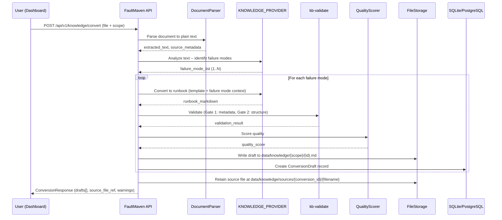
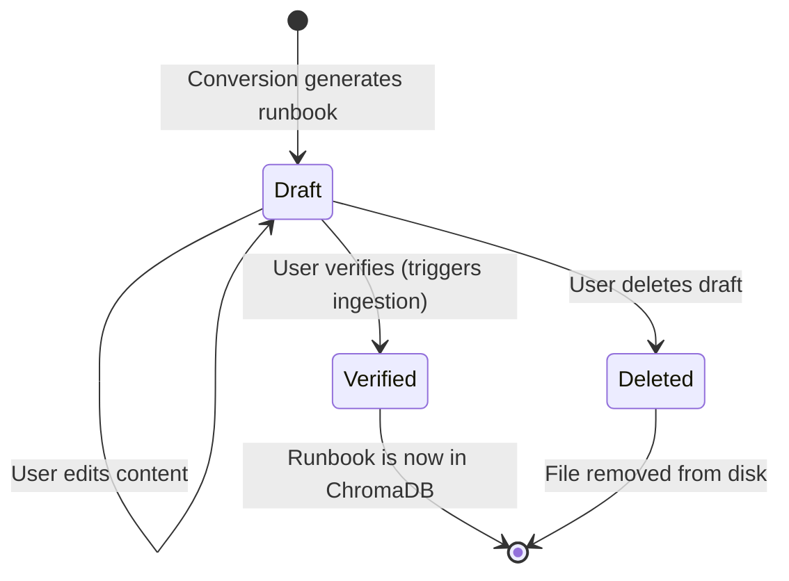

# Runbook Conversion (Document + Case Sources)

**Document Type:** Feature Specification
**Version:** 2.0
**Status:** Implemented
**Date:** 2026-03-26

---

## Executive Summary

This specification defines the runbook conversion feature that generates standardized runbook files from two sources:

1. **Document-to-runbook**: Uploaded documents (PDF, DOCX, TXT, Markdown, HTML) are analyzed for failure modes and converted to runbooks.
2. **Case-to-runbook**: Resolved investigation cases are converted to runbooks using the root cause, solutions, and evidence collected during the investigation.

Both sources produce output compliant with the [Runbook Content Architecture](./runbook-content-architecture.md) and share the same draft review workflow (edit → verify → ingest).

### Objectives

1. Reduce the manual effort required to populate the Knowledge Base with properly structured runbooks.
2. Enforce the "one runbook = one failure mode" rule automatically by detecting and splitting multi-topic source documents.
3. Maintain quality standards by gating all generated output through the existing `kb-validate` pipeline and quality scorer.
4. Keep generated runbooks as non-searchable drafts until a human explicitly promotes them to `verified` status.
5. Close the knowledge flywheel: resolved cases automatically produce draft runbooks for future investigations.

### Non-Goals

- Real-time URL scraping or web page fetching. Users save web content to a file before uploading.
- Batch upload UI. Batch conversion is achieved by looping over the single-file API endpoint.
- Automatic ingestion into ChromaDB. Drafts remain outside the vector store until manually verified.

---

## 1. System Architecture

### 1.1 High-Level Flow



### 1.2 Component Diagram

```mermaid
graph TD
    subgraph "Dashboard"
        UI[ConvertDocumentPage]
    end

    subgraph "API Layer"
        EP[POST /knowledge/convert]
        EP6[POST /knowledge/convert-from-case]
        EP2[GET /knowledge/conversions/{id}]
        EP7[GET /knowledge/conversions/by-case/{case_id}]
        EP3[PUT /knowledge/conversions/{id}/drafts/{draft_id}]
        EP4[POST /knowledge/conversions/{id}/drafts/{draft_id}/verify]
        EP5[DELETE /knowledge/conversions/{id}/drafts/{draft_id}]
    end

    subgraph "Domain Services"
        CS[ConversionService]
        KS[KnowledgeService]
    end

    subgraph "Infrastructure"
        DP[DocumentParser]
        LLM[LLMRouter - KNOWLEDGE_PROVIDER]
        VAL[RunbookValidator]
        QS[QualityScorer]
        FS[FileStorage]
        VDB[(ChromaDB)]
        DB[(Database)]
    end

    UI --> EP
    UI --> EP2
    UI --> EP3
    UI --> EP4
    UI --> EP5
    EP --> CS
    EP4 --> KS
    CS --> DP
    CS --> LLM
    CS --> VAL
    CS --> QS
    CS --> FS
    CS --> DB
    KS --> VDB
```

### 1.3 Module Placement

The conversion feature is a **domain service** within the knowledge module. It does not own its own database tables -- it creates `KnowledgeItem` records via the existing knowledge infrastructure and stores conversion metadata in a new `conversion_jobs` table.

```
faultmaven/modules/knowledge/
    domain/
        services/
            conversion_service.py      # NEW -- orchestrates the pipeline
            document_parser.py         # NEW -- text extraction from file formats
        models/
            conversion.py             # NEW -- ConversionJob, ConversionDraft models
    api/
        conversion_routes.py          # NEW -- /knowledge/convert endpoints
```

This placement follows the established pattern: conversion is business logic that creates knowledge items through the existing knowledge module contracts.

### 1.4 Two Conversion Sources

Both sources use the same downstream pipeline (LLM generation with canonical template, validation, quality scoring, draft persistence) but differ in input:

| Aspect | Document Source | Case Source |
|--------|----------------|-------------|
| **Entry point** | `POST /knowledge/convert` (file upload) | `POST /knowledge/convert-from-case` (case_id) |
| **Preprocessing** | 6-stage pipeline (extract, PII, triage, etc.) | None (case data is already structured) |
| **Analysis** | LLM identifies failure modes from text | Single failure mode from case root cause |
| **Source material** | Extracted document text | Assembled from case title, description, root cause, solutions, hypotheses, evidence |
| **Tracking** | `source_type = "document"` on ConversionJob | `source_type = "case"`, `case_id` populated |
| **Dashboard** | Drafts tab on KB page | Drafts tab on KB page (case-sourced drafts shown with "from case" badge) |

The `ConversionService.convert_from_case()` method constructs a `FailureModeAnalysis` from the case data and calls `_convert_single_failure_mode()` — the same method used for document-driven conversion. This ensures identical template compliance, validation, and quality scoring.

**Case conversion lookup**: `GET /knowledge/conversions/by-case/{case_id}` returns the conversion job and drafts for a specific case, used by the Dashboard Runbook tab.

---

## 2. Preprocessing Pipeline

Before the source document reaches the LLM, it passes through a preprocessing pipeline that extracts text, removes noise, enforces size limits, checks for sensitive content, and triages non-actionable documents. This pipeline runs entirely server-side — the user uploads a file and receives either converted drafts or a rejection with explanation.

### 2.1 Pipeline Flow

```text
Upload (file + scope + metadata)
  │
  ├── 1. Format Extraction
  │     PDF/DOCX/HTML → plain text with structure preserved
  │     Markdown/TXT → pass through
  │     Reuse existing extractors from faultmaven/modules/preprocessing/
  │
  ├── 2. Content Cleanup
  │     Strip: navigation boilerplate, cookie banners, sidebars
  │     Strip: table of contents (redundant with headings)
  │     Strip: marketing/sales content ("Try our enterprise plan!")
  │     Strip: page numbers, copyright notices, revision history
  │     Strip: embedded image references (LLM can't see them)
  │     Collapse: excessive whitespace, repeated blank lines
  │     Preserve: headings, lists, code blocks, tables (structural elements)
  │
  ├── 3. Sensitive Content Scan
  │     Run Presidio + regex detection (same as evidence pipeline)
  │     Detect: API keys, credentials, private keys, DB connection strings
  │     Action: Redact and log what was removed
  │     Warning: "N sensitive items were redacted. Redacted commands may be
  │              incomplete in the generated runbook. Review before verifying."
  │
  ├── 4. Size Check (hard limit)
  │     Measure: token count (tiktoken or model-appropriate tokenizer)
  │     Limit: 30,000 tokens (~120K chars)
  │     If under limit: pass through
  │     If over limit: REJECT with HTTP 413 Payload Too Large
  │       → "Document contains {actual} tokens (limit: 30,000).
  │          Please split the document into smaller, focused chapters
  │          and convert each one separately."
  │     No silent truncation — truncation causes silent data loss
  │     where failure modes at the end of the document are never
  │     detected, and the user has no way to know.
  │
  ├── 5. Source Metadata Extraction
  │     Capture: original filename, file size, format, page count (PDF),
  │              word count, detected language, extraction timestamp
  │     Purpose: feeds into Sources section of generated runbook and
  │              ConversionJob record for provenance tracking
  │
  └── 6. Content Triage (CLASSIFIER_PROVIDER)
        Send only the FIRST 2,000 tokens to the classifier (introduction,
        abstract, and table of contents are always sufficient to determine
        document type). Full document is never sent — classifiers often
        have small context windows (8K) and the cost is wasted.
        Prompt: "Does this document contain troubleshooting procedures,
        diagnostic steps, error resolution, or incident response content?"
        Response: { is_actionable: bool, confidence: float, reason: str }
        If not actionable (confidence > 0.8):
          → Reject with: "This document does not appear to contain
             troubleshooting content. The conversion pipeline produces
             runbooks from diagnostic procedures, incident reports,
             vendor troubleshooting guides, or postmortems."
        If uncertain (confidence ≤ 0.8):
          → Proceed with warning: "This document may not contain
             sufficient troubleshooting content. Generated runbooks
             may have incomplete sections."
```

### 2.2 Format Extraction Details

| Format | Extractor | Structure Preservation | Notes |
|--------|-----------|----------------------|-------|
| PDF | `PyPDF2` / `pdfplumber` | Tables extracted as markdown tables, headings from font size heuristics | Multi-column layouts may need reflow |
| DOCX | `python-docx` | Headings, lists, tables preserved as markdown | Embedded images stripped |
| HTML | `BeautifulSoup` | `h1-h6` → markdown headings, `pre/code` → fenced blocks, `table` → markdown tables, `ul/ol` → lists | Strip `nav`, `footer`, `aside`, `script`, `style` tags |
| Markdown | Pass-through | Full structure preserved | Strip HTML comments |
| TXT | Pass-through | No structure | Best-effort heading detection (ALL CAPS lines, underlined lines) |

The existing extractors in `faultmaven/modules/preprocessing/` handle PDF, DOCX, and unstructured text. HTML extraction exists in the page capture pipeline (`source_type="page_capture"` branch). These should be reused — the conversion pipeline calls the same extraction functions, not new implementations.

### 2.3 Content Cleanup Rules

The cleanup step removes content that would waste tokens and dilute embeddings without contributing to runbook quality:

**Always remove:**
- Repeated headers/footers (detected by identical text appearing on multiple pages)
- Navigation elements (`<nav>`, breadcrumbs, sidebar menus)
- Cookie/privacy banners
- "Last updated by..." revision metadata (we capture this in frontmatter instead)
- Empty sections (heading with no content before next heading)

**Never remove:**
- Code blocks (even if they look like boilerplate — the LLM decides relevance)
- Tables (often contain the most useful content: error codes, parameters, thresholds)
- Inline error messages or log excerpts
- URLs (potential sources for the Sources section)

### 2.4 Sensitive Content Handling

The sensitive content scan runs the same detection layers as the evidence pipeline:

- **Regex layer**: API keys, AWS keys, JWTs, private keys, DB connection strings, passwords
- **Presidio layer**: Credit cards, SSNs, emails, phone numbers (if present in the source doc)

Redacted content is replaced with `[REDACTED:{type}]` markers. The LLM sees these markers and can note in the runbook that specific values need to be filled in by the user.

The scan produces a `redaction_report` included in the `ConversionResponse`:

```json
{
  "redactions": [
    { "type": "api_key", "count": 2, "context": "Found in code blocks" },
    { "type": "db_connection_string", "count": 1, "context": "Found in configuration example" }
  ],
  "warning": "3 sensitive items were redacted. Review generated runbooks for [REDACTED] placeholders."
}
```

### 2.5 Size Limit Rationale

The 30,000-token limit is chosen to leave headroom for the LLM's system prompt (~2K tokens for the template), the analysis response, and safety margin. This accommodates most troubleshooting guides (typically 5-20 pages).

**Hard rejection, not silent truncation.** If a document exceeds 30K tokens, the pipeline returns HTTP 413 with a clear instruction to split the document. Silent truncation is rejected as a design option because:

1. **Silent data loss** — Failure modes described later in the document are never detected, and the user has no indication this happened.
2. **False completeness** — The user believes the entire document was processed, leading to incomplete KB coverage.
3. **User agency** — The user knows their document better than any heuristic. They can split it into focused chapters that each convert cleanly.

For very large documents (vendor manuals, comprehensive guides), the recommended workflow is: split by chapter or topic → convert each chapter separately → review and merge if needed.

### 2.6 Integration with ConversionService

The preprocessing pipeline is encapsulated in a `DocumentPreprocessor` class:

```python
class DocumentPreprocessor:
    """Preprocesses uploaded documents before LLM conversion."""

    async def preprocess(
        self,
        file_path: Path,
        file_format: str,
    ) -> PreprocessingResult:
        """
        Returns:
            PreprocessingResult with:
              - extracted_text: cleaned, size-managed text
              - source_metadata: filename, format, word count, etc.
              - redaction_report: what sensitive content was removed
              - triage_result: is_actionable, confidence, reason
              - warnings: list of user-facing warnings
              - is_rejected: True if content triage says not actionable
              - rejection_reason: explanation if rejected
        """
```

The `ConversionService` calls `DocumentPreprocessor.preprocess()` as the first step. If `is_rejected` is True, it returns immediately with the rejection reason. Otherwise, it passes `extracted_text` to the analysis and conversion LLM calls.

---

## 3. KNOWLEDGE_PROVIDER Capability

### 3.1 Definition

A new LLM capability for knowledge extraction and content transformation tasks. These tasks require strong instruction-following for structured output (template compliance), content analysis (failure mode detection), and technical writing (producing actionable runbook sections).

### 3.2 Settings Integration

Add to `LLMSettings` in `faultmaven/config/settings.py`:

```python
class LLMSettings(BaseSettings):
    # Existing providers
    provider: LLMProvider = Field(...)
    multimodal_provider: Optional[LLMProvider] = Field(default=None)
    synthesis_provider: Optional[LLMProvider] = Field(default=None)
    classifier_provider: Optional[LLMProvider] = Field(default=None)
    code_provider: Optional[LLMProvider] = Field(default=None)
    da_provider: Optional[LLMProvider] = Field(default=None)

    # NEW
    knowledge_provider: Optional[LLMProvider] = Field(default=None)
```

Environment variable: `KNOWLEDGE_PROVIDER`

Getter method (follows established pattern):

```python
def get_knowledge_provider(self) -> LLMProvider:
    return self.knowledge_provider or self.provider
```

### 3.3 Model Selection per Provider

Add to the per-provider model fields in `LLMSettings`:

```python
# Knowledge transformation models (prefer strong instruction-following)
openai_knowledge_model: str = Field(default="gpt-4o")
anthropic_knowledge_model: str = Field(default="claude-3-5-sonnet-20241022")
fireworks_knowledge_model: str = Field(default="accounts/fireworks/models/qwen2.5-72b-instruct")
groq_knowledge_model: str = Field(default="llama-3.3-70b-versatile")
gemini_knowledge_model: str = Field(default="gemini-2.0-flash")
```

### 3.4 Routing Rationale

| Task | Why not reuse existing capability |
|------|----------------------------------|
| Failure mode analysis | Not classification (CLASSIFIER) -- requires reading comprehension and domain knowledge |
| Template-compliant generation | Not synthesis (SYNTHESIS) -- requires long-form structured writing, not fast JSON |
| Technical content transformation | Not code (CODE) -- not generating executable code, generating technical documentation |

The knowledge provider should default to a model with strong instruction-following (Anthropic Claude or OpenAI GPT-4o) because template compliance is the critical quality dimension. Cheaper models can be tested but are not recommended as defaults.

### 3.5 Model Resolution in ConversionService

The `ConversionService` calls `LLMRouter.route()` with the model resolved from `settings.llm.get_knowledge_model()`:

```python
model = self._settings.llm.get_knowledge_model()
response = await self._llm_router.route(
    messages=messages,
    model=model,
    max_tokens=4096,
    temperature=0.3,  # Low temperature for structured compliance
)
```

---

## 4. LLM Prompt Design

The conversion pipeline makes two distinct LLM calls per source document:

1. **Analysis call** -- identify distinct failure modes in the source document
2. **Conversion call** -- one per failure mode, producing a template-compliant runbook

### 4.1 Analysis Prompt (Failure Mode Detection)

**System message:**

```
You are an expert at analyzing technical documentation to identify distinct
failure modes. A failure mode is a specific way a system can fail, characterized
by unique symptoms, diagnostic procedures, and resolution steps.

Your task: Read the provided document and identify every distinct failure mode
it covers. For each failure mode, provide:
1. A short title (include the technology and failure type)
2. The symptoms or error messages associated with it
3. A brief summary of the resolution approach

Rules:
- If the document covers only ONE failure mode, return exactly one item.
- If the document is purely architectural/conceptual with no failure modes,
  return an empty list and set "is_actionable" to false.
- Do NOT invent failure modes not present in the source material.
- Failure modes must be distinct -- different symptoms OR different resolutions.
```

**Response format** (structured output via `response_format`):

```json
{
  "is_actionable": true,
  "failure_modes": [
    {
      "id": "pg-connection-pool-exhaustion",
      "title": "PostgreSQL Connection Pool Exhaustion",
      "domain": "database",
      "service": "postgresql",
      "symptom_class": ["connection_refused", "latency"],
      "severity": "high",
      "symptoms_summary": "FATAL: too many connections for role...",
      "resolution_summary": "Terminate idle connections, resize pool..."
    }
  ],
  "source_assessment": {
    "content_type": "troubleshooting_guide",
    "actionability_rating": "high",
    "missing_information": ["No verification steps provided"]
  }
}
```

### 4.2 Conversion Prompt (Per Failure Mode)

**System message:**

```
You are a technical writer converting source material into a FaultMaven
runbook. You MUST produce output that exactly matches the template below.
Every section is required. Do not add sections. Do not rename sections.
Do not include commentary, explanations, or meta-text -- only the runbook.

TEMPLATE:
=========

---
id: {kebab-case-id}
title: "{Title -- include failure mode, not just technology}"
domain: {domain}
service: {service}
symptom_class: [{symptom_classes}]
scope: {scope}
tags: [{tags}]
difficulty: {difficulty}
severity: {severity}
version: "1.0.0"
last_updated: {today_iso}
verified_by: ""
status: draft
---

# Runbook: {Title}

## Problem Definition
- Exact alert names, error messages as they appear in logs, metric patterns.
- Be specific: include the actual strings a user would grep for.

## Diagnostic Steps

### Step 1: {description}
```{language}
{command}
```
{interpretation guidance: what to look for, what findings mean}

### Step 2: {description}
...

## Mitigation
**Risk**: {what could go wrong}
```{language}
{mitigation command}
```
**Verify**: {how to confirm mitigation worked}
**Duration**: {how long the mitigation is safe}

## Root Cause Resolution
**If** {diagnostic finding from Step N}:
```{language}
{permanent fix command}
```

**If** {alternative diagnostic finding}:
...

## Verification
- {specific metric or command to confirm the fix}
- {observation period}
- {what "back to normal" looks like}

## Prevention
- {configuration change to prevent recurrence}
- {monitoring alert to add}
- {process change}

## Sources
- {source_filename} -- primary source document for this runbook

=========

RULES:
1. Every section MUST contain content. No empty sections.
2. Diagnostic Steps and Root Cause Resolution MUST contain fenced code blocks.
3. Root Cause Resolution MUST use "If X then Y" structure linking to findings
   from Diagnostic Steps.
4. Section sizes: aim for 400-900 characters per section so each fits within
   1-2 retrieval chunks (structure-aware splitting on section headers).
5. If the source material does not provide enough information for a section,
   write "[INSUFFICIENT SOURCE DATA -- manual completion required]" and
   continue. Do not fabricate commands or procedures.
6. The Sources section MUST reference the uploaded filename as the primary
   source.
7. Use the taxonomy values provided in the failure mode analysis. Do not
   change domain, service, or symptom_class.
```

**User message:**

```
Convert the following source material into a runbook for this specific
failure mode:

FAILURE MODE: {failure_mode.title}
DOMAIN: {failure_mode.domain}
SERVICE: {failure_mode.service}
SYMPTOM_CLASS: {failure_mode.symptom_class}
SEVERITY: {failure_mode.severity}
SCOPE: {scope}
SOURCE FILENAME: {original_filename}
TODAY: {iso_date}

--- SOURCE MATERIAL ---
{relevant_excerpt_or_full_text}
--- END SOURCE MATERIAL ---
```

### 4.3 Prompt Design Decisions

| Decision | Rationale |
|----------|-----------|
| Template embedded in system prompt | The LLM sees the exact target format every call. No drift from a separate template file. |
| Low temperature (0.3) | Structured compliance is more important than creative variation. |
| `max_tokens=4096` | A single runbook is typically 1500-3000 tokens. 4096 provides headroom without encouraging verbosity. |
| "[INSUFFICIENT SOURCE DATA]" marker | Prevents LLM hallucination of commands. Visible to the user in the editor. |
| Separate analysis and conversion calls | Analysis needs holistic document understanding. Conversion needs focused, template-compliant generation. Combining them degrades both. |

---

## 5. Multi-Runbook Splitting Logic

### 5.1 Detection Strategy

The analysis LLM call (Section 4.1) identifies failure modes. The splitting logic is:

```python
async def _analyze_and_split(self, text: str, filename: str) -> AnalysisResult:
    """
    Analyze document for failure modes.

    Returns:
        AnalysisResult with failure_modes list.
        - 0 modes: source is not actionable (architectural/conceptual)
        - 1 mode: single runbook conversion
        - N modes: N separate runbook conversions
    """
    response = await self._llm_router.route(
        messages=[
            {"role": "system", "content": ANALYSIS_SYSTEM_PROMPT},
            {"role": "user", "content": f"Analyze this document:\n\n{text}"}
        ],
        model=self._knowledge_model,
        max_tokens=2048,
        temperature=0.2,
        response_format={"type": "json_object"},
    )
    return AnalysisResult.model_validate_json(response.content)
```

### 5.2 Text Routing for Multi-Mode Documents

When multiple failure modes are detected, the conversion prompt receives the **full source text** for each failure mode, not a pre-extracted excerpt. The LLM is instructed to focus on the specified failure mode and extract only the relevant content. This avoids lossy heuristic text splitting.

For very large documents (over 12,000 tokens after extraction), the text is chunked by section headers and the LLM receives only the sections relevant to each failure mode, as identified in the analysis response.

### 5.3 ID Generation

Runbook IDs are generated deterministically from the failure mode analysis:

```python
def _generate_runbook_id(self, failure_mode: FailureMode) -> str:
    """Generate kebab-case ID from service and failure description."""
    # e.g., "pg-connection-pool-exhaustion"
    base = f"{failure_mode.service}-{failure_mode.title}"
    slug = re.sub(r'[^a-z0-9]+', '-', base.lower()).strip('-')
    # Truncate to 60 chars, ensure uniqueness with short hash if needed
    if len(slug) > 60:
        slug = slug[:55] + '-' + hashlib.md5(slug.encode()).hexdigest()[:4]
    return slug
```

### 5.4 Handling Edge Cases

| Scenario | Behavior |
|----------|----------|
| Document has 0 failure modes (architectural/conceptual) | Return 422 with message: "Source document does not contain actionable failure modes. Runbooks require specific symptoms, diagnostics, and resolution steps." |
| Document has 1 failure mode | Standard single-runbook conversion. |
| Document has 2-5 failure modes | Parallel conversion (asyncio.gather). |
| Document has 6+ failure modes | Sequential conversion to avoid LLM rate limits. Warn user: "Source document is very broad. Consider splitting the source into focused documents for better results." |
| LLM returns duplicate failure modes | Deduplicate by `(service, symptom_class)` tuple before conversion. |

---

## 6. API Contract

### 6.1 Endpoints

| Method | Path | Purpose | Auth |
|--------|------|---------|------|
| `POST` | `/api/v1/knowledge/convert` | Upload document and start conversion | Scoped (see 6.6) |
| `GET` | `/api/v1/knowledge/conversions/{conversion_id}` | Get conversion job status and drafts | Owner only |
| `GET` | `/api/v1/knowledge/conversions` | List user's conversion jobs | Owner only |
| `PUT` | `/api/v1/knowledge/conversions/{conversion_id}/drafts/{draft_id}` | Edit draft content | Owner only |
| `POST` | `/api/v1/knowledge/conversions/{conversion_id}/drafts/{draft_id}/verify` | Promote draft to verified (triggers ingestion) | Scoped (see 6.6) |
| `DELETE` | `/api/v1/knowledge/conversions/{conversion_id}/drafts/{draft_id}` | Delete a draft | Owner only |

### 6.2 POST /api/v1/knowledge/convert -- Request

Multipart form data:

| Field | Type | Required | Description |
|-------|------|----------|-------------|
| `file` | `UploadFile` | Yes | Source document (PDF, DOCX, TXT, MD, HTML) |
| `scope` | `string` | Yes | Target KB tier: `global`, `team`, `personal` |
| `team_id` | `string` | No | Required if scope is `team` |

Allowed MIME types:

```python
CONVERSION_ALLOWED_TYPES = {
    "text/plain",
    "text/markdown",
    "text/html",
    "application/pdf",
    "application/msword",
    "application/vnd.openxmlformats-officedocument.wordprocessingml.document",
}
```

Max file size: Governed by existing `MAX_UPLOAD_SIZE_MB` setting (default 10 MB).

### 6.3 POST /api/v1/knowledge/convert -- Response (201)

```json
{
  "conversion_id": "conv_a1b2c3d4",
  "status": "completed",
  "source_file": {
    "filename": "postgres-troubleshooting.pdf",
    "size_bytes": 45230,
    "content_type": "application/pdf",
    "retained_path": "data/knowledge/sources/conv_a1b2c3d4/postgres-troubleshooting.pdf"
  },
  "analysis": {
    "failure_modes_detected": 3,
    "is_actionable": true,
    "source_assessment": {
      "content_type": "troubleshooting_guide",
      "actionability_rating": "high",
      "missing_information": []
    }
  },
  "drafts": [
    {
      "draft_id": "draft_x1y2z3",
      "runbook_id": "pg-connection-pool-exhaustion",
      "title": "PostgreSQL Connection Pool Exhaustion",
      "scope": "global",
      "status": "draft",
      "validation": {
        "passed": true,
        "errors": [],
        "warnings": ["No external references found"]
      },
      "quality_score": {
        "overall": 72.5,
        "grade": "C",
        "completeness": 85.0,
        "clarity": 70.0,
        "actionability": 65.0,
        "comprehensiveness": 68.0
      },
      "file_path": "data/knowledge/global/pg-connection-pool-exhaustion.md",
      "content_preview": "---\nid: pg-connection-pool-exhaustion\ntitle: ..."
    }
  ],
  "warnings": [],
  "created_at": "2026-03-22T14:30:00Z"
}
```

### 6.4 PUT /api/v1/knowledge/conversions/{id}/drafts/{draft_id} -- Request

```json
{
  "content": "---\nid: pg-connection-pool-exhaustion\ntitle: ...\n(full markdown content)"
}
```

Response: Updated draft object with re-run validation and quality score.

### 6.5 POST .../drafts/{draft_id}/verify -- Response (200)

```json
{
  "draft_id": "draft_x1y2z3",
  "runbook_id": "pg-connection-pool-exhaustion",
  "status": "verified",
  "knowledge_item_id": "ki_abc123",
  "ingested": true,
  "ingested_at": "2026-03-22T15:00:00Z",
  "collection": "global_kb",
  "chunks_created": 8
}
```

This endpoint:
1. Updates frontmatter `status` from `draft` to `verified` and sets `verified_by` to the current user.
2. Creates a `KnowledgeItem` record in the database.
3. Triggers the ingestion pipeline (chunk, embed, store in ChromaDB).

**Frontmatter mutation implementation note:** The `.md` file on disk must be updated before ingestion. Use `python-frontmatter` (or `ruamel.yaml`) to parse the YAML frontmatter, mutate the `status` and `verified_by` fields, and write back the file preserving the markdown body. Do not use regex substitution — YAML has edge cases (quoted strings, multiline values) that regex cannot handle reliably. The `kb-ingest` pipeline reads frontmatter from the file, so the file must be correct on disk before ingestion runs.

### 6.6 Access Control

| Scope | Who can convert | Who can verify |
|-------|----------------|----------------|
| `global` | Platform admin only | Platform admin only |
| `team` | Team admin only | Team admin only |
| `personal` | Any authenticated user (own KB) | Any authenticated user (own KB) |

Implementation: Reuse existing `require_admin` dependency for global scope. Add `require_team_admin(team_id)` dependency for team scope. Personal scope uses standard auth with user ID scoping.

### 6.7 Error Responses

| Status | Condition | Body |
|--------|-----------|------|
| 400 | Missing required fields | `{"detail": "scope is required"}` |
| 401 | Not authenticated | Standard auth error |
| 403 | Insufficient permissions for scope | `{"detail": "Global KB conversion requires platform admin role"}` |
| 413 | File too large | `{"detail": "File exceeds maximum size of 10MB"}` |
| 415 | Unsupported file type | `{"detail": "Unsupported file type: image/png. Allowed: ..."}` |
| 422 | Document not actionable | `{"detail": "Source document does not contain actionable failure modes..."}` |
| 422 | All drafts failed validation | `{"detail": "Generated runbooks failed quality validation", "validation_errors": [...]}` |
| 500 | LLM failure after retries | `{"detail": "Document conversion failed. Please try again."}` |
| 503 | No LLM provider available | `{"detail": "Knowledge provider is not configured or unavailable"}` |

---

## 7. Pydantic Models

### 7.1 Request/Response Models

Location: `faultmaven/modules/knowledge/domain/models/conversion.py`

```python
from datetime import datetime
from enum import Enum
from typing import List, Optional
from pydantic import BaseModel, Field


class ConversionStatus(str, Enum):
    PROCESSING = "processing"
    COMPLETED = "completed"
    PARTIAL = "partial"        # Some drafts failed validation
    FAILED = "failed"


class DraftStatus(str, Enum):
    DRAFT = "draft"
    VERIFIED = "verified"
    DELETED = "deleted"


class FailureModeAnalysis(BaseModel):
    id: str
    title: str
    domain: str
    service: str
    symptom_class: List[str]
    severity: str
    symptoms_summary: str
    resolution_summary: str


class SourceAssessment(BaseModel):
    content_type: str
    actionability_rating: str = Field(
        description="low, medium, or high"
    )
    missing_information: List[str]


class AnalysisResult(BaseModel):
    is_actionable: bool
    failure_modes: List[FailureModeAnalysis]
    source_assessment: SourceAssessment


class ValidationResult(BaseModel):
    passed: bool
    errors: List[str]
    warnings: List[str]


class QualityScore(BaseModel):
    overall: float
    grade: str
    completeness: float
    clarity: float
    actionability: float
    comprehensiveness: float


class SourceFileInfo(BaseModel):
    filename: str
    size_bytes: int
    content_type: str
    retained_path: str


class ConversionDraft(BaseModel):
    draft_id: str
    runbook_id: str
    title: str
    scope: str
    status: DraftStatus
    validation: ValidationResult
    quality_score: QualityScore
    file_path: str
    content_preview: str = Field(
        max_length=500,
        description="First 500 chars of generated markdown"
    )
    content: Optional[str] = Field(
        default=None,
        description="Full markdown content, included on detail requests"
    )
    quality_warning: Optional[str] = Field(
        default=None,
        description="Warning if quality score < 50"
    )


class ConversionResponse(BaseModel):
    conversion_id: str
    status: ConversionStatus
    source_file: SourceFileInfo
    analysis: AnalysisResult
    drafts: List[ConversionDraft]
    warnings: List[str]
    created_at: datetime


class DraftUpdateRequest(BaseModel):
    content: str = Field(
        min_length=100,
        description="Full runbook markdown content including frontmatter"
    )


class VerifyResponse(BaseModel):
    draft_id: str
    runbook_id: str
    status: str  # "verified"
    knowledge_item_id: str
    ingested: bool
    ingested_at: Optional[datetime]
    collection: str
    chunks_created: int
```

---

## 8. Dashboard UI Flow

### 8.1 Entry Point

Add a "Convert Document" button to the existing KBPage, next to the existing upload functionality. The button is visible only when the user has write access to the current KB tier.

### 8.2 Conversion Flow (Wireframe-Level)

**Step 1: Upload**

```
+--------------------------------------------------+
|  Convert Document to Runbook(s)                   |
|                                                   |
|  [Drop file here or click to browse]              |
|  Supported: PDF, DOCX, TXT, Markdown, HTML        |
|                                                   |
|  Target KB:  ( ) Personal  ( ) Team  ( ) Global   |
|              [Team selector if Team selected]     |
|                                                   |
|  [Convert]                                        |
+--------------------------------------------------+
```

**Step 2: Processing (shown while API call is in progress)**

```
+--------------------------------------------------+
|  Converting: postgres-troubleshooting.pdf          |
|                                                   |
|  [============================     ] 75%           |
|                                                   |
|  Analyzing document...                             |
|  Found 3 failure modes                             |
|  Generating runbook 2 of 3...                      |
+--------------------------------------------------+
```

Note: The conversion is synchronous from the user's perspective (single API call that blocks until complete). The progress indication is approximate, driven by polling or SSE in a future iteration. V1 uses a spinner with status text.

**Step 3: Review Drafts**

```
+--------------------------------------------------+
|  Conversion Complete: 3 runbooks generated         |
|                                                   |
|  Source: postgres-troubleshooting.pdf (44 KB)      |
|  Assessment: High actionability                    |
|                                                   |
|  +----------------------------------------------+ |
|  | pg-connection-pool-exhaustion    Score: 73/C  | |
|  | Validation: PASSED (2 warnings)               | |
|  | [Edit] [Activate] [Delete]             | |
|  +----------------------------------------------+ |
|  | pg-replication-lag               Score: 68/D  | |
|  | Validation: PASSED (1 warning)                | |
|  | [Edit] [Activate] [Delete]             | |
|  +----------------------------------------------+ |
|  | pg-wal-disk-full                 Score: 45/F  | |
|  | ! Quality below 50 -- source may lack detail  | |
|  | Validation: FAILED (missing code blocks)      | |
|  | [Edit] [Delete]                               | |
|  +----------------------------------------------+ |
+--------------------------------------------------+
```

Verify button is disabled when validation fails. User must edit to fix validation errors first.

**Step 4: Edit (inline markdown editor)**

```
+--------------------------------------------------+
|  Editing: pg-connection-pool-exhaustion            |
|                                                   |
|  [Markdown Editor -- full content]                 |
|                                                   |
|  Validation: PASSED                                |
|  Quality: 73/C                                     |
|                                                   |
|  [Save Draft]  [Activate]  [Cancel]         |
+--------------------------------------------------+
```

On save, the API re-runs validation and quality scoring. The results update in real time.

**Step 5: Verification Confirmation**

```
+--------------------------------------------------+
|  Activate Runbook?                          |
|                                                   |
|  This will:                                        |
|  - Set status to "verified"                        |
|  - Set verified_by to your username                |
|  - Ingest into ChromaDB (global_kb collection)     |
|  - Make the runbook searchable by the AI           |
|                                                   |
|  [Confirm]  [Cancel]                               |
+--------------------------------------------------+
```

### 8.3 Dashboard Components

| Component | File | Purpose |
|-----------|------|---------|
| `ConvertUpload` | `components/ConvertUpload.tsx` | File selection, scope picker, convert trigger |
| `ConversionResults` | `components/ConversionResults.tsx` | Draft cards with scores and actions |
| `DraftEditor` | `components/DraftEditor.tsx` | Markdown editor with live validation |
| `VerifyConfirmDialog` | Reuse `ConfirmDialog.tsx` | Verification confirmation modal |

### 8.4 API Client Functions

Add to `faultmaven-dashboard/src/lib/knowledge/`:

```typescript
interface ConversionResponse { /* matches API response */ }
interface DraftUpdateRequest { content: string; }
interface VerifyResponse { /* matches API response */ }

export async function convertDocument(
  file: File,
  scope: string,
  teamId?: string
): Promise<ConversionResponse>;

export async function getConversion(
  conversionId: string
): Promise<ConversionResponse>;

export async function updateDraft(
  conversionId: string,
  draftId: string,
  content: string
): Promise<ConversionDraft>;

export async function verifyDraft(
  conversionId: string,
  draftId: string
): Promise<VerifyResponse>;

export async function deleteDraft(
  conversionId: string,
  draftId: string
): Promise<void>;
```

---

## 9. Storage and Lifecycle

### 9.1 File Storage Layout

```
data/knowledge/
    sources/                         # Source files (provenance)
        conv_a1b2c3d4/
            postgres-troubleshooting.pdf
    global/                          # Global KB runbooks
        pg-connection-pool-exhaustion.md    # status: draft (not in ChromaDB)
        pg-replication-lag.md               # status: draft (not in ChromaDB)
    team_{team_id}/                  # Team KB runbooks
        ...
    user_{user_id}/                  # Personal KB runbooks
        ...
```

### 9.2 Database Schema

New table: `conversion_jobs`

| Column | Type | Description |
|--------|------|-------------|
| `id` | `VARCHAR(36)` PK | Conversion job ID (conv_ prefix + UUID) |
| `user_id` | `VARCHAR(36)` FK | User who initiated conversion |
| `organization_id` | `VARCHAR(36)` | Organization context |
| `scope` | `VARCHAR(20)` | Target KB tier |
| `team_id` | `VARCHAR(36)` | Team ID (if scope=team) |
| `status` | `VARCHAR(20)` | processing, completed, partial, failed |
| `source_filename` | `VARCHAR(255)` | Original filename |
| `source_content_type` | `VARCHAR(100)` | MIME type |
| `source_size_bytes` | `INTEGER` | File size |
| `source_path` | `VARCHAR(500)` | Path to retained source file |
| `failure_modes_detected` | `INTEGER` | Number of failure modes found |
| `analysis_result` | `JSON` | Full analysis LLM response |
| `created_at` | `DATETIME` | Job creation time |
| `completed_at` | `DATETIME` | Job completion time |

New table: `conversion_drafts`

| Column | Type | Description |
|--------|------|-------------|
| `id` | `VARCHAR(36)` PK | Draft ID (draft_ prefix + UUID) |
| `conversion_id` | `VARCHAR(36)` FK | Parent conversion job |
| `runbook_id` | `VARCHAR(100)` | Generated runbook ID (kebab-case) |
| `title` | `VARCHAR(255)` | Runbook title |
| `file_path` | `VARCHAR(500)` | Path to draft markdown file |
| `status` | `VARCHAR(20)` | draft, verified, deleted |
| `validation_passed` | `BOOLEAN` | Whether kb-validate passed |
| `validation_errors` | `JSON` | Validation error list |
| `validation_warnings` | `JSON` | Validation warning list |
| `quality_score` | `FLOAT` | Overall quality score |
| `quality_details` | `JSON` | Full quality scorer output |
| `knowledge_item_id` | `VARCHAR(36)` | Set when verified and ingested |
| `created_at` | `DATETIME` | Draft creation time |
| `verified_at` | `DATETIME` | When status changed to verified |
| `verified_by` | `VARCHAR(36)` | User who verified |

### 9.3 Lifecycle State Machine



Key rules:
- **Draft**: File exists on disk. NOT in ChromaDB. NOT searchable by the AI.
- **Verified**: File updated with `status: verified` and `verified_by`. Ingested into ChromaDB. Searchable.
- **Deleted**: File removed from disk. Database record marked as deleted (soft delete).
- **No reverse transition**: Once verified, the runbook follows the standard KB lifecycle (verified -> stale -> deprecated) managed by the existing governance system. It is no longer a "conversion draft."

### 9.4 Source File Retention

Source files are retained indefinitely in `data/knowledge/sources/{conversion_id}/`. This provides:
- **Provenance**: Users can reference the original document that produced the runbook.
- **Re-conversion**: If the template changes, source files can be re-processed.
- **Audit trail**: For compliance requirements.

Source files are excluded from ChromaDB indexing.

---

## 10. Document Parsing

### 10.1 Parser Implementation

Location: `faultmaven/modules/knowledge/domain/services/document_parser.py`

The parser extracts plain text from supported file formats. It does not interpret or transform the content -- that is the LLM's job.

| Format | Library | Notes |
|--------|---------|-------|
| PDF | `pypdf` (already a dependency) | Extract text per page. Warn if OCR-only PDF detected (no extractable text). |
| DOCX | `python-docx` (already a dependency) | Extract paragraphs, tables, and list items. Preserve code blocks from monospace styling. |
| TXT | Built-in | Read as UTF-8. |
| Markdown | Built-in | Pass through as-is (already text). Strip HTML if embedded. |
| HTML | `beautifulsoup4` | Extract text content. Preserve code block content from `<pre>` and `<code>` tags. Strip all other HTML. |

### 10.2 Text Size Limits

| Limit | Value | Rationale |
|-------|-------|-----------|
| Max extracted text | 100,000 characters | Beyond this, LLM context window is exceeded. Reject with 413. |
| Min extracted text | 200 characters | Below this, the source lacks sufficient content. Reject with 422. |
| Target LLM input | 50,000 characters | For documents over this size, send summary + relevant sections per failure mode. |

### 10.3 BeautifulSoup Dependency

`beautifulsoup4` is required for HTML parsing. Add to `requirements/base.txt`:

```
beautifulsoup4>=4.12.0
```

This is the only new dependency. All other parsers use existing dependencies.

---

## 11. Error Handling

### 11.1 Error Categories and Recovery

| Error Category | Example | Recovery Strategy |
|----------------|---------|-------------------|
| **Parse failure** | Encrypted PDF, corrupt DOCX | Return 422 with specific message. Do not attempt LLM call. |
| **LLM analysis failure** | Provider timeout, rate limit | Retry via BaseExternalClient circuit breaker (3 retries). If all fail, return 503. |
| **LLM conversion failure** | One of N failure mode conversions fails | Mark that draft as failed, continue with remaining. Return `status: partial` with successful drafts + error details. |
| **Validation failure** | Generated runbook missing required sections | Include the draft with `validation.passed = false`. User can edit to fix. |
| **Quality below threshold** | Score < 50 | Include warning in draft. Do not block -- user decides. |
| **Storage failure** | Disk full, permission error | Return 500. No partial state -- transaction rolls back. |

### 11.2 LLM Failure Handling

```python
async def _convert_failure_mode(
    self,
    text: str,
    failure_mode: FailureModeAnalysis,
    scope: str,
    filename: str,
) -> ConversionDraft | ConversionError:
    """Convert a single failure mode. Returns draft or error."""
    try:
        response = await self._llm_router.route(
            messages=self._build_conversion_messages(text, failure_mode, scope, filename),
            model=self._knowledge_model,
            max_tokens=4096,
            temperature=0.3,
        )
        return self._process_llm_output(response, failure_mode, scope)
    except Exception as e:
        logger.error(f"Conversion failed for {failure_mode.id}: {e}")
        return ConversionError(
            failure_mode_id=failure_mode.id,
            error=str(e),
            retryable=getattr(e, 'retryable', False),
        )
```

### 11.3 Idempotency

The conversion endpoint is NOT idempotent -- each upload creates a new conversion job. To prevent accidental duplicate conversions, the Dashboard disables the "Convert" button after submission and shows the processing state.

---

## 12. Integration with KB Toolkit Validation and Quality Scoring

### 12.1 Validation Integration

The `ConversionService` invokes the KB Toolkit's `RunbookValidator` programmatically. The toolkit is imported as a Python package, not called as a CLI subprocess.

```python
from kb_toolkit.config.config import KBConfig
from kb_toolkit.core.validator import RunbookValidator

class ConversionService:
    def __init__(self, ...):
        self._kb_config = KBConfig.load()
        self._validator = RunbookValidator(self._kb_config)

    def _validate_draft(self, file_path: Path) -> ValidationResult:
        """Run Gate 1 (metadata) and Gate 2 (structure) on generated runbook."""
        result = self._validator.validate_file(file_path)
        return ValidationResult(
            passed=result["passed"],
            errors=result["errors"],
            warnings=result["warnings"],
        )
```

### 12.2 Quality Scoring Integration

```python
from kb_toolkit.core.quality import QualityScorer

class ConversionService:
    def __init__(self, ...):
        self._scorer = QualityScorer(self._kb_config)

    def _score_draft(self, file_path: Path) -> QualityScore:
        """Score generated runbook quality."""
        result = self._scorer.score_file(file_path)
        scores = result["scores"]
        return QualityScore(
            overall=scores["overall"],
            grade=result["grade"],
            completeness=scores["completeness"],
            clarity=scores["clarity"],
            actionability=scores["actionability"],
            comprehensiveness=scores["comprehensiveness"],
        )
```

### 12.3 Quality Warning Threshold

If `quality_score.overall < 50`, the draft includes:

```python
quality_warning = (
    "Quality score is below 50. The source material may lack sufficient "
    "diagnostic commands, resolution steps, or verification procedures. "
    "Manual editing is recommended before verification."
)
```

### 12.4 Re-Validation on Edit

When a user edits a draft via `PUT .../drafts/{draft_id}`, the API:
1. Writes the updated content to the file.
2. Re-runs validation (`_validate_draft`).
3. Re-runs quality scoring (`_score_draft`).
4. Returns the updated draft with new validation and quality results.

This provides a tight feedback loop: the user edits, saves, and immediately sees whether their changes fixed validation errors or improved the quality score.

---

## 13. Implementation Phases

### Phase 1: Core Pipeline (Estimated: 3-4 days)

1. Add `KNOWLEDGE_PROVIDER` to `LLMSettings` with getter and per-provider model fields.
2. Implement `DocumentParser` for all 5 file formats.
3. Implement `ConversionService` with analysis and conversion LLM calls.
4. Integrate KB Toolkit `RunbookValidator` and `QualityScorer`.
5. Create database migration for `conversion_jobs` and `conversion_drafts` tables.
6. Implement `POST /api/v1/knowledge/convert` endpoint.

### Phase 2: Draft Management (Estimated: 2-3 days)

1. Implement `GET /conversions/{id}`, `GET /conversions` endpoints.
2. Implement `PUT .../drafts/{draft_id}` with re-validation.
3. Implement `POST .../drafts/{draft_id}/verify` with ingestion trigger.
4. Implement `DELETE .../drafts/{draft_id}`.
5. Wire access control (admin for global, team admin for team, owner for personal).

### Phase 3: Dashboard UI (Estimated: 3-4 days)

1. `ConvertUpload` component with file drop and scope selection.
2. `ConversionResults` component with draft cards.
3. `DraftEditor` component with markdown editing and live validation display.
4. Integration with existing KBPage.
5. API client functions in `lib/knowledge/`.

### Phase 4: Testing and Hardening (Estimated: 2-3 days)

1. Unit tests for `DocumentParser` (each file format).
2. Unit tests for `ConversionService` (mock LLM responses).
3. Integration tests for the conversion API endpoint.
4. Integration tests for the verify-and-ingest flow.
5. Edge case testing: empty documents, huge documents, non-English content, OCR PDFs.

---

## 14. Testing Strategy

### 14.1 Unit Tests

| Component | Test File | Coverage Target |
|-----------|-----------|-----------------|
| `DocumentParser` | `tests/unit/modules/knowledge/test_document_parser.py` | 90%+ |
| `ConversionService` | `tests/unit/modules/knowledge/test_conversion_service.py` | 80%+ |
| Pydantic models | `tests/unit/modules/knowledge/test_conversion_models.py` | 90%+ |
| ID generation | Included in `test_conversion_service.py` | 100% |

### 14.2 Integration Tests

| Scenario | Test File |
|----------|-----------|
| Full conversion flow (upload -> drafts -> verify -> ingested) | `tests/integration/modules/knowledge/test_conversion_flow.py` |
| Access control (admin, team admin, user) | `tests/integration/modules/knowledge/test_conversion_auth.py` |
| Edit and re-validate | `tests/integration/modules/knowledge/test_conversion_edit.py` |

### 14.3 Test Fixtures

LLM responses are mocked using `AsyncMock` and `respx` (established pattern). Fixture files contain representative LLM analysis and conversion responses for deterministic testing.

```python
@pytest.fixture
def mock_analysis_response():
    return AnalysisResult(
        is_actionable=True,
        failure_modes=[
            FailureModeAnalysis(
                id="pg-connection-pool-exhaustion",
                title="PostgreSQL Connection Pool Exhaustion",
                domain="database",
                service="postgresql",
                symptom_class=["connection_refused", "latency"],
                severity="high",
                symptoms_summary="FATAL: too many connections",
                resolution_summary="Terminate idle, resize pool",
            )
        ],
        source_assessment=SourceAssessment(
            content_type="troubleshooting_guide",
            actionability_rating="high",
            missing_information=[],
        ),
    )
```

---

## 15. Rollback Procedures

### 15.1 Feature Flag

Add to `faultmaven/config/feature_flags.py`:

```python
ENABLE_DOCUMENT_CONVERSION: bool = Field(
    default=False,
    description="Enable document-to-runbook conversion feature"
)
```

The conversion routes are registered conditionally:

```python
if settings.features.enable_document_conversion:
    app.include_router(conversion_router, prefix="/api/v1")
```

### 15.2 Database Rollback

The Alembic migration for `conversion_jobs` and `conversion_drafts` includes a `downgrade()` that drops both tables. Existing data (knowledge items created via verification) persists in the standard `knowledge_items` table and ChromaDB -- those are not touched by rollback.

### 15.3 Data Cleanup

If the feature is disabled after use:
- Draft files in `data/knowledge/{scope}/` with `status: draft` can be safely deleted.
- Source files in `data/knowledge/sources/` can be archived or deleted.
- Verified runbooks remain in the KB (they are now standard knowledge items).

---

## 16. Observability

### 16.1 Structured Logging

```python
logger.info(
    "document_conversion_started",
    extra={
        "conversion_id": conversion_id,
        "filename": filename,
        "content_type": content_type,
        "scope": scope,
        "text_length": len(extracted_text),
    }
)

logger.info(
    "document_conversion_completed",
    extra={
        "conversion_id": conversion_id,
        "failure_modes_detected": len(analysis.failure_modes),
        "drafts_generated": len(drafts),
        "drafts_passed_validation": sum(1 for d in drafts if d.validation.passed),
        "avg_quality_score": mean_quality,
        "duration_seconds": duration,
    }
)
```

### 16.2 Opik Tracing

The conversion LLM calls are traced via the existing `@opik.track` decorator on `LLMRouter.route()`. No additional Opik instrumentation is needed for the conversion service itself -- the LLM calls are the unit of tracing interest.

### 16.3 Metrics

Add Prometheus counters:

| Metric | Type | Labels | Purpose |
|--------|------|--------|---------|
| `faultmaven_conversions_total` | Counter | `scope`, `status` | Total conversion jobs |
| `faultmaven_conversion_drafts_total` | Counter | `scope`, `validation_passed` | Total drafts generated |
| `faultmaven_conversion_duration_seconds` | Histogram | `scope`, `failure_modes` | Conversion pipeline latency |
| `faultmaven_conversion_quality_score` | Histogram | `scope` | Quality score distribution |
| `faultmaven_conversion_verifications_total` | Counter | `scope` | Drafts promoted to verified |

---

## 17. Security Considerations

### 17.1 File Upload Security

- File type validation via MIME type AND file extension (defense in depth).
- File size limit enforced by `MAX_UPLOAD_SIZE_MB`.
- Filenames sanitized before storage (remove path traversal, special characters).
- Uploaded files stored outside the web-accessible directory.

### 17.2 LLM Security

- Source document content is passed to the LLM as user content, not system content. The system prompt is hardcoded and not influenced by the uploaded document.
- Generated runbook content is validated by the deterministic `RunbookValidator` before being presented to the user. The LLM cannot inject arbitrary content that bypasses validation.
- PII in source documents: The preprocessing pipeline (Section 2.4) runs Presidio + regex detection on the source document **before** sending to the LLM. Sensitive content (API keys, credentials, connection strings, private keys) is redacted and replaced with `[REDACTED:{type}]` markers. This is required because the KNOWLEDGE_PROVIDER may be a third-party LLM API — user-uploaded documents must be scrubbed before leaving the server. The redaction report is included in the `ConversionResponse` so the user knows what was removed and can fill in placeholders in the generated runbook.

### 17.3 User Isolation

- Conversion jobs are scoped to the user who created them.
- Users can only access their own conversion jobs and drafts.
- Personal KB drafts are stored in `data/knowledge/user_{user_id}/` -- not accessible to other users.
- The existing knowledge repository layer enforces user isolation.

---

## Related Documents

- [Runbook Content Architecture](./runbook-content-architecture.md) -- Template, taxonomy, quality gates, lifecycle
- [Knowledge Base Architecture](./knowledge-base-architecture.md) -- Storage, retrieval, 3-tier system
- [KB Toolkit](https://github.com/FaultMaven/faultmaven-kb-toolkit) -- Validation, quality scoring, ingestion tools
