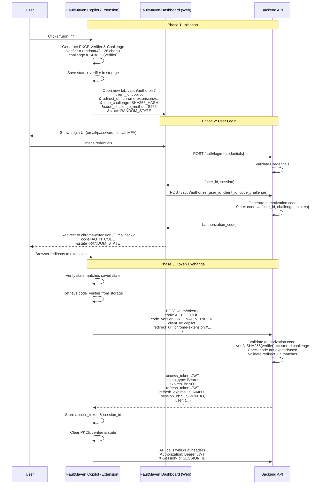

# FaultMaven Authentication System Design

## Overview

This document defines the **authoritative authentication architecture** for FaultMaven. It serves as the single source of truth for frontend and backend implementation, ensuring secure user identity management while maintaining clean separation between authentication (user identity) and sessions (conversation state).

## Design Principles

### Core Philosophy

FaultMaven uses a **dual-header approach** that cleanly separates concerns:

- **Authentication**: `Authorization: Bearer <token>` for user identity
- **Session Management**: `X-Session-Id: <session_id>` for conversation continuity

### Key Design Goals

1. **Deployment Agnostic**: Core business logic is unaware of authentication mode
2. **Unified Token Format**: JWT tokens in all deployment modes for middleware uniformity
3. **Clean Frontend Integration**: Single discovery endpoint determines auth flow
4. **Browser Extension Optimized**: Designed for multi-tab, persistent extension usage
5. **Secure by Default**: Tokens expire, proper error handling, secure storage
6. **Production Ready**: OAuth 2.0 with PKCE for multi-user deployments

## Authentication Modes

FaultMaven supports two authentication strategies, selected at deployment time:

### Local Mode (Self-Hosted / Single-User)

For users running FaultMaven locally or on their own infrastructure.

| Aspect | Specification |
|--------|---------------|
| **Authentication** | `/api/v1/auth/login` endpoint |
| **User Input** | Username (optional password for enhanced security) |
| **Token Format** | JWT signed with local secret key |
| **User Storage** | SQLite (local file) |
| **Use Case** | Single-user self-hosted deployments |
| **Registration** | `/api/v1/auth/register` for account creation |

### Cloud Mode (Multi-User / SaaS)

For FaultMaven Cloud or enterprise on-premises deployments.

| Aspect | Specification |
|--------|---------------|
| **Authentication** | OAuth 2.0 Authorization Code Flow with PKCE |
| **Identity Provider** | Dashboard acts as IdP for Extension |
| **Token Format** | JWT signed with RS256 (asymmetric key) |
| **User Storage** | PostgreSQL with proper user management |
| **Use Case** | Multi-user production deployments |

### Strategy Selection

Authentication strategy is determined by configuration at startup:

```yaml
# Local Mode (default for self-hosted)
auth:
  mode: local
  jwt_algorithm: HS256
  jwt_secret_key: ${JWT_SECRET_KEY}

# Cloud Mode (SaaS / Enterprise)
auth:
  mode: oauth
  jwt_algorithm: RS256
  jwt_private_key_path: /secrets/jwt_private.pem
  jwt_public_key_path: /secrets/jwt_public.pem
  oauth:
    dashboard_url: https://dashboard.faultmaven.ai
```

## Frontend Integration

### Auth Configuration Discovery

The frontend uses a single discovery endpoint to determine which authentication flow to use. This keeps deployment-specific logic out of the frontend codebase.

**Endpoint:** `GET /api/v1/auth/config`

```json
// Response for Local Mode
{
  "auth_mode": "local",
  "login_endpoint": "/api/v1/auth/login",
  "register_endpoint": "/api/v1/auth/register",
  "supports_registration": true,
  "oauth": null
}

// Response for Cloud Mode
{
  "auth_mode": "oauth",
  "login_endpoint": null,
  "register_endpoint": null,
  "supports_registration": false,
  "oauth": {
    "authorize_url": "/auth/oauth/authorize",
    "token_url": "/auth/oauth/token",
    "client_id": "faultmaven-copilot",
    "scopes": ["openid", "profile", "email", "cases:read", "cases:write"],
    // Present (relative path) only when hosted SSO is configured; null otherwise.
    "hosted_login_url": "/api/v1/auth/sso/login"
  }
}
```

> When hosted SSO is configured (see [Hosted SSO](#hosted-sso-adr-015--workos)),
> the Cloud-mode `oauth` block advertises `hosted_login_url` so the dashboard can
> offer a "Sign in with SSO" entry point; it is `null` when SSO is not
> configured.

**Frontend Implementation Pattern:**

```typescript
// src/lib/auth/auth-client.ts
interface IAuthClient {
  signIn(): Promise<AuthResult>;
  signOut(): Promise<void>;
  getAccessToken(): Promise<string>;
}

class AuthClientFactory {
  static async create(apiBase: string): Promise<IAuthClient> {
    const config = await fetch(`${apiBase}/api/v1/auth/config`).then(r => r.json());

    if (config.auth_mode === 'local') {
      return new LocalAuthClient(config);
    } else {
      return new OAuthClient(config);
    }
  }
}

// Usage - frontend code is deployment-agnostic
const authClient = await AuthClientFactory.create(API_BASE);
await authClient.signIn();  // Works for both local and cloud
```

This pattern ensures:
- Frontend has **zero hardcoded deployment logic**
- Auth mode is determined at runtime from backend config
- Same frontend bundle works for local and cloud deployments

## Token Architecture

### Unified JWT Format

**Critical Design Decision:** Both Local and Cloud modes use JWT tokens with identical structure. This ensures middleware and protected endpoints require no conditional logic.

**JWT Payload Structure:**

```json
{
  "sub": "user_abc123",
  "username": "alice",
  "email": "alice@example.com",
  "roles": ["user", "admin"],
  "scopes": ["openid", "profile", "email", "cases:read", "cases:write", "knowledge:read"],
  "organization_id": "org_default",
  "iat": 1706140800,
  "exp": 1706141700,
  "iss": "faultmaven",
  "aud": "faultmaven-api",
  "jti": "550e8400-e29b-41d4-a716-446655440000",
  "type": "access",
  "auth_mode": "local"
}
```

Both `HS256JWTTokenGenerator` (local mode) and `RS256JWTTokenGenerator` (cloud/OAuth mode) produce identical claim sets. The only difference is the signing algorithm and the `auth_mode` value (`"local"` vs `"oauth"`).

`iss` and `aud` above are the **defaults** of `JWT_ISSUER` / `JWT_AUDIENCE`, not constants. A deployment names its own pair, and that one pair is what every mint stamps and every decoder checks — the generators take it as a required constructor argument, so a construction site that fails to wire it fails at construction rather than minting tokens no other decoder in the deployment accepts (#938).

Neither value may be blank. Both are refused at startup, because with no hardcoded fallback left a blank one fails every authentication in the deployment. The two are not symmetric at runtime — PyJWT treats a falsy `aud` in a payload as *absent* and rejects it, while a blank `iss` compares equal to itself and is silently functional — but both are refused, since a blank issuer is unintended in every case.

**Changing the pair invalidates tokens already in circulation.** Both access and refresh tokens minted under the previous values are rejected immediately by the next request that presents them — they are not merely left to expire. Clients treat that rejection as definitive and re-authenticate, so the effect is a forced re-login for every active session, and a rolling deploy widens it: while both generations are running they reject each other's refresh tokens, and refresh rotation revokes the presented token before minting its replacement.

The defaults are `iss="faultmaven"` / `aud="faultmaven-api"` because `aud` names the token's intended **recipient** — for an access token, the API — rather than the client bearing it (RFC 7519 §4.1.3). They previously read `iss="faultmaven-api"` / `aud="faultmaven-app"`, which had both roles backwards; #938 corrected them while unifying the pair.

That correction is also what makes #938 cheap to deploy, and the impact differs by mode:

- **`AUTH_MODE=local` (HS256).** Refresh tokens minted before the upgrade already carried exactly this pair — it was hardcoded into the refresh mint — so they keep validating and most sessions continue uninterrupted. Access tokens carried the old defaults and are rejected. A client holding one still inside its lifetime presents it, receives a definitive 401, and logs out; a client past its proactive-refresh threshold (the extension refreshes with under five minutes remaining) refreshes first and recovers silently on the surviving refresh token. So the exposure is roughly the sessions active in the earlier part of a 15-minute access window, not the whole population.
- **`AUTH_MODE=oauth` (RS256).** Both token kinds carried the old configured defaults, so both are invalidated and every active session re-authenticates.
- **Both modes.** Password-reset tokens in flight (one-hour lifetime) stop verifying and the reset must be requested again.

A rollback inverts each of these.

**Token Types:**

| Token | Lifetime | Purpose | Storage |
|-------|----------|---------|---------|
| Access Token | 15 minutes | API authentication | Extension: `chrome.storage.local` |
| Refresh Token | 7 days | Obtain new access tokens | Extension: `chrome.storage.local` |

**Signing Algorithms:**

| Mode | Algorithm | Key Management |
|------|-----------|----------------|
| Local | HS256 | Symmetric key in `JWT_SECRET_KEY` env var |
| Cloud | RS256 | Asymmetric keypair, private key secured |

### Token Validation Middleware

Because tokens are uniformly JWT, validation is identical for both modes. Every
request path — the mandatory-auth middleware (`api/middleware/auth.py`), the
tenant binder (`api/middleware/tenant_scope.py`), and the optional-auth
dependency (`api/v1/auth_dependencies.py`) — converges on one implementation:

```python
# faultmaven/modules/auth/domain/services/auth_service.py
claims = await auth_service.verify_token_with_revocation_check(token, token_type="access")
```

This performs the full validation set: signature (HS256 with `JWT_SECRET_KEY`
in local mode, RS256 with the public key in cloud mode), expiration, issuer,
audience, required claims (including `jti`), `type == "access"`, and the Redis
revocation-list check. A revoked-but-unexpired token is rejected on every
path; the optional-auth dependency treats it as unauthenticated rather than
erroring.

**Single revocation store (#767).** Every per-token revocation writer — OAuth
`POST /auth/oauth/revoke`, refresh-token rotation in both modes, and logout —
writes to the same deployment-wide store the check above reads:
`RedisTokenRevocationStore`, keyed `{token_revocation_prefix}jti:{jti}`
(`revoked:token:jti:{jti}` by default), created once in the DI container for
both auth modes and shared by instance. There is no secondary revocation
namespace or SQL table. Failure posture: the per-request check fails **open**
on store errors (availability; access tokens are short-lived), refresh-token
validation in the generators fails **closed** (a store outage cannot mint new
credentials from a revoked token), and revocation *writes* propagate store
errors so revoke endpoints never report success while the token remains
usable.

**Per-user revocation (#769).** Bulk revocation — admin
`POST /auth/users/{id}/revoke-tokens`, and the deactivate/delete, password
change/reset and role-change flows in `UserService` — goes through
`AuthService.revoke_user_tokens`, which writes a **revocation watermark** to
that same store at `{token_revocation_prefix}user:{user_id}`
(`revoked:token:user:{user_id}` by default), holding the revocation instant
with a TTL that outlives the longest-lived refresh token. Every validate path
then rejects a token whose `iat` is at or before its user's watermark.

Per-token entries are namespaced separately, at
`{token_revocation_prefix}jti:{jti}`. The two namespaces sit under distinct
literal segments because `jti` reaches the store from a submitted token: RFC
7009 revocation (`POST /auth/oauth/revoke`) is unauthenticated. Were the
per-user keys a direct child of the shared prefix, a submitted jti of
`user:<victim>` would overwrite that victim's watermark with a non-numeric
body, and the subsequent watermark read would raise — disabling per-user
revocation for the victim on the fail-open request path while locking them out
of refresh on the fail-closed generator path.

**Only a token this deployment signed is ever recorded (#830).** Both
generators verify the submitted token's signature *before* reading `jti`, so
the unauthenticated revoke endpoint cannot write a key of the caller's
choosing. A token that fails verification is logged and dropped, and the
endpoint still answers 200 — RFC 7009 treats revoking an invalid token as
success, but it does not require storing an entry for one. An **expired** token
is likewise not recorded: there is nothing left to revoke. Audience, issuer and
`type` are deliberately not checked on this path — `token_type_hint` is a hint,
and any token this deployment signed is revocable whatever it was minted for.

The entry's TTL is `min(exp - now, configured maximum lifetime for that token
type)`. A signed token cannot carry an arbitrary `exp`, so the cap is defence in
depth on the generator revoke path — the one an unauthenticated caller can
reach: it keeps store memory bounded by configuration rather than by a claim any
caller supplies. `AuthService.revoke_token`, which logout uses, takes its `exp`
from claims the authenticated request path has already verified and is left
uncapped.

Which ceiling applies is decided by the token's **own verified `type`**, never by
which revoke method the request routed to. `token_type_hint` is optional in RFC
7009 and may be wrong, and the endpoint routes an absent hint to the access
path — so a genuine refresh token arrives there as a matter of course. Reading
the ceiling from the route would truncate its entry to the access lifetime,
expiring the revocation days before the token it revokes while the endpoint had
already answered 200.

The OAuth rate limiter guarding `/revoke` remains in-memory and per-process, so
its per-IP ceiling scales with replica count.

The watermark TTL is derived from `settings.auth.jwt_refresh_token_expire_days`
(the `JWT_REFRESH_TOKEN_EXPIRY_DAYS` knob), folded together with the access
expiry — the single expiry source every minter is built from (see the
configuration reference). Because there is one source, "the watermark outlives
every mintable token" is structural: reading it covers every mint path. When the
field was declared on two settings halves this had to be a `max()` across both,
and reading one half alone once capped the watermark at its 7-day default while
refresh tokens lived for the configured 30, resurrecting revoked tokens on day 8.

`UserService` persists **before** revoking, deliberately. Revoking first opens
a TOCTOU: during the gap the database still holds the old password, roles and
active flag, so a login landing in it authenticates against pre-change state
and mints a token whose `iat` falls *after* the watermark — surviving the very
revocation meant to kill it. Persisting first inverts that, at the accepted
cost that a store-write failure leaves the change committed while returning an
error (the #767 posture: never report a revocation that did not land).

**`iat` is stamped from a pre-read instant, not from mint time (#831).**
Persist-then-revoke closes the window a login could complete entirely inside,
but not a request that *straddles* the whole sequence: one that reads the user
row (old roles, old active flag) or validates a still-valid refresh token,
loses the CPU while the admin action persists and watermarks, and only then
mints. Stamped at mint time, that token's `iat` postdates the watermark and
survives it while carrying pre-change state. So every
`IJWTTokenGenerator.generate_*` method requires a `state_read_at` argument —
captured by the caller before its first read of any state the claims derive
from (the user row, the presented refresh token, the reset-request account
lookup) — and stamps `iat` from it. A mint whose reads straddled a
revocation then necessarily carries `iat <= watermark` and dies with it. The
argument is required with no default, so a future mint path that forgets it
fails loudly rather than silently reopening the straddle; a `state_read_at`
more than a couple of seconds in the future is refused outright (a miswired
caller passing a derived time, not clock slew), and a marginally-future one
degrades to `now`, the smaller and therefore more-revocable stamp. Captures
go through one exported helper, `capture_state_read_at()`, so every capture
site is greppable; the helper cannot verify *placement*, which is why each
mint path carries a straddle placement test.

**`iat` only — `exp` stays a mint-time stamp.** Revocation consumes nothing
from `exp`, and deriving it from the basis would tax every slowly-redeemed
two-leg login's real lifetime while `expires_in` reported the nominal one —
and could go negative under legal configuration, returning an
already-expired token as a success. With the split, `exp` is mint-time
`now` plus the configured lifetime: `expires_in` is truthful, a born-dead
mint is impossible by construction, and `exp - iat` is no longer a fixed
constant (it grows by the basis-to-mint span). The one cost the split keeps
is inherent to the straddle kill itself: a login racing the *same user's*
credential change (e.g. logging in immediately after completing a password
reset) can begin before the watermark, read the *new* state, and still mint
a pair whose backdated `iat` dies with the watermark — an HTTP 200 carrying
a dead pair. The window is one handler's read duration; the retry logs in
cleanly.

**Two-leg flows carry the first leg's basis in the hand-off artifact.** The
OAuth authorization code and the SSO completion code are minted from state
read in an *earlier* request — most consequentially the organization the
tokens will claim — and neither artifact is revocable (no `iat`, no
watermark check), so capturing only at the exchange leg would let a
revoke-all landing between the legs be survived by a pair carrying the
pre-revocation tenant. Both artifacts therefore carry their leg's pre-read
capture as **epoch seconds** (a number cannot be naive): the SSO login
payload from the callback's entry, the OAuth code row from
`create_authorization_code`'s entry — stored, not derived, so reconfiguring
the code TTL while codes are in flight cannot shift the stamp in either
direction. Each exchange stamps `iat` from the *older* of the two legs'
bases, and treats a present-but-unusable carried value as absent, with a
warning (`is not None`, then a broad except; on the SSO side an escape would
500 the exchange after `consume_login` already burned the single-use code —
the OAuth parse runs before the code is claimed, where the posture is the
same but the cost of an escape is only a retryable 500). The refresh
grants need no such carry: the presented refresh token is itself
watermark-checked, so that artifact is already revocable. Residues, stated
precisely: the stored capture postdates the request's middleware org-binding
by milliseconds, and an artifact written by a pre-#831 process (or the
unwired Postgres code repository, which does not persist the field) carries
no basis and falls back to the exchange leg's capture — a window bounded by
the artifact's TTL. The password-reset decoy takes the same captured instant
as the real mint, so `iat` cannot carry the account lookup's latency and
answer the existence question the decoy refuses.

The admin endpoint performs the revocation *before* resolving the user, and
never conditions it on that lookup. `DatabaseUserStore.get_user` swallows its
exceptions and returns `None`, making a database outage indistinguishable from
an absent user; gating revocation on it would let a DB blip answer "user not
found" to an admin containing a live compromise, having revoked nothing.
Revocation needs only Redis, so it runs on Redis alone and the lookup only
shapes the response.

**Limits of the watermark, stated precisely:**

- Matching is on `sub` + `iat`, so completeness holds only while every mint
  path emits both and keys `sub` to the same user_id the watermark is written
  under. All current minters do; a test pins it, because nothing in the type
  system enforces it.
- With clock skew between the revoking and minting processes, "every token
  issued at or before the revocation instant" is measured on the *revoker's*
  clock. If a minter's clock runs ahead by S seconds, tokens minted up to S
  seconds before the revocation can survive it.
- Revocation state is Redis-only and is **not** durable in standalone
  deployments, which run FakeRedis in-process: a restart clears every
  watermark and revoked jti, restoring revoked-but-unexpired tokens for the
  rest of their lifetime. Account deactivation is in the database and does
  survive; revocation alone does not.
- A sign-in clears a watermark that predates it (below), so the reach of a
  revocation over a *reachable* account ends at that account's next login.

**A fresh authentication supersedes a watermark that predates it.** The
watermark means "everything issued before instant T is stale", and an
authentication whose state reads all began after T is not. `POST /auth/login`
therefore calls `clear_user_revocation_if_before(user_id, state_read_at)` before
minting, gated on the account still being active and undeleted.

Without it, deliberate sign-out — which is account-scoped, so it writes a
watermark on an ordinary user action rather than an admin one — locks the user
out of signing back in for the remainder of that second: `iat` has whole-second
granularity and the rule is `iat <= watermark`, so a login landing in the same
second mints an access *and* a refresh token that are rejected on sight. The
login reports success and every request 401s, with no way forward because the
refresh token is dead too. Across replicas the window is not one second but the
clock skew between the pod that wrote the watermark and the pod that mints.

The comparison is against the caller's **pre-read capture, not `now`**, and this
is what keeps it from undoing the straddle protection above: a watermark written
*during* the login's reads does not predate the capture, is left in place, and
the pair that login mints still dies. Second granularity cannot separate those
two cases, so the stored watermark keeps a sub-second fraction (floored again by
`is_user_revoked`, so the revocation rule itself is unchanged), and the
compare-and-delete runs server-side in Redis so a revocation landing between the
read and the delete cannot be deleted on the strength of the previous value.

Residual: a watermark from an admin revocation that the user's own later
sign-out has already overwritten is indistinguishable from the sign-out's own.
The sequence revoke → user signs out → user signs in therefore revives tokens
minted before the admin revocation, for the remainder of their TTL.
Deactivation and deletion are unaffected — both block the sign-in — so what can
revive is stale roles or scopes, bounded by the access-token lifetime.

The admin endpoint resolves `user_id` against the user store and returns 404 if
it does not exist. A watermark write succeeds for any string, so an admin who
pastes a username or mistypes an id would otherwise get a revocation
confirmation while the real account kept authenticating.

The watermark is used instead of an index of issued JTIs because it is
complete by construction: FaultMaven mints tokens from the RS256 and HS256
`IJWTTokenGenerator` implementations, and a watermark covers both — including
any added later — with no bookkeeping at mint time. An index would silently
under-revoke whenever a mint path forgot to register, while still reporting a
complete revocation. The trade-off is that there is no count of revoked
tokens to report, so the endpoint returns the watermark
(`{"message": ..., "revoked_before": "<ISO 8601>"}`) rather than a token
count.

Comparison is `iat <= watermark`, not `<`: `iat` has whole-second
granularity, and honouring a token minted in the same second as a revocation
is the more dangerous of the two rounding errors. A user who re-authenticates
within that same second gets one rejected token and succeeds on retry.

Both revocation arms share one rule (`revocation_reason` in
`jwt_token_generator.py`) so no validate path can diverge from another, and
both inherit the failure posture above: the per-request check fails open,
generator refresh validation fails closed, and the watermark *write*
propagates store errors — an admin never gets a revocation confirmation while
the user's tokens keep authenticating.

**That one rule governs every token type this system issues, including
password-reset tokens (#829).** Reset tokens carry `sub`, `iat` and `jti`, so
`UserService.reset_password` runs `revocation_reason` against their claims
exactly as the access and refresh paths do: revoking a user's tokens — or
deactivating them, which revokes — kills any outstanding reset link with them.
The check runs before the one-time `password_reset:{jti}` key is consumed, so a
store outage cannot burn a legitimate token, and it does **not** fail open: a
reset is an account-takeover-grade operation, so an unknown revocation state
refuses rather than proceeds. Completing a reset additionally requires an
active account, matching `POST /auth/refresh` and `authenticate()`. *(Rejected:
deleting the user's `password_reset:*` keys inside `revoke_user_tokens` — a
second cleanup path a future reset flow could forget, which is the
fragmentation #767 removed.)*

## Local Mode Authentication

### Endpoint Design

Local Mode uses simple form-based authentication with JWT token issuance.

**Login Endpoint:** `POST /api/v1/auth/login`

```http
POST /api/v1/auth/login
Content-Type: application/json

{
  "username": "alice",
  "password": "optional-password"
}
```

> **Deprecated alias.** `POST /api/v1/auth/dev-login` is registered as a
> `deprecated=True` alias of `/login` (same handler, same request/response
> shape, same `require_local_mode` gate), retained for older clients and
> tooling. New clients should use `/login`.

**Response (200 OK):**

```json
{
  "access_token": "eyJhbGciOiJIUzI1NiIsInR5cCI6IkpXVCJ9...",
  "refresh_token": "eyJhbGciOiJIUzI1NiIsInR5cCI6IkpXVCJ9...",
  "token_type": "Bearer",
  "expires_in": 900,
  "refresh_expires_in": 604800,
  "session_id": "session-41afd36b-3f3c-46dd-8794-1565984d843d",
  "user": {
    "user_id": "user_f939a782",
    "username": "alice",
    "email": "alice@example.com",
    "display_name": "Alice Smith",
    "roles": ["user", "admin"],
    "auth_mode": "local",
    "created_at": "2025-10-23T12:00:00Z"
  }
}
```

**Registration Endpoint:** `POST /api/v1/auth/register`

```http
POST /api/v1/auth/register
Content-Type: application/json

{
  "username": "alice",
  "email": "alice@example.com",
  "display_name": "Alice Smith",
  "password": "optional-password"
}
```

**Response (201 Created):** Same structure as login response.

### Error Responses (Login + Register)

Both endpoints share a common error-response contract sourced from the
service-layer typed exceptions and dispatched by the global handlers in
`api/exception_handlers.py`. Each shape maps to a single HTTP status:

| Status | Trigger | Service-layer exception |
|--------|---------|-------------------------|
| **401 Unauthorized** | User does not exist (login only) | route-raised `HTTPException(401)` |
| **404 Not Found** | User-id lookup miss on update flows | `NotFoundError(resource_type="user", resource_id=...)` |
| **409 Conflict** | Username or email already exists | `ConflictError(resource_type="user", conflict_reason="duplicate_username" \| "duplicate_email")` |
| **422 Unprocessable Entity** | Invalid username or email format | `ValidationException(...)` |
| **500 Internal Server Error** | Unforeseen failure | re-wrapped via blanket `except Exception` |

The 409 response carries `resource_type` / `resource_id` /
`conflict_reason` in the response body so clients can distinguish
duplicate-username from duplicate-email programmatically without
parsing the human-readable message.

Routes do **not** catch `ValueError`. Service layers (`DatabaseUserStore`,
`RedisUserStore`) raise the typed exceptions directly; the global
handlers translate them. The route's `try/except` block contains a
`FaultMavenException` pass-through ahead of the blanket `except
Exception` so typed exceptions reach the handlers instead of being
re-wrapped as 500. See the
[service exception contract specification](../specifications/exception-contract.md)
for the full mapping, route pattern, and the legacy anti-pattern
this contract replaces.

### Local Mode Security

Even in Local Mode, security best practices apply:

| Security Measure | Implementation |
|-----------------|----------------|
| **JWT Tokens** | HS256-signed JWTs (not UUIDs) |
| **Token Expiry** | Access: 15 minutes, Refresh: 7 days |
| **Password Support** | Optional bcrypt-hashed password |
| **Rate Limiting** | 10 login attempts per minute per IP |
| **HTTPS** | Recommended even for localhost |

### Organization Context

FaultMaven JWT tokens include an `organization_id` claim that determines the user's organization context:

| Mode | Organization Strategy |
|------|----------------------|
| **Local Mode** | All users belong to default organization `00000000-0000-0000-0000-000000000001` (managed by `SingleTenantProvider`) |
| **Cloud Mode** | Users can belong to multiple organizations; `organization_id` represents active context |

**JWT Payload Structure (all modes):**

```json
{
  "sub": "user_abc123",
  "username": "alice",
  "organization_id": "00000000-0000-0000-0000-000000000001",
  "email": "alice@example.com",
  "roles": ["user"],
  "scopes": ["cases:read", "cases:write"],
  "exp": 1708012800,
  "iat": 1708009200,
  "type": "access",
  "auth_mode": "local"
}
```

> [!IMPORTANT]
> The `organization_id` claim is always **present**, but under `TENANT_PROVIDER=multi` it may be **empty**: a user carrying no organization gets `""` rather than the Standalone sentinel. Substituting the sentinel there would bind every org-less user to one shared tenant — and hand them the global-KB write licence that migration 033 keys on that id. Services must not assume a non-empty value; `bind_request_org_context` refuses such a request with a 403. Single-tenant is unchanged: the sentinel is the correct claim, because that user *is* the deployment's sole tenant. See `resolve_organization_claim` in `jwt_token_generator.py`.

### Environment-Based Endpoint Exposure

Certain endpoints are only available in specific environments:

```python
# Endpoint visibility by auth mode
ENDPOINT_VISIBILITY = {
    "/api/v1/auth/login":     ["local"],           # Local mode only
    "/api/v1/auth/dev-login": ["local"],           # Local mode only (deprecated alias of /login)
    "/api/v1/auth/register":  ["local"],           # Local mode only
    "/auth/oauth/authorize":  ["oauth"],           # Cloud mode only
    "/auth/oauth/token":      ["oauth"],           # Cloud mode only
    "/auth/sso/login":        ["oauth"],           # Cloud mode, only when SSO is configured
    "/auth/sso/callback":     ["oauth"],           # Cloud mode, only when SSO is configured
    "/auth/sso/exchange":     ["oauth"],           # Cloud mode, only when SSO is configured
    "/api/v1/auth/refresh":   ["local", "oauth"],  # Both modes (mode-agnostic refresh)
    "/api/v1/auth/config":    ["local", "oauth"],  # Always available
    "/api/v1/auth/me":        ["local", "oauth"],  # Always available
    "/api/v1/auth/me/available-scopes": ["local", "oauth"],  # Always available (KB-publish scopes)
    "/api/v1/auth/logout":    ["local", "oauth"],  # Always available
}

# Debug endpoints — development only (no auth, internal topology exposed)
DEVELOPMENT_ONLY_ENDPOINTS = [
    "/debug/routes",
    "/debug/health",
    "/debug/config",
    "/debug/llm-providers",
]

# Admin-only endpoints — always registered, gated by require_platform_admin
ADMIN_ENDPOINTS = [
    # User management (auth module)
    "/api/v1/auth/users",                        # GET: list all users
    "/api/v1/auth/users/{username}",             # DELETE: remove user
    "/api/v1/auth/users/{user_id}/revoke-tokens", # POST: revoke all tokens for user
    # Platform admin (admin module)
    "/api/v1/admin/users",                       # GET: user details
    "/api/v1/admin/users/{user_id}/roles",       # POST: assign role
    "/api/v1/admin/llm/config",                  # GET: LLM provider status
    "/api/v1/admin/llm/config/test",             # POST: test provider connection
    "/api/v1/admin/config/status",               # GET: env configuration status
]
```

**Implementation:**

```python
def create_app(config: AppConfig) -> FastAPI:
    app = FastAPI()

    # Register auth endpoints based on mode
    if config.auth.mode == "local":
        app.include_router(local_auth_router)
    else:
        app.include_router(oauth_router)

    # Always register common endpoints
    app.include_router(common_auth_router)

    # User management and admin routes — always registered, gated by require_platform_admin
    app.include_router(admin_users_router)   # User management (admin only)
    app.include_router(admin_config_router)  # LLM config + env status (authenticated)

    return app
```

## Cloud Mode Authentication (OAuth 2.0)

### Why Dashboard-Centric Authentication?

**Security Benefits:**

1. **No Credentials in Extension**: Extension never handles passwords or MFA codes
2. **Simplified Extension**: No complex authentication UI in extension
3. **Centralized Auth Logic**: All authentication flows (social login, MFA, SSO) in one place
4. **Better User Experience**: Users see familiar dashboard login UI
5. **Easier Updates**: Authentication changes don't require extension updates

**Architecture Benefits:**

- Dashboard handles complex OAuth flows (Google, GitHub, Microsoft)
- Dashboard implements MFA, password reset, email verification
- Extension remains lightweight and focused on core functionality
- Backend issues standard JWT tokens for both dashboard and extension

### Complete OAuth Flow



### PKCE (Proof Key for Code Exchange)

#### Why PKCE is Required

- Browser extensions are **public clients** - they cannot securely store a `client_secret`
- Authorization codes can be intercepted by malicious apps monitoring browser redirects
- PKCE proves that the app exchanging the code is the same app that initiated the flow

#### How PKCE Works

1. Extension generates random `code_verifier` (43-128 characters)
2. Extension computes `code_challenge = SHA256(code_verifier)`
3. Extension sends `code_challenge` in authorization request
4. Backend stores `code_challenge` with authorization code
5. Extension sends original `code_verifier` when exchanging code for token
6. Backend verifies `SHA256(code_verifier)` matches stored `code_challenge`

#### Security Properties

- Even if authorization code is intercepted, attacker cannot exchange it without the `code_verifier`
- `code_verifier` never leaves the extension until token exchange
- Backend cryptographically verifies the extension's identity

#### PKCE Implementation

**Extension: Generate PKCE Parameters**

```typescript
// src/lib/auth/pkce.ts
import { createHash, randomBytes } from 'crypto';

export class PKCEGenerator {
  /**
   * Generate PKCE code verifier (43-128 characters, base64url-encoded)
   */
  static generateCodeVerifier(): string {
    const verifier = randomBytes(32)
      .toString('base64')
      .replace(/\+/g, '-')
      .replace(/\//g, '_')
      .replace(/=/g, '');
    return verifier; // 43 characters
  }

  /**
   * Generate PKCE code challenge (SHA256 hash of verifier)
   */
  static generateCodeChallenge(verifier: string): string {
    const hash = createHash('sha256')
      .update(verifier)
      .digest('base64')
      .replace(/\+/g, '-')
      .replace(/\//g, '_')
      .replace(/=/g, '');
    return hash;
  }

  /**
   * Generate state parameter for CSRF protection
   */
  static generateState(): string {
    return randomBytes(16).toString('hex'); // 32 characters
  }
}
```

**Backend: Verify PKCE**

Verification is a private method on `OAuthService` (there is no standalone
`pkce.py` module); it is invoked during the authorization-code exchange:

```python
# faultmaven/modules/auth/domain/services/oauth_service.py
import hashlib
import base64
import secrets

    def _verify_pkce(self, code_verifier: str, code_challenge: str) -> bool:
        """Verify PKCE code_verifier matches code_challenge."""
        verifier_bytes = code_verifier.encode("utf-8")
        computed_challenge = (
            base64.urlsafe_b64encode(hashlib.sha256(verifier_bytes).digest())
            .decode("utf-8")
            .rstrip("=")
        )
        # Constant-time comparison to prevent timing attacks
        return secrets.compare_digest(computed_challenge, code_challenge)
```

### OAuth Endpoints

#### Authorization Endpoint

**GET** `/auth/oauth/authorize` - Display consent screen

```http
GET /auth/oauth/authorize
  ?client_id=faultmaven-copilot
  &redirect_uri=chrome-extension://{extension_id}/callback
  &code_challenge={sha256_hash}
  &code_challenge_method=S256
  &state={random_state}
  &scope=openid profile email cases:read cases:write
```

**Response:** Consent page HTML or auto-redirect with authorization code.

**POST** `/auth/oauth/authorize` - Submit consent approval

```http
POST /auth/oauth/authorize
Content-Type: application/json

{
  "approved": true,
  "client_id": "faultmaven-copilot",
  "redirect_uri": "chrome-extension://{extension_id}/callback",
  "code_challenge": "{sha256_hash}",
  "code_challenge_method": "S256",
  "scope": "openid profile email cases:read cases:write",
  "state": "{random_state}"
}
```

**Response:** Redirect to `redirect_uri` with authorization code.

#### Token Endpoint

**POST** `/auth/oauth/token` - Exchange code for tokens

```http
POST /auth/oauth/token
Content-Type: application/json

{
  "grant_type": "authorization_code",
  "code": "{authorization_code}",
  "code_verifier": "{original_verifier}",
  "client_id": "faultmaven-copilot",
  "redirect_uri": "chrome-extension://{extension_id}/callback"
}
```

**Response (200 OK):**

```json
{
  "access_token": "eyJhbGciOiJSUzI1NiIsInR5cCI6IkpXVCJ9...",
  "refresh_token": "eyJhbGciOiJSUzI1NiIsInR5cCI6IkpXVCJ9...",
  "token_type": "Bearer",
  "expires_in": 900,
  "refresh_expires_in": 604800,
  "session_id": "session-xyz",
  "user": {
    "user_id": "user_123",
    "username": "alice",
    "email": "alice@example.com",
    "display_name": "Alice Smith",
    "roles": ["user", "admin"],
    "auth_mode": "oauth"
  }
}
```

#### Token Refresh

**POST** `/auth/oauth/token` - Refresh access token

```http
POST /auth/oauth/token
Content-Type: application/json

{
  "grant_type": "refresh_token",
  "refresh_token": "{refresh_token}",
  "client_id": "faultmaven-copilot"
}
```

**Response (200 OK):**

```json
{
  "access_token": "eyJhbGciOiJSUzI1NiIsInR5cCI6IkpXVCJ9...",
  "refresh_token": "eyJhbGciOiJSUzI1NiIsInR5cCI6IkpXVCJ9...",
  "token_type": "Bearer",
  "expires_in": 900,
  "refresh_expires_in": 604800
}
```

#### Mode-Agnostic Refresh: `POST /api/v1/auth/refresh`

In addition to the OAuth `grant_type=refresh_token` flow above, a mode-agnostic
refresh endpoint is available in **both** local and cloud modes
(`modules/auth/api/auth.py`). Local-mode clients cannot use the OAuth token
endpoint, so this is their refresh path; cloud clients may use either.

```http
POST /api/v1/auth/refresh
Content-Type: application/json

{
  "refresh_token": "{refresh_token}"
}
```

The access token is a stateless JWT and cannot be extended, so an active client
mints a new one before expiry rather than re-logging-in. **Refresh tokens
rotate:** the presented refresh token is revoked (in the shared revocation
store) and a fresh refresh token is returned alongside the new access token.
The response shape matches the OAuth refresh response above.

## Hosted SSO (ADR-015 / WorkOS)

Cloud deployments can offer a hosted single-sign-on flow in addition to the
OAuth PKCE flow. Users sign in on an external identity provider's hosted login
page rather than entering credentials into FaultMaven.

### Provider seam

Hosted SSO is abstracted behind the `ISSOIdentityProvider` interface
(`modules/auth/contracts.py`). The single implementation today is
`WorkOSIdentityProvider` (`modules/auth/infrastructure/sso/workos_provider.py`),
backed by **WorkOS AuthKit** (User Management), constructed via `from_config`.
The rest of the auth module depends only on the interface, so a different IdP can
be swapped in without touching the flow.

### Flow

The SSO router (`modules/auth/api/sso.py`, prefix `/auth/sso`) is mounted **only
when SSO is fully configured** (`sso_configured`), mirroring the OAuth router
gate. All three legs are unauthenticated by nature — they *are* the login — and
rate-limited per IP (see [Rate Limiting](#5-rate-limiting)). Orchestration lives
in `SSOLoginService`.

| Leg | Endpoint | Behavior |
|-----|----------|----------|
| 1 | `GET /auth/sso/login` | Mint a `state` value, store it server-side, and `302` to the IdP hosted login page. |
| 2 | `GET /auth/sso/callback` | IdP redirect target: verify `state`, exchange the IdP code, JIT-provision/resolve the user, then `302` to the dashboard with a **single-use completion code** (or a sanitized error slug). |
| 3 | `POST /auth/sso/exchange` | Dashboard trades the completion code for a minted FaultMaven session — a standard `AuthTokenResponse` (the same JWT access/refresh pair as the other flows). |

Splitting the browser redirect (leg 2) from the token mint (leg 3) keeps tokens
out of URLs and browser history: the callback carries only an opaque single-use
code, which the dashboard immediately exchanges from its own backend.

### Security properties

- **Login-CSRF binding.** A `state` cookie (`fm_sso_state`, path-scoped to
  `/api/v1/auth/sso`, `SameSite=Lax`, `Secure`) binds the flow to the initiating
  browser: set on `/login`, required + verified + cleared on `/callback`.
- **Ephemeral state store.** Pending login state is held in a short-lived store
  (`modules/auth/infrastructure/stores/sso_ephemeral_store.py`), not in a durable
  table.
- **No caching.** Login-flow responses send `Cache-Control: no-store` /
  `Pragma: no-cache` — the callback URL carries a single-use code and the
  exchange response carries tokens.
- **JIT provisioning + audit.** First-time SSO users are provisioned just-in-time
  on callback; each successful JIT account creation writes an `account_created`
  entry to `user_audit_log` (provider, derived username, and transport IP /
  user-agent — never the IdP subject or email; the `success` / `session_id`
  columns were added in migration 032, with `session_id` null because
  provisioning precedes the session mint at `/exchange`). Failed attempts (email
  conflict, invalid identity, lost create-race) and returning-subject logins are
  **not** written to `user_audit_log` — only the log stream records them
  (`sso_jit_rejected`). The audit write itself fails open.

### Discovery

When SSO is configured, `GET /auth/config` advertises the entry point as
`oauth.hosted_login_url` (relative path, resolved by the dashboard against its
API origin); it is `null` otherwise. `sso_configured` — which gates both the
router mount and this advertisement — is true when `AUTH_MODE=oauth` **and** all
three `WORKOS_*` values are set; it does not depend on `DEPLOYMENT_MODE`. The
coherence gate is one-directional: `DEPLOYMENT_MODE=cloud` **requires** the
`WORKOS_*` credentials and refuses to boot (naming the missing vars) without
them, since hosted SSO is the only cloud sign-in path. The reverse is not gated —
`AUTH_MODE=oauth` with `WORKOS_*` set mounts SSO without cloud mode, and a partial
`WORKOS_*` config outside cloud is simply inert (the router does not mount), not
fatal.

## Security Design

### 1. State Parameter (CSRF Protection)

**Purpose:** Prevent CSRF attacks during OAuth redirect

**Implementation:**

- Extension generates random `state` parameter before redirect
- Extension stores `state` in `chrome.storage.local`
- Dashboard includes `state` in redirect URL
- Extension verifies returned `state` matches stored value

**Attack Prevented:** Malicious site cannot trick user into authorizing extension without knowing the `state` value

### 2. Authorization Code Properties

| Property | Value | Purpose |
|----------|-------|---------|
| **Single-Use** | Code deleted after exchange | Prevents replay attacks |
| **Short-Lived** | 10 minute TTL | Limits exposure window |
| **Client-Bound** | Validates client_id and redirect_uri | Prevents code injection |
| **PKCE Protected** | Requires correct code_verifier | Proves client identity |

### 3. Redirect URI Validation

#### Extension ID Registration

The backend validates redirect URIs using a pre-registered allowlist to prevent authorization code injection attacks.

#### Current implementation (production)

A flat allowlist driven by settings, plus a single global redirect-URI checker:

- `settings.oauth_allowed_clients` — flat list of accepted `client_id` values.
- `OAuthService._is_redirect_uri_allowed(redirect_uri)` — validates the redirect URI against the configured patterns (one global rule set; not per-client policy).
- `OAuthService.create_authorization_code()` rejects any request whose `client_id` is absent from the allowlist (`INVALID_CLIENT`) or whose `redirect_uri` fails the global check (`INVALID_REDIRECT_URI`).

This is sufficient for single-client (browser-extension) deployments today.

#### Planned upgrade — per-client policy via `OAuthClientRegistry`

> **Status: Planned (not yet implemented).** The registry below describes the target design — per-client `redirect_uris`, `allowed_scopes`, and `client_type` ("public" / "confidential"), loaded from `config/oauth_clients.yml`. None of these classes or that config file exist in the current code; the implementation will replace the flat allowlist when shipped.

**Configuration (planned):** `config/oauth_clients.yml`

```yaml
oauth_clients:
  faultmaven-copilot:
    client_id: faultmaven-copilot
    client_type: public
    redirect_uris:
      # Chrome Web Store (Production)
      - chrome-extension://abcdefghijklmnopqrstuvwxyz123456/callback
      # Chrome Web Store (Beta)
      - chrome-extension://bcdefghijklmnopqrstuvwxyz123456a/callback
      # Firefox Add-ons (Production)
      - moz-extension://12345678-1234-1234-1234-123456789abc/callback
      # Local Development (unpacked extension) - development only
      - chrome-extension://*/callback
    allowed_scopes:
      - openid
      - profile
      - email
      - cases:read
      - cases:write
      - knowledge:read
      - evidence:read
```

**Implementation (planned):**

```python
# Planned location: faultmaven/modules/auth/domain/services/oauth_client_registry.py
from typing import Dict, List
import re
from pydantic import BaseModel

class OAuthClientConfig(BaseModel):
    client_id: str
    client_type: str  # "public" or "confidential"
    redirect_uris: List[str]
    allowed_scopes: List[str]

class OAuthClientRegistry:
    """Registry of authorized OAuth clients with redirect URI validation."""

    def __init__(self, config: Dict[str, OAuthClientConfig]):
        self.clients = config

    def validate_redirect_uri(self, client_id: str, redirect_uri: str) -> bool:
        """Validate redirect URI against registered patterns."""
        if client_id not in self.clients:
            return False

        allowed_uris = self.clients[client_id].redirect_uris

        for allowed in allowed_uris:
            if allowed.endswith('*'):
                # Wildcard pattern (dev mode only)
                if settings.environment == Environment.DEVELOPMENT:
                    pattern = allowed.replace('*', '[a-z]{32}')
                    if re.match(pattern, redirect_uri):
                        return True
            elif allowed == redirect_uri:
                # Exact match
                return True

        return False

    def get_allowed_scopes(self, client_id: str) -> List[str]:
        """Get allowed scopes for client."""
        if client_id not in self.clients:
            return []
        return self.clients[client_id].allowed_scopes
```

**Security Properties (target):**

- Only pre-registered extension IDs can receive authorization codes (per-client policy, not a single global rule set)
- Prevents authorization code injection attacks
- Supports multiple browser extension stores (Chrome, Firefox, Edge) with per-client allowed-scope governance
- Wildcard patterns only allowed in development mode
- Exact match required in production (no regex vulnerabilities)

### 4. Token Security

**Token Lifecycle:**

| Token | Lifetime | Rotation | Revocation |
|-------|----------|----------|------------|
| Access Token | 15 minutes | N/A | Immediate on logout |
| Refresh Token | 7 days | On each use | Immediate on logout |

**Storage Security:**

| Context | Storage Location | Security Properties |
|---------|------------------|---------------------|
| Extension | `chrome.storage.local` | Isolated per-extension, not synced |
| Dashboard | `httpOnly` cookie | XSS-protected, SameSite=Strict |
| Backend | JWT (stateless) | No server-side token storage needed |

#### Critical: Extension Token Storage

Refresh tokens **MUST** be stored in `chrome.storage.local` only. Never store in:

| Storage Type | Risk Level | Why Unsafe |
|--------------|------------|------------|
| `chrome.storage.sync` | **CRITICAL** | Tokens transmitted to Google servers |
| `localStorage` | **HIGH** | Accessible to content scripts (XSS) |
| `sessionStorage` | **HIGH** | Lost on restart, accessible to content scripts |
| `document.cookie` | **CRITICAL** | Transmitted with HTTP requests |
| URL parameters | **CRITICAL** | Logged in browser history, server logs |

**Correct Implementation:**

```typescript
// CORRECT: Store in chrome.storage.local (background script context)
async function storeTokens(tokens: AuthTokens) {
  await chrome.storage.local.set({
    access_token: tokens.access_token,
    refresh_token: tokens.refresh_token,
    expires_at: Date.now() + (tokens.expires_in * 1000),
    refresh_expires_at: Date.now() + (tokens.refresh_expires_in * 1000)
  });
}
```

### 5. Rate Limiting

OAuth endpoints are rate-limited to prevent abuse:

| Endpoint | Limit | Window | Scope |
|----------|-------|--------|-------|
| `/auth/oauth/authorize` | 10 requests | 1 minute | Per IP |
| `/auth/oauth/token` | 5 requests | 1 minute | Per IP |
| `/auth/oauth/revoke` | 20 requests | 1 minute | Per IP |
| `/auth/sso/login` | 10 requests | 1 minute | Per IP (prevent state-store flooding) |
| `/auth/sso/callback` | 10 requests | 1 minute | Per IP (prevent state/code guessing via the IdP leg) |
| `/auth/sso/exchange` | 5 requests | 1 minute | Per IP (prevent completion-code brute force) |
| `/api/v1/auth/login` | 10 requests | 1 minute | Per IP (via global rate limiter — no dedicated per-endpoint limit yet) |

**Response on limit exceeded:** `429 Too Many Requests` with `Retry-After` header.

### 6. HTTPS Enforcement

In production, redirect URIs must use secure schemes:

| Scheme | Allowed in Production | Allowed in Development |
|--------|----------------------|------------------------|
| `https://` | Yes | Yes |
| `chrome-extension://` | Yes | Yes |
| `moz-extension://` | Yes | Yes |
| `http://` | **No** | Yes (localhost only) |

**Configuration:**

```yaml
oauth:
  require_https_redirect: true  # Production default
  # Set to false for local development with http://localhost
```

## OAuth Scopes

OAuth scopes are advertised on the access token to describe the resource
access a Copilot session intends to use. They are **not** the authorization
mechanism: server-side authorization is enforced by the RBAC layer (roles plus
the `require_authentication` / `require_platform_admin` dependencies — see
[Role-Based Access Control](#role-based-access-control)). There is no
scope-to-permission validator in the request path; a scope on the token does
not by itself grant access.

### Scopes Minted on Access Tokens

Both token generators (`jwt_token_generator.py`, HS256 and RS256) mint the same
fixed scope set on every access token:

| Scope | Description |
|-------|-------------|
| `openid` | User's unique identifier |
| `profile` | Username, display_name |
| `email` | User's email address |
| `cases:read` | Read access to cases |
| `cases:write` | Write access to cases |
| `knowledge:read` | Read access to knowledge base |

Evidence is accessed as part of its parent case, so there is no separate
`evidence:*` scope on minted tokens.

### Scopes Advertised for the Copilot Extension

The discovery endpoint `GET /auth/config` advertises the subset the extension
requests during authorization:

```text
openid profile email cases:read cases:write
```

## Role-Based Access Control

### User Roles

#### Regular User (`user` role)

Default role for all users:

- Login and authenticate
- Search Global KB (read-only)
- List Global KB documents (read-only)
- Upload to their own User KB
- Manage their own User KB documents
- Use all troubleshooting features
- **Cannot:** Upload/modify/delete Global KB

#### Admin User (`user` + `admin` roles)

Enhanced permissions:

- All regular user capabilities
- Upload documents to Global KB
- Update Global KB documents
- Delete Global KB documents
- Bulk operations on Global KB

### Role Implementation

Two role vocabularies coexist in the codebase:

- **Operator role (`platform_admin`).** The deployment-scoped operator role
  (ADR-012 D9), defined as `PLATFORM_ADMIN_ROLE` in
  `modules/auth/domain/models/rbac.py` and re-exported from the auth contracts.
  It is enforced by the `require_platform_admin` dependency — one per user
  representation (`api/middleware/auth.py` for `AuthenticatedUser`,
  `api/v1/auth_dependencies.py` for `DevUser`), both delegating to that type's
  `is_platform_admin()`. It guards everything acting on the deployment as a
  whole: cross-tenant case listing, user administration, LLM configuration, and
  Global KB authoring. It is granted out-of-band by the `fm-promote-platform-admin` command — never
  through the user-management API, whose `assign_role` validates against the
  org `Role` enum and so cannot mint an operator.
- **Org-scoped roles (`Role` enum).** Separately,
  `modules/auth/domain/models/rbac.py` defines a `Role` enum — `admin`,
  `member`, `viewer` — with a granular `Permission` mapping
  (`get_permissions_for_roles`) for organization/team-scoped RBAC. `admin` here
  is **tenant-bounded**: full authority inside one organization, none outside
  it. `platform_admin` is deliberately NOT a member of this enum, so holding it
  grants no org permissions by itself; the standalone deployment's single
  account legitimately holds both. Wiring the granular permissions to actual
  endpoint checks is tracked as a separate RBAC reconciliation (#1040).
- **Baseline (`user`).** Every other authenticated user; baseline access is
  gated by `require_authentication`, not by a specific role string. Token
  generators default the claim to `["user"]` when the user carries no roles.

**User contract (`UserDTO`):**

This is the public contract surface other modules consume. The internal domain entity (`User`, in `faultmaven/modules/auth/domain/models/user.py`) carries persistence-layer fields like `hashed_password`, `is_verified`, `updated_at`, `last_login_at`, and `metadata`; it should not be exported across module boundaries.

```python
# faultmaven/modules/auth/contracts.py
@dataclass
class UserDTO:
    user_id: str
    username: str
    email: str
    display_name: str
    is_active: bool = True
    roles: Optional[List[str]] = None  # account-level role strings, when attached for cross-module checks
```

> **Auth mode** (`local` vs `oauth`) is a system-wide configuration setting (`AUTH_MODE`), not a per-user attribute — both modes operate on the same `UserDTO` shape.

**Protected Endpoints:**

```python
from faultmaven.api.dependencies import require_platform_admin, require_authentication

@router.post("/knowledge/documents")
async def upload_document(
    file: UploadFile,
    current_user: User = Depends(require_platform_admin)  # Admin only
):
    """Upload document to Global KB (admin only)"""
    ...

@router.post("/knowledge/search")
async def search_knowledge(
    request: SearchRequest,
    current_user: User = Depends(require_authentication)  # Any user
):
    """Search Global KB (all users)"""
    ...
```

## Common Endpoints

These endpoints work identically in both Local and Cloud modes.

### Token Validation

```http
GET /api/v1/auth/me
Authorization: Bearer {access_token}
```

**Response:**

```json
{
  "user_id": "user_123",
  "username": "alice",
  "email": "alice@example.com",
  "display_name": "Alice Smith",
  "roles": ["user", "admin"],
  "auth_mode": "local",
  "created_at": "2025-10-23T12:00:00Z"
}
```

### Available KB-Publish Scopes

```http
GET /api/v1/auth/me/available-scopes
Authorization: Bearer {access_token}
```

Returns the **knowledge-base publish scopes** the caller may target for
collaboration — a distinct concept from OAuth token scopes. `personal`
(author-only) and `global` (platform-wide) are always returned; `team` is
included only when the deployment is team-enabled (a Cloud collaboration
feature) **and** the caller belongs to at least one team. Frontends gate their
team UI (KB team-publish, case share-to-team) on this signal. Scopes are
returned narrowest-to-widest.

**Response:**

```json
{
  "scopes": ["personal", "team", "global"]
}
```

### Logout

```http
POST /api/v1/auth/logout
Authorization: Bearer {access_token}
```

**Response:**

```json
{
  "message": "Logged out successfully",
  "revoked_tokens": 1
}
```

### Session Invalidation on Auth Events

Authentication events have implications for session state management. The
table below is the *intended* invalidation matrix; the **Implemented** column
records current behavior, since several rows are aspirational.

| Event | Intended Session Action | Implemented |
|-------|-------------------------|-------------|
| **Logout** | Revoke the presented access token; drop associated session state | Partial — the presented token is revoked by `jti`; no session/investigation-state cleanup |
| **Token Revocation** | Delete session associated with revoked token | Token is revoked in the shared store; session cleanup not wired |
| **New Login (same client_id)** | Replace previous session with new one | Intended |
| **Password Change** | Invalidate all sessions | Partial — every outstanding token is invalidated via the per-user watermark (#769); session/investigation-state cleanup not wired |
| **Account Deactivation** | Delete all sessions immediately | Partial — same: tokens invalidated by watermark, session state not deleted |

**Implementation (logout, actual):**

```python
# faultmaven/modules/auth/api/auth.py — logout endpoint
async def logout(current_user, auth_service, ...) -> LogoutResponse:
    jti = current_user.jti
    if not jti:
        # Foreign token without a jti — nothing to revoke.
        return LogoutResponse(
            message="Logged out (token carries no jti; nothing to revoke)",
            revoked_tokens=0,
        )
    # Revoke only the presented access token. Raises on store failure so logout
    # never reports success while the token remains usable (#767).
    await auth_service.revoke_token(jti, exp)
    return LogoutResponse(message="Logged out successfully", revoked_tokens=1)
```

> [!NOTE]
> Logout revokes only the token presented on the request — by design, so
> signing out on one device does not sign the user out everywhere. Revoking
> every token for a user is the separate per-user watermark path described
> under [Token Validation Middleware](#token-validation-middleware). Logout
> still does not delete investigation/session state.

## Frontend Implementation

### Extension OAuth Client

```typescript
// src/lib/auth/oauth-client.ts
export class OAuthClient implements IAuthClient {
  private readonly dashboardUrl: string;
  private readonly extensionId = chrome.runtime.id;

  constructor(config: OAuthConfig) {
    this.dashboardUrl = config.oauth.authorize_url;
  }

  async signIn(): Promise<AuthResult> {
    // Generate PKCE parameters
    const codeVerifier = PKCEGenerator.generateCodeVerifier();
    const codeChallenge = PKCEGenerator.generateCodeChallenge(codeVerifier);
    const state = PKCEGenerator.generateState();

    // Store for later verification
    await chrome.storage.local.set({
      pkce_verifier: codeVerifier,
      auth_state: state,
      auth_initiated_at: Date.now()
    });

    // Build authorization URL
    const params = new URLSearchParams({
      response_type: 'code',
      client_id: 'faultmaven-copilot',
      redirect_uri: `chrome-extension://${this.extensionId}/callback`,
      code_challenge: codeChallenge,
      code_challenge_method: 'S256',
      state: state,
      scope: 'openid profile email cases:read cases:write'
    });

    // Open dashboard in new tab
    await chrome.tabs.create({
      url: `${this.dashboardUrl}?${params.toString()}`
    });

    // Return pending result - callback handler will complete
    return { pending: true };
  }
}
```

### Extension Local Auth Client

```typescript
// src/lib/auth/local-auth-client.ts
export class LocalAuthClient implements IAuthClient {
  private readonly loginEndpoint: string;

  constructor(config: LocalAuthConfig) {
    this.loginEndpoint = config.login_endpoint;
  }

  async signIn(credentials: { username: string; password?: string }): Promise<AuthResult> {
    const response = await fetch(this.loginEndpoint, {
      method: 'POST',
      headers: { 'Content-Type': 'application/json' },
      body: JSON.stringify(credentials)
    });

    if (!response.ok) {
      const error = await response.json();
      throw new AuthError(error.message);
    }

    const tokens = await response.json();

    // Store tokens
    await chrome.storage.local.set({
      access_token: tokens.access_token,
      refresh_token: tokens.refresh_token,
      expires_at: Date.now() + (tokens.expires_in * 1000),
      session_id: tokens.session_id,
      user: tokens.user
    });

    return { success: true, user: tokens.user };
  }
}
```

### Token Manager with Auto-Refresh

```typescript
// src/lib/auth/token-manager.ts
class TokenManager {
  private refreshPromise: Promise<void> | null = null;

  async getValidAccessToken(): Promise<string> {
    const tokens = await this.getStoredTokens();

    if (!tokens) {
      throw new Error('No tokens available');
    }

    // Check if access token is expired or expiring soon (< 5 minutes)
    const expiryBuffer = 5 * 60 * 1000;
    if (Date.now() + expiryBuffer >= tokens.expires_at) {
      await this.refreshTokens();
      const newTokens = await this.getStoredTokens();
      return newTokens!.access_token;
    }

    return tokens.access_token;
  }

  private async refreshTokens(): Promise<void> {
    // Prevent concurrent refresh requests
    if (this.refreshPromise) {
      return this.refreshPromise;
    }

    this.refreshPromise = this._doRefresh();
    try {
      await this.refreshPromise;
    } finally {
      this.refreshPromise = null;
    }
  }

  private async _doRefresh(): Promise<void> {
    const tokens = await this.getStoredTokens();

    if (!tokens?.refresh_token) {
      throw new Error('No refresh token available');
    }

    // Check if refresh token is expired
    if (Date.now() >= tokens.refresh_expires_at) {
      await this.clearTokens();
      throw new Error('Refresh token expired, re-authentication required');
    }

    const response = await fetch('/auth/oauth/token', {
      method: 'POST',
      headers: { 'Content-Type': 'application/json' },
      body: JSON.stringify({
        grant_type: 'refresh_token',
        refresh_token: tokens.refresh_token,
        client_id: 'faultmaven-copilot'
      })
    });

    if (!response.ok) {
      await this.clearTokens();
      throw new Error('Token refresh failed');
    }

    const newTokens = await response.json();
    await this.storeTokens(newTokens);
  }
}
```

### API Client with Dual Headers

```typescript
// src/lib/api.ts
class FaultMavenAPI {
  private tokenManager: TokenManager;

  /**
   * Get headers with token and session ID.
   * Session ID is fetched from storage on every call for Manifest V3 compatibility.
   */
  private async getHeaders(): Promise<Record<string, string>> {
    const headers: Record<string, string> = {
      'Content-Type': 'application/json'
    };

    // Get valid access token (auto-refreshes if needed)
    try {
      const accessToken = await this.tokenManager.getValidAccessToken();
      headers['Authorization'] = `Bearer ${accessToken}`;
    } catch (error) {
      console.warn('No valid access token available', error);
    }

    // Fetch session ID from storage (Manifest V3 Service Worker safe)
    const storage = await chrome.storage.local.get(['session_id']);
    if (storage.session_id) {
      headers['X-Session-Id'] = storage.session_id;
    }

    return headers;
  }

  async apiCall(endpoint: string, options: RequestInit = {}) {
    const headers = await this.getHeaders();

    const response = await fetch(`${API_BASE}${endpoint}`, {
      ...options,
      headers: { ...headers, ...(options.headers || {}) }
    });

    if (response.status === 401) {
      await this.handleAuthError();
      throw new AuthenticationError('Authentication required');
    }

    return response;
  }
}
```

## Backend Implementation

### Service Contracts

```python
# faultmaven/modules/auth/contracts.py

class IOAuthService(ABC):
    """Contract for OAuth authentication operations."""

    @abstractmethod
    async def create_authorization_code(
        self, user_id: str, request: OAuthAuthorizationDTO
    ) -> str:
        """Generate authorization code for OAuth flow."""
        ...

    @abstractmethod
    async def exchange_code_for_token(
        self, code: str, code_verifier: str, redirect_uri: str
    ) -> OAuthTokenDTO:
        """Exchange authorization code for access token."""
        ...

    @abstractmethod
    async def validate_token(self, token: str) -> Optional[str]:
        """Validate access token and return user_id."""
        ...

    @abstractmethod
    async def refresh_access_token(
        self, refresh_token: str, client_id: str
    ) -> OAuthTokenDTO:
        """Refresh access token using refresh token."""
        ...

    @abstractmethod
    async def revoke_token(self, token: str) -> None:
        """Revoke access token (logout)."""
        ...


class ILocalAuthService(ABC):
    """Contract for Local Mode authentication operations."""

    @abstractmethod
    async def login(self, username: str, password: Optional[str] = None) -> AuthTokenDTO:
        """Authenticate user with username/password."""
        ...

    @abstractmethod
    async def register(
        self, username: str, email: str, display_name: str, password: Optional[str] = None
    ) -> AuthTokenDTO:
        """Register new user account."""
        ...

    @abstractmethod
    async def validate_token(self, token: str) -> Optional[str]:
        """Validate access token and return user_id."""
        ...


class IOAuthCodeRepository(ABC):
    """Storage abstraction for OAuth authorization codes."""

    @abstractmethod
    async def save_code(self, code_data: OAuthCodeDTO) -> None:
        """Store authorization code with PKCE challenge."""
        ...

    @abstractmethod
    async def get_code(self, code: str) -> Optional[OAuthCodeDTO]:
        """Retrieve authorization code data."""
        ...

    @abstractmethod
    async def mark_code_used(self, code: str) -> None:
        """Mark code as used (prevents replay attacks)."""
        ...

    @abstractmethod
    async def delete_expired_codes(self) -> int:
        """Clean up expired codes."""
        ...
```

### Storage Implementations

**In-Memory (Local Development):**

```python
class InMemoryOAuthCodeRepository(IOAuthCodeRepository):
    """In-memory implementation for local development."""

    def __init__(self):
        self._codes: Dict[str, OAuthCodeDTO] = {}
        self._lock = asyncio.Lock()

    async def save_code(self, code_data: OAuthCodeDTO) -> None:
        async with self._lock:
            self._codes[code_data.code] = code_data

    async def get_code(self, code: str) -> Optional[OAuthCodeDTO]:
        async with self._lock:
            code_data = self._codes.get(code)
            if code_data and code_data.expires_at > datetime.now(timezone.utc):
                return code_data
            return None
```

**Redis (Cloud Cache Layer):**

```python
class RedisOAuthCodeRepository(IOAuthCodeRepository):
    """Redis implementation for cloud deployments."""

    def __init__(self, redis_client):
        self.redis = redis_client
        self.key_prefix = "oauth:code:"
        self.ttl_seconds = 600  # 10 minutes

    async def save_code(self, code_data: OAuthCodeDTO) -> None:
        key = f"{self.key_prefix}{code_data.code}"
        value = json.dumps({
            "user_id": code_data.user_id,
            "redirect_uri": code_data.redirect_uri,
            "code_challenge": code_data.code_challenge,
            "expires_at": code_data.expires_at.isoformat(),
            "used": code_data.used
        })
        await self.redis.setex(key, self.ttl_seconds, value)
```

**PostgreSQL (Enterprise Persistent Storage):**

```python
class PostgresOAuthCodeRepository(IOAuthCodeRepository):
    """PostgreSQL implementation for enterprise deployments."""

    async def save_code(self, code_data: OAuthCodeDTO) -> None:
        query = """
            INSERT INTO auth.oauth_codes
            (code, user_id, redirect_uri, code_challenge, expires_at, used)
            VALUES ($1, $2, $3, $4, $5, $6)
            ON CONFLICT (code) DO UPDATE SET used = EXCLUDED.used
        """
        await self.db.execute(
            query,
            code_data.code,
            code_data.user_id,
            code_data.redirect_uri,
            code_data.code_challenge,
            code_data.expires_at,
            code_data.used
        )
```

### Dependency Injection

```python
# faultmaven/main.py (composition root)

def create_app(config: AppConfig) -> FastAPI:
    app = FastAPI()

    # Select auth service based on mode
    if config.auth.mode == "local":
        auth_service = LocalAuthService(
            user_repository=create_user_repository(config),
            token_generator=JWTTokenGenerator(config.auth.jwt_secret_key, "HS256")
        )
        app.include_router(local_auth_router)
    else:
        # Cloud mode with OAuth
        oauth_code_repo = create_oauth_code_repository(config)
        auth_service = OAuthService(
            code_repository=oauth_code_repo,
            token_generator=JWTTokenGenerator(config.auth.jwt_private_key, "RS256"),
            user_repository=create_user_repository(config)
        )
        app.include_router(oauth_router)

    # Inject into dependencies
    app.dependency_overrides[IAuthService] = lambda: auth_service

    return app


def create_oauth_code_repository(config: AppConfig) -> IOAuthCodeRepository:
    """Factory for OAuth code repository based on config."""
    if config.cache.backend == "redis":
        return RedisOAuthCodeRepository(config.cache.redis_url)
    elif config.database.backend == "postgres":
        return PostgresOAuthCodeRepository(config.database.url)
    else:
        return InMemoryOAuthCodeRepository()
```

## Observability

### Structured Logging

```python
import structlog

logger = structlog.get_logger(__name__)

class OAuthService:
    async def create_authorization_code(self, user_id: str, request: OAuthAuthorizationDTO) -> str:
        logger.info(
            "oauth.authorization.start",
            user_id=user_id,
            client_id=request.client_id,
            code_challenge_method=request.code_challenge_method
        )

        code = self._generate_code()
        await self.code_repository.save_code(...)

        logger.info(
            "oauth.authorization.success",
            user_id=user_id,
            code_expires_in_seconds=600
        )

        return code
```

### Prometheus Metrics

```python
from prometheus_client import Counter, Histogram

# Counters
oauth_code_issued = Counter(
    "oauth_code_issued_total",
    "Total authorization codes issued",
    ["client_id"]
)

oauth_token_exchanged = Counter(
    "oauth_token_exchanged_total",
    "Total successful token exchanges",
    ["client_id"]
)

oauth_token_refresh = Counter(
    "oauth_token_refresh_total",
    "Total token refreshes",
    ["client_id", "status"]
)

auth_login_attempts = Counter(
    "auth_login_attempts_total",
    "Total login attempts",
    ["auth_mode", "status"]
)

# Histograms
oauth_token_exchange_duration = Histogram(
    "oauth_token_exchange_duration_seconds",
    "Token exchange request duration"
)
```

## Error Handling

### OAuth Error Responses

All OAuth errors follow RFC 6749 format:

```json
{
  "error": "error_code",
  "error_description": "Human-readable description"
}
```

| Error Code | HTTP Status | Description |
|------------|-------------|-------------|
| `invalid_client` | 400 | Unknown or invalid client_id |
| `invalid_grant` | 400 | Code expired, used, or PKCE failed |
| `invalid_request` | 400 | Missing required parameters |
| `unauthorized_client` | 401 | Client not authorized for grant type |
| `access_denied` | 403 | User denied authorization |
| `server_error` | 500 | Internal server error |

### Frontend Error Handling

```typescript
class AuthErrorHandler {
  async handleAuthError(error: AuthError): Promise<void> {
    switch (error.code) {
      case 'invalid_grant':
        await this.clearAuthState();
        await this.showRetryPrompt();
        break;

      case 'access_denied':
        await this.showCancelledMessage();
        break;

      case 'server_error':
        await this.showErrorMessage(error.description);
        break;

      default:
        await this.showGenericError();
    }
  }
}
```

## Testing Strategy

### Unit Tests

**PKCE Verification:**

```python
@pytest.mark.asyncio
async def test_pkce_verification_success():
    """Test PKCE verification with correct verifier."""
    verifier = "test_verifier_1234567890abcdef"
    challenge = compute_pkce_challenge(verifier)

    assert verify_pkce(verifier, challenge) is True

@pytest.mark.asyncio
async def test_pkce_verification_failure():
    """Test PKCE verification with wrong verifier."""
    verifier = "correct_verifier"
    challenge = compute_pkce_challenge(verifier)

    assert verify_pkce("wrong_verifier", challenge) is False
```

**Token Exchange:**

```python
@pytest.mark.asyncio
async def test_token_exchange_pkce_mismatch():
    """Test that token exchange fails with incorrect code_verifier."""
    verifier = "test_verifier_1234567890"
    challenge = compute_pkce_challenge(verifier)
    code = await create_auth_code(user_id="user_123", challenge=challenge)

    response = await client.post("/auth/oauth/token", json={
        "grant_type": "authorization_code",
        "code": code,
        "code_verifier": "wrong_verifier",
        "client_id": "faultmaven-copilot",
        "redirect_uri": "chrome-extension://abc.../callback"
    })

    assert response.status_code == 400
    assert response.json()["error"] == "invalid_grant"
```

### Integration Tests

**Complete OAuth Flow:**

```typescript
describe('OAuth Flow Integration', () => {
  it('should complete full authorization flow', async () => {
    // 1. Initiate login
    const oauth = await AuthClientFactory.create(API_BASE);
    await oauth.signIn();

    // 2. Verify PKCE data stored
    const storage = await chrome.storage.local.get(['pkce_verifier', 'auth_state']);
    expect(storage.pkce_verifier).toBeDefined();
    expect(storage.auth_state).toBeDefined();

    // 3. Simulate callback with authorization code
    const result = await handleAuthCallback(callbackUrl);

    expect(result.success).toBe(true);
    expect(result.user).toBeDefined();

    // 4. Verify PKCE data cleaned up
    const cleaned = await chrome.storage.local.get(['pkce_verifier']);
    expect(cleaned.pkce_verifier).toBeUndefined();
  });
});
```

## Configuration Reference

### Environment Variables

| Variable | Mode | Description | Default |
|----------|------|-------------|---------|
| `AUTH_MODE` | Both | `local` or `oauth` | `local` |
| `JWT_SECRET_KEY` | Local | Symmetric key for HS256 | Required |
| `JWT_PRIVATE_KEY_PATH` | Cloud | Path to RS256 private key | Required |
| `JWT_PUBLIC_KEY_PATH` | Cloud | Path to RS256 public key | Required |
| `JWT_ACCESS_TOKEN_EXPIRY_MINUTES` | Both | Access token lifetime in **minutes** (1–1440) | `15` |
| `JWT_REFRESH_TOKEN_EXPIRY_DAYS` | Both | Refresh token lifetime in **days**, not minutes (1–90) | `7` |
| `OAUTH_CODE_EXPIRY` | Cloud | Authorization code lifetime (minutes) | `10` |
| `OAUTH_REQUIRE_CONSENT` | Cloud | Require user consent screen | `true` |
| `OAUTH_REQUIRE_HTTPS_REDIRECT` | Cloud | Require HTTPS redirect URIs | `true` |
| `OAUTH_REDIRECT_URI_PATTERNS` | Cloud | JSON list of regexes a redirect must match | the two `launchWebAuthFlow` hosts |
| `OAUTH_FIRST_PARTY_CLIENTS` | Cloud | JSON list of client IDs eligible to skip consent | `["faultmaven-copilot"]` |
| `OAUTH_FIRST_PARTY_REDIRECT_PATTERNS` | Cloud | JSON list of regexes that identify a first-party client | `[]` (nothing skips consent) |
| `DASHBOARD_URL` | Both | Dashboard URL for OAuth redirects | `http://localhost:3333` |

The three list-valued OAuth variables are parsed as JSON, not as comma-separated
text; a bare value fails at startup rather than being split.

**Skipping consent takes both first-party variables, and only the redirect one
proves anything.** `client_id` is caller-supplied, so an extension that is not
ours presents `faultmaven-copilot` as easily as the real one — and the consent
screen never caught that, because it renders the client *name*, so the
impostor's prompt read "FaultMaven Copilot" too. What an impostor cannot do is
receive the code at our extension's redirect: `identity.launchWebAuthFlow` sends
it to `https://<id>.chromiumapp.org/` (Chrome) or
`https://<digest>.extensions.allizom.org/` (Firefox), and the browser derives
that host from the extension's own id.

`OAUTH_REDIRECT_URI_PATTERNS` therefore admits *any* extension id by default, so
unpacked development builds work — it constrains the channel, not the client.
`OAUTH_FIRST_PARTY_REDIRECT_PATTERNS` is what names our build, and it is empty by
default: until a deployment pins its published extension id there, every client
gets the consent screen. A shipped default cannot know that id, and an
id-agnostic one would hand the skip to any extension that asked, silently —
what goes wrong when a consent skip is wrong is that nothing appears.

The in-extension `chrome-extension://…/callback.html` and
`moz-extension://…/callback.html` forms are no longer accepted. The extension
serves those pages itself, so they carry no evidence of who is receiving the
code.

The two JWT expiry variables name their unit because they do not share one, and
both are bounded (1–1440 minutes, 1–90 days) so an implausible value fails at
boot rather than silently removing the short-credential assumption the revocation
design rests on. Those bounds are also what lets a revocation entry be held
against a lifetime no configuration can exceed. *(Rejected: accepting the old
unsuffixed names as aliases — this is pre-production, and keeping a name whose
unit an operator read as minutes is the trap itself.)*

**The pair is the single source, effective in every auth mode.** Expiry is
declared once, on `AuthSettings`; `SecuritySettings` carries the keys, issuer and
audience but no expiry field. Every minter takes the same two values:

| Minter | Lifetimes from |
|--------|----------------|
| `HS256JWTTokenGenerator` (local) | explicit constructor args, wired from `settings.auth` |
| `RS256JWTTokenGenerator` (cloud/OAuth) | explicit constructor args, wired from `settings.auth` |
| `OAuthService` / SSO `expires_in` | `settings.auth` |

The generators take the lifetimes as constructor parameters rather than reading a
settings object, so which settings half a caller happens to hold can never
decide a token's lifetime. The retired `JWT_ACCESS_TOKEN_EXPIRE_MINUTES` /
`JWT_REFRESH_TOKEN_EXPIRE_DAYS` spelling (**EXPIRE**) once bound a duplicate
declaration on the security half — so each documented spelling worked in exactly
one mode and was silently inert in the other (#888). Settings construction now
**rejects** either retired name with an error naming its replacement.

`AuthService._longest_token_lifetime_seconds` reads that one source; a `max()`
across settings halves is no longer needed because there is only one half to
read.

### Configuration File

```yaml
# config/auth.yml
auth:
  mode: local  # or "oauth"

  jwt:
    algorithm: HS256  # or RS256 for cloud
    secret_key: ${JWT_SECRET_KEY}
    access_token_expiry_minutes: 60
    refresh_token_expiry_minutes: 10080  # 7 days

  oauth:  # Cloud mode only
    dashboard_url: https://dashboard.faultmaven.ai
    require_consent: false
    require_https_redirect: false
    code_expiry_minutes: 10

  rate_limiting:
    enabled: true
    login_attempts_per_minute: 10
    token_requests_per_minute: 5
```

## Architectural Compliance

This design adheres to FaultMaven's architectural principles:

| Principle | Implementation |
|-----------|----------------|
| **Vertical Modules with Contracts** | `IOAuthService`, `ILocalAuthService` interfaces in `contracts.py` |
| **Database-per-Module Boundaries** | Auth module owns `auth.oauth_codes` table exclusively |
| **Interface-Based Design** | All auth operations through abstract interfaces |
| **Deployment-Agnostic Core** | Strategy pattern selects Local vs Cloud at startup |
| **Composition Root Pattern** | Dependency injection in `main.py` |
| **Boundary Enforcement** | `.importlinter` rules prevent cross-module imports |
| **Unified Token Format** | JWT in both modes for middleware uniformity |
| **Frontend Strategy Pattern** | `AuthClientFactory` selects client based on config |

## Summary

| Aspect | Local Mode | Cloud Mode |
|--------|------------|------------|
| **Endpoint** | `/api/v1/auth/login` | `/auth/oauth/authorize` |
| **Flow** | Form POST → JWT | OAuth 2.0 + PKCE |
| **Token Signing** | HS256 (symmetric) | RS256 (asymmetric) |
| **User Storage** | SQLite | PostgreSQL |
| **Code Storage** | In-Memory | Redis / PostgreSQL |
| **JWT Structure** | Identical | Identical |
| **Middleware** | Identical | Identical |
| **Frontend Discovery** | `/api/v1/auth/config` | `/api/v1/auth/config` |

The core business logic (Cases, Knowledge, Evidence) interacts only with the uniform JWT token claims and never knows which authentication mode is active.
