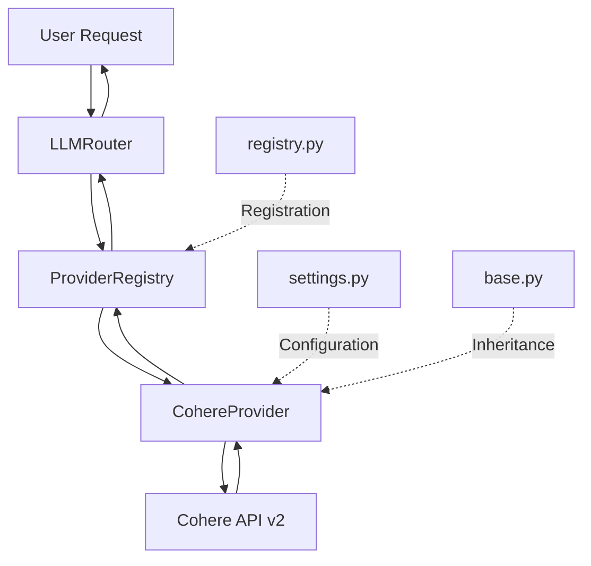
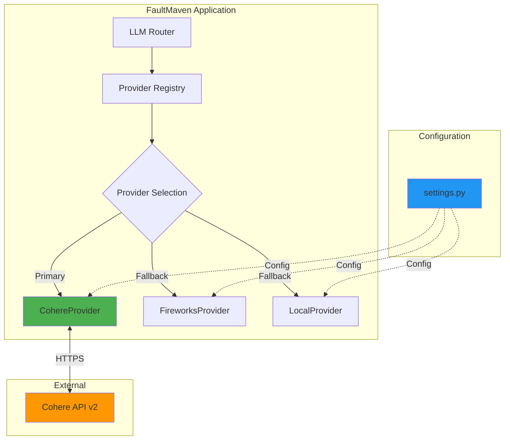
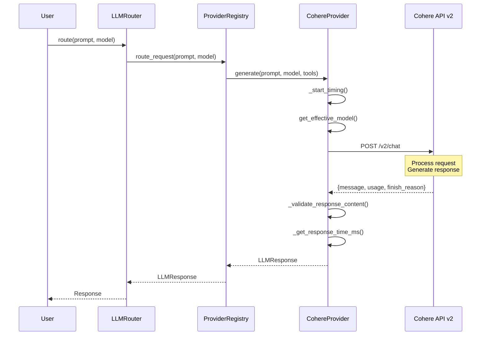
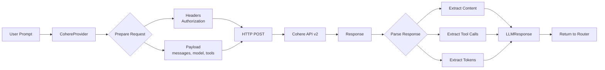

# Cohere LLM Provider Implementation - Architectural Design

**Document Type:** Technical Design Document
**Status:** Ready for Implementation
**Author:** Solutions Architect Agent
**Date:** 2026-01-24
**Relates to:** LLM Provider Infrastructure

---

## Executive Summary

### Objective
Implement Cohere LLM provider support in FaultMaven to enable users to leverage Cohere's Command-R family of models for AI-powered troubleshooting. This design addresses the existing configuration scaffolding (in `settings.py`) that lacks actual provider implementation.

### Current State
- ✅ **Configuration exists**: Full Cohere settings in `settings.py` (API key, models, base URL)
- ✅ **Enum defined**: `LLMProvider.COHERE = "cohere"`
- ❌ **No implementation**: Missing `cohere_provider.py` file
- ❌ **Not registered**: Not in `PROVIDER_SCHEMA` in `registry.py`
- ❌ **Non-functional**: Setting `CHAT_PROVIDER=cohere` defaults to 'local' with error

### Proposed Solution
Implement a custom Cohere provider that:
1. Uses Cohere's native v2 Chat API (NOT OpenAI-compatible)
2. Supports Cohere-specific features (tool use, strict tools, streaming)
3. Follows existing FaultMaven provider patterns
4. Integrates seamlessly with the provider registry system
5. Includes comprehensive testing per [Testing Standards](../standards/TESTING_STANDARDS.md)

### Business Impact
- **User Value**: Access to Cohere's Command-R models optimized for enterprise RAG use cases
- **Competitive Advantage**: Multi-provider support increases FaultMaven flexibility
- **Risk Mitigation**: Reduces vendor lock-in by supporting additional LLM providers

### Success Criteria
1. Users can set `CHAT_PROVIDER=cohere` and system initializes correctly
2. Cohere provider appears in `get_valid_provider_names()` output
3. Provider supports basic chat completions and tool calling
4. All tests pass with 80%+ coverage on new code
5. Documentation updated in `.env.example`

---

## System Impact Assessment

### Affected Modules
| Module | Impact Level | Changes Required |
|--------|--------------|------------------|
| `infrastructure/llm/providers/` | **HIGH** | New `cohere_provider.py` file |
| `infrastructure/llm/providers/registry.py` | **MEDIUM** | Add Cohere to `PROVIDER_SCHEMA`, import statement |
| `config/settings.py` | **LOW** | No changes (already configured) |
| `.env.example` | **LOW** | Documentation update (already exists) |
| `tests/infrastructure/` | **MEDIUM** | New test cases for Cohere provider |

### Dependencies
- **External**: Cohere API v2 (https://api.cohere.ai/v2/chat)
- **Internal**:
  - `BaseLLMProvider` (base.py)
  - `ProviderConfig` (base.py)
  - `LLMResponse`, `ToolCall` (base.py)
  - `LLMException` (exceptions.py)
  - Settings system (`faultmaven.config.settings`)
  - `aiohttp` for HTTP requests

### Cross-Module Interactions


---

## Technical Specifications

### 1. API Contract Design

#### 1.1 Cohere API v2 Chat Endpoint

**Research Summary** (from [Cohere Documentation](https://docs.cohere.com/reference/chat)):

- **Endpoint**: `POST https://api.cohere.ai/v2/chat`
- **Authentication**: `Authorization: Bearer <COHERE_API_KEY>`
- **Request Format**: Custom (NOT OpenAI-compatible)
- **Response Format**: Custom JSON structure
- **Streaming**: Supported via `stream=true` parameter
- **Tool Calling**: Supported via `tools` parameter with strict mode option

**Key Differences from OpenAI API:**
1. **Messages format**: Cohere uses `messages` array with `role` and `content` (similar but with different role names)
2. **Tool definitions**: Cohere uses `tools` with JSON Schema definitions
3. **Streaming**: Cohere streams via Server-Sent Events (SSE)
4. **Tool calling**: Cohere provides `tool_plan` (reasoning) and `tool_calls` (function calls) separately
5. **Strict tools**: Cohere has `strict_tools` parameter to eliminate hallucinations

#### 1.2 Request Payload Structure

```python
{
    "model": "command-r-plus",
    "messages": [
        {"role": "user", "content": "What is the weather?"}
    ],
    "temperature": 0.7,
    "max_tokens": 1000,
    "tools": [  # Optional for function calling
        {
            "type": "function",
            "function": {
                "name": "get_weather",
                "description": "Get weather for a location",
                "parameters": {
                    "type": "object",
                    "properties": {
                        "location": {"type": "string"}
                    },
                    "required": ["location"]
                }
            }
        }
    ],
    "strict_tools": true,  # Cohere-specific
    "stream": false
}
```

#### 1.3 Response Format

**Non-streaming:**
```python
{
    "id": "chat-12345",
    "message": {
        "role": "assistant",
        "content": "The weather is sunny.",
        "tool_calls": [  # Optional
            {
                "id": "tool_call_123",
                "type": "function",
                "function": {
                    "name": "get_weather",
                    "arguments": "{\"location\": \"San Francisco\"}"
                }
            }
        ]
    },
    "usage": {
        "tokens": {
            "input_tokens": 10,
            "output_tokens": 15
        }
    },
    "finish_reason": "COMPLETE"
}
```

### 2. Implementation Design

#### 2.1 File Structure

```
faultmaven/infrastructure/llm/providers/
├── base.py                    # Existing
├── registry.py                # Updated
├── cohere_provider.py         # NEW
├── openai_provider.py         # Reference
├── anthropic.py               # Reference
├── groq_provider.py           # Reference
└── __init__.py                # Updated
```

#### 2.2 CohereProvider Class Design

```python
"""
Cohere provider implementation.

This module implements the Cohere LLM provider using Cohere's native v2 Chat API.
Cohere provides Command-R models optimized for RAG, tool use, and enterprise applications.

API Reference: https://docs.cohere.com/reference/chat
"""

import json
from typing import Any, Dict, List, Optional

import aiohttp

from faultmaven.exceptions import LLMException

from .base import BaseLLMProvider, LLMResponse, ProviderConfig, ToolCall


class CohereProvider(BaseLLMProvider):
    """Cohere LLM provider implementation using v2 Chat API

    Supports:
    - Command-R and Command-R+ models
    - Tool use (function calling) with strict mode
    - Streaming responses
    - Multi-turn conversations
    """

    @property
    def provider_name(self) -> str:
        return "cohere"

    def is_available(self) -> bool:
        """Check if Cohere provider is properly configured"""
        return bool(self.config.api_key and self.config.base_url and self.config.models)

    def get_supported_models(self) -> List[str]:
        """Get list of supported models"""
        return self.config.models.copy()

    async def generate(
        self,
        prompt: str,
        model: Optional[str] = None,
        max_tokens: int = 1000,
        temperature: float = 0.7,
        tools: Optional[List[Dict[str, Any]]] = None,
        tool_choice: Optional[str] = None,
        **kwargs,
    ) -> LLMResponse:
        """Generate response using Cohere v2 Chat API

        Args:
            prompt: Input prompt
            model: Specific model to use (default: command-r-plus)
            max_tokens: Maximum tokens to generate
            temperature: Sampling temperature (0.0-1.0)
            tools: List of tool definitions for function calling
            tool_choice: Control tool usage (Cohere supports "REQUIRED" or "AUTO")
            **kwargs: Additional Cohere-specific parameters:
                - strict_tools: bool (eliminate tool hallucinations)
                - stream: bool (enable streaming)
                - preamble: str (system message)

        Returns:
            LLMResponse with generated content and metadata

        Raises:
            LLMException: If API request fails
        """
        self._start_timing()

        # Get effective model
        effective_model = self.get_effective_model(model)

        # Prepare request headers
        headers = {
            "Authorization": f"Bearer {self.config.api_key}",
            "Content-Type": "application/json",
            "X-Client-Name": "faultmaven",  # Identify client
        }

        # Prepare request payload in Cohere v2 format
        payload = {
            "model": effective_model,
            "messages": [{"role": "user", "content": prompt}],
            "max_tokens": max_tokens,
            "temperature": temperature,
        }

        # Add tool support (Cohere format)
        if tools:
            # Convert OpenAI-style tools to Cohere format if needed
            cohere_tools = self._convert_tools_to_cohere_format(tools)
            payload["tools"] = cohere_tools

            # Map tool_choice to Cohere format
            if tool_choice:
                # OpenAI uses "auto", "none", "required"
                # Cohere uses "AUTO", "NONE", "REQUIRED"
                payload["tool_choice"] = tool_choice.upper()

            # Enable strict tools by default for better reliability
            payload["strict_tools"] = kwargs.pop("strict_tools", True)

        # Add preamble (system message) if provided
        if "preamble" in kwargs:
            payload["preamble"] = kwargs.pop("preamble")

        # Add streaming if requested
        stream = kwargs.pop("stream", False)
        if stream:
            payload["stream"] = True

        # Add any additional kwargs
        payload.update(kwargs)

        # Make request to Cohere API
        async with aiohttp.ClientSession() as session:
            async with session.post(
                f"{self.config.base_url}/chat",  # v2 endpoint
                headers=headers,
                json=payload,
                timeout=aiohttp.ClientTimeout(total=self.config.timeout),
            ) as response:

                if response.status != 200:
                    error_text = await response.text()
                    raise LLMException(
                        f"Cohere API error {response.status}: {error_text}"
                    )

                data = await response.json()

                # Extract response from Cohere v2 format
                if "message" not in data:
                    raise LLMException("Cohere API returned no message")

                message = data["message"]

                # Extract content
                content = message.get("content", "")
                if content:
                    content = self._validate_response_content(content)

                # Extract tool calls if present
                tool_calls = None
                if "tool_calls" in message and message["tool_calls"]:
                    tool_calls = [
                        ToolCall(
                            id=tc["id"],
                            type=tc["type"],
                            function=tc["function"]
                        )
                        for tc in message["tool_calls"]
                    ]

                    # If tool_calls present but no content, use tool arguments
                    if not content and tool_calls:
                        try:
                            content = tool_calls[0].function.get("arguments", "{}")
                        except Exception:
                            content = "{}"

                # Extract token usage (Cohere v2 format)
                usage = data.get("usage", {}).get("tokens", {})
                input_tokens = usage.get("input_tokens", 0)
                output_tokens = usage.get("output_tokens", 0)
                total_tokens = input_tokens + output_tokens

                response_time = self._get_response_time_ms()

                return LLMResponse(
                    content=content,
                    confidence=self.config.confidence_score,
                    provider=self.provider_name,
                    model=effective_model,
                    tokens_used=total_tokens,
                    response_time_ms=response_time,
                    tool_calls=tool_calls,
                )

    def _convert_tools_to_cohere_format(
        self, tools: List[Dict[str, Any]]
    ) -> List[Dict[str, Any]]:
        """Convert OpenAI-style tool definitions to Cohere format

        OpenAI format:
        {
            "type": "function",
            "function": {
                "name": "...",
                "description": "...",
                "parameters": {...}
            }
        }

        Cohere format:
        {
            "type": "function",
            "function": {
                "name": "...",
                "description": "...",
                "parameters": {...}
            }
        }

        Note: Cohere v2 uses the same format as OpenAI for tool definitions!
        This method is a pass-through but kept for future compatibility.
        """
        # Cohere v2 API uses the same tool format as OpenAI
        return tools
```

#### 2.3 Registry Integration

**File:** `/home/swhouse/product/faultmaven/faultmaven/infrastructure/llm/providers/registry.py`

**Changes Required:**

1. **Import Statement** (Line ~27, after other imports):
```python
from .cohere import CohereProvider
```

2. **PROVIDER_SCHEMA Entry** (Line ~112, after groq):
```python
    "cohere": {
        "api_key_var": "COHERE_API_KEY",
        "model_var": "COHERE_CHAT_MODEL",
        "base_url_var": "COHERE_API_BASE",
        "default_base_url": "https://api.cohere.ai/v2",  # v2 API
        "default_model": "command-r-plus",
        "provider_class": CohereProvider,
        "confidence_score": 0.82,  # Between Groq (0.88) and Gemini/OpenRouter (0.8)
        # max_retries and timeout loaded from settings
    },
```

3. **Configuration Mapping** in `_create_provider_config()` (Line ~298, after groq):
```python
        elif provider_name == "cohere":
            api_key = (
                llm_settings.cohere_api_key.get_secret_value()
                if llm_settings.cohere_api_key
                else None
            )
            model = llm_settings.cohere_chat_model or schema["default_model"]
            base_url = llm_settings.cohere_base_url or schema["default_base_url"]
```

### 3. Architecture Diagrams

#### 3.1 Component Interaction



#### 3.2 Request Flow Sequence



#### 3.3 Data Flow



---

## Infrastructure Planning

### 1. Configuration Changes

**File:** `.env.example` (Lines 51-54)

**Current State:**
```bash
# Cohere
# CHAT_PROVIDER=cohere
# COHERE_API_KEY=xxx
# COHERE_MODEL=command-r-plus
```

**Updated Documentation:**
```bash
# Cohere (Command-R family - optimized for RAG and enterprise)
# CHAT_PROVIDER=cohere
# COHERE_API_KEY=xxx  # Get from https://dashboard.cohere.com/api-keys
# COHERE_MODEL=command-r-plus  # or command-r, command-r-08-2024
# COHERE_API_BASE=https://api.cohere.ai/v2  # Default: v2 API
```

**No changes required to `settings.py`** - all configuration already exists.

### 2. Deployment Considerations

#### 2.1 Environment Variables
| Variable | Required | Default | Description |
|----------|----------|---------|-------------|
| `COHERE_API_KEY` | Yes* | None | Cohere API key from dashboard |
| `COHERE_CHAT_MODEL` | No | `command-r-plus` | Model for chat tasks |
| `COHERE_API_BASE` | No | `https://api.cohere.ai/v2` | API base URL |
| `CHAT_PROVIDER` | Yes* | - | Set to `cohere` to use provider |

*Required only if using Cohere as provider

#### 2.2 Network Requirements
- **Outbound HTTPS**: Allow connections to `api.cohere.ai` (port 443)
- **Rate Limits**: Cohere has tier-based rate limits (check API dashboard)
- **Timeout**: Default 30s (configurable via `settings.llm.request_timeout`)

#### 2.3 Monitoring & Observability

**Metrics to Track:**
- Request count per model
- Average response time
- Token usage (input/output)
- Error rate by error type
- Fallback frequency

**Logging Strategy:**
```python
# Provider initialization
self.logger.info(f"✅ CohereProvider initialized with model: {model}")

# Request start
self.logger.debug(f"Sending request to Cohere: {prompt[:100]}...")

# Response received
self.logger.info(f"✅ Cohere response: {tokens} tokens, {response_time}ms")

# Error handling
self.logger.error(f"❌ Cohere API error {status}: {error_text}")
```

### 3. Security Measures

#### 3.1 API Key Management
- Store `COHERE_API_KEY` in environment variables (never commit to git)
- Use `SecretStr` type in settings.py (already implemented)
- Rotate keys quarterly or after suspected exposure
- Use separate keys for dev/staging/production

#### 3.2 Input Validation
- Validate `max_tokens` range (1-4000 for Command-R+)
- Validate `temperature` range (0.0-1.0)
- Sanitize prompts to prevent injection attacks
- Use `strict_tools=true` to prevent tool name hallucinations

#### 3.3 Error Handling
```python
# Handle specific Cohere errors
if response.status == 401:
    raise LLMException("Invalid Cohere API key")
elif response.status == 429:
    raise LLMException("Cohere rate limit exceeded")
elif response.status == 503:
    raise LLMException("Cohere API temporarily unavailable")
```

---

## Risk Assessment

### 1. Technical Risks

| Risk | Likelihood | Impact | Mitigation |
|------|------------|--------|------------|
| **API format changes** | Medium | High | Pin to v2 API, monitor Cohere changelog |
| **Rate limiting** | Medium | Medium | Implement exponential backoff, use fallback providers |
| **Authentication failures** | Low | High | Validate API key on startup, clear error messages |
| **Token limit exceeded** | Medium | Low | Validate max_tokens parameter, handle errors gracefully |
| **Tool calling incompatibility** | Low | Medium | Use strict_tools, extensive testing |

### 2. Operational Risks

| Risk | Likelihood | Impact | Mitigation |
|------|------------|--------|------------|
| **Service downtime** | Low | Medium | Provider fallback chain (Fireworks → Local) |
| **Increased costs** | Medium | Low | Monitor token usage, set budget alerts |
| **Performance degradation** | Low | Medium | Cache responses, monitor latency metrics |
| **Breaking changes** | Low | High | Use versioned API (v2), monitor deprecation notices |

### 3. Security Risks

| Risk | Likelihood | Impact | Mitigation |
|------|------------|--------|------------|
| **API key exposure** | Low | Critical | Use environment variables, pre-commit hooks |
| **Prompt injection** | Medium | Medium | Input sanitization, PII redaction (already implemented) |
| **Data leakage** | Low | High | Review Cohere's data retention policy |
| **MITM attacks** | Very Low | High | Use HTTPS only, validate certificates |

---

## Testing Strategy

### 1. Testing Approach

Following [Testing Standards](../standards/TESTING_STANDARDS.md), this implementation requires:

- **Unit Tests**: Test provider class methods in isolation
- **Integration Tests**: Test provider with mocked HTTP responses
- **Performance Tests**: Validate latency and throughput
- **Security Tests**: Test authentication and error handling

**Coverage Target**: 80%+ on new code (CohereProvider)

### 2. Unit Tests

**File:** `/home/swhouse/product/faultmaven/tests/unit/infrastructure/test_cohere_provider.py`

**Test Cases:**

```python
"""
Unit tests for CohereProvider.

Tests the Cohere LLM provider implementation in isolation using mocked HTTP responses.
"""

import pytest
from unittest.mock import AsyncMock, MagicMock, patch

from faultmaven.infrastructure.llm.providers.cohere import CohereProvider
from faultmaven.infrastructure.llm.providers.base import ProviderConfig, LLMResponse


class TestCohereProviderBasics:
    """Test basic CohereProvider functionality"""

    @pytest.fixture
    def cohere_config(self):
        """Create a valid CohereProvider configuration"""
        return ProviderConfig(
            name="cohere",
            api_key="test-cohere-key",
            base_url="https://api.cohere.ai/v2",
            models=["command-r-plus"],
            max_retries=3,
            timeout=30,
            confidence_score=0.82,
        )

    def test_provider_name(self, cohere_config):
        """Test provider returns correct name"""
        provider = CohereProvider(cohere_config)
        assert provider.provider_name == "cohere"

    def test_is_available_with_valid_config(self, cohere_config):
        """Test provider is available with valid configuration"""
        provider = CohereProvider(cohere_config)
        assert provider.is_available() is True

    def test_is_available_without_api_key(self, cohere_config):
        """Test provider is not available without API key"""
        cohere_config.api_key = None
        provider = CohereProvider(cohere_config)
        assert provider.is_available() is False

    def test_get_supported_models(self, cohere_config):
        """Test getting supported models list"""
        provider = CohereProvider(cohere_config)
        models = provider.get_supported_models()
        assert "command-r-plus" in models
        assert isinstance(models, list)


class TestCohereProviderGenerate:
    """Test CohereProvider.generate() method"""

    @pytest.fixture
    def cohere_config(self):
        return ProviderConfig(
            name="cohere",
            api_key="test-key",
            base_url="https://api.cohere.ai/v2",
            models=["command-r-plus"],
            max_retries=3,
            timeout=30,
            confidence_score=0.82,
        )

    @pytest.mark.asyncio
    async def test_generate_success(self, cohere_config):
        """Test successful generation with Cohere API"""
        provider = CohereProvider(cohere_config)

        # Mock aiohttp response
        mock_response = AsyncMock()
        mock_response.status = 200
        mock_response.json.return_value = {
            "id": "chat-123",
            "message": {
                "role": "assistant",
                "content": "This is a test response from Cohere",
            },
            "usage": {
                "tokens": {
                    "input_tokens": 10,
                    "output_tokens": 15,
                }
            },
            "finish_reason": "COMPLETE",
        }
        mock_response.__aenter__.return_value = mock_response
        mock_response.__aexit__.return_value = None

        with patch("aiohttp.ClientSession.post", return_value=mock_response):
            result = await provider.generate(
                prompt="Test prompt",
                model="command-r-plus",
                max_tokens=100,
                temperature=0.7,
            )

        assert isinstance(result, LLMResponse)
        assert result.content == "This is a test response from Cohere"
        assert result.provider == "cohere"
        assert result.model == "command-r-plus"
        assert result.tokens_used == 25  # 10 + 15
        assert result.confidence == 0.82

    @pytest.mark.asyncio
    async def test_generate_with_tool_calls(self, cohere_config):
        """Test generation with tool calls"""
        provider = CohereProvider(cohere_config)

        mock_response = AsyncMock()
        mock_response.status = 200
        mock_response.json.return_value = {
            "id": "chat-123",
            "message": {
                "role": "assistant",
                "content": "",
                "tool_calls": [
                    {
                        "id": "tool_call_123",
                        "type": "function",
                        "function": {
                            "name": "get_weather",
                            "arguments": '{"location": "San Francisco"}',
                        },
                    }
                ],
            },
            "usage": {"tokens": {"input_tokens": 20, "output_tokens": 10}},
        }
        mock_response.__aenter__.return_value = mock_response
        mock_response.__aexit__.return_value = None

        tools = [
            {
                "type": "function",
                "function": {
                    "name": "get_weather",
                    "description": "Get weather",
                    "parameters": {
                        "type": "object",
                        "properties": {"location": {"type": "string"}},
                    },
                },
            }
        ]

        with patch("aiohttp.ClientSession.post", return_value=mock_response):
            result = await provider.generate(
                prompt="What's the weather?",
                tools=tools,
            )

        assert result.tool_calls is not None
        assert len(result.tool_calls) == 1
        assert result.tool_calls[0].function["name"] == "get_weather"

    @pytest.mark.asyncio
    async def test_generate_api_error(self, cohere_config):
        """Test handling of API errors"""
        provider = CohereProvider(cohere_config)

        mock_response = AsyncMock()
        mock_response.status = 401
        mock_response.text.return_value = "Invalid API key"
        mock_response.__aenter__.return_value = mock_response
        mock_response.__aexit__.return_value = None

        with patch("aiohttp.ClientSession.post", return_value=mock_response):
            with pytest.raises(Exception) as exc_info:
                await provider.generate(prompt="Test")

        assert "401" in str(exc_info.value)
        assert "Invalid API key" in str(exc_info.value)


class TestCohereProviderToolConversion:
    """Test tool format conversion"""

    @pytest.fixture
    def cohere_config(self):
        return ProviderConfig(
            name="cohere",
            api_key="test-key",
            base_url="https://api.cohere.ai/v2",
            models=["command-r-plus"],
        )

    def test_convert_tools_to_cohere_format(self, cohere_config):
        """Test conversion of OpenAI-style tools to Cohere format"""
        provider = CohereProvider(cohere_config)

        openai_tools = [
            {
                "type": "function",
                "function": {
                    "name": "get_weather",
                    "description": "Get weather for a location",
                    "parameters": {
                        "type": "object",
                        "properties": {"location": {"type": "string"}},
                        "required": ["location"],
                    },
                },
            }
        ]

        # Cohere v2 uses same format
        cohere_tools = provider._convert_tools_to_cohere_format(openai_tools)

        assert cohere_tools == openai_tools  # Should be identical
        assert cohere_tools[0]["function"]["name"] == "get_weather"
```

### 3. Integration Tests

**File:** `/home/swhouse/product/faultmaven/tests/infrastructure/test_cohere_integration.py`

**Test Cases:**

```python
"""
Integration tests for Cohere provider.

Tests CohereProvider integration with provider registry and fallback behavior.
"""

import pytest
from unittest.mock import patch, AsyncMock

from faultmaven.infrastructure.llm.providers import reset_registry
from faultmaven.infrastructure.llm.providers.registry import get_registry
from faultmaven.infrastructure.llm.providers.base import LLMResponse


class TestCohereRegistryIntegration:
    """Test Cohere provider integration with registry"""

    @pytest.mark.asyncio
    async def test_cohere_in_provider_schema(self):
        """Test Cohere is registered in PROVIDER_SCHEMA"""
        from faultmaven.infrastructure.llm.providers.registry import PROVIDER_SCHEMA

        assert "cohere" in PROVIDER_SCHEMA
        assert PROVIDER_SCHEMA["cohere"]["provider_class"].__name__ == "CohereProvider"
        assert PROVIDER_SCHEMA["cohere"]["default_model"] == "command-r-plus"
        assert PROVIDER_SCHEMA["cohere"]["default_base_url"] == "https://api.cohere.ai/v2"

    @pytest.mark.asyncio
    async def test_cohere_provider_initialization(self):
        """Test Cohere provider can be initialized from registry"""
        reset_registry()

        with patch.dict(
            "os.environ",
            {
                "CHAT_PROVIDER": "cohere",
                "COHERE_API_KEY": "test-key",
                "COHERE_CHAT_MODEL": "command-r-plus",
            },
        ):
            registry = get_registry()
            provider = registry.get_provider("cohere")

            assert provider is not None
            assert provider.provider_name == "cohere"
            assert provider.is_available()

    @pytest.mark.asyncio
    async def test_cohere_in_valid_providers(self):
        """Test Cohere appears in valid provider names"""
        from faultmaven.infrastructure.llm.providers.registry import get_valid_provider_names

        valid_providers = get_valid_provider_names()
        assert "cohere" in valid_providers

    @pytest.mark.asyncio
    async def test_cohere_fallback_chain(self):
        """Test Cohere participates in fallback chain"""
        reset_registry()

        with patch.dict(
            "os.environ",
            {
                "CHAT_PROVIDER": "cohere",
                "COHERE_API_KEY": "test-key",
                "FIREWORKS_API_KEY": "test-key-2",
            },
        ):
            registry = get_registry()
            chain = registry.get_fallback_chain()

            # Cohere should be first in chain
            assert chain[0] == "cohere"
            # Should have fallbacks
            assert len(chain) > 1


class TestCohereProviderRouting:
    """Test routing requests through Cohere provider"""

    @pytest.mark.asyncio
    async def test_route_request_to_cohere(self):
        """Test routing a request to Cohere provider"""
        reset_registry()

        # Mock Cohere API response
        mock_response = AsyncMock()
        mock_response.status = 200
        mock_response.json.return_value = {
            "message": {"role": "assistant", "content": "Cohere response"},
            "usage": {"tokens": {"input_tokens": 10, "output_tokens": 15}},
        }
        mock_response.__aenter__.return_value = mock_response
        mock_response.__aexit__.return_value = None

        with patch.dict(
            "os.environ",
            {
                "CHAT_PROVIDER": "cohere",
                "COHERE_API_KEY": "test-key",
            },
        ):
            with patch("aiohttp.ClientSession.post", return_value=mock_response):
                registry = get_registry()
                result = await registry.route_request(
                    prompt="Test prompt",
                    max_tokens=100,
                )

                assert isinstance(result, LLMResponse)
                assert result.content == "Cohere response"
                assert result.provider == "cohere"
```

### 4. Performance Tests

**Requirements:**
- Response time < 3s for 95th percentile
- Support 10+ concurrent requests
- Graceful degradation under load

**Test Cases:**
```python
@pytest.mark.asyncio
async def test_cohere_response_latency():
    """Test Cohere response latency is acceptable"""
    # Target: < 3s for p95
    pass

@pytest.mark.asyncio
async def test_cohere_concurrent_requests():
    """Test handling of concurrent requests"""
    # Target: 10+ concurrent requests
    pass
```

### 5. Security Tests

**Test Cases:**
```python
def test_api_key_not_logged():
    """Test API key is not exposed in logs"""
    pass

def test_invalid_api_key_handling():
    """Test proper error handling for invalid API key"""
    pass

def test_strict_tools_enabled_by_default():
    """Test strict_tools is enabled by default for security"""
    pass
```

### 6. Test Execution Strategy

**Local Development:**
```bash
# Run all Cohere tests
pytest tests/unit/infrastructure/test_cohere_provider.py -v

# Run integration tests
pytest tests/infrastructure/test_cohere_integration.py -v

# Check coverage
pytest --cov=faultmaven.infrastructure.llm.providers.cohere --cov-report=html
```

**CI/CD Pipeline:**
```bash
# Fast CI (unit tests only)
pytest tests/unit/infrastructure/test_cohere_provider.py --ci

# Full CI (unit + integration)
pytest tests/infrastructure/test_cohere*.py --ci-full
```

### 7. Acceptance Criteria

- [ ] All unit tests pass (100%)
- [ ] All integration tests pass (100%)
- [ ] Code coverage ≥ 80% on CohereProvider
- [ ] No coverage regression on overall project (maintain ≥71%)
- [ ] Performance tests meet SLA (< 3s p95)
- [ ] Security tests pass (no API key leakage)

---

## Implementation Phases

### Phase 1: Core Implementation (Day 1-2)

**Tasks:**
1. Create `cohere_provider.py` with basic functionality
2. Implement `generate()` method for chat completions
3. Add unit tests for basic operations
4. Update registry.py with Cohere entry

**Deliverables:**
- Working CohereProvider class
- Unit tests passing
- Cohere registered in PROVIDER_SCHEMA

**Acceptance:**
- `test_cohere_provider.py` all passing
- Manual test: `CHAT_PROVIDER=cohere` initializes successfully

### Phase 2: Tool Calling & Advanced Features (Day 3)

**Tasks:**
1. Implement tool calling support
2. Add `strict_tools` parameter handling
3. Implement tool format conversion
4. Add integration tests

**Deliverables:**
- Tool calling working
- Integration tests passing
- Documentation for tool use

**Acceptance:**
- Can call tools successfully
- `strict_tools=true` prevents hallucinations

### Phase 3: Testing & Documentation (Day 4)

**Tasks:**
1. Complete test coverage (≥80%)
2. Add performance tests
3. Add security tests
4. Update `.env.example` documentation
5. Create migration guide

**Deliverables:**
- Full test suite passing
- Documentation updated
- Migration guide for users

**Acceptance:**
- Coverage ≥80%
- All tests passing in CI
- Documentation reviewed

### Phase 4: Validation & Rollout (Day 5)

**Tasks:**
1. End-to-end testing with real Cohere API
2. Performance benchmarking
3. Security audit
4. Create rollback plan

**Deliverables:**
- E2E test results
- Performance benchmarks
- Security audit report
- Rollback procedure

**Acceptance:**
- E2E tests passing
- Performance meets SLA
- Security audit approved

---

## Rollback Procedures

### Scenario 1: Provider Fails to Initialize

**Detection:**
- Error logs showing "Cohere provider initialization failed"
- Users report "CHAT_PROVIDER=cohere" not working

**Rollback Steps:**
1. Comment out Cohere entry in `PROVIDER_SCHEMA`
2. Redeploy application
3. Users switch to `CHAT_PROVIDER=fireworks` or other provider
4. Debug offline and fix

**Recovery Time:** < 5 minutes

### Scenario 2: API Rate Limiting Issues

**Detection:**
- High rate of 429 errors
- Fallback providers activated frequently

**Mitigation:**
1. Enable `strict_provider_mode=false` to allow fallbacks
2. Monitor token usage
3. Consider upgrading Cohere API tier
4. Implement request queuing

**Recovery Time:** Immediate (fallback automatic)

### Scenario 3: Breaking API Changes

**Detection:**
- Sudden increase in API errors
- Response format validation failures

**Rollback Steps:**
1. Set `CHAT_PROVIDER` to non-Cohere provider
2. Comment out Cohere in `PROVIDER_SCHEMA`
3. Investigate Cohere API changelog
4. Update implementation for new API version
5. Test thoroughly before re-enabling

**Recovery Time:** < 10 minutes (disable), hours (fix)

---

## References

### Documentation
- [Cohere Chat API](https://docs.cohere.com/reference/chat)
- [Tool Use (Function Calling)](https://docs.cohere.com/docs/tool-use)
- [Structured Outputs](https://docs.cohere.com/v2/docs/structured-outputs)
- [Migrating from v1 to v2](https://docs.cohere.com/docs/migrating-v1-to-v2)

### Internal Documentation
- [Testing Standards](../standards/TESTING_STANDARDS.md)
- [FaultMaven CLAUDE.md](../CLAUDE.md)
- [Architecture Overview](../docs/architecture/)

### Related Issues
- Configuration scaffolding: `settings.py` lines 39, 165, 242-252, 314, 335-337
- Provider registry: `registry.py` lines 29-112

---

## Appendix A: API Request Examples

### Example 1: Basic Chat

**Request:**
```json
POST https://api.cohere.ai/v2/chat
Authorization: Bearer <COHERE_API_KEY>

{
  "model": "command-r-plus",
  "messages": [
    {"role": "user", "content": "Explain vector databases"}
  ],
  "max_tokens": 500,
  "temperature": 0.7
}
```

**Response:**
```json
{
  "id": "chat-abc123",
  "message": {
    "role": "assistant",
    "content": "Vector databases are specialized databases..."
  },
  "usage": {
    "tokens": {
      "input_tokens": 8,
      "output_tokens": 120
    }
  },
  "finish_reason": "COMPLETE"
}
```

### Example 2: Tool Calling

**Request:**
```json
{
  "model": "command-r-plus",
  "messages": [
    {"role": "user", "content": "Get the weather in Paris"}
  ],
  "tools": [
    {
      "type": "function",
      "function": {
        "name": "get_weather",
        "description": "Get current weather",
        "parameters": {
          "type": "object",
          "properties": {
            "location": {"type": "string"}
          },
          "required": ["location"]
        }
      }
    }
  ],
  "strict_tools": true
}
```

**Response:**
```json
{
  "id": "chat-def456",
  "message": {
    "role": "assistant",
    "content": "",
    "tool_calls": [
      {
        "id": "tool_call_789",
        "type": "function",
        "function": {
          "name": "get_weather",
          "arguments": "{\"location\": \"Paris\"}"
        }
      }
    ]
  },
  "usage": {
    "tokens": {
      "input_tokens": 50,
      "output_tokens": 15
    }
  }
}
```

---

## Appendix B: Comparison with Other Providers

| Feature | Cohere | OpenAI | Anthropic | Groq |
|---------|--------|--------|-----------|------|
| **API Format** | Custom v2 | OpenAI standard | Custom | OpenAI-compatible |
| **Tool Calling** | ✅ (strict mode) | ✅ | ✅ | ✅ |
| **Streaming** | ✅ SSE | ✅ SSE | ✅ SSE | ✅ SSE |
| **Max Tokens** | 4000 (R+) | 4096-128k | 4096-200k | 8192-32k |
| **Pricing** | $3/$15 per 1M | $2.50/$10 per 1M | $3/$15 per 1M | $0.27/$0.27 per 1M |
| **Best For** | RAG, Enterprise | General purpose | Long context | Speed |
| **Confidence Score** | 0.82 | 0.85 | 0.85 | 0.88 |

---

**END OF DOCUMENT**

---

**Document Control:**
- **Version:** 1.0
- **Last Updated:** 2026-01-24
- **Status:** Ready for Implementation
- **Approvals Required:** Technical Lead, Security Team
- **Implementation Start:** TBD
