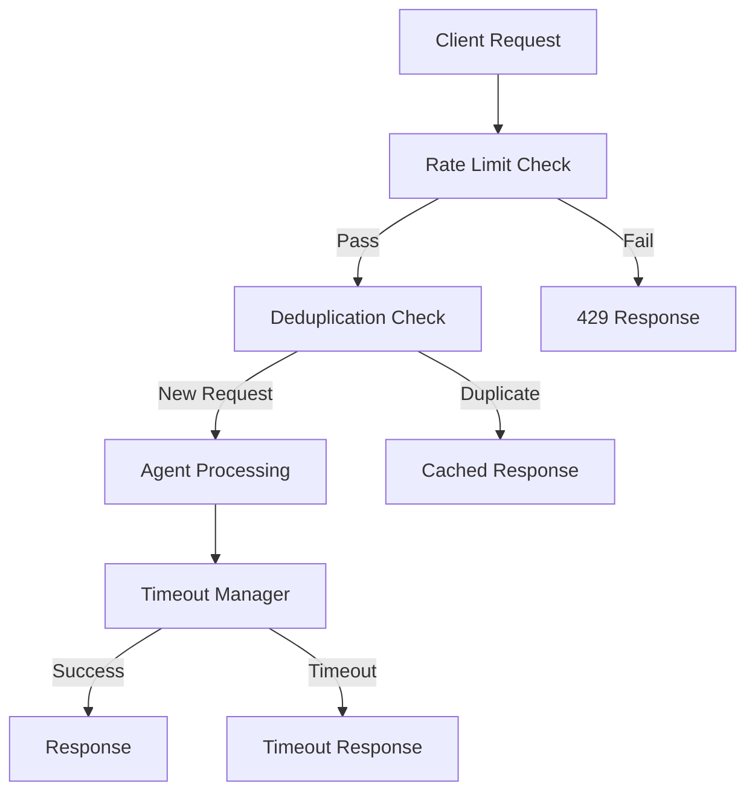

# Client Protection Implementation Guide

## Implementation Architecture

### Middleware Stack Order

```python
# FastAPI Middleware Stack (order matters!)
app.add_middleware(CORSMiddleware, ...)          # 1. CORS (outermost)
app.add_middleware(GZipMiddleware, ...)          # 2. Compression
app.add_middleware(LoggingMiddleware, ...)       # 3. Request logging
app.add_middleware(RateLimitMiddleware, ...)     # 4. Rate limiting (NEW)
app.add_middleware(DeduplicationMiddleware, ...) # 5. Deduplication (NEW)
app.add_middleware(PerformanceMiddleware, ...)   # 6. Performance tracking
app.add_middleware(SystemOptimizationMiddleware, ...) # 7. System optimization
```

### Component Integration



## Directory Structure

```
faultmaven/
├── api/
│   └── middleware/
│       ├── rate_limiting.py      # NEW: Rate limiting middleware
│       ├── deduplication.py      # NEW: Request deduplication
│       └── timeout_manager.py    # NEW: Agent timeout management
├── infrastructure/
│   └── protection/
│       ├── __init__.py           # NEW: Protection module
│       ├── rate_limiter.py       # NEW: Rate limiting backend
│       ├── request_hasher.py     # NEW: Request hashing logic
│       └── timeout_handler.py    # NEW: Timeout handling
├── models/
│   └── protection.py            # NEW: Protection data models
├── config/
│   └── protection.py            # NEW: Protection configuration
└── docs/
    └── security/
        ├── client-protection.md  # ✅ Created
        └── implementation-guide.md # ✅ This file
```

## Implementation Steps

### Step 1: Core Infrastructure

1. **Create protection models and configuration**
2. **Implement Redis-backed rate limiter**
3. **Create request hashing utilities**
4. **Implement timeout management**

### Step 2: Middleware Implementation

1. **Rate limiting middleware**
2. **Deduplication middleware**
3. **Timeout manager integration**
4. **Error handling and responses**

### Step 3: Integration

1. **Add middleware to FastAPI app**
2. **Configure dependencies and settings**
3. **Update container.py for DI**
4. **Add configuration to .env.example**

### Step 4: Testing & Validation

1. **Unit tests for each component**
2. **Integration tests for middleware stack**
3. **Load testing and performance validation**
4. **Security testing and attack simulation**

## Configuration Management

### Settings Hierarchy

**Protection settings are not environment-configurable.** They come from one of
two presets in `faultmaven/config/protection.py`, and the only thing the
environment chooses is *which preset*: `ENVIRONMENT=development` (or an unset
`ENVIRONMENT`, which defaults to `development`) selects the lenient one, and
every other explicit value — `staging`, `production`, anything unrecognised —
selects production's (fm#1023). The settings-driven loader that once read
per-field environment variables was unreachable and has been removed, along with
the keys it read. Setting any of these today does nothing — they are enumerated
rather than globbed because a `RATE_LIMIT_*` glob would wrongly sweep in two
spellings that are still live:

- `RATE_LIMITING_ENABLED`, `DEDUPLICATION_ENABLED`, `TIMEOUTS_ENABLED`
- `RATE_LIMIT_GLOBAL`, `RATE_LIMIT_PER_SESSION`, `RATE_LIMIT_PER_SESSION_HOURLY`,
  `RATE_LIMIT_PER_SESSION_READ`, `RATE_LIMIT_PER_SESSION_READ_HOURLY`,
  `RATE_LIMIT_TITLE_GENERATION` — each a `requests:window` pair
- `DEDUP_DEFAULT_TTL`
- `TIMEOUT_AGENT_TOTAL`, `TIMEOUT_AGENT_PHASE`, `TIMEOUT_LLM_CALL`,
  `TIMEOUT_EMERGENCY_SHUTDOWN`
- `BASIC_PROTECTION_ENABLED`, `PROTECTION_BYPASS_HEADERS`, `REDIS_KEY_PREFIX`

`RATE_LIMIT_ENABLED`, `RATE_LIMIT_REQUESTS_PER_MINUTE` and
`RATE_LIMIT_BURST_SIZE` are gone too (fm#985 item 16). They were
`settings.security` fields rather than loader inputs, so fm#1023 left them
standing, but no enforcement path read them either. Setting one is now inert
rather than fatal — `SecuritySettings` ignores unknown keys. Whether a
deployment is actually rate limited is answered by `GET /admin/config/status`,
which reads the middleware stack. See
[client-protection.md](client-protection.md) for the same list from the
operator's side.

Two keys do still reach the presets, and only these two:

1. `PROTECTION_RATE_LIMIT_FAIL_OPEN` — the Redis degrade policy. Read by the
   development preset; the production preset pins fail-*closed* and ignores it.
2. `PROTECTION_TRUSTED_PROXIES` — which proxies' `X-Forwarded-For` may be
   believed. Honoured by both presets; empty by default.

Changing a limit, a TTL or a timeout means editing the preset.

### Feature Flags

`ProtectionSettings` (`faultmaven/models/protection.py`) is the in-process shape
the presets produce. Its fields are code, not configuration:

```python
class ProtectionSettings(BaseModel):
    enabled: bool = True                       # both presets pin True
    rate_limiting_enabled: bool = True
    deduplication_enabled: bool = True
    timeout_management_enabled: bool = True

    fail_open_on_redis_error: bool = True      # development honours the key;
                                               # production pins False
    fail_open_on_timeout_error: bool = False

    debug_protection: bool = False
    protection_bypass_headers: List[str] = []  # see below
```

**Bypass headers exist only in the development preset.** It sets
`["X-Dev-Bypass", "X-Test-Bypass"]`, and the mere *presence* of either header on
a request skips rate limiting entirely — which is why an unset `ENVIRONMENT` on
an internet-facing box is a hole rather than a default. The production preset
pins the list **empty**, and no environment variable can add to it.

## Error Handling Strategy

### Exception Hierarchy

```python
class ProtectionError(Exception):
    """Base protection system error"""
    pass

class RateLimitError(ProtectionError):
    """Rate limit exceeded"""
    def __init__(self, retry_after: int, limit_type: str):
        self.retry_after = retry_after
        self.limit_type = limit_type

class DuplicateRequestError(ProtectionError):
    """Duplicate request detected"""
    def __init__(self, original_timestamp: datetime):
        self.original_timestamp = original_timestamp

class TimeoutError(ProtectionError):
    """Operation timeout"""
    def __init__(self, operation: str, timeout_duration: float):
        self.operation = operation
        self.timeout_duration = timeout_duration
```

### Error Response Format

```python
@dataclass
class ProtectionErrorResponse:
    error_type: str
    message: str
    retry_after: Optional[int] = None
    error_code: str = ""
    correlation_id: str = ""
    timestamp: str = ""
    suggestions: List[str] = field(default_factory=list)
```

## Performance Considerations

### Memory Usage

- **Rate limiting**: ~90–120 bytes per *request* inside the window (see
  [Redis Usage](#redis-usage) for the per-key bound)
- **Deduplication**: ~64 bytes per unique request hash
- **Timeout tracking**: ~200 bytes per active operation

### CPU Overhead

- **Rate limiting**: ~0.1ms per request
- **Deduplication**: ~0.05ms per request (hashing)
- **Timeout management**: ~0.02ms per request

### Redis Usage

- **Keys**: Prefixed and namespaced (`fm:rl:`, `fm:dedup:`)
- **Memory (`fm:rl:`)**: each key is a sorted set holding one entry per *allowed*
  request inside the window, so it is bounded by the limit, not by the window
  duration — a refused request inserts nothing. Each entry is a 32-character
  member plus a float score, roughly 90–120 bytes with sorted-set overhead, so

  ```text
  bytes per saturated key ≈ limit × ~100
  total ≈ Σ over active keys
  ```

  Production's `global` limit of 500 therefore tops out around 50 KB per key.
  Keys carry a TTL of `window + 60` seconds, so one stops costing anything a
  little over a minute after its last request.
- **Operations**: ~2-3 Redis calls per request

## Security Implementation Details

### Rate Limiting Security

```python
# Prevent timing attacks
def constant_time_compare(a: str, b: str) -> bool:
    """Constant time string comparison"""
    return hmac.compare_digest(a.encode(), b.encode())

# Prevent enumeration attacks
def add_jitter(base_time: float) -> float:
    """Add random jitter to retry times"""
    return base_time + random.uniform(0, base_time * 0.1)
```

### Hash Security

Use a password KDF (PBKDF2, scrypt, argon2) only where the input really is a
secret and the digest really is exposed — password storage. Do not reach for one
to hash request content.

```python
# Content addressing: plain SHA-256 over length-prefixed components.
# Length prefixes, not delimiters, so no component's content can pose as a
# field boundary.
def content_hash(*components: str) -> str:
    digest = hashlib.sha256()
    for component in components:
        encoded = component.encode("utf-8")
        digest.update(f"{len(encoded)}:".encode("ascii"))
        digest.update(encoded)
    return digest.hexdigest()
```

A KDF here is not free caution — it is a live hazard. The dedup hasher used
PBKDF2-HMAC-SHA256 at 100,000 iterations to derive a Redis key from request
content: ~72–85 ms per call, run **synchronously inside async dispatch**, so it
stalled the whole event loop rather than one request. The digest was never a
secret and never returned to a client, and the salt was a literal in the source,
so it bought nothing for the cost.

## Monitoring Integration

### Metrics Collection

```python
# Prometheus metrics
protection_requests_total = Counter(
    'protection_requests_total',
    'Total protection checks',
    ['protection_type', 'result']
)

protection_duration_seconds = Histogram(
    'protection_duration_seconds',
    'Protection check duration',
    ['protection_type']
)
```

### Logging Standards

```python
# Structured logging format
{
    "event": "rate_limit_exceeded",
    "session_id": "abc123",
    "endpoint": "/api/v1/cases/{case_id}/queries",
    "limit_type": "per_session",
    "current_count": 15,
    "limit": 10,
    "window": 60,
    "retry_after": 45,
    "timestamp": "2025-01-16T10:30:00Z",
    "correlation_id": "req_456"
}
```

`limit_type` takes one of five values, not one: `global`, `per_session`,
`per_session_hourly`, `per_session_read`, `per_session_read_hourly`. **An alert
written against `per_session` alone sees no read refusals at all** — reads were
moved to their own pair of buckets in fm#994, so a throttled UI now reports
`per_session_read` or `per_session_read_hourly`. Match on the prefix
`per_session` (which covers all four) or enumerate them.

Note that `RateLimitMiddleware` currently emits this as a single formatted
message rather than as the structured fields above —
`Rate limit exceeded: per_session_read, count=121/120, retry_after=60s, ip=…,
session=…` — so a log-based alert has to match within the message text. The
structured shape above is the target, not what ships today.

## Testing Strategy

### Unit Test Coverage

- **Rate limiting algorithms**: 95%+
- **Hash generation**: 100%
- **Timeout mechanisms**: 90%+
- **Error handling**: 95%+

### Integration Test Scenarios

1. **Normal operation**: All protections pass
2. **Rate limit hit**: Proper 429 responses
3. **Duplicate detection**: Proper duplicate handling
4. **Timeout scenarios**: Graceful timeout handling
5. **Redis failures**: Graceful degradation
6. **High load**: Performance under stress

### Load Test Targets

- **1000 requests/second**: No protection failures
- **10K concurrent sessions**: Memory usage <100MB
- **Protection overhead**: <5ms per request
- **Redis response time**: <2ms 99th percentile

## Deployment Considerations

### Rolling Deployment

1. **Deploy with protections disabled**
2. **Verify application stability**
3. **Enable protections gradually**
4. **Monitor and tune thresholds**

### Rollback Plan

1. **Environment variable toggles**
2. **Redis key prefixing for isolation**
3. **Graceful degradation modes**
4. **Monitoring-based auto-rollback**

### Configuration Tuning

The shipped values live in `faultmaven/config/protection.py` and are tabulated in
[client-protection.md](client-protection.md). They are not repeated here: the
copy that used to sit in this section had drifted from every preset it claimed to
describe, and a tuning guide that disagrees with the code is worse than one that
points at it.

Two things to know before turning a dial:

- **Reads and writes are separate buckets.** `per_session` / `per_session_hourly`
  meter writes and the few embedding-backed GETs; `per_session_read` /
  `per_session_read_hourly` meter ordinary navigation. Raising `per_session`
  because the UI is being throttled treats the wrong bucket — that symptom is
  almost always the read pair.
- **Both read keys must be set together.** The middleware applies the split only
  when it finds both, and meters reads against the write buckets (logging why)
  when either is missing. That is deliberate: the limiter allows anything it
  holds no configuration for, so a half-configured split would leave reads
  unmetered rather than merely tighter.
