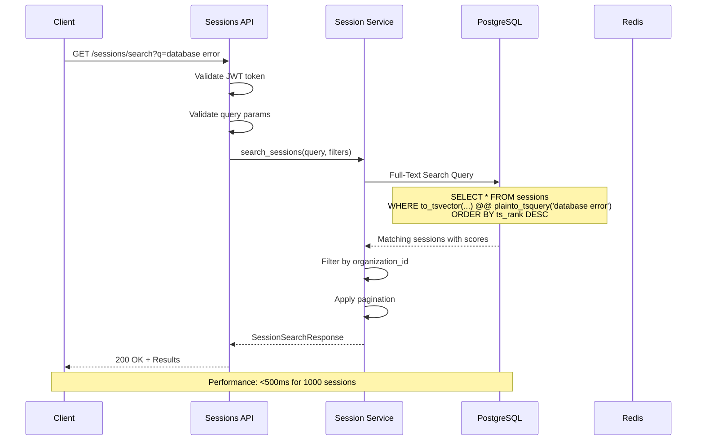
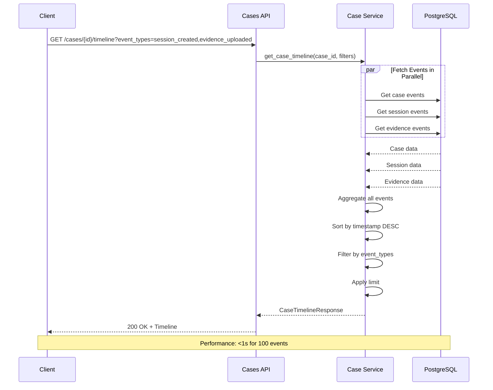
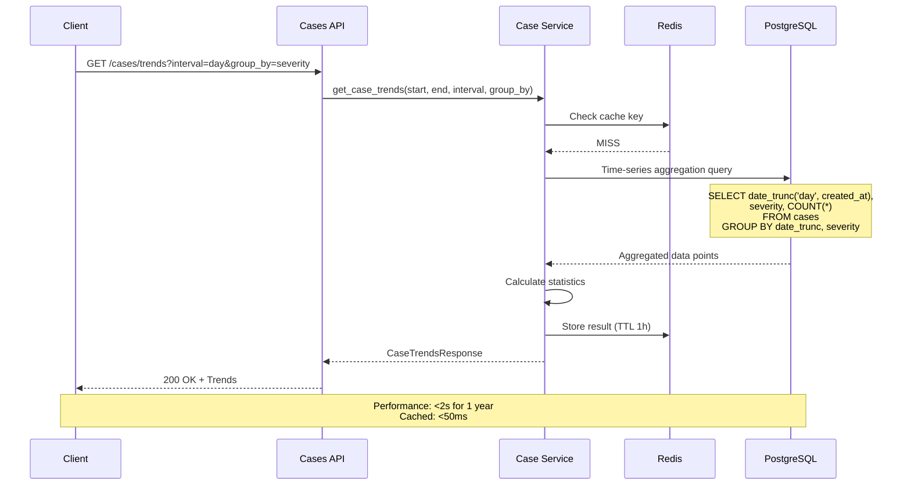
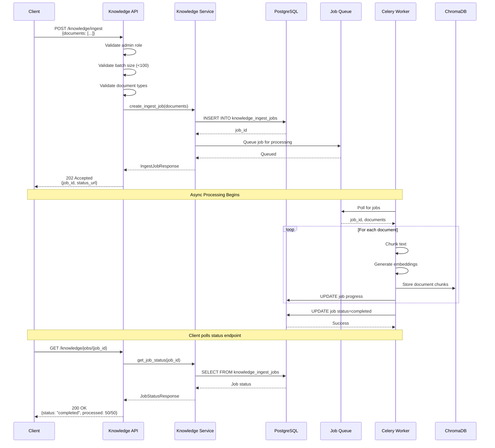
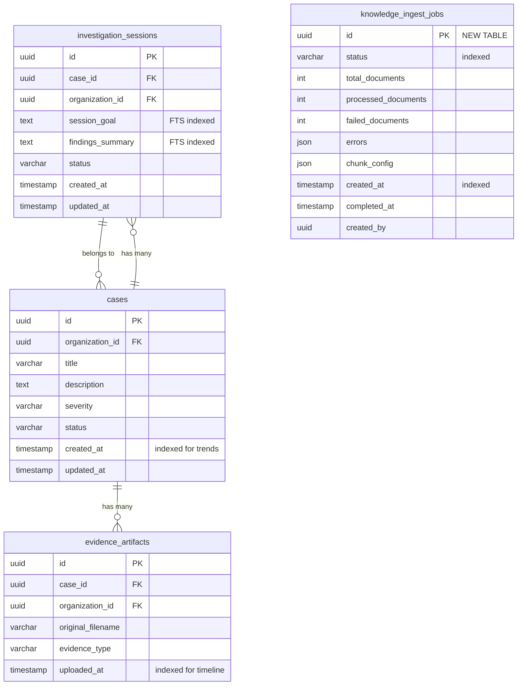
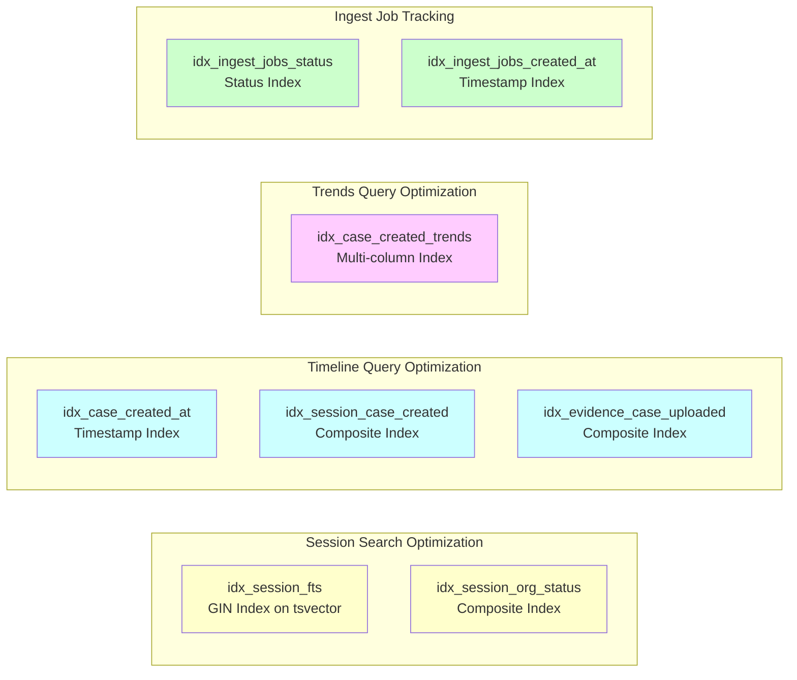
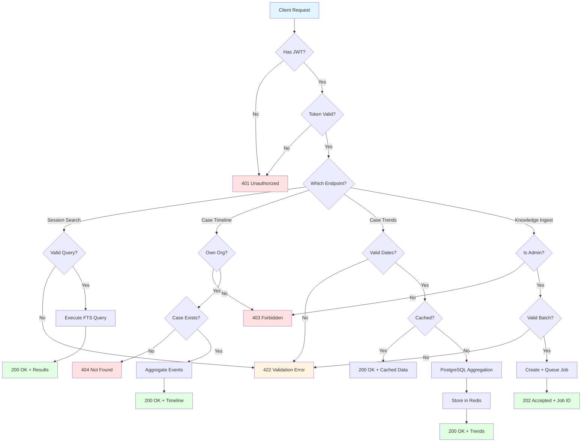
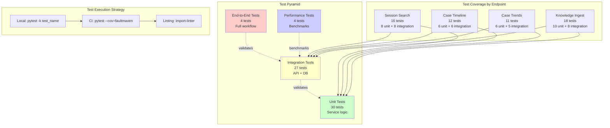
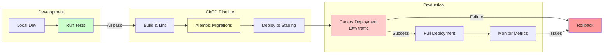
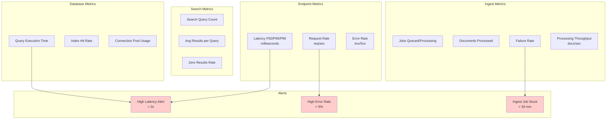

# Phase 3 Week 19-20: Architecture Diagrams

**Related Design**: [DESIGN-Phase3-Week19-20-High-Priority-Endpoints.md](./DESIGN-Phase3-Week19-20-High-Priority-Endpoints.md)

---

## System Architecture Overview

```mermaid
graph TB
    subgraph "API Gateway"
        AG[FastAPI App]
    end

    subgraph "API Routes Layer"
        SR[Sessions Router<br/>/api/v1/sessions]
        CR[Cases Router<br/>/api/v1/cases]
        KR[Knowledge Router<br/>/api/v1/knowledge]
    end

    subgraph "Service Layer"
        SS[Session Service<br/>search_sessions()]
        CS[Case Service<br/>get_timeline()<br/>get_trends()]
        KS[Knowledge Service<br/>queue_ingest_job()<br/>process_ingest_job()]
    end

    subgraph "Data Layer"
        PG[(PostgreSQL<br/>Cases, Sessions,<br/>Evidence)]
        CHR[(ChromaDB<br/>Vector Store)]
        RD[(Redis<br/>Cache)]
    end

    subgraph "Background Jobs"
        BW[Celery Worker<br/>Ingest Processing]
    end

    AG --> SR
    AG --> CR
    AG --> KR

    SR --> SS
    CR --> CS
    KR --> KS

    SS --> PG
    CS --> PG
    CS --> RD
    KS --> PG
    KS --> CHR
    KS --> BW

    BW --> PG
    BW --> CHR

    style SR fill:#ffcccc
    style CR fill:#ffcccc
    style KR fill:#ffcccc
    style SS fill:#ccffcc
    style CS fill:#ccffcc
    style KS fill:#ccffcc
```

---

## Session Search Flow



---

## Case Timeline Flow



---

## Case Trends Flow



---

## Knowledge Ingest Flow (Async)



---

## Database Schema Changes



---

## New Indexes for Performance



---

## Component Interaction Matrix

| Component | Session Search | Case Timeline | Case Trends | Knowledge Ingest |
|-----------|----------------|---------------|-------------|------------------|
| **API Routes** | `sessions.py` | `cases.py` | `cases.py` | `knowledge/api/routes.py` |
| **Services** | `investigation_session_service.py` | `case_service.py` | `case_service.py` | `knowledge_service.py` |
| **Repositories** | `session_repository.py` | `case_repo.py`, `session_repo.py`, `evidence_repo.py` | `case_repository.py` | `knowledge_repository.py` |
| **Database** | PostgreSQL FTS | PostgreSQL (3 tables) | PostgreSQL aggregation | PostgreSQL + ChromaDB |
| **Caching** | None (real-time) | None (high cardinality) | Redis (1h TTL) | None (async) |
| **Background Jobs** | N/A | N/A | N/A | Celery worker |
| **Auth Required** | JWT User | JWT User | JWT User | JWT Admin |
| **Perf Target** | <500ms | <1s | <2s | 202 <100ms |

---

## API Endpoint Decision Tree



---

## Testing Architecture



---

## Deployment Flow



---

## Monitoring Dashboard Layout



---

**End of Architecture Diagrams**
