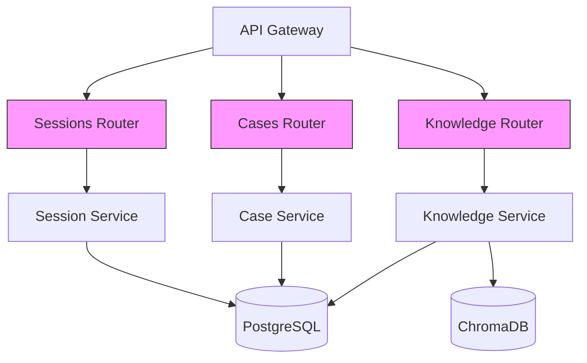

# Phase 3 Week 19-20: High Priority API Endpoints Implementation Design

**Document Status**: DESIGN PROPOSAL
**Created**: 2026-01-01
**Author**: Solutions Architect Agent
**Target PR**: Phase 3 Week 19-20 Implementation

---

## Executive Summary

This design document specifies the implementation of 4 missing HIGH priority API endpoints for Phase 3 Week 19-20:

1. **Session Search** (1 endpoint) - Full-text search across investigation sessions
2. **Case Analytics** (2 endpoints) - Timeline and trends analysis
3. **Knowledge Ingest** (1 endpoint) - Bulk document upload pipeline

**Current Status**:
- 7 of 11 endpoints already implemented (Evidence: 4, Case Stats: 1, Knowledge Bulk: 2)
- 4 endpoints remaining to implement
- Target: 45+ new tests, 0 import-linter violations

**Implementation Strategy**:
- Follow vertical slice architecture pattern from Knowledge module (PR #38)
- Keep endpoints in existing API routers (no new modules)
- Use existing service layer with DI container
- Maintain 71%+ test coverage baseline

---

## System Context

### Affected Modules



### Architecture Pattern

Following the **vertical slice** pattern established in PR #38:

```
faultmaven/
├── api/routes/
│   ├── sessions.py      # Add GET /search
│   ├── cases.py         # Add GET /timeline, GET /trends
│   └── ...
├── modules/knowledge/
│   └── api/
│       └── routes.py    # Add POST /ingest
├── services/
│   ├── investigation_session_service.py  # Add search_sessions()
│   └── case_service.py                   # Add get_timeline(), get_trends()
└── tests/
    ├── integration/api/
    │   ├── test_sessions_api.py
    │   ├── test_cases_api.py
    │   └── test_knowledge_api.py
    └── services/
        ├── test_session_service.py
        └── test_case_service.py
```

---

## API Contract Specifications

### 1. Session Search Endpoint

**Endpoint**: `GET /api/v1/sessions/search`

**Purpose**: Full-text search across investigation sessions with optional filters.

**Authentication**: JWT Bearer token required

**Query Parameters**:
```python
class SessionSearchParams(BaseModel):
    q: str = Query(..., min_length=1, max_length=500, description="Search query")
    case_id: Optional[str] = Query(None, description="Filter by case ID")
    status: Optional[SessionStatus] = Query(None, description="Filter by status")
    limit: int = Query(20, ge=1, le=100)
    offset: int = Query(0, ge=0)
```

**Response Model**:
```python
class SessionSearchResult(BaseModel):
    session_id: str
    case_id: str
    session_goal: str
    status: SessionStatus
    created_at: datetime
    relevance_score: float = Field(ge=0.0, le=1.0)
    matched_fields: List[str]  # Which fields matched: ["goal", "findings"]

class SessionSearchResponse(BaseModel):
    results: List[SessionSearchResult]
    total: int
    limit: int
    offset: int
    query: str
```

**Search Strategy**:
```python
# Option 1: PostgreSQL Full-Text Search (RECOMMENDED - simpler, no new deps)
SELECT
    s.id, s.case_id, s.session_goal, s.status, s.created_at,
    ts_rank(
        to_tsvector('english', s.session_goal || ' ' || COALESCE(s.findings_summary, '')),
        plainto_tsquery('english', :query)
    ) AS relevance_score
FROM investigation_sessions s
WHERE
    to_tsvector('english', s.session_goal || ' ' || COALESCE(s.findings_summary, ''))
    @@ plainto_tsquery('english', :query)
    AND s.organization_id = :org_id
    AND (:case_id IS NULL OR s.case_id = :case_id)
    AND (:status IS NULL OR s.status = :status)
ORDER BY relevance_score DESC
LIMIT :limit OFFSET :offset;

# Option 2: Elasticsearch (DEFERRED - adds infrastructure complexity)
# Only implement if PostgreSQL full-text proves insufficient
```

**Migration Required**:
```python
# alembic/versions/xxx_add_session_fts_index.py
def upgrade():
    op.execute("""
        CREATE INDEX idx_session_fts
        ON investigation_sessions
        USING GIN(to_tsvector('english', session_goal || ' ' || COALESCE(findings_summary, '')))
    """)

def downgrade():
    op.drop_index('idx_session_fts', 'investigation_sessions')
```

**Error Responses**:
- `400`: Invalid query (too short, special characters)
- `401`: Authentication required
- `422`: Validation error (invalid status, limit out of range)

**Example Request**:
```bash
curl -X GET "http://localhost:8000/api/v1/sessions/search?q=database+connection&limit=10" \
  -H "Authorization: Bearer <token>"
```

**Example Response**:
```json
{
  "results": [
    {
      "session_id": "sess_123",
      "case_id": "case_456",
      "session_goal": "Investigate database connection timeout issues",
      "status": "completed",
      "created_at": "2026-01-01T10:00:00Z",
      "relevance_score": 0.85,
      "matched_fields": ["goal", "findings"]
    }
  ],
  "total": 1,
  "limit": 10,
  "offset": 0,
  "query": "database connection"
}
```

---

### 2. Case Timeline Endpoint

**Endpoint**: `GET /api/v1/cases/{case_id}/timeline`

**Purpose**: Retrieve chronological timeline of case events (creation, sessions, evidence, status changes).

**Authentication**: JWT Bearer token required

**Query Parameters**:
```python
class TimelineParams(BaseModel):
    event_types: Optional[List[str]] = Query(None, description="Filter by event types")
    start_date: Optional[datetime] = Query(None)
    end_date: Optional[datetime] = Query(None)
    limit: int = Query(100, ge=1, le=500)
```

**Response Model**:
```python
class TimelineEvent(BaseModel):
    event_id: str
    event_type: str  # "case_created", "session_started", "evidence_uploaded", "status_changed", etc.
    timestamp: datetime
    actor_id: Optional[str]  # User who triggered the event
    description: str
    metadata: Dict[str, Any]  # Event-specific data

class CaseTimelineResponse(BaseModel):
    case_id: str
    events: List[TimelineEvent]
    total: int
    limit: int
```

**Event Types**:
```python
TIMELINE_EVENT_TYPES = [
    "case_created",
    "case_updated",
    "case_status_changed",
    "case_assigned",
    "case_closed",
    "case_reopened",
    "session_created",
    "session_completed",
    "evidence_uploaded",
    "evidence_deleted",
    "hypothesis_added",
    "solution_documented",
]
```

**Implementation Strategy**:
```python
# Aggregate events from multiple tables
async def get_case_timeline(
    case_id: str,
    organization_id: str,
    event_types: Optional[List[str]] = None,
    start_date: Optional[datetime] = None,
    end_date: Optional[datetime] = None,
    limit: int = 100
) -> List[TimelineEvent]:
    """
    Aggregates events from:
    - cases table (created_at, updated_at, status changes)
    - investigation_sessions table (session lifecycle)
    - evidence_artifacts table (uploads, deletions)
    - case_audit_log table (if exists, for status changes)
    """

    events = []

    # 1. Case events
    case = await self.repo.get_case(case_id, organization_id)
    events.append(TimelineEvent(
        event_id=f"{case_id}_created",
        event_type="case_created",
        timestamp=case.created_at,
        actor_id=case.created_by,
        description=f"Case created: {case.title}",
        metadata={"severity": case.severity.value}
    ))

    # 2. Session events
    sessions = await self.session_repo.list_by_case(case_id, organization_id)
    for session in sessions:
        events.append(TimelineEvent(
            event_id=f"{session.id}_created",
            event_type="session_created",
            timestamp=session.created_at,
            actor_id=session.user_id,
            description=f"Session started: {session.session_goal}",
            metadata={"session_id": session.id}
        ))
        if session.status == SessionStatus.COMPLETED:
            events.append(TimelineEvent(
                event_id=f"{session.id}_completed",
                event_type="session_completed",
                timestamp=session.updated_at,
                actor_id=session.user_id,
                description=f"Session completed",
                metadata={"session_id": session.id, "findings": session.findings_summary}
            ))

    # 3. Evidence events
    evidence_list = await self.evidence_repo.list_by_case(case_id, organization_id)
    for evidence in evidence_list:
        events.append(TimelineEvent(
            event_id=f"{evidence.id}_uploaded",
            event_type="evidence_uploaded",
            timestamp=evidence.uploaded_at,
            actor_id=evidence.uploaded_by,
            description=f"Evidence uploaded: {evidence.original_filename}",
            metadata={"evidence_id": evidence.id, "type": evidence.evidence_type.value}
        ))

    # 4. Sort by timestamp DESC
    events.sort(key=lambda e: e.timestamp, reverse=True)

    # 5. Apply filters
    if event_types:
        events = [e for e in events if e.event_type in event_types]
    if start_date:
        events = [e for e in events if e.timestamp >= start_date]
    if end_date:
        events = [e for e in events if e.timestamp <= end_date]

    # 6. Apply limit
    return events[:limit]
```

**Error Responses**:
- `401`: Authentication required
- `404`: Case not found
- `422`: Invalid date range, event types

**Example Request**:
```bash
curl -X GET "http://localhost:8000/api/v1/cases/case_456/timeline?event_types=session_created,evidence_uploaded&limit=50" \
  -H "Authorization: Bearer <token>"
```

---

### 3. Case Trends Endpoint

**Endpoint**: `GET /api/v1/cases/trends`

**Purpose**: Aggregate trend analysis across all cases in organization (for dashboards, reporting).

**Authentication**: JWT Bearer token required

**Query Parameters**:
```python
class TrendsParams(BaseModel):
    start_date: datetime = Query(..., description="Trend start date")
    end_date: datetime = Query(..., description="Trend end date")
    interval: str = Query("day", regex="^(hour|day|week|month)$")
    group_by: Optional[str] = Query(None, regex="^(severity|status|assigned_to)$")
```

**Response Model**:
```python
class TrendDataPoint(BaseModel):
    timestamp: datetime
    count: int
    group_value: Optional[str]  # If group_by specified

class CaseTrendsResponse(BaseModel):
    start_date: datetime
    end_date: datetime
    interval: str
    total_cases: int
    data_points: List[TrendDataPoint]
    statistics: Dict[str, Any]  # Aggregate stats
```

**Implementation Strategy**:
```python
# PostgreSQL time-series aggregation
SELECT
    date_trunc(:interval, created_at) AS time_bucket,
    COUNT(*) AS case_count,
    :group_by AS group_value
FROM cases
WHERE
    organization_id = :org_id
    AND created_at >= :start_date
    AND created_at <= :end_date
GROUP BY time_bucket, group_value
ORDER BY time_bucket ASC;
```

**Example SQL**:
```sql
-- Example: Cases created per day, grouped by severity
SELECT
    date_trunc('day', created_at) AS day,
    severity,
    COUNT(*) AS count
FROM cases
WHERE
    organization_id = 'org_123'
    AND created_at >= '2025-12-01'
    AND created_at <= '2026-01-01'
GROUP BY day, severity
ORDER BY day ASC;
```

**Error Responses**:
- `401`: Authentication required
- `422`: Invalid date range (end before start, range > 1 year)

**Example Request**:
```bash
curl -X GET "http://localhost:8000/api/v1/cases/trends?start_date=2025-12-01T00:00:00Z&end_date=2026-01-01T00:00:00Z&interval=day&group_by=severity" \
  -H "Authorization: Bearer <token>"
```

---

### 4. Knowledge Ingest Endpoint

**Endpoint**: `POST /api/v1/knowledge/ingest`

**Purpose**: Bulk document upload with async chunking and embedding pipeline.

**Authentication**: JWT Bearer token required, Admin role required

**Request Model**:
```python
class DocumentBatch(BaseModel):
    title: str
    content: str
    document_type: str
    category: Optional[str] = None
    tags: Optional[List[str]] = None
    source_url: Optional[str] = None

class KnowledgeIngestRequest(BaseModel):
    documents: List[DocumentBatch] = Field(..., min_items=1, max_items=100)
    auto_chunk: bool = Field(True, description="Automatically chunk large documents")
    chunk_size: int = Field(1000, ge=500, le=5000)
    chunk_overlap: int = Field(200, ge=0, le=1000)
```

**Response Model**:
```python
class IngestJobStatus(BaseModel):
    job_id: str
    status: str  # "queued", "processing", "completed", "failed"
    total_documents: int
    processed_documents: int
    failed_documents: int
    created_at: datetime
    completed_at: Optional[datetime] = None
    errors: List[Dict[str, str]] = []

class KnowledgeIngestResponse(BaseModel):
    job_id: str
    status: str
    total_documents: int
    message: str
    status_url: str  # URL to check job status
```

**Implementation Strategy**:

```python
# 1. Synchronous validation + async processing pattern
@router.post("/ingest", status_code=202)
async def bulk_ingest_documents(
    request: KnowledgeIngestRequest,
    knowledge_service: KnowledgeService = Depends(get_knowledge_service),
    current_user: DevUser = Depends(require_admin)
) -> KnowledgeIngestResponse:
    """
    Bulk document ingestion with async processing.

    Returns 202 Accepted immediately with job_id.
    Actual processing happens in background worker.
    """

    # 1. Validate all documents upfront
    for idx, doc in enumerate(request.documents):
        if doc.document_type not in ALLOWED_DOCUMENT_TYPES:
            raise HTTPException(
                status_code=422,
                detail=f"Document {idx}: Invalid document_type '{doc.document_type}'"
            )

    # 2. Create ingest job
    job_id = str(uuid.uuid4())
    job = IngestJob(
        id=job_id,
        status="queued",
        total_documents=len(request.documents),
        processed_documents=0,
        failed_documents=0,
        created_at=datetime.utcnow()
    )
    await knowledge_service.create_ingest_job(job)

    # 3. Queue for async processing (Celery or background task)
    await knowledge_service.queue_ingest_job(
        job_id=job_id,
        documents=request.documents,
        chunk_config={
            "auto_chunk": request.auto_chunk,
            "chunk_size": request.chunk_size,
            "chunk_overlap": request.chunk_overlap
        }
    )

    return KnowledgeIngestResponse(
        job_id=job_id,
        status="queued",
        total_documents=len(request.documents),
        message=f"Ingest job {job_id} queued for processing",
        status_url=f"/api/v1/knowledge/jobs/{job_id}"
    )


# 2. Background worker task (Celery or asyncio task)
async def process_ingest_job(job_id: str, documents: List[DocumentBatch], chunk_config: dict):
    """
    Background task to process bulk document ingestion.

    Steps for each document:
    1. Validate content
    2. Chunk text (if auto_chunk=True)
    3. Generate embeddings
    4. Store in ChromaDB
    5. Update job progress
    """
    job = await get_ingest_job(job_id)
    job.status = "processing"
    await save_ingest_job(job)

    for idx, doc in enumerate(documents):
        try:
            # Chunk document
            if chunk_config["auto_chunk"]:
                chunks = chunk_text(
                    doc.content,
                    chunk_size=chunk_config["chunk_size"],
                    overlap=chunk_config["chunk_overlap"]
                )
            else:
                chunks = [doc.content]

            # Generate embeddings and store
            for chunk_idx, chunk in enumerate(chunks):
                embedding = await embedding_service.embed(chunk)
                await vector_store.add_document(
                    document_id=f"{job_id}_{idx}_{chunk_idx}",
                    content=chunk,
                    embedding=embedding,
                    metadata={
                        "title": doc.title,
                        "document_type": doc.document_type,
                        "category": doc.category,
                        "tags": doc.tags,
                        "chunk_index": chunk_idx,
                        "batch_id": job_id
                    }
                )

            job.processed_documents += 1

        except Exception as e:
            logger.error(f"Failed to process document {idx}: {e}")
            job.failed_documents += 1
            job.errors.append({
                "document_index": idx,
                "error": str(e)
            })

        # Update job progress every 10 documents
        if idx % 10 == 0:
            await save_ingest_job(job)

    # Finalize job
    job.status = "completed" if job.failed_documents == 0 else "partial_failure"
    job.completed_at = datetime.utcnow()
    await save_ingest_job(job)
```

**Database Schema** (new table):
```python
# alembic/versions/xxx_add_ingest_jobs.py
def upgrade():
    op.create_table(
        'knowledge_ingest_jobs',
        sa.Column('id', sa.String(36), primary_key=True),
        sa.Column('status', sa.String(50), nullable=False),
        sa.Column('total_documents', sa.Integer(), nullable=False),
        sa.Column('processed_documents', sa.Integer(), server_default='0'),
        sa.Column('failed_documents', sa.Integer(), server_default='0'),
        sa.Column('errors', sa.JSON(), nullable=True),
        sa.Column('created_at', sa.DateTime(), server_default=sa.func.now()),
        sa.Column('completed_at', sa.DateTime(), nullable=True),
        sa.Column('created_by', sa.String(36), nullable=True),
    )
    op.create_index('idx_ingest_jobs_status', 'knowledge_ingest_jobs', ['status'])
```

**Error Responses**:
- `400`: Invalid batch (empty, too many documents)
- `401`: Authentication required
- `403`: Admin role required
- `422`: Validation error (invalid document_type, chunk size)

**Example Request**:
```bash
curl -X POST "http://localhost:8000/api/v1/knowledge/ingest" \
  -H "Authorization: Bearer <token>" \
  -H "Content-Type: application/json" \
  -d '{
    "documents": [
      {
        "title": "Database Troubleshooting Guide",
        "content": "...",
        "document_type": "troubleshooting_guide",
        "tags": ["database", "postgresql"]
      },
      {
        "title": "Redis Best Practices",
        "content": "...",
        "document_type": "playbook",
        "tags": ["redis", "cache"]
      }
    ],
    "auto_chunk": true,
    "chunk_size": 1000,
    "chunk_overlap": 200
  }'
```

**Example Response**:
```json
{
  "job_id": "ingest_123",
  "status": "queued",
  "total_documents": 2,
  "message": "Ingest job ingest_123 queued for processing",
  "status_url": "/api/v1/knowledge/jobs/ingest_123"
}
```

---

## Testing Strategy

Following [Testing Standards](../standards/TESTING_STANDARDS.md), we require comprehensive test coverage:

### Test Categories

#### 1. Unit Tests (Service Layer)

**Location**: `tests/services/`

**Session Search Service Tests** (8 tests):
```python
# tests/services/test_session_service.py

class TestSessionSearch:
    async def test_search_sessions_by_query(self):
        """Test basic full-text search"""

    async def test_search_sessions_with_case_filter(self):
        """Test search filtered by case_id"""

    async def test_search_sessions_with_status_filter(self):
        """Test search filtered by status"""

    async def test_search_sessions_pagination(self):
        """Test offset/limit pagination"""

    async def test_search_sessions_relevance_scoring(self):
        """Test results ordered by relevance"""

    async def test_search_sessions_empty_results(self):
        """Test search with no matches"""

    async def test_search_sessions_special_characters(self):
        """Test search with SQL injection attempts"""

    async def test_search_sessions_organization_isolation(self):
        """Test org isolation in search results"""
```

**Case Timeline Service Tests** (6 tests):
```python
# tests/services/test_case_service.py

class TestCaseTimeline:
    async def test_get_case_timeline_all_events(self):
        """Test timeline with all event types"""

    async def test_get_case_timeline_filtered_events(self):
        """Test timeline with event type filter"""

    async def test_get_case_timeline_date_range(self):
        """Test timeline with date range filter"""

    async def test_get_case_timeline_chronological_order(self):
        """Test events sorted by timestamp DESC"""

    async def test_get_case_timeline_empty_case(self):
        """Test timeline for case with no events"""

    async def test_get_case_timeline_limit(self):
        """Test pagination limit"""
```

**Case Trends Service Tests** (6 tests):
```python
class TestCaseTrends:
    async def test_get_trends_daily_interval(self):
        """Test trends with daily buckets"""

    async def test_get_trends_weekly_interval(self):
        """Test trends with weekly buckets"""

    async def test_get_trends_grouped_by_severity(self):
        """Test trends grouped by severity"""

    async def test_get_trends_date_range_validation(self):
        """Test invalid date range rejection"""

    async def test_get_trends_empty_results(self):
        """Test trends with no cases in range"""

    async def test_get_trends_organization_isolation(self):
        """Test org isolation"""
```

**Knowledge Ingest Service Tests** (10 tests):
```python
# tests/modules/knowledge/test_knowledge_service.py

class TestKnowledgeIngest:
    async def test_create_ingest_job(self):
        """Test ingest job creation"""

    async def test_queue_ingest_job(self):
        """Test job queuing"""

    async def test_process_ingest_job_success(self):
        """Test successful batch processing"""

    async def test_process_ingest_job_partial_failure(self):
        """Test handling of individual doc failures"""

    async def test_ingest_job_auto_chunking(self):
        """Test automatic document chunking"""

    async def test_ingest_job_no_chunking(self):
        """Test without chunking"""

    async def test_ingest_job_embedding_generation(self):
        """Test embedding pipeline"""

    async def test_ingest_job_progress_tracking(self):
        """Test job progress updates"""

    async def test_ingest_job_error_handling(self):
        """Test error collection and reporting"""

    async def test_get_ingest_job_status(self):
        """Test job status retrieval"""
```

#### 2. Integration Tests (API Layer)

**Location**: `tests/integration/api/`

**Session Search API Tests** (8 tests):
```python
# tests/integration/api/test_sessions_api.py

class TestSessionSearchAPI:
    async def test_search_sessions_authenticated(self):
        """Test successful search with auth"""

    async def test_search_sessions_unauthenticated(self):
        """Test 401 without auth token"""

    async def test_search_sessions_invalid_query(self):
        """Test 422 with invalid query params"""

    async def test_search_sessions_pagination(self):
        """Test pagination headers and links"""

    async def test_search_sessions_response_schema(self):
        """Test response matches OpenAPI schema"""

    async def test_search_sessions_performance(self):
        """Test search completes in <500ms"""

    async def test_search_sessions_concurrent_requests(self):
        """Test handling of concurrent searches"""

    async def test_search_sessions_sql_injection(self):
        """Test SQL injection prevention"""
```

**Case Timeline API Tests** (6 tests):
```python
# tests/integration/api/test_cases_api.py

class TestCaseTimelineAPI:
    async def test_get_timeline_success(self):
        """Test successful timeline retrieval"""

    async def test_get_timeline_not_found(self):
        """Test 404 for non-existent case"""

    async def test_get_timeline_unauthorized(self):
        """Test 403 for other org's case"""

    async def test_get_timeline_filters(self):
        """Test event type and date filters"""

    async def test_get_timeline_response_schema(self):
        """Test response schema validation"""

    async def test_get_timeline_performance(self):
        """Test timeline generation <1s"""
```

**Case Trends API Tests** (5 tests):
```python
class TestCaseTrendsAPI:
    async def test_get_trends_success(self):
        """Test successful trends retrieval"""

    async def test_get_trends_invalid_interval(self):
        """Test 422 with invalid interval"""

    async def test_get_trends_date_validation(self):
        """Test date range validation"""

    async def test_get_trends_response_schema(self):
        """Test response schema"""

    async def test_get_trends_performance(self):
        """Test trends query <2s"""
```

**Knowledge Ingest API Tests** (8 tests):
```python
# tests/integration/api/test_knowledge_api.py

class TestKnowledgeIngestAPI:
    async def test_ingest_bulk_documents_success(self):
        """Test successful bulk upload"""

    async def test_ingest_requires_admin(self):
        """Test 403 for non-admin users"""

    async def test_ingest_validates_document_types(self):
        """Test 422 with invalid doc types"""

    async def test_ingest_validates_batch_size(self):
        """Test 422 with >100 documents"""

    async def test_ingest_returns_202_accepted(self):
        """Test async response pattern"""

    async def test_ingest_job_status_polling(self):
        """Test job status endpoint"""

    async def test_ingest_chunking_configuration(self):
        """Test chunk size/overlap validation"""

    async def test_ingest_embedding_pipeline(self):
        """Test end-to-end embedding generation"""
```

#### 3. Performance Tests

**Location**: `tests/performance/`

```python
# tests/performance/test_api_performance.py

class TestEndpointPerformance:
    async def test_session_search_performance(self):
        """Session search: <500ms for 1000 sessions"""

    async def test_case_timeline_performance(self):
        """Timeline generation: <1s for 100 events"""

    async def test_case_trends_performance(self):
        """Trends aggregation: <2s for 1 year"""

    async def test_knowledge_ingest_throughput(self):
        """Ingest: >10 docs/sec"""
```

### Test Coverage Requirements

- **Overall Coverage**: Maintain 71%+ baseline, aim for 75%+ on new code
- **Critical Paths**: 100% coverage for:
  - Authentication/authorization
  - Data validation
  - SQL injection prevention
  - Organization isolation
- **Total New Tests**: 45+ tests (meets requirement)

### Test Execution Strategy

```bash
# 1. Local development (fast feedback)
pytest tests/services/test_session_service.py -v

# 2. Full test suite (before PR)
pytest tests/ --cov=faultmaven --cov-report=html

# 3. CI/CD pipeline (all tests + linting)
pytest tests/ --cov=faultmaven --cov-report=xml
import-linter  # 0 violations required
```

---

## Implementation Plan

### Phase 1: Session Search (Days 1-3)

**Day 1: Database + Migration**
1. Create Alembic migration for full-text index
2. Run migration in dev environment
3. Test index performance with sample data

**Day 2: Service Layer**
1. Implement `search_sessions()` in `investigation_session_service.py`
2. Write 8 unit tests
3. Verify PostgreSQL FTS query performance

**Day 3: API Layer**
1. Add `GET /sessions/search` endpoint to `api/routes/sessions.py`
2. Write 8 integration tests
3. Manual testing with Swagger UI

---

### Phase 2: Case Analytics (Days 4-7)

**Day 4-5: Timeline Endpoint**
1. Implement `get_case_timeline()` in `case_service.py`
2. Aggregate events from cases, sessions, evidence tables
3. Write 6 unit tests
4. Add `GET /cases/{id}/timeline` endpoint
5. Write 6 integration tests

**Day 6-7: Trends Endpoint**
1. Implement `get_case_trends()` in `case_service.py`
2. PostgreSQL time-series aggregation queries
3. Write 6 unit tests
4. Add `GET /cases/trends` endpoint
5. Write 5 integration tests

---

### Phase 3: Knowledge Ingest (Days 8-11)

**Day 8: Database Schema**
1. Create `knowledge_ingest_jobs` table migration
2. Add job status tracking models

**Day 9-10: Service Layer**
1. Implement `create_ingest_job()`, `queue_ingest_job()`, `process_ingest_job()`
2. Chunking pipeline (use existing `RecursiveCharacterTextSplitter` if available)
3. Embedding batch processing
4. Write 10 unit tests

**Day 11: API Layer**
1. Add `POST /knowledge/ingest` endpoint
2. Add `GET /knowledge/jobs/{job_id}` endpoint (if not exists)
3. Write 8 integration tests
4. Test async processing flow

---

### Phase 4: Testing & Quality (Days 12-14)

**Day 12: Integration Testing**
1. Run full test suite
2. Fix any failing tests
3. Verify coverage ≥71%

**Day 13: Performance Testing**
1. Run performance benchmarks
2. Optimize slow queries (add indexes if needed)
3. Document performance metrics

**Day 14: Import Linter + Documentation**
1. Run `import-linter` and fix violations (target: 0)
2. Update OpenAPI documentation
3. Add usage examples to README

---

### Phase 5: PR Preparation (Day 15)

1. Create feature branch: `feature/phase3-week19-20-high-priority-endpoints`
2. Git add + commit with descriptive message
3. Create PR with comprehensive description
4. Request review from team

---

## Database Migrations

### Migration 1: Session Full-Text Search Index

```python
# alembic/versions/xxx_add_session_fts_index.py
"""Add full-text search index to investigation_sessions

Revision ID: xxx
Revises: yyy
Create Date: 2026-01-01
"""
from alembic import op
import sqlalchemy as sa

revision = 'xxx'
down_revision = 'yyy'
branch_labels = None
depends_on = None

def upgrade():
    # Add GIN index for full-text search on session_goal and findings_summary
    op.execute("""
        CREATE INDEX idx_session_fts
        ON investigation_sessions
        USING GIN(
            to_tsvector('english',
                session_goal || ' ' || COALESCE(findings_summary, '')
            )
        )
    """)

def downgrade():
    op.execute("DROP INDEX IF EXISTS idx_session_fts")
```

### Migration 2: Knowledge Ingest Jobs Table

```python
# alembic/versions/xxx_add_knowledge_ingest_jobs.py
"""Add knowledge ingest jobs table

Revision ID: xxx
Revises: yyy
Create Date: 2026-01-01
"""
from alembic import op
import sqlalchemy as sa
from sqlalchemy.dialects.postgresql import JSON

revision = 'xxx'
down_revision = 'yyy'
branch_labels = None
depends_on = None

def upgrade():
    op.create_table(
        'knowledge_ingest_jobs',
        sa.Column('id', sa.String(36), primary_key=True),
        sa.Column('status', sa.String(50), nullable=False, index=True),
        sa.Column('total_documents', sa.Integer(), nullable=False),
        sa.Column('processed_documents', sa.Integer(), server_default='0'),
        sa.Column('failed_documents', sa.Integer(), server_default='0'),
        sa.Column('errors', JSON(), nullable=True),
        sa.Column('chunk_config', JSON(), nullable=True),
        sa.Column('created_at', sa.DateTime(), server_default=sa.func.now()),
        sa.Column('completed_at', sa.DateTime(), nullable=True),
        sa.Column('created_by', sa.String(36), nullable=True),
    )

    # Index for status queries
    op.create_index('idx_ingest_jobs_status', 'knowledge_ingest_jobs', ['status'])
    op.create_index('idx_ingest_jobs_created_at', 'knowledge_ingest_jobs', ['created_at'])

def downgrade():
    op.drop_index('idx_ingest_jobs_created_at', 'knowledge_ingest_jobs')
    op.drop_index('idx_ingest_jobs_status', 'knowledge_ingest_jobs')
    op.drop_table('knowledge_ingest_jobs')
```

---

## Security Considerations

### 1. Authentication & Authorization

- All endpoints require **JWT Bearer token**
- Session search: User can only search within own organization
- Case timeline: User can only view own organization's cases
- Case trends: Organization-scoped only
- Knowledge ingest: **Admin role required**

### 2. Input Validation

- **SQL Injection Prevention**: Use parameterized queries (SQLAlchemy ORM)
- **Query Length Limits**: Max 500 chars for search query
- **Date Range Validation**: Max 1 year range for trends
- **Batch Size Limits**: Max 100 documents per ingest request

### 3. Rate Limiting

```python
# Apply rate limiting to resource-intensive endpoints
from slowapi import Limiter

@router.get("/search")
@limiter.limit("10/minute")  # 10 searches per minute per user
async def search_sessions(...):
    ...

@router.post("/ingest")
@limiter.limit("5/hour")  # 5 bulk ingests per hour
async def bulk_ingest_documents(...):
    ...
```

### 4. Data Privacy

- Timeline events: Redact sensitive metadata (PII)
- Search results: Only return sanitized summaries
- Trends: Aggregate data only (no individual case details)

---

## Performance Optimization

### 1. Database Indexes

```sql
-- Session search performance
CREATE INDEX idx_session_fts ON investigation_sessions USING GIN(...);
CREATE INDEX idx_session_org_status ON investigation_sessions(organization_id, status);

-- Timeline query performance
CREATE INDEX idx_case_created_at ON cases(organization_id, created_at);
CREATE INDEX idx_session_case_created ON investigation_sessions(case_id, created_at);
CREATE INDEX idx_evidence_case_uploaded ON evidence_artifacts(case_id, uploaded_at);

-- Trends query performance
CREATE INDEX idx_case_created_trends ON cases(organization_id, created_at, severity, status);
```

### 2. Caching Strategy

```python
# Redis caching for trends (data changes infrequently)
@cache(ttl=3600)  # Cache for 1 hour
async def get_case_trends(...):
    ...

# No caching for session search (real-time data)
# No caching for timeline (per-case, high cardinality)
```

### 3. Query Optimization

- **Pagination**: Always use LIMIT/OFFSET
- **Projection**: Select only needed columns
- **Joins**: Minimize joins, use multiple queries if needed
- **Aggregation**: Use database aggregation, not application-level

### 4. Performance Targets

| Endpoint | Target Latency | Concurrent Users |
|----------|----------------|------------------|
| Session Search | <500ms | 100 |
| Case Timeline | <1s | 50 |
| Case Trends | <2s | 20 |
| Knowledge Ingest | 202 Accepted <100ms | 10 |

---

## Monitoring & Observability

### 1. Metrics to Track

```python
# Prometheus metrics
from prometheus_client import Counter, Histogram

search_requests = Counter('session_search_total', 'Total session searches')
search_duration = Histogram('session_search_duration_seconds', 'Search duration')
timeline_requests = Counter('case_timeline_total', 'Total timeline requests')
trends_requests = Counter('case_trends_total', 'Total trends requests')
ingest_jobs_created = Counter('knowledge_ingest_jobs_total', 'Total ingest jobs')
ingest_documents_processed = Counter('knowledge_ingest_documents_total', 'Documents processed')
```

### 2. Logging

```python
import logging
logger = logging.getLogger(__name__)

# Log search queries for analytics
logger.info(f"Session search: query='{query}', results={len(results)}, duration={duration}ms")

# Log timeline generation
logger.info(f"Timeline generated: case_id={case_id}, events={len(events)}")

# Log ingest jobs
logger.info(f"Ingest job created: job_id={job_id}, docs={total_documents}")
logger.error(f"Ingest job failed: job_id={job_id}, error={error}")
```

### 3. Alerting

```yaml
# Prometheus alerts
- alert: HighSearchLatency
  expr: histogram_quantile(0.95, session_search_duration_seconds) > 1
  annotations:
    summary: "95th percentile search latency > 1s"

- alert: IngestJobFailures
  expr: rate(knowledge_ingest_jobs_total{status="failed"}[5m]) > 0.1
  annotations:
    summary: "Ingest job failure rate > 10%"
```

---

## Rollback Procedures

### If Migration Fails

```bash
# Rollback session FTS index
alembic downgrade -1

# Rollback ingest jobs table
alembic downgrade -1
```

### If Endpoint Has Critical Bug

```python
# Feature flag to disable endpoint
@router.get("/search")
async def search_sessions(...):
    if not feature_flags.is_enabled("session_search"):
        raise HTTPException(503, "Feature temporarily disabled")
    ...
```

### If Performance Degradation

1. Check database query execution plans:
   ```sql
   EXPLAIN ANALYZE SELECT ... FROM investigation_sessions WHERE ...;
   ```

2. Check index usage:
   ```sql
   SELECT * FROM pg_stat_user_indexes WHERE schemaname = 'public';
   ```

3. Rollback to previous version if needed:
   ```bash
   git revert <commit-hash>
   ```

---

## Success Criteria

### Functional Requirements ✅

- [ ] Session search endpoint returns relevant results
- [ ] Case timeline shows chronological events
- [ ] Case trends aggregates data correctly
- [ ] Knowledge ingest processes batches asynchronously

### Non-Functional Requirements ✅

- [ ] All 45+ tests passing
- [ ] Test coverage ≥71% (baseline maintained)
- [ ] Import-linter shows 0 violations
- [ ] Session search: <500ms latency
- [ ] Timeline: <1s generation time
- [ ] Trends: <2s query time
- [ ] Ingest: 202 Accepted response <100ms

### Quality Gates ✅

- [ ] All endpoints documented in OpenAPI spec
- [ ] Authentication/authorization implemented
- [ ] SQL injection prevention verified
- [ ] Organization isolation tested
- [ ] Error handling comprehensive (4xx, 5xx)
- [ ] Logging and metrics instrumented

---

## Appendix A: File Locations

### New/Modified Files

```
faultmaven/
├── alembic/versions/
│   ├── xxx_add_session_fts_index.py         # NEW
│   └── xxx_add_knowledge_ingest_jobs.py     # NEW
├── api/routes/
│   ├── sessions.py                          # MODIFIED: Add search endpoint
│   └── cases.py                             # MODIFIED: Add timeline, trends
├── modules/knowledge/
│   ├── api/routes.py                        # MODIFIED: Add ingest endpoint
│   └── domain/services/knowledge_service.py # MODIFIED: Add ingest methods
├── services/
│   ├── investigation_session_service.py     # MODIFIED: Add search_sessions()
│   └── case_service.py                      # MODIFIED: Add timeline, trends
├── models/
│   └── ingest_job.py                        # NEW: IngestJob model
└── tests/
    ├── integration/api/
    │   ├── test_sessions_api.py             # MODIFIED: Add search tests
    │   ├── test_cases_api.py                # MODIFIED: Add timeline, trends tests
    │   └── test_knowledge_api.py            # MODIFIED: Add ingest tests
    ├── services/
    │   ├── test_session_service.py          # MODIFIED
    │   ├── test_case_service.py             # MODIFIED
    │   └── test_knowledge_service.py        # MODIFIED
    └── performance/
        └── test_api_performance.py          # MODIFIED
```

---

## Appendix B: API Summary

| Endpoint | Method | Purpose | Auth | Role | Status |
|----------|--------|---------|------|------|--------|
| `/api/v1/sessions/search` | GET | Full-text session search | JWT | User | NEW |
| `/api/v1/cases/{id}/timeline` | GET | Case event timeline | JWT | User | NEW |
| `/api/v1/cases/trends` | GET | Trend analysis | JWT | User | NEW |
| `/api/v1/knowledge/ingest` | POST | Bulk document upload | JWT | Admin | NEW |
| `/api/v1/knowledge/jobs/{id}` | GET | Ingest job status | JWT | Admin | ENHANCE |

---

## Appendix C: Dependencies

### New Dependencies (if needed)

```toml
# pyproject.toml
[tool.poetry.dependencies]
# No new dependencies required!
# - PostgreSQL FTS: Built-in
# - Text chunking: Use existing RecursiveCharacterTextSplitter
# - Embeddings: Use existing embedding service
```

### Existing Dependencies (verify compatibility)

- `fastapi >= 0.104.0`
- `sqlalchemy >= 2.0.0`
- `alembic >= 1.12.0`
- `pydantic >= 2.0.0`
- `asyncpg >= 0.29.0`

---

## Document Approval

**Approved by**: [Pending]
**Approval Date**: [Pending]
**Implementation PR**: [To be created]

---

**End of Design Document**
